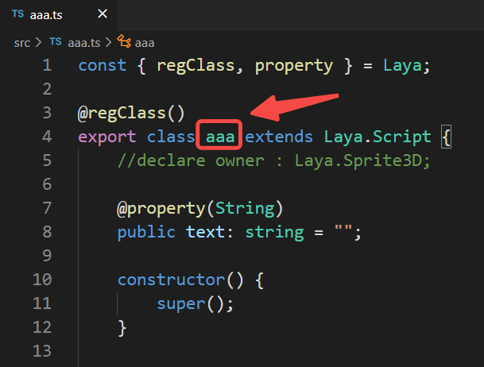

# 入口


## 一、启动场景

在使用LayaAir2.0中，只能使用Main类来作为项目的入口类，从而进行项目的初始化工作。如图1-1所示


（图1-1）

但是在LayaAir3.0中，项目的入口做了根本性的改变，首先我们知道LayaAir 3.0 IDE中可以创建多个场景，每个场景都可以单独运行来调试，但是不管是2D场景还是3D场景，都需要有一个场景作为项目的启动场景，当项目发布时，会要求指定一个场景作为启动场景。


### 1.1 设置启动场景

假设我们的项目已经制作了几个场景，比如启动画面场景，加载场景等等，下面我们来看看在IDE中是如何设置启动场景的。

如图1-2所示，我们可以在IDE的 File -> Build 选项中来打开项目 Build 菜单

 

（图1-2）

打开 Build 菜单后，可以对项目进行命名，选择发布平台和发布路径等操作，其中 Startup Scene 用于指定项目启动场景

 

（图1-3） 

如动图1-3所示，可以选择指定一个启动场景

 

（动图1-4） 


### 1.2 设置启动参数

针对启动场景的设置，我们还需要进一步来确定项目的启动参数，比如屏幕适配，引擎类库等等，如图1-5所示。

 

（图1-5） 

具体的项目屏幕适配设置及引擎初始化设置等参数设置，在[《项目设置详解》](https://layaair.layabox.com/3.x/doc/basics/IDE/projectSettings/readme.html) 文档中已经介绍了，在这里就不过多讲解了，开发者可以对项目的需求和开发需求来不断配置。

在启动场景配置好之后，想要进一步运行项目的逻辑，需要我们添加项目入口代码，LayaAir 3.0 可以通过两种代码形式：

- **自定义脚本入口类**

- **Runtime 入口类**


## 二、脚本入口类

使用LayaAir3.0创建工程后，会建立一个默认的场景，位于assets下的Scene，同时会创建一个Main的脚本，位于src目录下。如图2-1所示

 

（图2-1）


 通常我们可以利用这个默认的 Main.ts 脚本作为项目的入口类，如图2-2所示

 

（图2-2）


### 2.1 添加自定义脚本

**自定义脚本**：什么是自定义脚本，请参考“自定义脚本组件”文档

添加脚本的目的，是可以在场景启动后，启动这个脚本作为项目的代码入口，如动图2-3所示，我们可以给Scene2D节点添加 Main 脚本


 （动图2-3）


### 2.2 入口方法

当添加 Main 脚本后，可以在Main的 `onStart` 方法中加入项目初始化代码：

```
const { regClass, property } = Laya;

@regClass()
export class Main extends Laya.Script {

    @property()
    private img: Laya.Image;      

    onStart() {
        console.log("Game start");
        this.img.visible = false;
    }
}
```

> 注意，使用自定义脚本，需要在编辑器拖入想使用的属性组件

这样，项目的入口场景和入口类的启动方法就介绍完了，当然我们也可以不使用 Main.ts 作为入口类，可以使用其它自定义脚本作为项目入口类，这个由开发者来规划


## 三、Runtime入口类

除了使用 Main 类或者自定义脚本以外，我们也可以使用 runtime 类来作为项目入口

**Runtime**：只有在LayaAir3.0 IDE的Scene2D节点的Inspector面板中，可以看到 Runtime 属性，如图3-1所示


（图3-1）

Runtime 是Scene2D场景运行时的逻辑类，Runtime脚本与自定义脚本类似，不同的是 Runtime 可以直接使用 Scene2D 下的节点对象

### 3.1 添加Runtime类

我们可以把 Main.ts 拖入到 Scene2D 的Runtime 属性中，IDE会自动生成 Main.generated 类，如动图3-1所示

 

（动图3-1）


### 3.2 对象命名，勾选 Declare Var

在Scene2D下创建一个Image组件，在属性面板勾选Declare Var，并修改名字为img，保存场景，如图3-2所示


（图3-2）


此时，打开Main.generated.ts ，可以看到多了一个img属性

 

 （图3-3） 


此时的 Main.ts 代码，要想成功使用刚刚生成的 MainBase 类并作为Runtime的话，需要修改代码：

1，原来Main继承 Laya.Script，现在需要继承自 MainBase

2，Main 可以直接使用img属性

3，Main 没有 onStart 方法，需要修改为 onAwake 方法才能在启动

如图3-4所示

 

（图3-4） 


这样，运行项目，依然可以看到输出 Game start，那么用 runtime 作为项目启动入口就介绍完了，开发者可以根据自己项目的需要来使用 runtime类或者自定义脚本类！


## 四、自定义初始化

使用IDE开发项目，Laya.init入口是屏蔽的。如果开发者需要在Laya.Init之前执行一些逻辑处理，可以使用以下方法。选择一个Typescript文件，例如Main.ts，在代码中加入：

```Go
Laya.LayaEnv.beforeInit = function(config: Laya.IStageConfig) {
    //这个方法会在Laya.init前调用
    console.log("before init");
    
    //这里可以对config以及Laya.Config、Laya.Config3D进行自定义的修改
}

Laya.LayaEnv.afterInit = function() {
    //这个方法会在Laya.init后调用
    console.log("after init");
}
```

需要注意的是，需保证这些代码所在的脚本文件需要是被引用的，如果被tree shaking了就无效了。

**注意：如果没有特殊需求，一般不推荐使用这种方法进行游戏初始化。开发者应该使用挂载组件脚本的方式。**

如图4-1所示，把代码加入 Main.ts 的代码最上面

 

（图4-1）

运行可以看到，输出结果如图4-2所示

 

（图4-2）

