# 开发流程: Hello World

本篇旨在使刚接触LayaAir引擎的开发者，在搭建完基础的开发环境之后，初步了解LayaAir引擎的基础开发流程。

> 如果环境还没搭建，请先查看[《搭建基础开发环境》](../../developmentEnvironment/download/readme.md)。

## 一、使用LayaAir-IDE创建一个空项目

LayaAir的开发流程，高度依赖LayaAir-IDE。

IDE是集成开发环境（Integrated Development Environment）的缩写，顾名思义，集成了LayaAir引擎开发从项目创建到可视化编辑，以及运行预览及项目发布的全部工作流程。

### 1.1 创建项目

首先，打开LayaAir3的IDE，开发者在登录之后，点击创建项目。如图1-1所示。

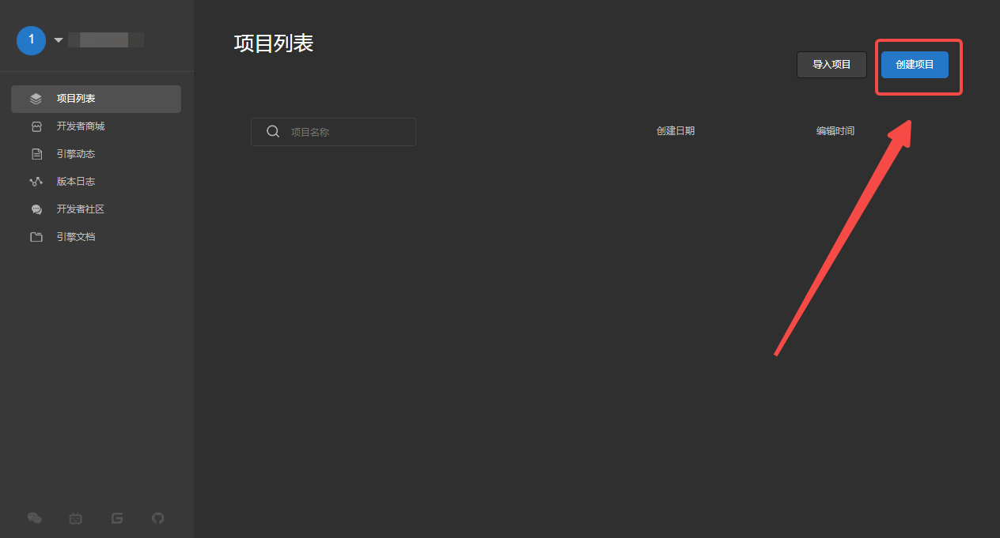

（图1-1）

在新项目创建的面板里，开发者可以根据需要，选择不同的项目模板来创建项目。这里以2D或3D空项目为例，创建一个空的项目。如图1-2所示，填写项目名称，并选择项目位置后，点击创建项目。

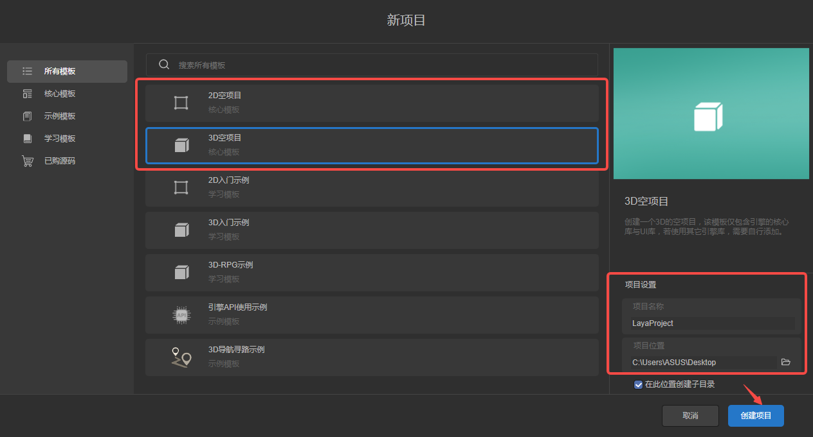

（图1-2）

创建完成后，会自动加载并打开已创建的项目，如图1-3所示，

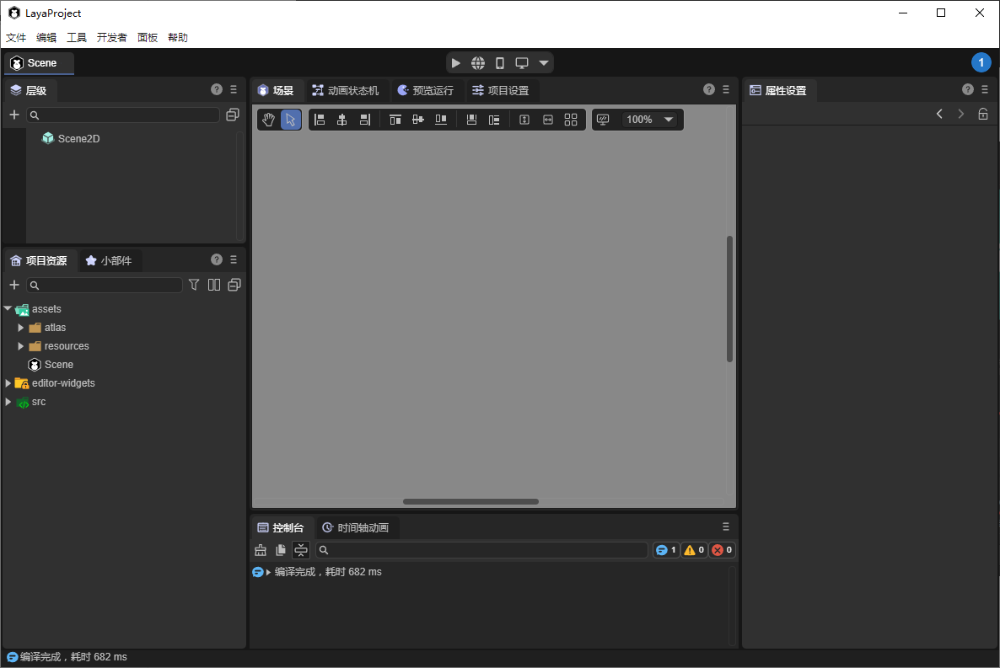

（图1-3）

2D空项目默认没有3D场景节点，而3D项目空项目则会同时存在3D场景节点和2D场景的节点。如图1-4所示。

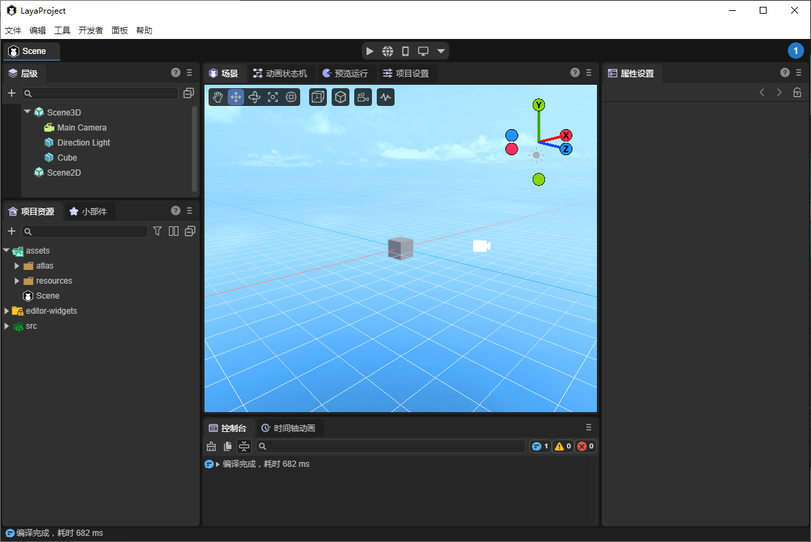

（图1-4）

### 1.2 基础环境配置

开发者在安装完成Vscode编码工具后，IDE通常会自己关联该编码工具。

如果开发者要使用其它的编码工具，或者在某些情况下，IDE未能自动识别编码工具的情况下，也可以通过首选项内进行手动指定，如图1-5所示。

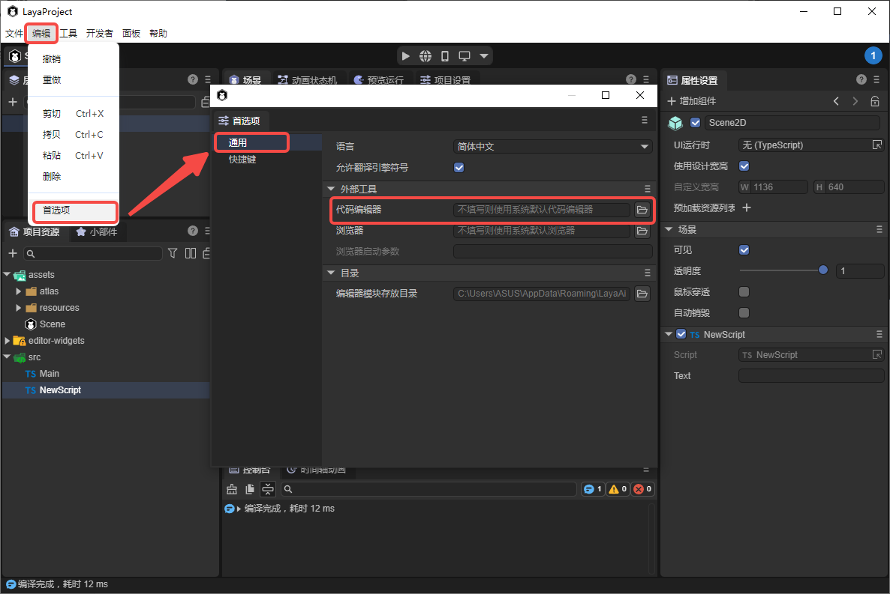

（图1-5）

> 用于调试和预览的外部浏览器，如果不想使用IDE默认指定之外，也可以在此处设置。

### 1.3 IDE的语言设置

LayaAir3的IDE支持中文与英文，开发者可自行选择。

需要重点提及的是，在中文界面中，支持属性名自选是否翻译。

考虑到有些开发者更习惯于英文的属性名称，以便于直观的在代码中使用，还考虑到有的开发者更习惯于中文属性名，以方便理解。因此，可以通过`勾选翻译引擎符号`使用全中文的界面（Tips中仍然可查看英文属性名），如图1-6所示，去掉勾选，则引擎属性将不翻译。

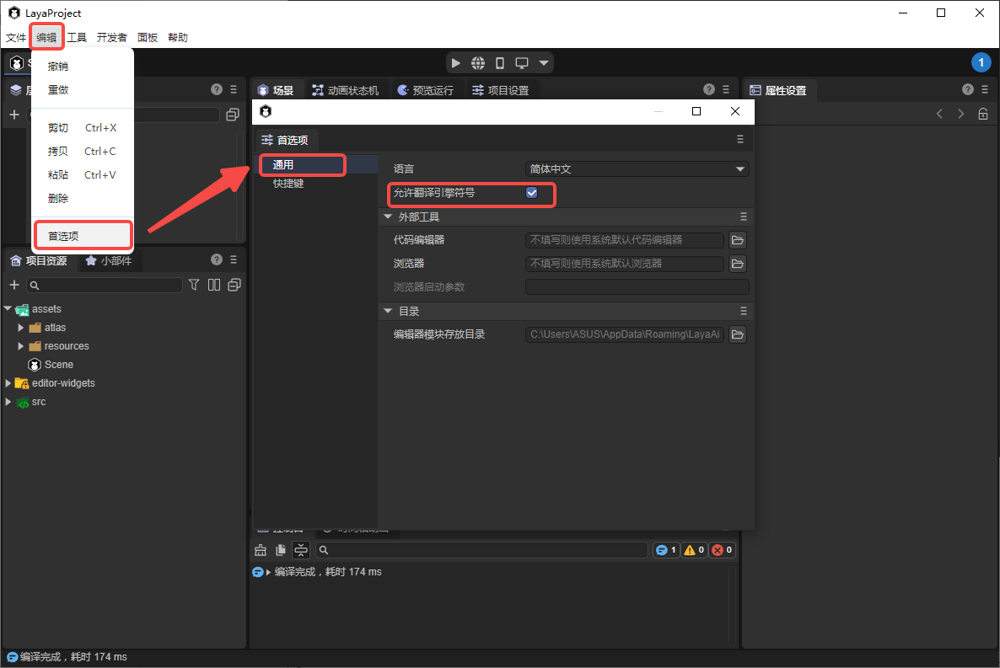

（图1-6）

## 二、预览运行

项目预览用来查看项目在不同环境中的运行效果。LayaAir-IDE提供了四种模式（版本>=3.2），如图2-1所示，分别是IDE内预览，浏览器预览，移动端预览，Windows端预览。

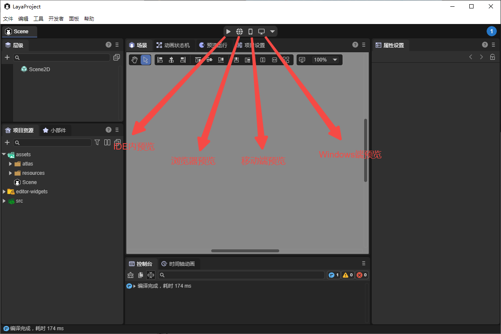

（图2-1）

### 2.1 IDE内预览与调试

IDE内置了浏览器预览环境，点击IDE内后，直接在IDE内预览运行效果。在该模式下，开发者可以更清晰的查看运行后的节点层级，以及直接调整节点属性的变化效果。如动图2-2所示。

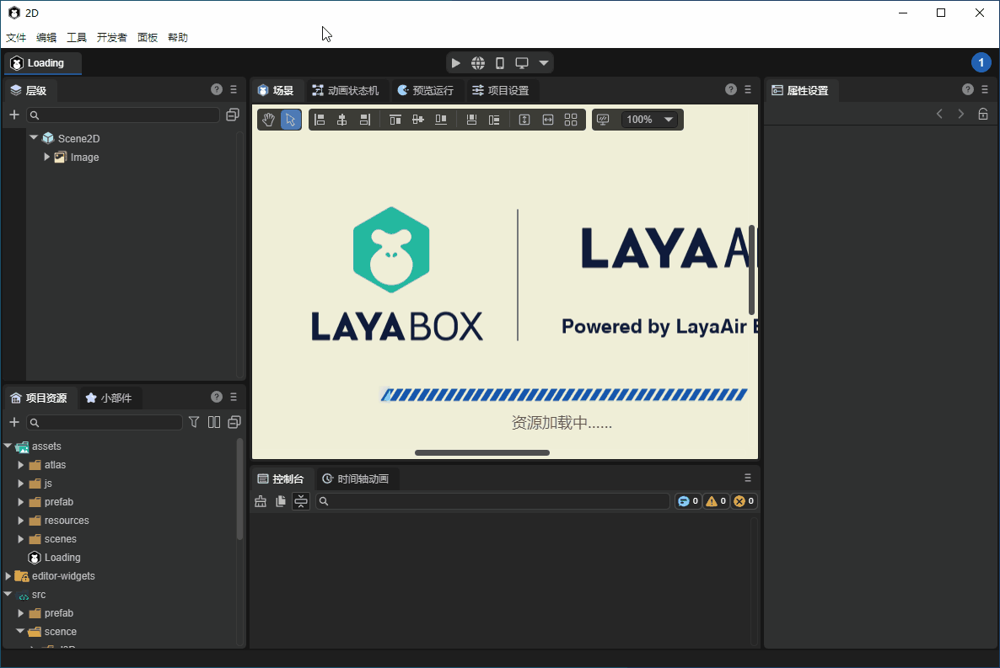

(动图2-2)

> 此效果为“2D入门示例”项目。

预览面板上的工具栏中，可以调整预览的分辨率、缩放、重置、声音开关、开发者工具、刷新。如图2-3所示。

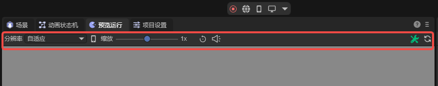

(图2-3)

### 2.2  浏览器预览

浏览器预览，就是调用系统的浏览器来运行与调试，我们通常是推荐chrome浏览器，如果开发者的系统中默认不是chrome浏览器，也可以通过 `首选项` -> `通用`   -> `外部工具`  -> `浏览器` 选择开发者指定的浏览器。如图2-4所示。

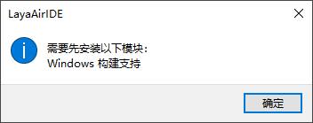

（图2-4）

### 2.3 移动端预览

移动端预览用于手机扫码预览移动端浏览器运行的真机效果。如图2-5所示。

> 需要注意的是，移动端设备要与电脑设备处于同一局域网下。

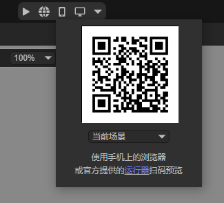

（图2-5）

### 2.4  Windows端预览 

Windows端预览是基于windows原生exe环境的一种预览模式，通常用于检测Native安装包中是否运行稳定或表现是否一致等问题。

如果是首次运行，没有安装相应的native模块，则会弹出图2-6所示的提示，先安装环境构建的支持包。

（图2-6）

点击确定后，会自动提示安装，点击安装即可。

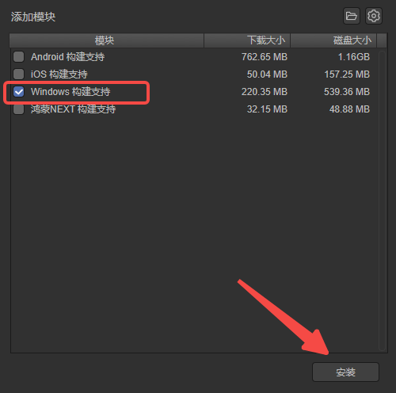

（图2-7）

安装完成后，点击即可查看运行效果，如图2-8所示。

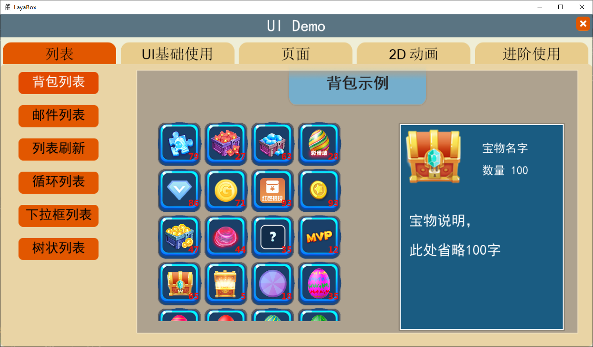

（图2-8）

> 此效果为“2D入门示例”项目。

## 三、入口场景说明

### 3.1 运行的入口

LayaAir3引擎是基于场景运行的，无法设置一个纯粹的代码作为项目入口。

也就是说，无论是测试运行，还是正式上线，必须要有一个入口的场景，作为项目运行首先启动的场景。

点击图3-1所示的图标，可以选择预览运行的入口，也就是点击预览运行后，要加载并运行的场景。

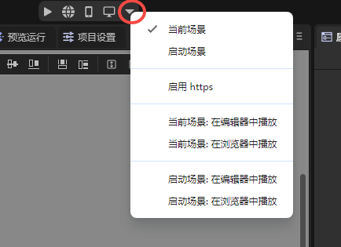

（图3-1）

### 3.2 当前场景

`当前场景`就是指当前正在编辑的场景，如图3-2显示的就是当前场景。该模式仅用于预览测试的时候使用。

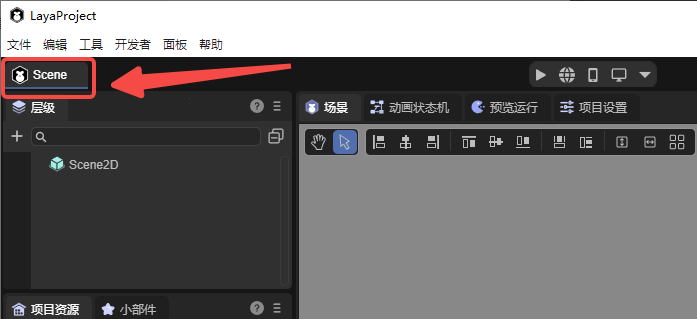

（图3-2）

### 3.3 启动场景

启动场景是整个项目的入口场景，通常是用于加载页，在该界面中实现游戏资源的加载，以及进度条的展示。

要设置启动场景，需要依次打开 `构建发布` -> `通用` -> `启动场景` 来进行设置，如图3-3所示。

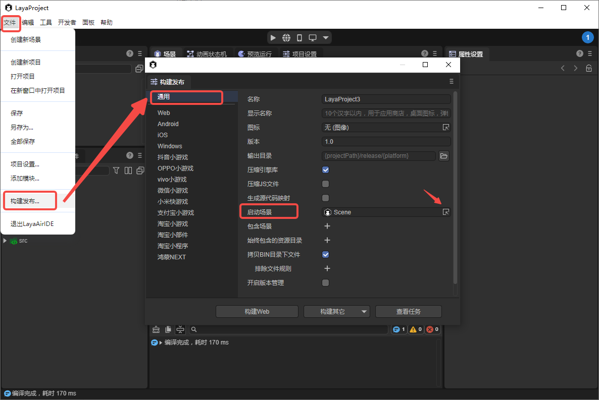

（图3-3）

设置完成后，无论是项目预览的勾选`启动场景`还是构建项目（发布产品）的时候，都会以启动场景作为项目运行的入口场景。

## 四、脚本

场景支持两种脚本的运行，一种是UI运行时，仅支持2D UI场景的根节点上使用。另一种是自定义脚本，适用于任意场景和节点上使用。无论开发者选择使用哪一种，都会跟随场景的运行而执行脚本逻辑。

做为新手，本小节以自定义脚本为例，引导开发者在场景上创建脚本并运行该脚本。

### 4.1 创建脚本

开发者首先选中层级面板中的根节点，在属性面板中，依次点击`增加组件` 与 `新建组件脚本` ，然后`输入名称`，点击`创建并添加`。如动图4-1所示，即完成了脚本的创建，以及场景上绑定脚本的操作。

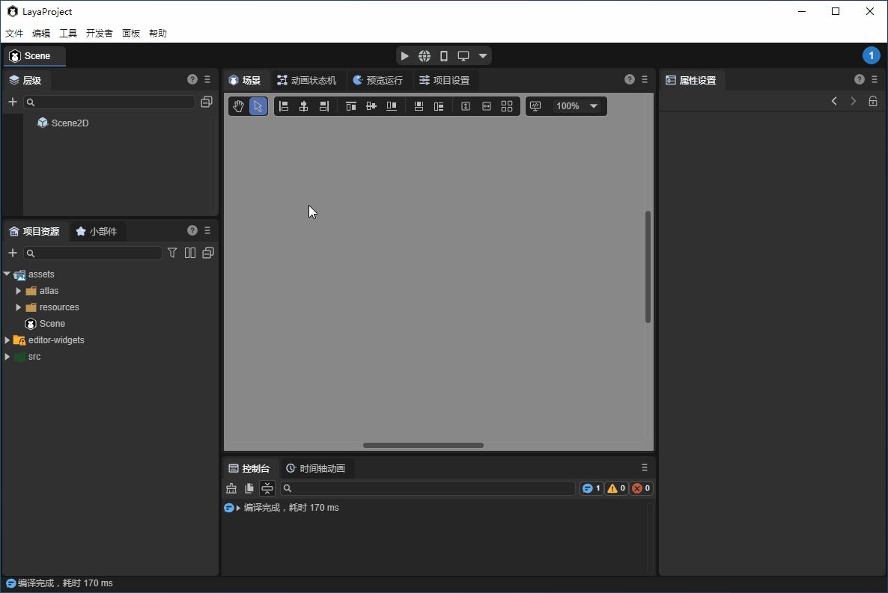

（动图4-1）

除了这种方式外，我们也可以在项目资源面板中创建脚本，然后将脚本拖拽到属性面板进行绑定组件，操作如动图4-2所示。

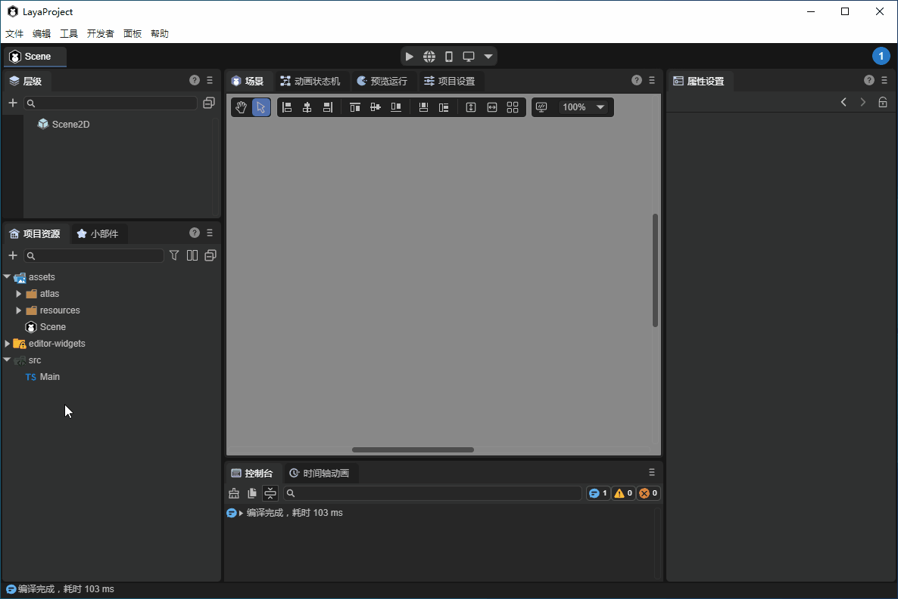

（动图4-2）

### 4.2 脚本编码

脚本的编码环境，在前文中已进行介绍，我们推荐采用Vscode进行编码。当我们双击属性面板的脚本或资源面板的脚本，均会打开Vscode编码工具，如图4-3所示。

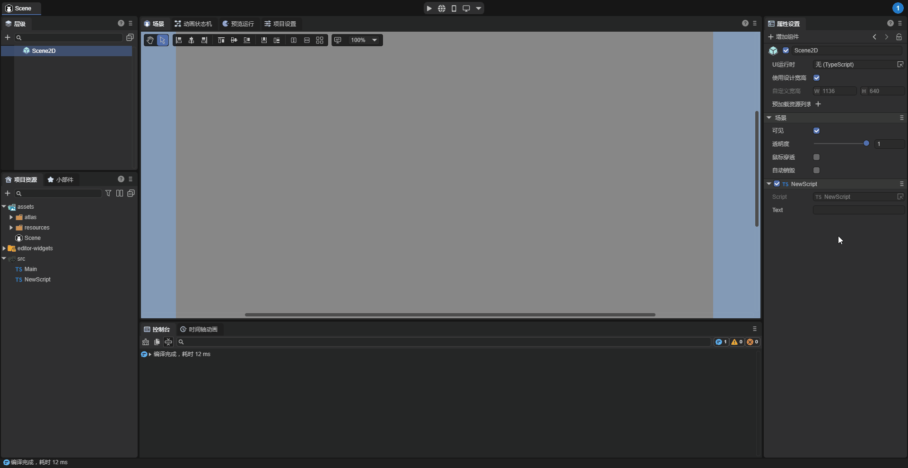

（图4-3）

进入vscode编码工具后，我们在onAwake生命周期方法里，添加第一行代码，打印"Hello, World!"，如图4-4所示，

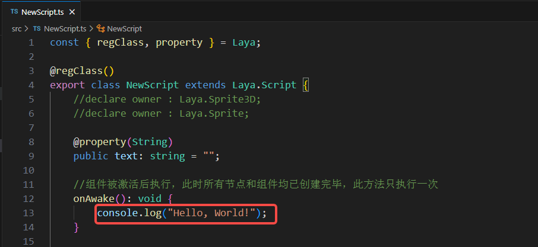

（图4-4）

回到LayaAir-IDE中，运行查看控制台，如动图4-5所示，可以看到打印了日志。

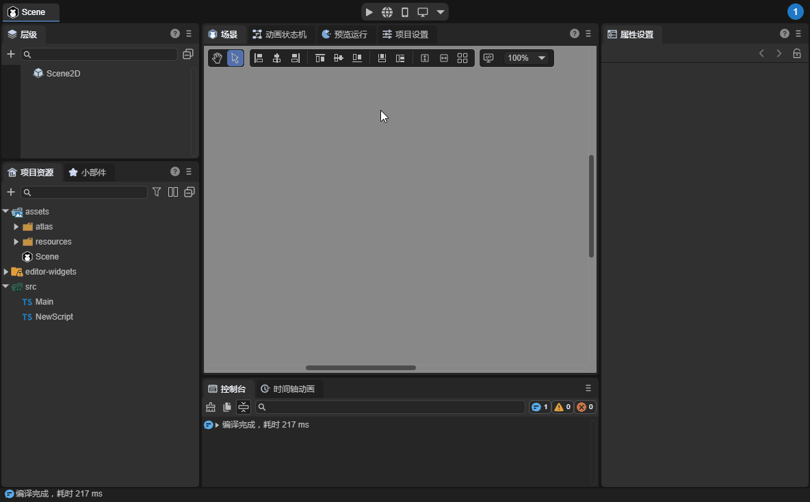

（动图4-5）

如果我们使用浏览器进行调试，按F12键在DevTools中查看日志。

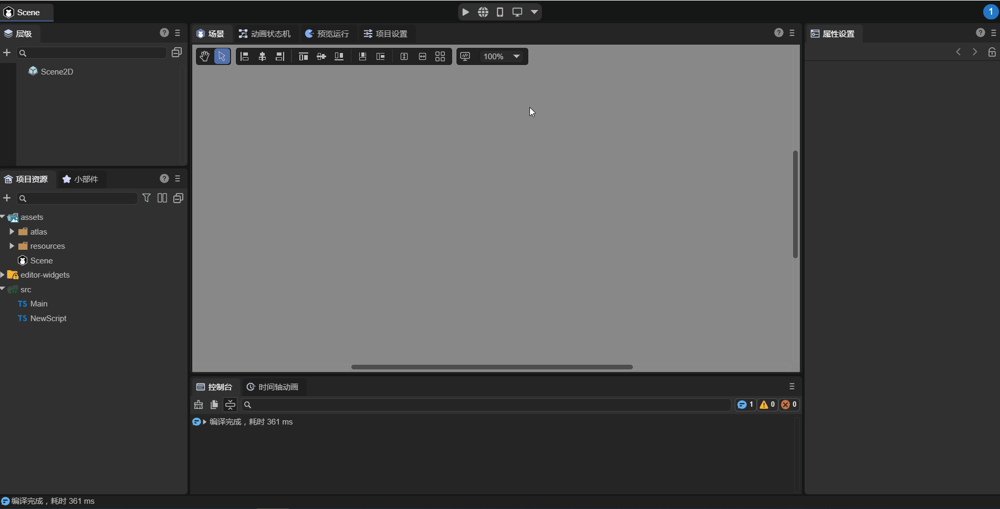

（动图4-6）

关于更多如何基于LayaAir的组件系统，进行脚本编写，一定要查看文档[《实体组件系统（ECS）》](../../common/Component/readme.md)。

## 五、可视化开发

LayaAir3-IDE支持丰富的可视化开发模块，这里列出一些主要的功能模块文档链接，开发者可在有时间的时候逐一查看。

[UI编辑模块](../../../IDE/uiEditor/readme.md)

[动画编辑模块](../../../IDE/animationEditor/readme.md)

[2D物理编辑](../../../IDE/physicsEditor/physics2D/readme.md)

[3D物理编辑](../../../IDE/physicsEditor/physics3D/readme.md)

[3D粒子编辑](../../../IDE/particleEditor/readme.md)

[材质编辑模块](../../../IDE/materialEditor/readme.md)

[蓝图编辑模块](../../../IDE/ShaderBlueprint/readme.md)

[IDE插件系统](../../../IDE/layapackage/readme.md)

## 六、构建发布

当开发完成后，可以将项目发布出去，在“构建发布”面板中，点击“构建Web”，构建完成后，点击运行，会在浏览器中运行。

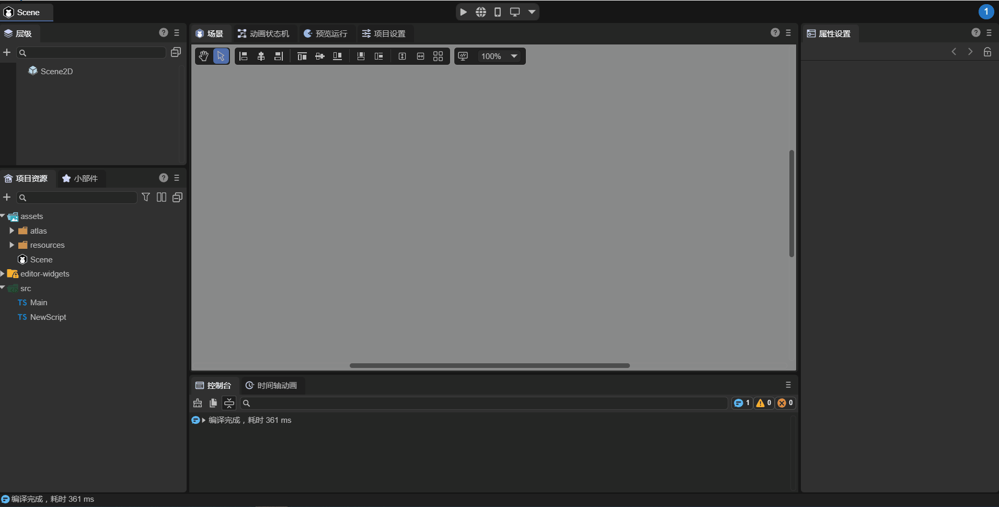

（动图6-1）

> 更多构建发布的内容可以参考[《 通用发布》](../../../released/generalSetting/readme.md)。

