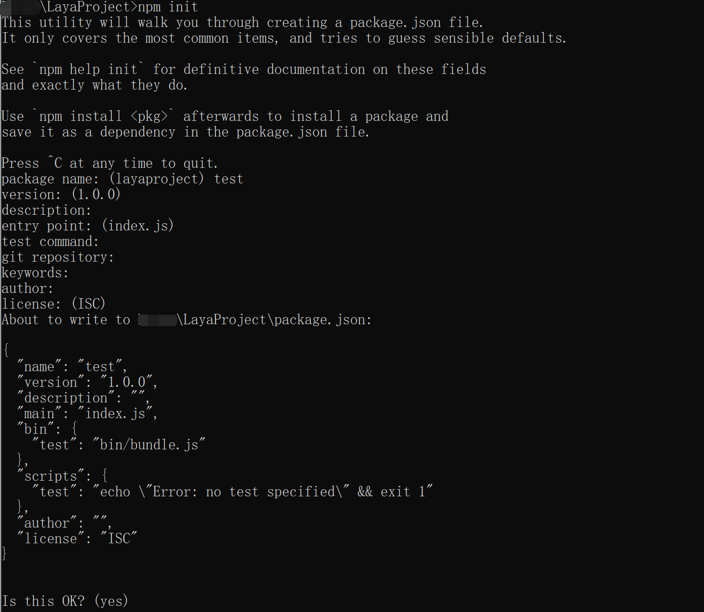
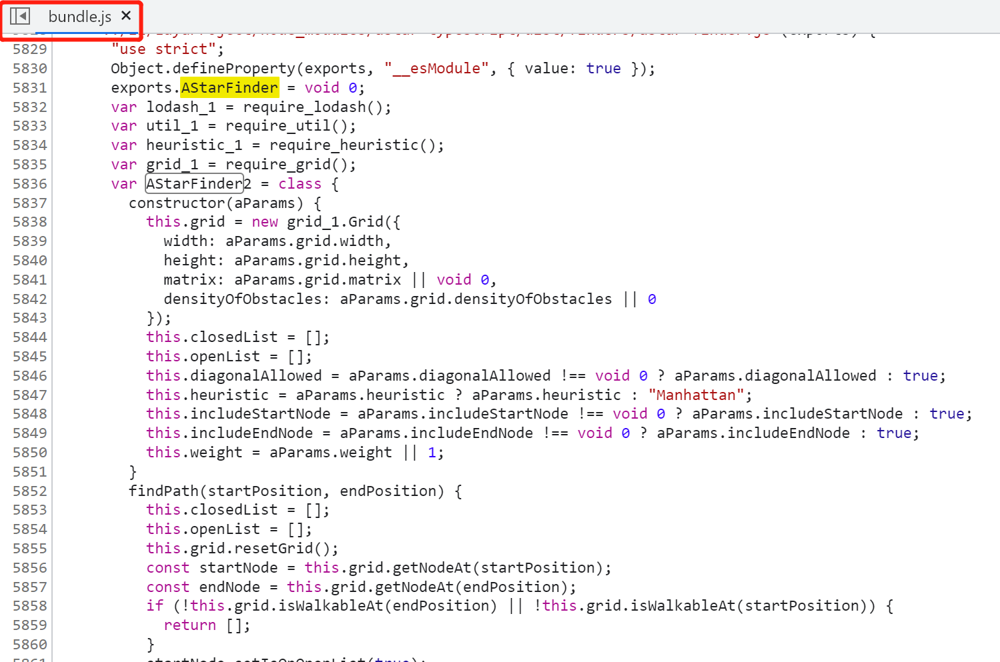
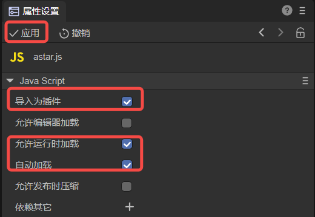

# 使用外部模块


## 一、第三方模块

### 1.1 支持方式

在开发过程中，如果需要使用一些第三方库，推荐的解决方法是使用JS的模块功能。

步骤如下：

1. 在项目文件夹执行 npm init 初始化项目。
2. 使用npm install xxx --save 安装xxx包。

然后在代码中使用import语句导入即可


### 1.2 使用示例

我们用第三方AStar模块在讲解：

**npm init**

在开发中使用npm init会生成一个pakeage.json文件，这个文件主要是用来记录这个项目的详细信息的，它会将我们在项目开发中所要用到的包，以及项目的详细信息等记录在这个项目中。

执行npm init是需要在DOS窗口执行的，我们可以windows+r键来打开窗口，然后输入CMD执行，然后就可以打开DOS窗口了。打开窗口之后，在DOS窗口中进入自己项目所在的目录。进入到项目所在的目录之后我们就可以直接执行npm init，执行了npm init之后，会让我们填写一些配置信息，如果还不知道怎么填写的话可以一路回车。

package name：你的项目名字
version： 版本号
description： 对项目的描述
entry point： 项目的入口文件
test command：项目启动的时候要用什么命令来执行脚本文件
git repository：如果你要将项目上传到git中的话，那么就需要填写git的仓库地址（这里就不写地址了）
keywirds： 项目关键字（这里就不写了）
author：作者的名字（这里就不写了）
license：发行项目需要的证书（这里就不写了）

如图1-1所示，

 

（图1-1）


**npm install xxx --save**

以npm安装AStar为例，如图1-2所示

 

（图1-2）

会把astar包安装到node_modules目录中
会在package.json的dependencies属性下添加astar

看一下package.json里的内容：

```
{
  "name": "test",
  "version": "1.0.0",
  "description": "",
  "main": "index.js",
  "bin": {
    "test": "bin/bundle.js"
  },
  "scripts": {
    "test": "echo \"Error: no test specified\" && exit 1"
  },
  "author": "",
  "license": "ISC",
  "dependencies": {
    "astar-typescript": "^1.2.5"
  }
}
```

接下来在我们的代码中可以使用 import AstarFinder 了，示例代码如下：

```
import { AStarFinder } from "../node_modules/astar-typescript/dist/astar";


const { regClass, property } = Laya;

@regClass()
export class Main extends Laya.Script {

    private aStarInstance: AStarFinder;

    onStart() {
        console.log("Game start");

        let myMatrix = [
            [0, 0, 0, 0, 0, 0, 0, 0],
            [0, 0, 0, 0, 0, 0, 0, 1],
            [0, 0, 1, 1, 0, 1, 1, 0],
            [0, 0, 1, 0, 0, 0, 1, 0],
            [0, 0, 0, 0, 0, 0, 1, 0],
            [1, 1, 1, 0, 1, 0, 1, 0],
            [0, 0, 0, 0, 1, 0, 1, 0],
            [0, 0, 1, 0, 0, 0, 0, 0]
          ];
          
        this.aStarInstance = new AStarFinder({
            grid: {
              matrix: myMatrix
            }
          });

        let startPos = { x: 0, y: 0 };
        let goalPos = { x: 7, y: 7 };

        let myPathway = this.aStarInstance.findPath(startPos, goalPos);
        console.log(myPathway);
    }
}
```

通过在IDE中运行此脚本，可以获得从 0,0 点到 7,7 点的最短路线，如图1-3所示

 

（图1-3）

到此为止，第三方模块已经成功导入到项目中了，在IDE中会自动加载，预览和运行都能正常使用。我们也可以验证发布工程，通过点击发布可以看到，引入的AStarFinder类已经成功的集成到发布的代码中了，如图1-4所示

 

（图1-4）


## 二、第三方JS文件

在某些特殊情况下，如果需要直接使用一些第三方的JS文件，IDE也提供了单独导入的功能。

### 2.1 支持方式

**导入为插件**

首先将JS文件放置到项目的assets文件夹或src文件夹下，然后在属性设置里勾选“导入为插件”。如图2-1所示

 

（图2-1）

此时这个脚本会在预览、运行或者发布中会自动加载。

**允许编辑器加载**

如果勾选“允许编辑器加载”，则脚本在编辑器环境也会载入。

> **注意，JS脚本不要出现对全局环境的修改，否则影响编辑器稳定。另外，JS脚本一旦载入，没有卸载和刷新功能，如果修改了JS文件，需要刷新编辑器才生效。如果不勾选，这个脚本会在预览、运行或者发布中才会载入。**

**依赖其它**

“依赖其它”可以设置多个脚本，这些脚本将会安排优先载入。


### 2.2  使用示例

我们用2D入门示例来讲解：

首先，在2D入门示例中，如果在没有导入astar.js的情况下，运行“进阶使用”下的“A*寻路”，点击任何区域，人物没有任何移动，如图2-2所示

 

（图2-2）

由于IDE本身不支持Astar的类库，同时也没有导入Astar类库，运行时会报错，如图2-3所示

 

（图2-3）

因此，我们需要引入Astar.js来支持A*算法，从 https://github.com/bgrins/javascript-astar 官网下载 [astar.js](https://github.com/bgrins/javascript-astar/blob/master/astar.js)

将 astar.js 放入 assets 目录下，或者 src 目录下，这里以 assets 为例，如图2-4所示

 

（图2-4）

点击 astar ，在属性面板中，勾选“导入为插件”，并点击“应用”，如图2-5所示

 

（图2-5）

此时，astar.js 已作为插件导入IDE中，在预览，运行和发布中会自动载入。

我们再次运行2D示例查看A*寻路示例，如动图2-6所示

 

（动图2-6）

运行正常了，接下来我们测试一下发布，看下发布后是如何实现的，如图2-7所示

 

（图2-7）

在发布后的web目录下，astar.js 已经发布到js目录下，并在index.html中被引入，再次运行，A*寻路依然正常运行。

开发者还可以对“允许编辑器加载”和“依赖其它”进行使用。