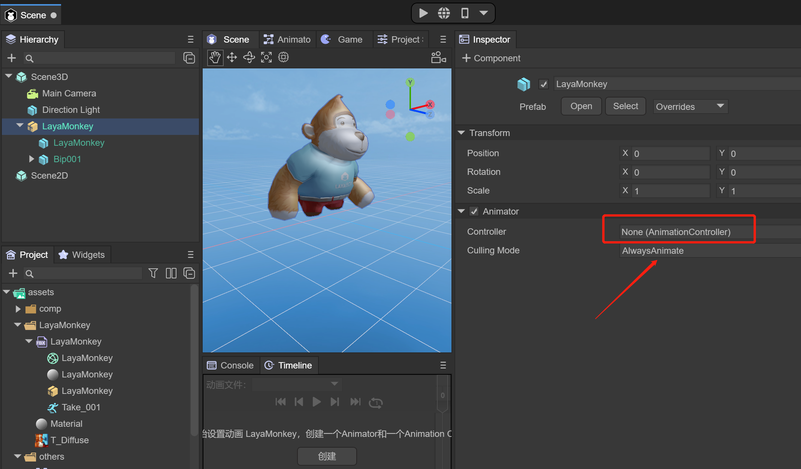
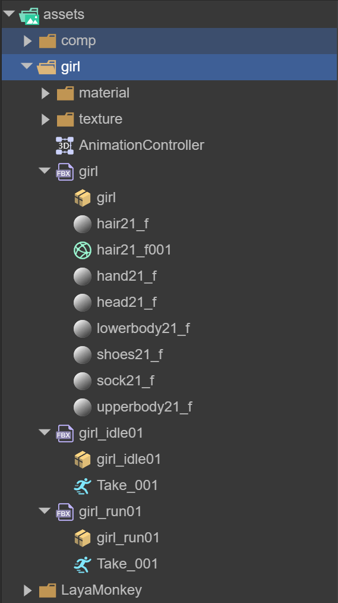
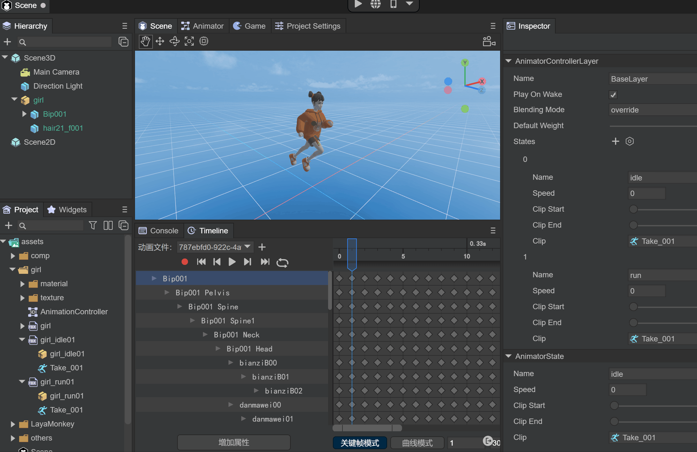
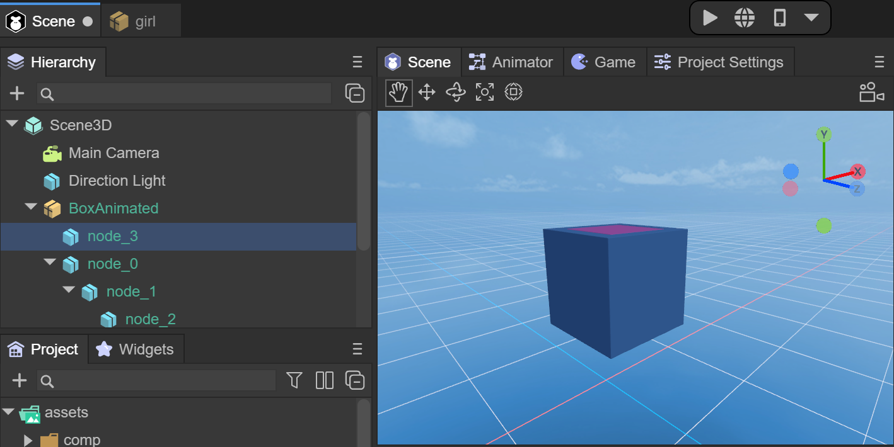
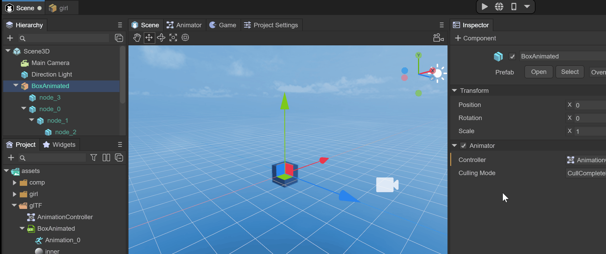

# 3D动画的导入与使用


## LayaAir目前支持导入的3D动画

- ### **骨骼蒙皮动画**

- ### **刚体动画**

  

## 一、骨骼蒙皮动画

在LayaAir中只能制作比较简单的动画，要想要复杂的动画，比如人物跑步的动画，那就要在外部的软件中制作并且导入到LayaAir中使用。通常我们需要使用3dMax软件制作模型和动画，并导出为Fbx格式文件，下面将介绍如何导入3D模型及动画

### 1，模型文件导入

将Fbx放入Assets目录下

 

（图1）

打开LayaAir IDE，IDE会识别Fbx文件并可以展开Fbx文件，看到图2中的文件信息，其中Take_001是Fbx自带的骨骼蒙皮动画文件，也是自身待机动画

将Fbx拖入Scene3D场景下，可以看到模型，但是没有贴图和动画，下面先介绍如何为LayaMonkey添加材质和贴图

 

（图2）


### 2，贴图设置关联

将贴图文件放入Assets下

 

（图3）

需要创建一个材质文件，来为模型配置贴图等信息

 

（图4）

点击新建的Material文件，右面可以看到很多配置信息，这里我们只需要将贴图文件拖入到材质文件中，

 

（图5） 

将材质文件拖入LayaMonkey的SkinnedMeshRenderer组件的Materials中

 

（图6） 

可以看到模型已经有贴图效果了

 

（图7）


### 3，骨骼蒙皮动画导入及使用

下面介绍如何为LayaMonkey添加动画

当Fbx文件拖入到Scene3D场景中时，会自动添加Animator组件，如果没有可以自行添加Animator组件，并且保证AlwaysAnimate模式

 

（图8）

此时，我们需要创建一个AnimationController文件，也就是3D动画状态机

 

（图9）

将新创建的Animation Controller文件，拖入到Animator组件中

 

（图10）

双击AnimatorController后，将Take_001动画文件拖入Animator窗口中

 

（图11） 

再次点击Scene窗口，点击下面的动画文件预览可以看到动画效果

 

（图12）  

此时运行IDE，可以播放LayaMonkey动画，也可以将LayaMonkey拖入Assets目录下，作为预制体，方便重用或者代码实现

 

（图13）  


### 4，多个单独骨骼蒙皮动画文件使用

大多数情况下，含动画的模型导出的Fbx文件会同时包含网格信息和动画信息，但是也有一些情况fbx文件只需要导出动画信息。例如同一个模型有很多动画，网格信息只需要一个就够了，其他动画信息可以通过单独的模型文件（不包含网格信息）导出。在制作动画时应该考虑动画的重用，用于场景中同类的模型。例如，不同的人形角色可能都使用相同的走动和跑步动画。只要保持骨骼结构一致，动画就可以重用。

图14中，以girl为例，我们将不带动画信息的Fbx文件和多个只带动画的Fbx文件放入Assets中

 

（图14）

创建好AnimatorController后，并将待机和跑步动画拖入Animator窗口中，可修改动画名字

 

（图15）

> 注意：此时idle待机动画是默认动画

如图16所示，我们可以分别预览待机和跑的动画，并设置是否循环播放

 

（图16）  

多个单独的骨骼蒙皮文件就设置成功了，单独的动画也可以设置到其它的模型去重用


### 5，代码运行示例

如下代码，我们可以在任何场景下，加载girl预制体，添加到场景中，并用鼠标点击屏幕来切换动画

```
import { MainBase } from "./Main.generated";
import KeyBoardManager = Laya.InputManager;
import Keyboard = Laya.Keyboard;
const { regClass, property } = Laya;

@regClass()
export class Main extends MainBase {

    private _animator: Laya.Animator;
    private _isRun: boolean;
    onAwake() {
        console.log("Game start");
        //加载指定的模型预制体，并添加到Scene3D场景内
        Laya.loader.load("girl/girl.lh").then(res => {
            let girl : Laya.Sprite3D = res.create();
            this.scene3D.addChild(girl); 
            //获得Animator 
            this._animator = girl.getComponent<Laya.Animator>(Laya.Animator);
        });      
        this.on( Laya.Event.MOUSE_DOWN, this, this.switchAni );
    }

    switchAni(): void {
        if (this._isRun) {
        	//播放对应的动画
            this._animator.play("idle");                
        } else {
			this._animator.play("run");
        }  
        this._isRun = !this._isRun;
    }    
}
```


## 二、刚体动画


### 1，glTF或fbx文件导入

将glTF放入Assets目录下，打开LayaAir IDE，IDE会识别glTF文件并可以展开glTF文件，看到图17中的文件信息，其中Animation_0是glTF自带的刚体动画文件

  

（图17）

将glTF拖入Scene3D场景下，可以看到模型，但是没有动画，下面先介绍如何使用动画

 

（图18）

### 2，动画导入及使用

当glTF文件拖入到Scene3D场景中时，会自动添加Animator组件，如果没有可以自行添加Animator组件，并且保证AlwaysAnimate模式

 

（图19）

此时，我们需要创建一个AnimationController文件，也就是3D动画状态机

 

（图20）

将新创建的Animation Controller文件，拖入到Animator组件中

 

（图21）

双击AnimatorController后，将Take_001动画文件拖入Animator窗口中

 

（图22） 

此时运行IDE，可以播放刚体动画，也可以将BoxAnimated拖入Assets目录下，作为预制体，方便重用或者代码实现

 

（图23）  


