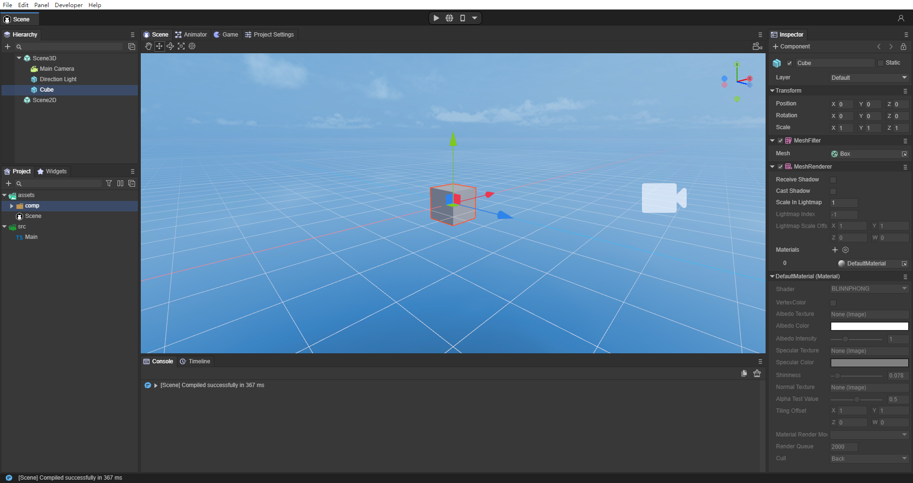
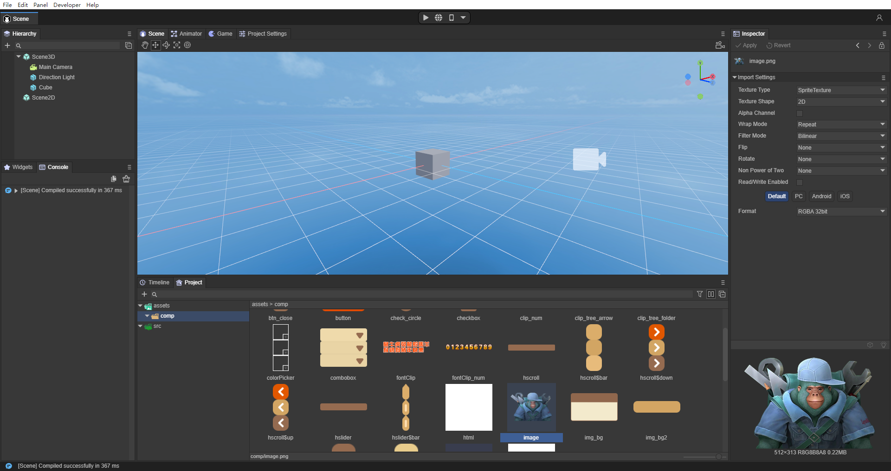
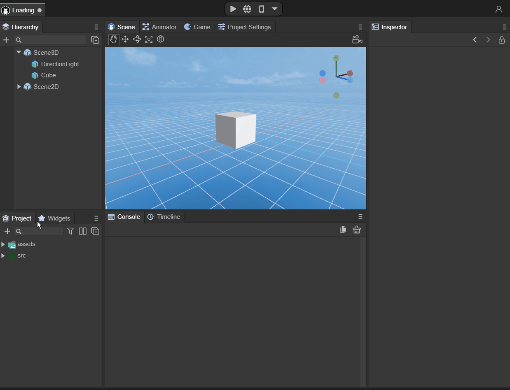
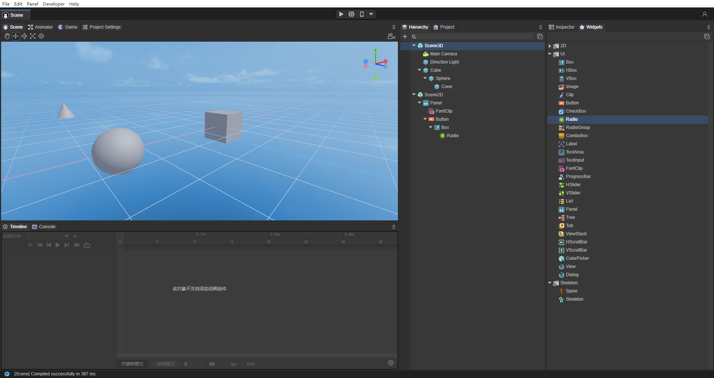
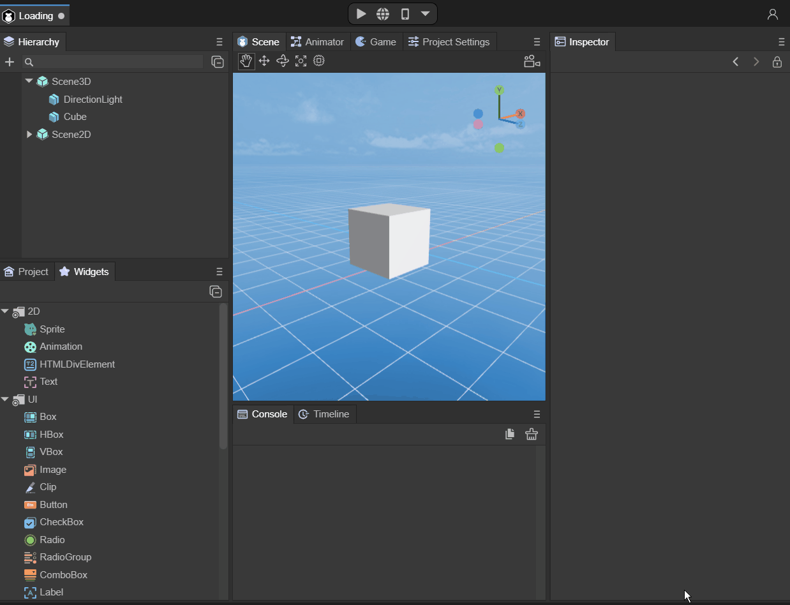
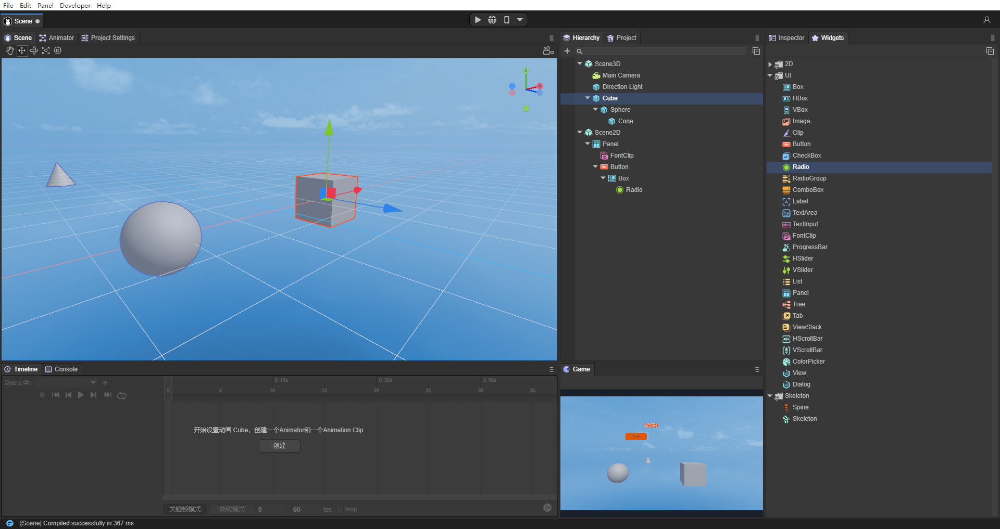

# 自定义IDE界面布局

> Author：Charley   &&  高宇浩

LayaAir 3.0 IDE允许开发者按照自己的习惯或喜好，对各块功能进行任意布局排版。

## 一、调整为更方便资源预览

当我们创建一个空项目，例如3D空项目，界面布局如图1-1所示。

 

（图1-1）

默认的模式比较简洁，有的开发者也许对资源的预览要求更高一些，我们不妨调整为这样的效果，界面如图1-2所示。

  

(图1-2)

操作方式如动图1-3所示：

 

（动图1-3）

## 二、调整为更方便层级展开

假如开发者的节点层级较多，并且需要展开查看的时候，纵向全屏查看，显然更加方便，效果如图2-1所示。

    

(图2-1)

操作方式如动图2-2所示：

 

(动图2-2)

## 三、调整为即时预览的方式

有的时候，开发者还需要一边编辑场景（2D和3D），一边查看实时预览效果。那么我们可以将Game面板独立出来，效果如图3-1所示。

  `

(图3-1)

操作方式如动图3-2所示：

 

(动图3-2)

---

> [!Note]
>
> 以上三种方式，仅供参照，掌握好IDE面板的位置调整方式，就可以按自己的需求与喜好进行布局了~