# 项目设置详解

> Author：Charley、孟星煜

## 一、运行配置

### 1.1 分辨率设置

分辨率的设置会影响IDE内的预览效果，以及项目运行时的画布宽高、适配模式、对齐方式，画布背景色等。可设置属性如图1-1所示：

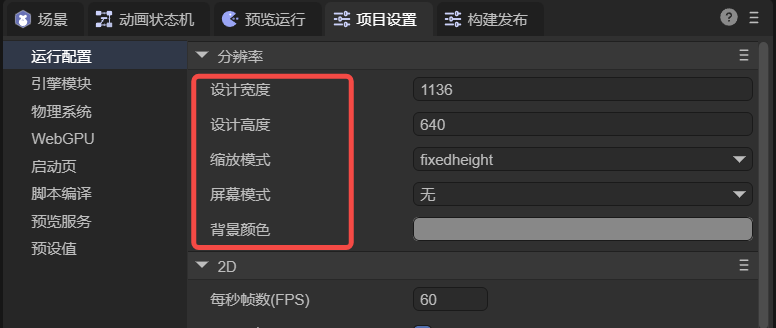  

（图1-1）

#### 1.1.1 画面宽高适配

影响产品画面宽高的三个设置，分别是设计宽高（Design Width、Design Height），缩放适配模式(Scale Mode)。

设计宽高，就是我们在IDE里的设置并看到的宽高，

这个宽高会影响在IDE里的UI场景背景大小，以及IDE的预览运行模式下，也是基于这个宽高查看效果。

在实际的运行环境里，例如不同的手机。由于屏幕比例的不同，肯定不可能与设计宽高完全吻合。

所以，就需要用引擎自带的缩放适配模式，进行缩放，从而来满足开发者的屏幕需求。

缩放适配模式涉及画布、舞台、适配算法等诸多知识点，我们在另一篇文档[《屏幕适配》](../../common/adaptScreen/readme.md)里详细介绍。

#### 1.1.2 横竖屏适配

有的时候，我们需要根据屏幕的比例强制横竖屏设置，在IDE中可以通过设置屏幕模式（Screen Mode）来设置。

横竖屏有三种适配模式，如图1-2所示。

 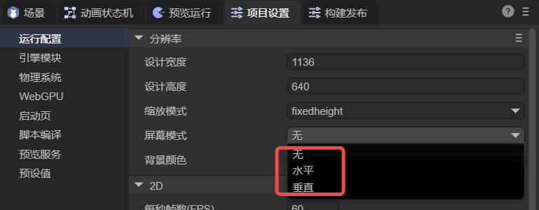

（图1-2）

**1，无变化：none**

none时，无论屏幕方向如何旋转，游戏的水平方向都不会产生跟随屏幕旋转的变化。

效果如动图1-3所示。

 

(动图1-3) 

通过动图1-3发现，none值时，当屏幕发生旋转后，基于竖屏设计的界面在横屏下就会变的不适合，同理，基于横屏设计的界面在竖屏下，也会变的不适合。

当然，如果我们的布局策略运用的比较合理，也许也可以兼顾横竖屏的体验。效果如动图1-4所示。

 

(动图1-4)

虽然不那么难看了，但为了达到最佳的效果，最好的方案，还是竖屏始终与设备竖屏的方向保持一致，横屏与设备横屏的方向保持一致。

**2，始终横屏：horizontal**

当我们设置的宽高就是横屏产品时，horizontal无疑是最佳的体验，效果如动图1-5所示。

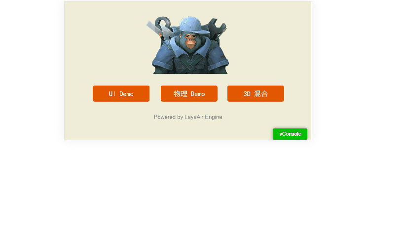  

(动图1-5)

通过动图1-5发现，screenMode属性值设置为horizontal时，无论屏幕方向如何旋转，设计上的水平方向都会与屏幕最短的边始终保持垂直，所以用户设备竖屏时看到横屏画面，自然就会把设备横过来，从而吻合了产品的设计。

**3，始终竖屏：vertical**

当我们设置的宽高就是竖屏产品时，vertical无疑是最佳的体验，效果如动图1-6所示。

  

(动图1-6)  

通过动图1-6发现，screenMode属性值设置为vertical时，无论屏幕方向如何旋转，游戏的水平方向都会与屏幕较长的边始终保持垂直。所以用户哪怕是把设备横屏了，仍然看到的是竖屏画面，自然就会把设备恢复竖屏，从而吻合了产品的设计。

> [!Tip]
>
> 需要注意的是，浏览器中运行的时候，引擎的自动横屏和自动竖屏，只能对画布进行旋转，如果用户的手机锁屏了，虽然画面自动旋转过来了，但是浏览器没有旋转过来，会导致输入法依然按浏览器的方向弹出，此时，可能会导致输入法与浏览器的显示呈90度。
>
> 在小游戏平台中运行，由于小游戏底层有横屏还是竖屏的配置，不会出现这个问题。


#### 1.1.3 画布背景色设置

画布背景色，其实就是给画布设置一个颜色，默认值为`#888888`，如图1-7所示：


（图1-7）

### 1.2 引擎初始化设置

有一些引擎的配置项，需要在引擎初始化的时候设置，而设置的入口就是如图1-8所示：

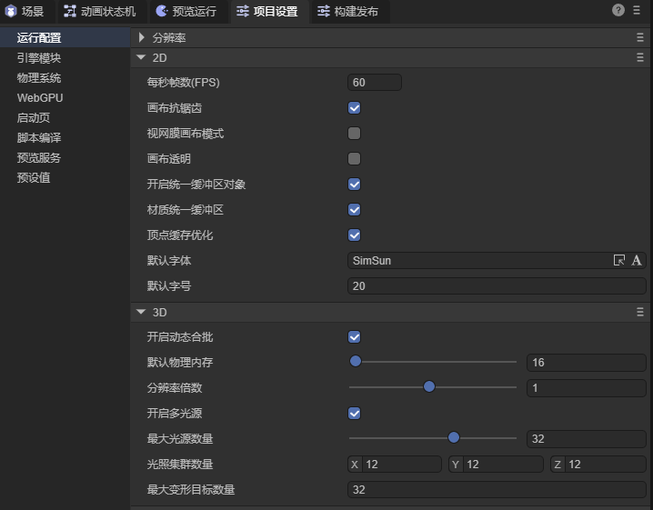

（图1-8）

2D属性参数说明：

| <span style="display:inline-block;width:115px">属性名称</span> | 属性说明                                                     |
| ------------------------------------------------------------ | ------------------------------------------------------------ |
| 每秒帧数FPS                                                  | 设备帧率；用于计算两帧之间的渲染最大间隔时长，通常设备上的帧率是最大60，也就是一秒钟内最多只有 60 帧会出现在屏幕上，那么两帧之间的时长为1000ms/60。对于高帧率设备，我们可以修改FPS值，例如120帧的设备，那两帧之间的时长则为1000ms/120。 |
| 画布抗锯齿                                                   | 是否开启抗锯齿；用于设置webGL上下文的antialias抗锯齿开关属性，会产生额外的性能消耗，主要用于2D非矩形的矢量绘图抗锯齿，无矢量绘制图形或性能压力大时，可以选择不开启。3D抗锯齿推荐使用摄像机的Fxaa或Msaa。 |
| 视网膜画布模式                                               | 是否使用高清画布模式；开启后无论任何适配模式，画布均采用物理分辨率大小，开启后会比不采用物理分辨率多一些性能消耗，但会让文本等保持最佳清晰度。 |
| 画布透明                                                     | 是否画布透明；默认状态画布有背景色，开启后，可以设置画布为无色透明。 |
| 顶点缓存优化                                                 | 是否分配最大的VB缓冲区；开启后，渲染2D的时候，每次创建vb直接分配足够64k个顶点的缓存。这样可以提高效率。关闭后，可节省64k显存，但会牺牲性能效率，如果包含2D时，建议保持默认开启。 |
| 默认字体                                                     | 文本的默认字体；设置以后，IDE中新建的文本默认字体都采用该处的设置。 |
| 默认字号                                                     | 文本的默认字号；设置以后，IDE中新建的文本默认字号都采用该处的设置。 |

3D属性参数说明：

| <span style="display:inline-block;width:100px">属性名称</span> | 属性说明                                                     |
| ------------------------------------------------------------ | ------------------------------------------------------------ |
| 开启动态合批                                                 | 是否启用动态合批；开启动态合批后，满足 **实例合并**（同Mesh且同材质） ，即可减少RenderBatches渲染批次与Shader提交次数。 |
| 默认物理内存                                                 | 初始化3D设置时，默认物理功能初始化内存，单位为M。            |
| 分辨率倍数                                                   | 设置3D的分辨率倍数，默认值为1 ；降低3D分辨率，不会影响2D UI的分辨率，适当的调节可降低性能的消耗。 |
| 开启多光源                                                   | 是否开启多光源；如果不需要多光源，关闭后可减少性能的消耗。   |
| 最大光源数量                                                 | 默认值为32个。                                               |
| 光照集群数量                                                 | x、y、z轴的光照集群数量；z值会决定Cluster受区域光（点光、聚光）影响的数量，Math.floor(2048 / lightClusterCount.z - 1) * 4 为每个Cluster的最大平均接受区域光数量,如果每个Cluster所接受光源影响的平均数量大于该值，则较远的Cluster会忽略其中多余的光照影响。 |
| 最大形变数量                                                 | 网格渲染器的最大形变数量。默认值为32。                       |

### 1.3 杂项

如图1-9所示，LayaAir-IDE可以开启以下调试模块：

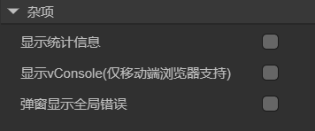

（图1-9）

#### 1.3.1 显示统计信息

勾选显示统计信息之后，可以查看当前帧率、内存占用、节点等信息，用于项目的分析与优化。如图1-10所示。

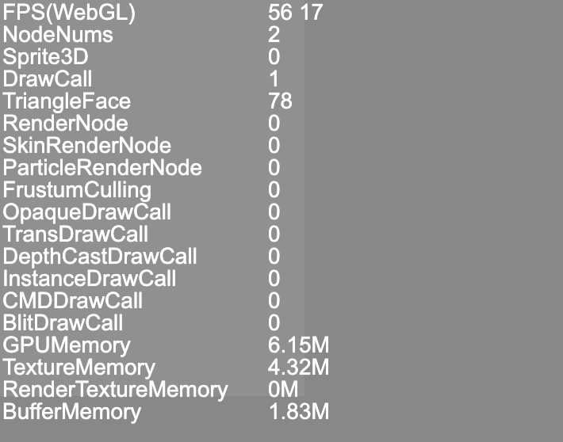

（图1-10）

如想了解更详细的统计信息面板上的参数，请查阅文档[《性能统计与优化》](../../common/Stat/readme.md)。


#### 1.3.2 显示移动端调试工具 VConsole

在移动端调试，通常需要联到电脑端的浏览器上。

如果开发者不需要断点，只是一些常用的日志打印、加载等查看等，开启`V Console`，在移动端会出现如图1-11所示的调试工具面板。


（图1-11）


#### 1.3.3 弹窗显示全局错误

如果捕获全局错误[window.onerror](https://www.w3school.com.cn/jsref/event_onerror.asp)，勾选`弹窗显示全局错误`可以弹窗抛出详细错误堆栈。例如，可以自定义一个全局错误，代码如下：

```typescript
//自定义一个全局错误
let err = new Error("自定义的Error");
Laya.Browser.window.onerror(err.message, "", "", "", err); 
```

运行时，就会弹窗抛出异常，效果如图1-12所示。


（图1-12）


## 二、引擎库模块

LayaAir引擎有多个模块组件，在IDE中默认只引入了较为基础的模块，如图2-1所示。

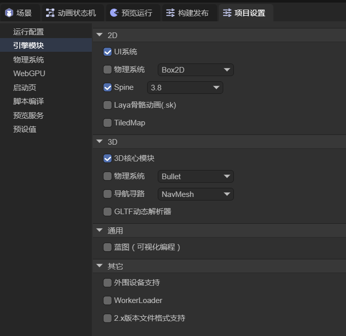

（图2-1）

如果应用到其它模块，需要勾选对应的模块，才可以使用其API，否则项目运行时会导致报错。

2D引擎库模块说明：

| 引擎库模块名  | 引擎库模块说明                                          |
| ------------- | ------------------------------------------------------- |
| UI系统        | 常用的UI组件库，使用2D UI组件的必选库，提供了两套UI系统 |
| 2D灯光功能    | 2D灯光相关组件的库                                      |
| 2D线渲染功能  | 2D线渲染器相关组件的库                                  |
| 物理系统      | Box2D物理库，有js和wasm两种可选                         |
| Spine         | Spine动画引擎库                                         |
| 导航寻路      | 2D寻路相关的库                                          |
| Laya骨骼动画  | LayaAir内置的骨骼动画.sk                                |
| TileMap       | 使用LayaAir内置的瓦片地图                               |
| 2D拖尾        | 2D拖尾渲染器相关组件的库                                |
| laya.particle | 2D粒子渲染器组件相关的库                                |

3D引擎库模块说明：

| 引擎库模块名   | 引擎库模块说明                          |
| -------------- | --------------------------------------- |
| 3D核心模块     | 3D基础模块，使用3D的必选库              |
| 物理系统       | Bullet或PhysX物理库，有js和wasm两种可选 |
| 导航寻路       | 3D寻路相关的库，有js和wasm两种可选      |
| 3D拖尾         | 3D拖尾系统库                            |
| GLTF动态解析器 | 代码直接使用gltf模型的加载解析库        |

通用引擎库模块说明：

| 引擎库模块名 | 引擎库模块说明             |
| ------------ | -------------------------- |
| 蓝图         | 程序蓝图（可视化编程）模块 |

其它引擎库模块说明：

| 引擎库模块名        | 引擎库模块说明                                              |
| ------------------- | ----------------------------------------------------------- |
| 外围设备支持        | 陀螺仪、加速计、地理位置、摄像头、麦克风等设备接口调用封装  |
| Workerloader        | WorkerLoader异步解码图片                                    |
| 2.x版本文件格式支持 | 动态载入2.0格式的.ls和.lh文件（不包含IDE，IDE里都可以载入） |
| 旧版本TiledMap支持  | tiledmap地图接口封装                                        |


## 三、物理系统

### 3.1 2D物理

2D物理有一些全局的配置，如图3-1所示，


（图3-1）

| <span style="display:inline-block;width:130px">设置选项</span> | 选项说明                                                     |
| ------------------------------------------------------------ | ------------------------------------------------------------ |
| 刚体休眠功能开关                                             | 开启该选项，允许刚体属性决定是否休眠。关闭开选项，所有刚体均无法设置休眠。为刚体设置启用休眠可节省性能开销，但影响运动或受到外力时的灵敏度，是否启用休眠取决于具体需求和对性能的权衡。 |
| 重力加速度                                                   | 重力是一种模拟物体在地球表面受到的引力，重力受两个参数影响，一个是质量另一个是加速度，此处设置的是重力加速度参数，该参数的XY会影响重力的方向，X表示水平方向的重力，Y表示垂直方向的重力，通常只使用垂直方向的重力设置。 |
| 速度迭代次数                                                 | 在物理引擎中，通常采用迭代方法来逼近模拟物体的运动，特别是在处理碰撞和关节等约束时。在迭代求解中，引擎会反复尝试逼近正确的速度状态，直到满足约束条件或达到此处指定的迭代次数。迭代次数越多精度也会更高，但也会消耗更大的性能。 |
| 位置迭代次数                                                 | 在物理引擎中，通常采用迭代方法来逼近模拟物体的运动。该处设置，是在迭代求解约束时，用于指定尝试逼近正确位置状态的次数。当物体受到约束(例如碰撞约束、关节约束等)影响时，引擎会进行多次迭代以逐渐调整物体的位置，使其满足约束条件。迭代次数越多精度也会更高，但也会消耗更大的性能。 |
| 长度单位转换比率                                             | 在物理引擎中，对于长度的单位是一个抽象的概念，物理引擎只关心相对长度和比例关系，而不关心具体的实际物理单位。所以，这并不直观，LayaAir-IDE中为了直观表达，默认将物理引擎中的长度单位转换为50个渲染像素，开发者也可以在此处根据自己的需求进行调节。 |
| 是否开启2D物理绘制                                           | 如果给2D节点添加了物理属性（刚体、碰撞盒等），此时勾选该选项，添加了物理属性的节点会显示出碰撞区域、关节约束连线等物理信息。 |


### 3.2 3D物理

3D物理有一些全局的配置，如图3-2所示，

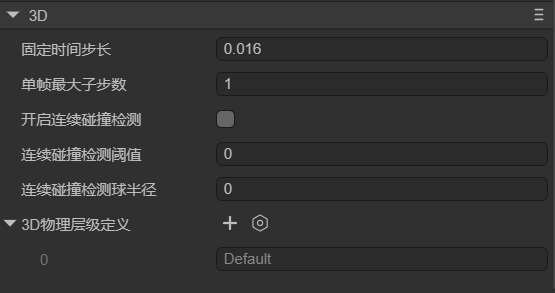

（图3-2）

| <span style="display:inline-block;width:130px">设置选项</span> | 选项说明                                                     |
| ------------------------------------------------------------ | ------------------------------------------------------------ |
| 固定时间步长                                                 | 时间步长是物理引擎中模拟物理现象(如运动、碰撞等)进展的基本时间单位。这相当于渲染帧率的间隔时长，可以通过固定时间步长(fixedTimeStep)来与渲染引擎的渲染帧速保持同步，单位是秒，默认为0.016秒，这与默认设置为60帧每秒的FPS相同(1秒/60帧≈0.016秒) |
| 单帧最大子步数                                               | 在物理引擎中，用于控制物理模拟的子步数量的参数。物理引擎在每1帧更新时都会进行物理模拟，但有时候帧率可能会波动或者物理计算量较大，导致在一帧内无法完成所有物理计算。为了确保物理模拟的准确性，物理引擎会将每1帧的物理模拟划分为多个子步进行处理。如果在一帧内需要进行的物理计算步数超过了这个值，物理引擎会进行截断，只计算 maxSubSteps个子步骤，以保证在有限的时间内完成物理模拟。 |
| 开启连续碰撞检测                                             | 在物理引擎中，用来设置引擎是否开启连续碰撞检测，在物理模拟中运动速度快的物体进行离散碰撞检测时，开启此功能将持续进行碰撞检测防止物体穿透。 |
| 连续碰撞检测阈值                                             | 用来设置连续碰撞检测的运动速度阈值，当物体超过此阈值时，将会开启连续碰撞检测。 |
| 连续碰撞检测球半径                                           | 在进行连续碰撞检测时，物体的形状通常被简化为一个扫描球体，以检测物体在其运动过程中可能与其他物体发生的碰撞，这个值就是用于指定这个扫描球体的半径。 |


## 四、WebGPU

WebGPU是一种新的Web标准，旨在为Web应用程序提供更好的图形和计算性能。在支持WebGPU的浏览器中，可以通过启用WebGPU来提高渲染性能，如图4-1所示。

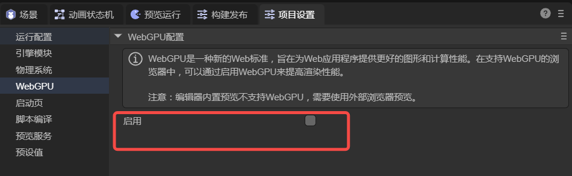

（图4-1）

注意：编辑器内置预览不支持WebGPU，需要使用外部浏览器预览。

例如，如果使用Chrome浏览器，可以通过访问 `chrome://flags` 查看是否有相关选项来启用这种支持。如图4-2所示，在页面中搜索 "WebGPU"。设置为“Enabled”后，重启浏览器。


（图4-2）


## 五、启动页

启动页是指，在游戏开始前，显示的图标。如果不进行设置，则会使用引擎默认的图标。开发者可以自定义图标，如图5-1所示：


（图5-1）

参数说明：

| 参数             | 说明                                                         |
| ---------------- | ------------------------------------------------------------ |
| 激活             | 勾选后，在游戏开始前，会显示启动页。                         |
| 背景颜色         | 勾选后，可以设置启动页的背景颜色。                           |
| 图片             | 启动页显示的图标，默认是引擎图标。自定义图标时，图片路径必须放在bin目录下。 |
| 适配             | 图标的屏幕适配。有center、fill、contain、cover四种模式。     |
| 最小显示时间     | 启动页的最小显示时间，单位为秒。                             |
| 允许在预览中激活 | 勾选后，在预览模式下可以看到启动页。否则，只有在发布后才可以看到启动页。 |


## 六、脚本编译

如图6-1所示，IDE提供了脚本编译和发行版本选项，


（图6-1）

脚本编译选项的配置如下，

| <span style="display:inline-block;width:100px">选项名称</span> | 参数解释                                                     |
| ------------------------------------------------------------ | ------------------------------------------------------------ |
| 宏定义                                                       | 允许在代码中定义一些常量或条件编译的标志。通常用于在不同平台或构建版本中使用不同的代码。例如，可以定义一个 `DEBUG` 宏，在调试版本中启用日志输出，而在发布版本中禁用。 |
| 外部包                                                       | 用于添加项目依赖的外部库或 SDK。                             |
| 包别名                                                       | 为导入的模块或命名空间创建别名。                             |
| 字符串编码                                                   | 设置项目使用的字符串编码。通常选择 `utf8`，以支持各种字符集。 |
| 入口文件                                                     | 指定项目的入口文件，即游戏启动时首先加载的脚本文件。         |
| 启动脚本                                                     | 可以自定义启动入口，用来替代启动场景，并且自行决定场景启动前要处理的逻辑，以及打开场景的时机。 |

发行版本选项的配置如下，

| <span style="display:inline-block;width:200px">选项名称</span> | 参数解释                                                     |
| ------------------------------------------------------------ | ------------------------------------------------------------ |
| 保留未被使用的组件脚本                                       | 如果勾选此项，即使某个组件脚本在场景中没有被引用，也会被包含在发布版本中。 |
| 删除debugger语句                                             | 如果勾选此项，发布版本中所有的 `debugger` 语句将被删除。     |
| 删除console语句                                              | 如果勾选此项，发布版本中所有的 `console.log`、`console.warn` 等控制台输出语句将被删除。 |
| 保留类和函数名称                                             | 如果勾选此项，压缩后的代码将保留类和函数的原始名称。         |
| 保留未引用的函数和变量                                       | 如果勾选此项，即使某个函数或变量在代码中没有被使用，也会被保留在压缩后的代码中。 |


## 七、预览服务

预览服务器可以设置在浏览器中预览的地址和端口号。设置好后刷新IDE，即可应用，效果如图7-1所示。


（图7-1）


## 八、预设值

### 8.1 纹理类型

当从外部导入纹理资源（PNG、JPG）到IDE时，如图8-1所示，会将该资源设置为开发者设定的纹理类型，通常可以选择为精灵纹理。


（图8-1）


### 8.2 3D预制体编辑场景

默认情况下，3D预制体是位于一个专用的系统空场景（DefaultPrefabEditEnv）的环境下进行编辑。

如果通过`3D预制体编辑场景`，指定了一个目标场景，相当于直接位于某个3D场景中进行编辑，这样当切换到3D场景中，就会更加符合需求。操作如图8-2所示：


（图8-2）


### 8.3 自动烘焙IBL

勾选`自动烘焙IBL`后，如图8-3所示，如果在Scene3D中更换了天空盒材质（Material由skybox更换为其它材质），此时Reflection Probe的IBL Tex无需手动点击`烘焙`按钮，保存场景后，IDE会自动进行重新烘焙。


（图8-3）

> 只有Reflection Probe的Source为Skybox时，才会自动烘焙。Custom无法自动烘焙。


### 8.4 3D渲染层名称定义

3D节点，可以选择层级并设置，而编辑设置中，正是增加、删除层级，以及为层级命名的地方。效果如图8-4所示。

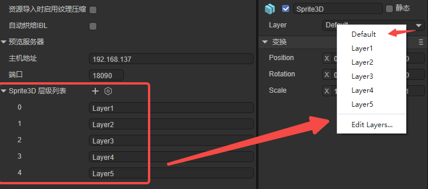

（图8-4）

关于层级Layer的更多介绍，可前往IDE文档[《使用3D精灵》](../../../3D/Sprite3D/readme.md)进行查看。


### 8.5 2D渲染层名称定义

在2D节点渲染相关的组件中（2D网格渲染器、2D拖尾渲染器、2D线渲染器、2D灯光等），可以设置渲染图层，如图8-5所示。

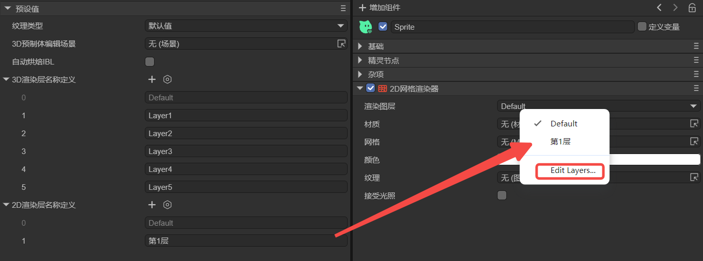

（图8-5）


