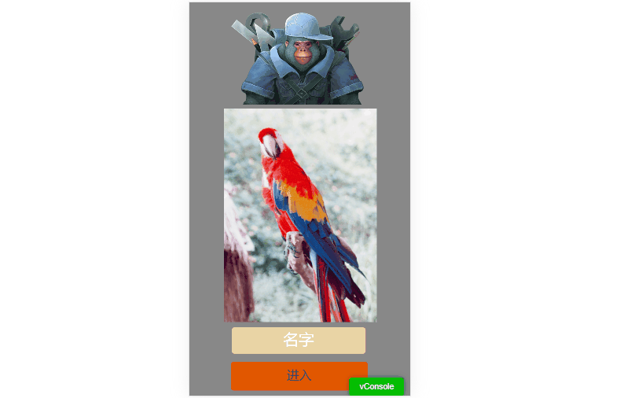
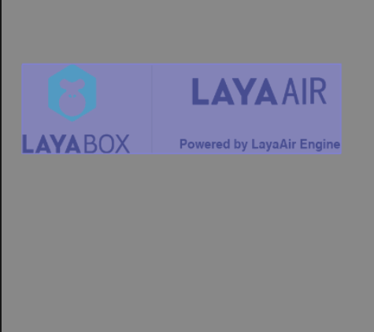

# 项目设置详解

> Author：Charley、孟星煜

IDE的项目设置包括两个部分，运行设置与编辑器设置。

## 一、运行设置

### 1.1 分辨率设置

分辨率的设置会影响IDE内的预览效果，以及项目运行时的画布宽高、适配模式、对齐方式，画布背景色等。可设置属性如图1-1所示：

  

（图1-1）

#### 1.1.1 画面宽高适配

影响产品画面宽高的三个设置，分别是设计宽高（Design Width、Design Height），缩放适配模式(Scale Mode)。

设计宽高，就是我们在IDE里的设置并看到的宽高，

这个宽高会影响在IDE里的UI场景背景大小，以及IDE的预览运行模式下，也是基于这个宽高查看效果。

在实际的运行环境里，例如不同的手机。由于屏幕比例的不同，肯定不可能与设计宽高完全吻合。

所以，就需要用引擎自带的缩放适配模式，进行缩放，从而来满足开发者的屏幕需求。

缩放适配模式涉及画布、舞台、适配算法等诸多知识点，我们在另一篇文档[《屏幕适配》](../../common/adaptScreen/readme.md)里详细介绍。

#### 1.1.2 横竖屏适配

有的时候，我们需要根据屏幕的比例强制横竖屏设置，在IDE中可以通过设置屏幕模式（Screen Mode）来设置。

横竖屏有三种适配模式，如图1-2所示。

 

（图1-2）

**1，无变化：none**

none时，无论屏幕方向如何旋转，游戏的水平方向都不会产生跟随屏幕旋转的变化。

效果如动图1-3所示。

 

(动图1-3) 

通过动图1-3发现，none值时，当屏幕发生旋转后，基于竖屏设计的界面在横屏下就会变的不适合，同理，基于横屏设计的界面在竖屏下，也会变的不适合。

当然，如果我们的布局策略运用的比较合理，也许也可以兼顾横竖屏的体验。效果如动图1-4所示。

 

(动图1-4)

虽然不那么难看了，但为了达到最佳的效果，最好的方案，还是竖屏始终与设备竖屏的方向保持一致，横屏与设备横屏的方向保持一致。

**2，始终横屏：horizontal**

当我们设置的宽高就是横屏产品时，horizontal无疑是最佳的体验，效果如动图1-5所示。

  

(动图1-5)

通过动图1-5发现，screenMode属性值设置为horizontal时，无论屏幕方向如何旋转，设计上的水平方向都会与屏幕最短的边始终保持垂直，所以用户设备竖屏时看到横屏画面，自然就会把设备横过来，从而吻合了产品的设计。

**3，始终竖屏：vertical**

当我们设置的宽高就是竖屏产品时，vertical无疑是最佳的体验，效果如动图1-6所示。

  

(动图1-6)  

通过动图1-6发现，screenMode属性值设置为vertical时，无论屏幕方向如何旋转，游戏的水平方向都会与屏幕较长的边始终保持垂直。所以用户哪怕是把设备横屏了，仍然看到的是竖屏画面，自然就会把设备恢复竖屏，从而吻合了产品的设计。

> [!Tip]
>
> 需要注意的是，浏览器中运行的时候，引擎的自动横屏和自动竖屏，只能对画布进行旋转，如果用户的手机锁屏了，虽然画面自动旋转过来了，但是浏览器没有旋转过来，会导致输入法依然按浏览器的方向弹出，此时，可能会导致输入法与浏览器的显示呈90度。
>
> 在小游戏平台中运行，由于小游戏底层有横屏还是竖屏的配置，不会出现这个问题。

#### 1.1.3 画布对齐适配

引擎中的提供的alignV（垂直对齐）与alignH（水平对齐）是对画布进行对齐。设置方式如图1-7所示：

  

（图1-7）

参数说明如下：

AlignV垂直对齐的参数为：top（顶部对齐）、middle（垂直居中对齐）、bottom（底部对齐）。

AlignH水平对齐的参数为：left（居左对齐）、center（水平居中对齐）、right（居右对齐）。

> [!Tip]
>
> 画布对齐不能理解为UI界面基于stage舞台的对齐，只是画布canvas相对于整个物理屏幕的对齐。
>
> 该设置在移动端，基本用不上，移动端绝大多数都需要全屏适配。当画布已经铺满整个屏幕时，设置就没有了意义。
>
> 通常是在PC端，非全屏的模式下使用，例如在画布非全屏适配的模式（showall和noscale）的情况下使用。

#### 1.1.4 画布背景色设置

画布背景色，其实就是给画布设置一个颜色，默认值为`#888888`，如图1-8所示：

  

（图1-8）

### 1.2 引擎初始化设置

有一些引擎的配置项，需要在引擎初始化的时候设置，而设置的入口就是如图1-9所示：

  

（图1-9）

2D属性参数说明：

| 属性名称       | 属性说明                                                     |
| -------------- | ------------------------------------------------------------ |
| 每秒帧数FPS    | 设备帧率；用于计算两帧之间的渲染最大间隔时长，通常设备上的帧率是最大60，也就是一秒钟内最多只有 60 帧会出现在屏幕上，那么两帧之间的时长为1000ms/60。对于高帧率设备，我们可以修改FPS值，例如120帧的设备，那两帧之间的时长则为1000ms/120。 |
| 画布抗锯齿     | 是否开启抗锯齿；用于设置webGL上下文的antialias抗锯齿开关属性，会产生额外的性能消耗，主要用于2D非矩形的矢量绘图抗锯齿，无矢量绘制图形或性能压力大时，可以选择不开启。3D抗锯齿推荐使用摄像机的Fxaa或Msaa。 |
| 视网膜画布模式 | 是否使用高清画布模式；开启后无论任何适配模式，画布均采用物理分辨率大小，开启后会比不采用物理分辨率多一些性能消耗，但会让文本等保持最佳清晰度。 |
| 画布透明       | 是否画布透明；默认状态画布有背景色，开启后，可以设置画布为无色透明。 |
| 顶点缓存优化   | 是否分配最大的VB缓冲区；开启后，渲染2D的时候，每次创建vb直接分配足够64k个顶点的缓存。这样可以提高效率。关闭后，可节省64k显存，但会牺牲性能效率，如果包含2D时，建议保持默认开启。 |
| 默认字体       | 文本的默认字体；设置以后，IDE中新建的文本默认字体都采用该处的设置。 |
| 默认字号       | 文本的默认字号；设置以后，IDE中新建的文本默认字号都采用该处的设置。 |

3D属性参数说明：

| 属性名称           | 属性说明                                                     |
| ------------------ | ------------------------------------------------------------ |
| 静态合批           | 是否启用静态合批；开启静态合批后，可以减少可见网格绘制调用之间渲染状态更改的次数。 |
| 动态合批           | 是否启用动态合批；开启动态合批后，满足 **实例合并**（同Mesh且同材质） ，即可减少RenderBatches渲染批次与Shader提交次数。 |
| 物理功能初始化内存 | 初始化3D设置时，默认物理功能初始化内存，单位为M。            |
| 开启UniformBuffer  | 启用Uniform Buffer；当启用Uniform Buffer缓存后，可以减少CUP传递至GPU的数据量。 |
| 分辨率倍数         | 设置3D的分辨率倍数，默认值为1 ；降低3D分辨率，不会影响2D UI的分辨率，适当的调节可降低性能的消耗。 |
| 多光源             | 是否开启多光源；如果不需要多光源，关闭后可减少性能的消耗。   |
| 最大光源数量       | 默认值为32个。                                               |
| 光照集群数量       | x、y、z轴的光照集群数量；z值会决定Cluster受区域光（点光、聚光）影响的数量，Math.floor(2048 / lightClusterCount.z - 1) * 4 为每个Cluster的最大平均接受区域光数量,如果每个Cluster所接受光源影响的平均数量大于该值，则较远的Cluster会忽略其中多余的光照影响。 |
| 最大形变数量       | 网格渲染器的最大形变数量。默认值为32。                       |
| 是否使用BVH裁剪    | 是否使用BVH裁剪；开启后，可以设置：一个BVH节点最大的cell数（超过这个数会分离—）、最大BVH节点的大小、最小cellbuild数（如果小于这个数，不会BVH构建）。 |


### 1.3 项目启动设置

#### 1.3.1 入口启动场景

LayaAir 3.0项目运行入口的设置有两种方式，一种是将当前场景Current Scene（正编辑的场景）作为项目运行的入口，另一种是设置一个固定的项目入口场景。

当我们在**构建发布**里设置了**启动场景**，并且**勾选**了启动场景作为入口，如图1-10所示。在运行项目时，引擎初始化之后，就会先运行设置的启动场景。

  

（图1-10）

#### 1.3.2 引擎库模块

LayaAir引擎由多个模块组件，默认只引入了较为基础的模块，如图1-11所示。


(图1-11) 

如果应用到其它模块，需要勾选对应的模块，才可以使用其API，否则项目运行时会导致报错。

引擎库模块说明：

| 引擎库模块名        | 引擎库模块说明                                               |
| ------------------- | ------------------------------------------------------------ |
| laya.d3             | 3D基础模块，使用3D的必选库                                   |
| laya.ui             | ui模块，包括常用的ui组件，使用2D UI组件的必选库              |
| laya.ani            | 2D动画模块，包括2D节点动画（序列帧、图集动画）、内置的骨骼动画等 |
| laya.device         | 陀螺仪、加速计、地理位置、摄像头、麦克风等设备接口调用封装   |
| laya.tiledmap       | tiledmap地图接口封装                                         |
| laya.particle       | 2D粒子的封装，不推荐使用                                     |
| laya.gltf           | 代码直接使用gltf模型的加载解析库                             |
| laya.physics        | Box2D物理库的封装                                            |
| laya.physics3D      | Bullet 3D物理库                                              |
| laya.physics3D.wasm | WebAssembly的Bullet 3D物理库                                 |
| laya.spine          | spine动画引擎库                                              |
| laya.workerloader   | WorkerLoader异步解码图片                                     |

#### 1.3.3 启动页配置

启动页是指，在游戏开始前，显示的图标。如果不进行设置，则会使用引擎默认的图标。开发者可以自定义图标，如图1-12所示：


（图1-12）

参数说明：

| 参数             | 说明                                                         |
| ---------------- | ------------------------------------------------------------ |
| 激活             | 勾选后，在游戏开始前，会显示启动页。                         |
| 背景颜色         | 勾选后，可以设置启动页的背景颜色。                           |
| 图片             | 启动页显示的图标，默认是引擎图标。自定义图标时，图片路径必须放在bin目录下。 |
| 适配             | 图标的屏幕适配。有center、fill、contain、cover四种模式。     |
| 最小显示时间     | 启动页的最小显示时间，单位为秒。                             |
| 允许在预览中激活 | 勾选后，在预览模式下可以看到启动页。否则，只有在发布后才可以看到启动页。 |


### 1.4 调试启动设置

如图1-13所示，LayaAir IDE可以开启以下调试模块：


（图1-13）

#### 1.4.1 显示统计信息

勾选显示统计信息之后，可以查看当前帧率、内存占用、节点等信息，用于项目的分析与优化。如图1-14所示。

  

（图1-14）

如想了解更详细的统计信息面板上的参数，请查阅文档[《性能统计与优化》](../../common/Stat/readme.md) 

#### 1.4.2 显示移动端调试工具 VConsole

在移动端调试，通常需要联到电脑端的浏览器上。

如果开发者不需要断点，只是一些常用的日志打印、加载等查看等，开启`V Console`，在移动端会出现如图1-15所示的调试工具面板。

  

（图1-15）

#### 1.4.3 弹窗显示全局错误

如果捕获全局错误[window.onerror](https://www.w3school.com.cn/jsref/event_onerror.asp)，勾选`弹窗显示全局错误`可以弹窗抛出详细错误堆栈。例如，可以自定义一个全局错误，代码如下：

```typescript
//自定义一个全局错误
let err = new Error("自定义的Error");
Laya.Browser.window.onerror(err.message, "", "", "", err); 
```

运行时，就会弹窗抛出异常，效果如图1-16所示。


（图1-16）

#### 1.4.4 显示2D物理调试

在LayaAir IDE中，如果给2D节点添加了物理属性（刚体、碰撞盒等），此时勾选`显示2D物理调试`，添加了物理属性的节点会显示出阴影效果，如动图1-17所示：



（动图1-17）


## 二、编辑器设置

### 2.1 3D预制体编辑场景

默认情况下，3D预制体是位于一个专用的系统空场景（DefaultPrefabEditEnv）的环境下进行编辑。

如果我们通过`3D预制体编辑场景`，指定了一个目标场景，相当于直接位于某个3D场景中进行编辑，这样当切换到3D场景中，就会更加符合需求。操作如图2-1所示：


（图2-1）

效果如图2-2所示：


（图2-2） 

### 2.2 资源导入时启用纹理压缩

勾选`资源导入时启用纹理压缩`后，当从外部导入纹理资源（PNG与JPG）到IDE时，如图2-3所示，会将该资源自动启动PC平台的[纹理压缩](../../../IDE/uiEditor/textureCompress/readme.md)，启用该操作后会增加运行效率，但会影响显示质量。


（图2-3）

该操作对启用该功能之前的旧资源不产生影响。


### 2.3 自动烘焙IBL

勾选`自动烘焙IBL`后，如图2-4所示，如果在Scene3D中更换了天空盒材质（Material由skybox更换为其它材质），此时Reflection Probe的IBL Tex无需手动点击`烘焙`按钮，保存场景后，IDE会自动进行重新烘焙。


（图2-4）

> 只有Reflection Probe的Source为Skybox时，才会自动烘焙。Custom无法自动烘焙。

### 2.4 预览服务器

预览服务器可以设置在浏览器中预览的地址和端口号。设置好后刷新IDE，即可应用，效果如图2-5所示。


（图2-5）

### 2.5 3D节点层级设置

3D节点，可以选择层级并设置，而编辑设置中，正是增加、删除层级，以及为层级命名的地方。效果如图2-6所示。

  

(图2-6)

关于层级Layer的更多介绍，可前往IDE文档[《使用3D精灵》](../../../3D/Sprite3D/readme.md)进行查看。

