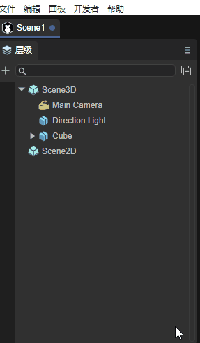
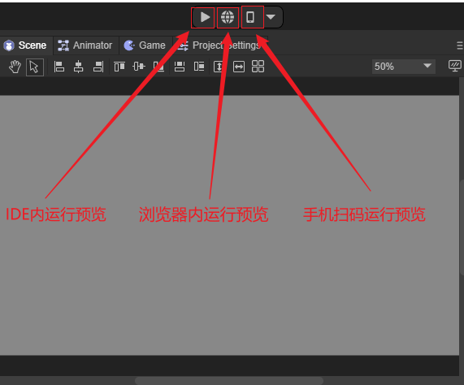
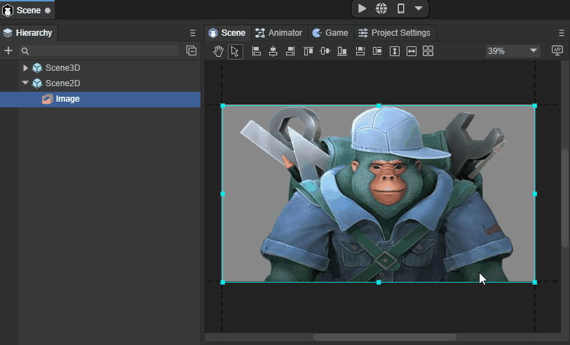
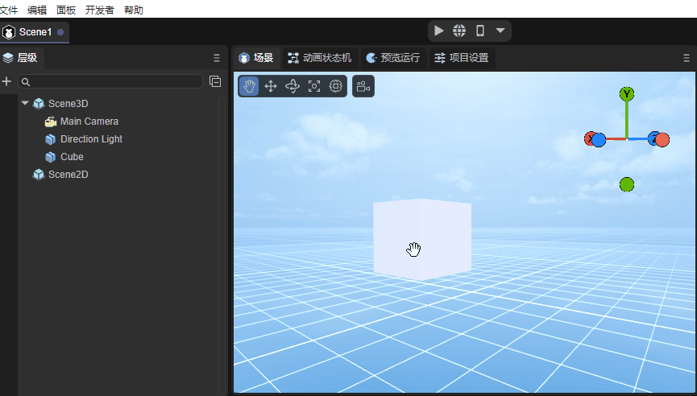
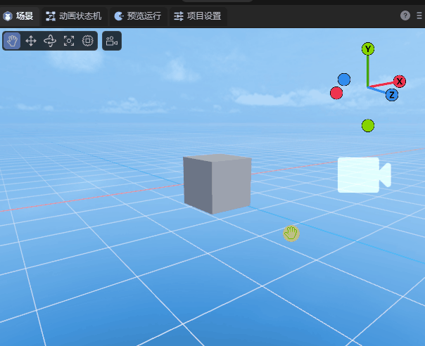

# IDE快捷键与鼠标交互操作大全

> Author: charley 

IDE的基础交互分为键盘输入、快捷键、鼠标交互、鼠标与键盘的功能组合，

本篇将介绍IDE的基础交互，了解全部的功能键组合，充分发挥双手的优势，提升开发效率。

> 文档中的按键均以windows系统键盘为例，Mac系统键盘的Command对应ctrl键，不再单独说明。

## 一、通用的基础交互

层级面板、属性面板、项目面板等，都是各块功能几乎都能用到的地方，所以我们先介绍这些通用的基础交互。

### 1.1 切换面板显示层级

IDE的功能面板，开发者可任意拖拽布局，当处于同一个窗口时，就会根据面板标签的点击切换来决定显示的层级。如动图1所示。

 

(动图1)

除了点击面板标签来切换，我们还可以用如下快捷键来切换一些常用的面板：

| 功能名称           | 操作     |
| ------------------ | -------- |
| 场景面板Scene      | Ctrl + 1 |
| 运行面板Game       | Ctrl + 2 |
| 属性面板Inspector  | Ctrl + 3 |
| 层级面板Hierarchy  | Ctrl + 4 |
| 项目面板Project    | Ctrl + 5 |
| 控制台面板Console  | Ctrl + 6 |
| 时间轴面板Timeline | Ctrl + 7 |

### 1.2 文件与节点的通用操作

#### 重命名：F2

无论是节点的名字还是文件与文件夹，使用快捷键`F2`即可可进入重命名模式

如果是鼠标操作，`单击选中`后间隔半秒再`单击`，也等同于F2。

#### 1.2.2 复制、粘帖、删除、选中

无论是在层级面板、项目面板、场景面板，选中节点对象或文件，即可用以下快捷键操作：

| 功能名称   | 操作                  |
| ---------- | --------------------- |
| 拷贝       | Ctrl   +  C           |
| 粘贴       | Ctrl   +  V           |
| 删除       | Delete                |
| 全选       | Ctrl   +   A          |
| 选中单个   | 鼠标左键单击          |
| 多选       | Ctrl  +  鼠标左键单击 |
| 不间断多选 | Shift +  鼠标左键单击 |

### 1.3 层级面板的常用操作

#### 1.3.1 创建空节点

除了通过鼠标右键菜单创建节点，还可以用以下快捷键，快速创建空节点。

| 功能说明                                     | 操作                     |
| -------------------------------------------- | ------------------------ |
| 在根节点下，创建一个空子节点                 | Ctrl   +  shift   +   N  |
| 为选中的当前节点，创建一个空子节点           | Alt     +   shift  +   N |
| 为选中的当前节点（可多选），创建一个空父节点 | Ctrl    +  shift  +   G  |

> 2D的空节点是Sprite，3D的空节点是Sprite3D

#### 1.3.2 展开全部子节点：Alt + 鼠标左键单击 

正展情况下，单击节点前的三角箭头，会展开一层子节点。

当使用 `Alt + 鼠标左键单击` 的组合功能键后，可直接展开其下的所有层级节点，效果如动图2所示。

 

(动图2)

#### 1.3.3 层级面板的顺序调整

##### 拖拽为目标节点的下级节点

当选中某个节点持续按住鼠标左键，将该节点拖拽到目标节点上，目标节点呈现绿色矩形框时，松开鼠标左键，即可成为目标节点的子节点，效果如动图3-1所示。

               

(动图3-1)

##### 拖拽为目标节点同级之后

当选中某个节点持续按住鼠标左键，将该节点拖拽到目标节点上，绿色线条位于目标节点下方时，松开鼠标左键，可改变该节点位置到目标节点同层级的后面。效果如动图3-2所示。

 

(动图3-2)

##### 拖拽为目标节点同级之前

当选中某个节点持续按住鼠标左键，将该节点拖拽到目标节点上，绿色线条位于目标节点上方时，松开鼠标左键，可改变该节点位置到目标节点同层级的前面。效果如动图3-3所示。

 

(动图3-3)

> 需要注意的是，2D节点只能在Scene2D下任意拖拽，3D节点只能在Scene3D下任意拖拽，2D与3D节点不可拖到对方的节点下。

### 1.4 层级与场景的通用操作

#### 1.4.1  3D节点的视窗聚焦：F

无论是层级面板还是场景中，选中节点后，使用快捷键`F`，即可实现视窗摄像机对该节点的聚焦。效果如动图4所示。

 

（动图4）

> 鼠标左键双击3D节点，也可实现视窗摄像机对该节点的聚焦。

#### 1.4.2 复制并粘贴节点：Ctrl  +  D

无论是2D节点还是3D节点，在层级面板或场景面板选中节点后，通过快捷键`Ctrl  +  D`，即可实现该节点的复制并粘贴。

### 1.5 运行预览功能

开发者在LayaAir IDE内编辑完成后，提供了三种运行预览方式，分别是的IDE内运行预览、浏览器内运行预览、手机扫码运行预览，按钮如图5所示。

 

(图5)

以上功能除了鼠标点击操作之外，还提供了如下快捷键：

| 功能说明         | 操作                    |
| ---------------- | ----------------------- |
| IDE内运行预览    | Ctrl   +  P             |
| 浏览器内运行预览 | Ctrl   +  Shift  +   P  |
| 手机扫码运行预览 | Ctrl   +   Shift  +   O |

### 1.6 属性面板操作

#### 1.6.1 属性数值滑动输入

当属性值是数字类型时，鼠标移动到输入框上，鼠标样式会转换为双向箭头样式，

此时可按箭头方向划动改变数值，也可点击直接输入框通过键盘输入。

#### 1.6.2 属性保存：Ctrl + S

无论是在属性面板中改变属性，还是在场景中操作，都会导致属性值的变化。

如果确定改变，可通过快捷键 `Ctrl + S`进行保存。

> 保存是全局通用的，后面各功能针对保存都不再重复介绍。

## 二、2D场景视窗交互

当处于Scene2D节点或2D预制体节点时，会启动2D场景视图窗口。当前支持以下快捷键：

| 功能说明         | 操作                       |
| ---------------- | -------------------------- |
| 平移视图舞台     | 中键长按拖拽、右键长按拖拽 |
| 上下滚动视窗内容 | 鼠标滚轮                   |
| 缩放视窗内容     | Ctrl +  鼠标滚轮           |

效果如动图6所示：

 

(动图6)

## 三、3D场景视窗交互

3D场景中，主要是两大类基础操作，

一是，改变场景视窗的摄像机位置与角度，让开发者如同自己的眼睛一样观察3D场景世界。

二是，改变模型的位置与角度，将模型摆放到场景中适当位置。

### 3.1 操作视窗摄像机

#### 3.1.1 旋转视窗摄像机：鼠标右键

在3D场景中，只要持续按住`鼠标右键`即进入视窗摄像机的旋转模式，松开`鼠标右键`即退出视窗摄像机旋转模式。

在该模式下，在屏幕方向上移动鼠标，可以改变视窗摄像机的角度，对整个场景的任意角度进行观察，效果如动图7-1所示。

 

(动图7-1)

#### 3.1.2 空间位移视窗摄像机：

当按住鼠标右键 + 键盘功能键，可以让摄像机按上下左右前后，具体功能键如下：

| 功能说明         | 操作          |
| ---------------- | ------------- |
| 摄像机`向上`位移 | 鼠标右键  + E |
| 摄像机`向下`位移 | 鼠标右键  + Q |
| 摄像机`向左`位移 | 鼠标右键  + A |
| 摄像机`向右`位移 | 鼠标右键  + D |
| 摄像机`向前`位移 | 鼠标右键  + W |
| 摄像机`向后`位移 | 鼠标右键  + S |

位移视窗摄像机的效果如动图7-2所示。

 

(动图7-2)

> 上下前后左右，是一个相对的方向，无论旋转到任何角度，都会按这个相对的方向进行位移。

#####  位移视窗摄像机加速：

在位移视窗摄像机的基础上，按住Shift叠加，可以在原功能基础上进行加速移动。

操作按键为：鼠标右键 + shift + (E、Q、A、D、W、S)

#### 3.1.3 屏幕内位移视窗摄像机：Q \ 鼠标中键

除了采用`鼠标右键 + 键盘功能键（E、Q、A、D）`实现视窗摄像机上下左右的位移外，还可以通过快捷键Q或鼠标中键来启动屏幕任意方向位移。

使用快捷键Q时，鼠标左键按下并拖拽，即可实现视窗摄像机在屏幕任意方向位移，效果如动图7-3所示。

 

(动图7-3)

要想退出该模式，则需要通过其它模式的快捷键，除非是需要持续不断的采用该模式位移视窗摄像机。否则更建议采用鼠标中键来启动屏幕任意方向位移。

鼠标中键的方式，只有在按下并拖拽时才会进入该模式，松开鼠标中键会自动回到其它模式。

#### 3.1.4 视窗摄像机缩放：鼠标滚轮

视窗摄像机缩放本质上就是视窗摄像机的前后位移，只因在位移过程中，观察目标时基于近大远小的透视原理，有种缩放的错觉，所以称为缩放视窗摄像机。效果如动图7-4所示，

 

(动图7-4）

#### 3.1.5 视窗摄像机绕焦点中心旋转：Alt + 左键拖拽

在观察或操作具体某个模型时，我们可能需要找一个非正面的合适角度。此时，之前介绍的方式都不太方便。所以围绕目标进行任意旋转是最适合的操作。

要旋转视窗摄像机之前，我们首先要做的事，就是聚焦，将模型处于视窗摄像机的中心位置。

> 聚焦的快捷键为F，前文1.4.1已进行介绍。

聚焦后，通过`Alt + 左键`的组合，左键向任意角度拖拽，即可实现绕焦点中心旋转，效果如动图7-5所示，

 

(动图7-5)

### 3.2 操作模型

操作模型的工具有四种，分别是位移、旋转、缩放、混合使用。可以通过快捷键 `W、E、R、T`进行启动不同的工具模式。

| 快捷键名称   | 按键 |
| ------------ | ---- |
| 模型位移工具 | W    |
| 模型旋转工具 | E    |
| 模型缩放工具 | R    |
| 混合编辑模型 | T    |

#### 3.2.1 模型位移工具：W

通过快捷键`W`进入模型位移工具模式后，模型上会出现红绿蓝三色的轴和片。

红绿蓝三个轴分别代表X、Y、Z三个方向，轴的颜色与右上角的坐标轴对应。

箭头所指的方向为正方向，拖动其中一个轴，可使该模型按该轴的正负方向进行位移，效果如动图8-1所示。

 

(动图8-1)

> 留意属性面板，如果该模型没有任何旋转（rotation都为0），拖动其中一个轴，只有该轴的属性值会发生变化 。如果有旋转，则会影响其它轴属性值。

三个相邻的面，蓝色为XY面、绿色XZ面、红色为YZ面。

拖动其中一个面，可使该模型在该面范围内任意位移，效果如动图8-2所示。

 

(动图8-2)

#### 3.2.2 模型旋转工具：E

通过快捷键`E`进入模型旋转工具模式后，模型上出现红绿蓝三色的交叉弧线和外层白圈，当鼠标划到模型上时，还会出现一个半透明圆。

红绿蓝三色的弧线分别代表X、Y、Z三个轴的方向，颜色与右上角的坐标轴对应。

选中其中一个弧线后，会变成完整的圆圈，代表按该该轴方向进行旋转，效果如动图9-1所示。

 

(动图9-1)

外层白圈，是基于屏幕的垂直旋转，效果如动图9-2所示。

 

(动图9-2)

如果鼠标在半透明圆拖拽，则可以任意角度旋转，效果如动图9-3所示。

 

(动图9-3)

#### 3.2.3 模型缩放工具：R

通过快捷键`R`进入模型缩放工具模式后，模型上不仅有红绿蓝三色轴，还有中心白块和外层白色圆圈。

红绿蓝三色轴分别代表X、Y、Z三个轴的方向，拉动其中一个轴，可在该轴对模式进行缩放，效果如动图10-1所示。

 

(动图10-1）

中心的白块与外层白色圆圈均是三轴同时缩放，两者的区别仅是缩放速率差异，效果如动图10-2所示。

 

(动图10-2）

#### 3.2.4 模型工具集合：T

通过快捷键`T`进入模型工具集合后，前文介绍的模型操作工具，都会集合到一起。

唯一需要注意的是，混合模式下，中心块缩放不再保留，只能通过外层白色圆圈整体缩放，以及通过拉动各轴的方块从单轴方向缩放，效果如动图11所示。

 

(动图11)

#### 3.2.5 模型的多选

多选的方式分别是框选、Shift、Ctrl这几种方式。

模型的框选，就是通过鼠标拉起屏幕矩形区，只要在矩形区内，无论远近都会被选中。

除了框选，也可以通过Shift或Ctrl结合鼠标点击，进行连续多选。

> 无论是单选，还是多选，选中的模型都会出现红色边框。							
>

## 四、时间轴动画编辑快捷键

### 4.1 时间轴帧面板的快捷键

| 功能说明                                       | 按键       |
| ---------------------------------------------- | ---------- |
| 插入空白帧                                     | F5         |
| 删除空白帧                                     | Shift + F5 |
| 删除关键帧                                     | Delete     |
| 复制关键帧                                     | Ctrl + C   |
| 粘贴关键帧                                     | Ctrl + V   |
| 当鼠标处于时间轴帧面板操作时，纵向滚动显示属性 | Ctrl+滚轮  |

### 4.2 时间轴曲线面板的快捷键

| 功能说明                                                     | 按键           |
| ------------------------------------------------------------ | -------------- |
| 锁定帧刻度面板（不缩放），以鼠标指针为中心，无限制缩放属性刻度面板的精度。 | Ctrl+滚轮      |
| 锁定属性刻度面板（不缩放），以鼠标指针为中心，无限制缩放帧刻度面板的精度。（无限制缩放会导致当缩放拉伸到0帧可见时，不再以缩放前的鼠标指标为中心进行缩放）。 | Alt+滚轮       |
| 锁定锁定属性刻度面板（不缩放），以鼠标指针为中心，有限制缩放帧刻度面板的精度。（始终保持以鼠标指针为中心进行缩放，当缩放拉伸至0帧可见时，禁止刻度精度缩小，只允许刻度精度放大） | Alt+Shift+滚轮 |
| 持续按住Shift键，可以使得移动关键帧，始终保持水平方向位移，单个与批量移动均有效。 | Shift          |
| 持续按住Ctrl键，可以使得移动关键帧，始终保持垂直方向位移，单个与批量移动均有效。 | Ctrl           |

> 由于时间轴动画相关，有详细的文档说明，这里不再展开介绍，想了解更多，请移步时间轴动画编辑文档。

## 五、蓝图编辑器快捷键

### 5.1 生成节点快捷键

当长按键盘上的快捷键，再鼠标左键点击，即可快捷生成不同类型的蓝图节点。

| 功能说明             | 快捷组合键   |
| -------------------- | ------------ |
| 快速生成Float节点1   | 1 + 鼠标左键 |
| 快速生成Vector2节点  | 2 + 鼠标左键 |
| 快速生成Vector3节点  | 3 + 鼠标左键 |
| 快速生成Vector4节点  | 4+ 鼠标左键  |
| 快速生成Int节点      | i + 鼠标左键 |
| 快速生成Boolean节点b | b + 鼠标左键 |
| 快速生成Time节点     | t + 鼠标左键 |

### 5.2 蓝图鼠标交互

| 功能说明         | 按键                    |
| ---------------- | ----------------------- |
| 整体移动蓝图节点 | 鼠标中键\右键  按下拖拽 |
| 整体缩放蓝图节点 | 鼠标滚轮                |

---

> 由于蓝图编辑器相关，有详细的文档说明，这里不再展开介绍，想了解更多，请移步蓝图编辑器文档。

