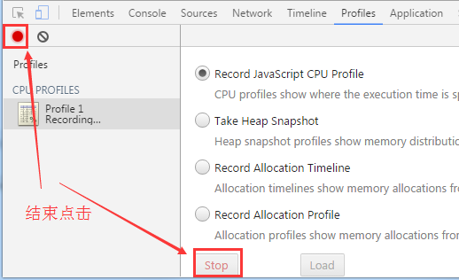
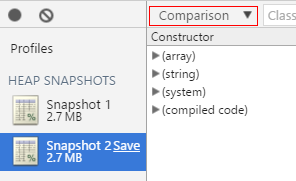

# 使用chrome的性能分析器

>  性能分析器（Profiles）是 chrome 开发者工具的一部分，可以通过在页面右键选择审查元素或在谷歌浏览器页面按F12 打开 chrome 开发者工具。然后点击 Profiles 切换至性能分析器（Profiles）面板。
>

 

###  1、CPU占用分析

#### 1.1 启动CPU性能分析器

​         选中 `Record JavaScript CPU Profile`，点击 Start 按钮或左上角的实心圆点，这个时候Chrome 就会开始记录当前网页的方法的执行。如图1-1所示。

 （图1-1）

#### 1.2 结束CPU性能分析器的监控

结束这个性能分析器的监控记录需要点击Stop按钮（或左侧的红色实心圆圈）。如图1-2所示。

 （图1-2）

### 1.3 查看CPU性能分析器的记录

结束监控后，在左侧 Profiles 下会列出一个监控结果文件，单击可以打开此监控结果文件。如图1-3所示

 （图1-3）

监控结果是以数据表格形式展现的。我们可以根据消耗排行，找到Function中提供的函数名，针对性能消耗较大的地方进行优化。

### 2、内存占用分析

#### 2.1启动内存分析

选中 `Take Heap Snapshot`，点击 `Take Snapshot` 按钮（也可以点击左边黑色实心圆圈），如图2-1所示，

 （图2-1）

生成的内存快照文件是以数据表格的形式记录了，当前网页对象的个数、所占的内存大小等。

#### 2.2 内存快照记录

在启动内存分析后，很快就会在左侧的 Profiles 栏目下生成一个当前网页的内存快照记录文件。单击可以查看相关数据，如图2-2所示。

 （图2-2）

#### 2.3内存快照分析

在拍完第一个内存快照后，点击左上角的圆点，可以记录一个新的内存快照。单击选择第二个内存快照，可以选择 Comparison 模式对此第二个快照与第一个快照之间的变化。通过分析，对网页进行优化。

​     
​    （图2-3）

​     
​    （图6）