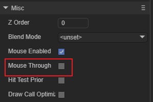

## 鼠标交互的使用与优化

> Author: charley           Data:  2022-04-14

无论是PC端的鼠标交互还是移动端的触摸交互，我们暂且都泛称为鼠标交互。这是游戏引擎实现人机交互的基础。本文从LayaAir引擎鼠标交互的基础使用开始（包括2D与3D），到进阶级的使用，进行全面介绍，希望对使用LayaAir的新老朋友都有所帮助。

[TOC]

### 一、鼠标交互的基础使用

> 非新手开发者，可以跳过本小节

#### 1.1 鼠标事件的类型

鼠标事件是鼠标交互的基础之一。例如点击，按下，离开，滚动等等，有了这些鼠标事件，我们就可以针对这些事件进行侦听，然后在触发这些事件时，作出相应的逻辑反馈。下面我们先来了解常用的鼠标事件类型：

##### 1.1.1 PC端的基础鼠标事件类型

| 事件类型           | 引擎对应的事件类型                    | 事件类型说明                     |
| -------------- | ---------------------------- | -------------------------- |
| mousedown      | Laya.Event. MOUSE_DOWN       | 鼠标左键按下                     |
| mouseup        | Laya.Event. MOUSE_UP         | 鼠标左键抬起                     |
| mousemove      | Laya.Event. MOUSE_MOVE       | 鼠标移动                       |
| mouseover      | Laya.Event. MOUSE_OVER       | 鼠标移入（从一个显示节点移入到另一个显示节点时触发） |
| mouseout       | Laya.Event. MOUSE_OUT        | 鼠标移出（从当前显示节点上移出时触发）        |
| click          | Laya.Event. CLICK            | 鼠标左键点击（按下再抬起后触发）           |
| doubleclick    | Laya.Event. DOUBLE_CLICK     | 鼠标左键双击（连点2次）               |
| rightclick     | Laya.Event. RIGHT_CLICK      | 鼠标右键点击（按下再抬起后触发）           |
| rightmousedown | Laya.Event. RIGHT_MOUSE_DOWN | 鼠标右键按下                     |
| rightmouseup   | Laya.Event. RIGHT_MOUSE_UP   | 鼠标右键抬起                     |
| mousewheel     | Laya.Event.  MOUSE_WHEEL     | 鼠标滚轮滚动                     |

##### 1.1.2 移动端的基础触摸事件

移动端的触摸事件相对于PC端来说，就简单的多，像点击，按下，抬起，移动，这些PC端的鼠标事件，在移动端是通用的。

| 事件类型        | 引擎对应的事件类型                | 事件类型说明                     |
| ----------- | ------------------------ | -------------------------- |
| mousedown   | Laya.Event. MOUSE_DOWN   | 触摸按下                       |
| mouseup     | Laya.Event. MOUSE_UP     | 触摸抬起                       |
| mousemove   | Laya.Event. MOUSE_MOVE   | 触摸移动                       |
| mouseover   | Laya.Event. MOUSE_OVER   | 触摸移入（从一个显示节点移入到另一个显示节点时触发） |
| mouseout    | Laya.Event. MOUSE_OUT    | 触摸移出（从当前显示节点上移出时触发）        |
| click       | Laya.Event. CLICK        | 触摸点击（触摸按下再抬起后触发）           |
| doubleclick | Laya.Event. DOUBLE_CLICK | 触摸双击（连点2次）                 |

##### 1.1.3 其它常用的鼠标交互类型

除了以上的基础鼠标交互类型，还有很多其它的事件类型，这里我们仅列出一些常用的鼠标交互事件，更多的事件类型，大家可查看引擎源码的Event类，或者官网的API文档，[https://layaair2.ldc2.layabox.com/api2/Chinese/index.html?type=Core&category=Event&class=laya.events.Event](https://layaair2.ldc2.layabox.com/api2/Chinese/index.html?type=Core&category=Event&class=laya.events.Event)

| 事件类型  | 引擎对应的事件类型         | 事件类型说明  |
| ----- | ----------------- | ------- |
| blur  | Laya.Event. BLUR  | 鼠标失去焦点  |
| focus | Laya.Event. FOCUS | 鼠标获得焦点  |
| input | Laya.Event. INPUT | 表单输入值改变 |

##### 1.1.4 自定义事件类型

如果开发者在某些情况下，想自己派发事件，然后侦听自己定义的事件类型，LayaAir引擎提供了event方法。API如图1所示：

    

(图1)

示例代码如下：

```typescript
onEnable(): void { 
	//需要先侦听自定义的test事件
  	this.xxx.on("test", this, () => {
		console.log("已收到test事件");
 	 });
}

onMouseDown(): void {
	//派发自定义事件的逻辑要放到侦听逻辑的后面
    this.xxx.event("test");
}
```

在上面的示例里，我们可以看出，派发自定义事件要在侦听逻辑的后面，另外还需要注意的是，派发的节点要对应侦听的节点，否则就会导致无法侦听成功（相当于信号不在一个频道上）。

#### 1.2 鼠标事件的使用方式

鼠标事件的使用原理，基本上就如同上文的示例，由事件侦听与事件派发两部分组成。只不过除自定义事件以外的事件，都是由引擎在某些条件下派发，开发者熟悉各个鼠标事件后，在对应的条件下，使用引擎提供的侦听器，侦听对应的鼠标事件即可。

##### 1.2.1 事件侦听器

事件侦听器有两个，一个是持续侦听的on方法，另一个是只侦听一次（自动移除）的once方法。

```typescript
    /**
     * 使用 EventDispatcher 对象注册指定类型的事件侦听器对象，以使侦听器能够接收事件通知。
     * @param type		事件的类型。
     * @param caller	事件侦听函数的执行域。
     * @param listener	事件侦听函数。
     * @param args		（可选）事件侦听函数的回调参数。
     * @return 此 EventDispatcher 对象。
     */
    on(type: string, caller: any, listener: Function, args: any[] = null): EventDispatcher {
        return this._createListener(type, caller, listener, args, false);
    }

    /**
     * 使用 EventDispatcher 对象注册指定类型的事件侦听器对象，以使侦听器能够接收事件通知，此侦听事件响应一次后自动移除。
     * @param type		事件的类型。
     * @param caller	事件侦听函数的执行域。
     * @param listener	事件侦听函数。
     * @param args		（可选）事件侦听函数的回调参数。
     * @return 此 EventDispatcher 对象。
     */
    once(type: string, caller: any, listener: Function, args: any[] = null): EventDispatcher {
        return this._createListener(type, caller, listener, args, true);
    }
```

on与once的使用基本上一样，只是on如果不想持续侦听，还需要手动移除，once不需要手动移除。

示例代码如下：

```typescript
//持续侦听click点击事件
this.xxx.on(Laya.Event.CLICK, this, () => {
	//侦听到事件后的逻辑代码...
});

//侦听一次close关闭事件
this.xxx.once(Laya.Event.CLOSE, this, this.onClosed);

onClosed(): void {
	//侦听到事件后的逻辑代码...
}
```

##### 1.2.2 事件侦听的移除

如果想移除事件侦听，LayaAir引擎提供了off、offAll、offAllCaller三种方法。下面我们分别介绍。

##### off：删除指定的某个侦听器

 

（图2） 

如图2所示，删除侦听器的参数与使用侦听器差不多，传入侦听器的事件类型，侦听函数的执行域，侦听函数即可。

示例代码如下：

```typescript
//持续侦听xxx对象的click点击事件
this.xxx.on(Laya.Event.CLICK, this, this.xxxOnClicked);

xxxOnClicked():void{
  //侦听到事件后的逻辑代码...
}

//删除xxx对象的click点击事件侦听器
this.xxx.off(Laya.Event.CLICK, this, this.xxxOnClicked);
```

##### offAll：删除对象中指定事件类型的全部侦听器

 

(图3)

如图3所示，只要传入指定的事件类型即可删除目标对象的该事件类型的全部侦听器。

示例代码如下所示：

```typescript
//删除xxx对象下click事件类型的全部侦听器
this.xxx.offAll(Laya.Event.CLICK);
```

##### offAllCaller：删除指定执行域的全部侦听器

  

(图4)

如图4所示，传入执行域，就可以删除该执行域下的所有事件侦听器。

示例代码如下：

```typescript
//删除xxx对象下this执行域的全部侦听器
this.xxx.offAllCaller(this);
```

##### 1.2.3 脚本里的鼠标事件生命周期

除了手动侦听的方式去使用鼠标事件，如果开发者采用组件式开发（继承了Laya.Script脚本类），也可以直接使用脚本组件的鼠标生命周期方法。

> 本小节暂不考虑3D脚本的情况，使用上2D与3D会有一些差异，3D鼠标交互会统一在后面的3D章节里介绍。

脚本组件中的鼠标事件相关的生命周期方法如下：

```typescript
export default class Script2DTest extends Laya.Script {
    constructor() { super(); }

    onClick(e: Laya.Event): void {
        console.log("点击脚本所属的节点对象时触发");
    }

    onDoubleClick(e: Laya.Event): void {
        console.log("双击脚本所属的节点对象时触发");
    }

    onMouseDown(e: Laya.Event): void {
        console.log("鼠标在脚本所属的节点对象上按下时触发");
    }

    onMouseUp(e: Laya.Event): void {
        console.log("鼠标在脚本所属的节点对象上抬起时触发");
    }

    onMouseMove(e: Laya.Event): void {
        console.log("鼠标在脚本所属的节点对象上移动时触发");
    }

    onMouseOver(e: Laya.Event): void {
        console.log("鼠标进入脚本所属的节点对象时触发");
    }

    onMouseOut(e: Laya.Event): void {
        console.log("鼠标离开脚本所属的节点对象时触发");
    }

    onStageMouseDown(e: Laya.Event): void {
        console.log("鼠标在stage（舞台）上按下时触发");
    }

    onStageMouseUp(e: Laya.Event): void {
        console.log("鼠标在stage（舞台）上抬起时触发");
    }

    onStageClick(e: Laya.Event): void {
        console.log("鼠标在stage（舞台）上点击时触发");
    }

    onStageMouseMove(e: Laya.Event): void {
        console.log("鼠标在stage（舞台）上移动时触发");
    }
}
```

通过上面的示例代码可以看出，在脚本的鼠标事件生命周期里，直接按需使用即可，无需再侦听（因为引擎已做侦听，这些事件生命周期方法，就是相应鼠标事件的侦听回调方法）。

#### 1.3 鼠标事件的关闭与开启:mouseEnabled

鼠标事件的侦听需要有个前提条件，就是这个节点对象要允许接收鼠标事件。

控制对象是否接收鼠标事件的属性参数是mouseEnabled，我们可以在代码里设置，也可以在IDE里的属性面板里设置，如图5所示：

 

（图5）

在代码里设置的示例代码如下：

```typescript
//true允许接收鼠标事件,false禁止接收鼠标事件
this.xxx.mouseEnabled = true;
```

通常，我们无需设置，引擎会根据组件的使用特性，决定是否开启。

例如，图像（Sprite、Image），文本（Text、Label）等，在多数情况下是不需要侦听鼠标事件的，所以默认是关闭的。但是按钮（Button）、标签（Tab）、HTML文本（HTMLDivElement）等，必须要通过点击操作进行交互的组件，肯定需要接收鼠标事件，所以默认就打开了。

此时，也许会有新手同学提问，我没有设置开启，为什么帧听图像的鼠标事件，也没问题？

那是由于，当使用on或once进行鼠标事件的侦听时，采用默认值关闭鼠标事件的，引擎又会自动打开。所以，大多数情况我们无需设置。

但是，需要注意的是，

如果是手动设置不接受鼠标事件（mouseEnabled为false），在事件侦听时，引擎就不会打开了。

另外，on与once侦听打开的只是侦听对象本身与父对象，该对象的子节点对象如果没有设置，还是不会自动打开。默认值是关闭的，还是会关闭，无法接收鼠标事件。

所以，当我们的子节点对象，无法点击，要先排查该对象是否可接收鼠标事件。

> 接收鼠标事件后，鼠标碰撞检测会消耗性能，原则上，不是必须要接受鼠标事件的对象，尽量不要手动设置开启。

#### 1.4 获得舞台坐标与局部坐标转换

鼠标交互里，除了事件的侦听与响应外，比较常用的还有获得舞台坐标或节点对象的局部坐标。

##### 1.4.1 获得鼠标所在的舞台坐标

- 通过`Laya.stage.mouseX`可以获得鼠标位于舞台（stage）上的X坐标。
- 通过`Laya.stage.mouseY`可以获得鼠标位于舞台（stage）上的Y坐标。

##### 1.4.2 转换舞台坐标为局部坐标

通过对象的`globalToLocal()`方法，可以将舞台坐标转换为局部坐标。

示例代码如下：

```typescript
//转换舞台坐标为XXX对象的局部坐标
let point: Laya.Point = this.XXX.globalToLocal(new Laya.Point(Laya.stage.mouseX, Laya.stage.mouseY));
console.log("打印局部坐标x,y", point.x, point.y);
```

#### 1.5 常见的实例使用

点击事件的使用示例比较简单，上文中也有体现。这个小节里，分别以PC端的鼠标滚轮缩放，与移动端的双指手势缩放为例，方便新手开发者理解鼠标交互事件的实战运用。

##### 1.5.1 PC端的鼠标滚轮缩放示例

下面的示例，实现了以鼠标点所在位置为图像的缩放中心，通过鼠标滚轮的交互进行缩放。

```typescript
export default class XX extends Laya.Script {
	private _owner: Laya.Image;
  
  onEnable(): void {
    this._owner = this.owner as Laya.Image;
    this.onMouseWheel();
  }
  
  /** 帧听滚轮事件，并处理滚动 */
  onMouseWheel(): void {
    //处理滚轮事件的帧听
    this.owner.on(Laya.Event.MOUSE_WHEEL, this, (e: Laya.Event) => {
      //转换舞台坐标为本地坐标
      let point: Laya.Point = this._owner.globalToLocal(new Laya.Point(Laya.stage.mouseX, Laya.stage.mouseY));

      if (e.delta > 0) { //当滑轮向上滚动时，增加xy缩放值  
        this._owner.scaleX += 0.1;
        this._owner.scaleY += 0.1;
      }
      if (e.delta < 0) { //当滑轮向下滚动时，减少xy缩放值
        this._owner.scaleX -= 0.1;
        this._owner.scaleY -= 0.1;
        //设置xy最小缩放值
        (this._owner.scaleX < 0.8) && (this._owner.scaleX = 0.8);
        (this._owner.scaleY < 0.8) && (this._owner.scaleY = 0.8);
      }

      //缩放后的鼠标位置
      let point2: Laya.Point = this._owner.globalToLocal(new Laya.Point(Laya.stage.mouseX, Laya.stage.mouseY));

      //计算缩放引发的xy偏移值
      let _offsetX = (point2.x - point.x) * this._owner.scaleX;
      let _offsetY = (point2.y - point.y) * this._owner.scaleY;

      //修正坐标位置
      this._owner.x += _offsetX;
      this._owner.y += _offsetY;
    });
  }
}
```

##### 1.5.2 移动端的双指手势缩放示例

下面的示例，实现了以双指中心为图像缩放中心，进行双指的手势缩放。

```typescript
export default class XX extends Laya.Script {
	private _owner: Laya.Image;
    /** 缩放前的中心点坐标信息 */
    private lastPivot: Laya.Point;
  	/** 上次的距离值 */
    private lastDistance: number = 0;
  
   onEnable(): void {
  	  this._owner = this.owner as Laya.Image;
  }
  
  //鼠标在对象上按下时自动触发执行的脚本生命周期方法
  onMouseDown(e: Laya.Event): void {
    //当触摸操作的touch对象数组存在，并且大于1个触摸点，就认定为缩放操作
    if (e.touches && e.touches.length > 1) {
      //把初始的touch坐标位置通过开平方运算，记录为初始双指距离
      this.lastDistance = this.getDistance(e.touches);
      //纪录缩放前的手指中心点坐标
      this.lastPivot = this.setPivot(e.touches);
      //多指按下的情况下，再去侦听手势移动事件并处理逻辑
      this._owner.on(Laya.Event.MOUSE_MOVE, this, this.mouseMove);
    }
  }
  
  onMouseUp(e: Laya.Event): void {
    //鼠标或手势抬起后，移除侦听
    this._owner.off(Laya.Event.MOUSE_MOVE, this, this.mouseMove);
  }
  
  /** 鼠标（或手势）在对象上移动时触发的事件侦听方法 */
  mouseMove(e: Laya.Event): void {
    /**当前的双指距离*/
    let distance: number = this.getDistance(e.touches);

    //设置缩放
    this._owner.scaleX += (distance - this.lastDistance) * 0.01;
    this._owner.scaleY += (distance - this.lastDistance) * 0.01;
    //设置缩放值限制条件
    (this._owner.scaleX < 0.8) && (this._owner.scaleX = 0.8);
    (this._owner.scaleY < 0.8) && (this._owner.scaleY = 0.8);
    (this._owner.scaleX > 5) && (this._owner.scaleX = 5);
    (this._owner.scaleY > 5) && (this._owner.scaleY = 5);

    //缩放后的手势中心点位置(局部位置)
    let nowPivot = this.setPivot(e.touches);

    //计算缩放引发的xy偏移值
    let _offsetX = (nowPivot.x - this.lastPivot.x) * this._owner.scaleX;
    let _offsetY = (nowPivot.y - this.lastPivot.y) * this._owner.scaleY;
	
    //修正坐标位置
    this._owner.x += _offsetX;
    this._owner.y += _offsetY;

    //保存当前值，用于下次计算
    this.lastDistance = distance;
  }
  
  /**
     * 计算并设置多指的中心点坐标
     * @param touches 手势信息数组
     */
  setPivot(touches: Array<any>): Laya.Point {
    let Point0: Laya.Point = this._owner.globalToLocal(new Laya.Point(touches[0].stageX, touches[0].stageY));
    let Point1: Laya.Point = this._owner.globalToLocal(new Laya.Point(touches[1].stageX, touches[1].stageY));
    return new Laya.Point((Point0.x + Point1.x) / 2, (Point0.y + Point1.y) / 2);
  }
  
  /** 计算两个触摸点坐标之间的距离 */
  getDistance(touches: Array<any>): number {
    //初始值为0
    var distance: number = 0;
    if (touches && touches.length > 1) {
      //计算距离
      let dx: number = touches[0].stageX - touches[1].stageX;
      let dy: number = touches[0].stageY - touches[1].stageY;
      distance = Math.sqrt(dx * dx + dy * dy);
    }
    return distance;
  }
}
```

### 二、穿透与鼠标碰撞区域

> 之所以把穿透单独拉出一个小节来介绍，是因为这块比较容易引起开发者的使用误区，是新手踩坑的一个常见地方。
>

是否穿透的API是mouseThrough，可以通过代码设置，也可以在IDE属性面板里直观的进行设置，如图6所示。

 

(图6)

在代码里设置的示例代码如下：

```typescript
//trues可穿透,false不可穿透（默认值）
this.xxx.mouseThrough = true;
```

#### 2.1 理解穿透与不接收事件的区别

如果鼠标可穿透当前显示对象，表现为侦听的该对象没有侦听到事件。例如按钮是可穿透的，那点击按钮就没有反馈。

从表象上看，穿透（mouseThrough为true）的效果与之前介绍的鼠标事件关闭（mouseEnabled为false）是一样的。

但底层的逻辑有区别。

当为某对象设置鼠标事件关闭后，即便是对该对象侦听，鼠标碰撞检测到该对象的时候，也会直接中断递归检测，导致该对象与子对象都无法接受鼠标事件。

而设置穿透，只是检测到未碰撞绘制图形的显示区域时，才判定为未命中，然后继续递归检测其子对象。

所以，如果不需要继续检测鼠标事件的情况下，直接中断检测性能更高。

#### 2.2 详解不穿透：mouseThrough为false

mouseThrough的默认值为false，为false时，可以理解为不穿透，这是大多数情况下表现出来的特性，但是，在某些情况下，也会产生穿透的现象。正是这样，导致一些新手开发者在没有完全理解该属性的设置之前，会比较困惑。下面我们一起彻底理解起来。

##### 2.2.1  不穿透的判定条件

当mouseThrough为false时，会依据当前对象的宽高（width、height）计算鼠标碰撞区域。宽高范围内才是不可穿透的区域。

##### 2.2.2 自定义鼠标碰撞区域（不可穿透区域）

之前介绍的鼠标碰撞区域，无论是自动计算的，还是手动设置的，都是依据起始坐标与宽高，形成的矩形区域。

如果我们想实现圆形、多边形等自定义的碰撞区，应该怎么实现呢？

引擎还可以通过graphics绘制图形来实现自定义的鼠标碰撞区域。如图9所示，想要通过Graphics绘制图形首先需要创建一个sprite，在sprite属性中来使用Graphics，我们为Sprite节点添加了一个圆形的graphics绘制区域。

  

（图9）

然后，我们还需要将这个圆形绘制区域的渲染类型(Hit Area)设置为碰撞区域（hit），如动图10所示。这样哪怕是个空节点，也会依据这个绘制的碰撞区为不可穿透区域。

 

(动图10)

如果不是空节点，本来就存在以宽高为碰撞区的矩形不可穿透区。那么绘制的碰撞区优先级要高于宽高碰撞区，检测完绘制碰撞区后，将不会再检测宽高碰撞区。相当于，存在绘制碰撞区之后，宽高碰撞区无效。

#### 2.3 详解穿透 ：mouseThrough为true

设置为穿透后，并非所有的组件都是处于穿透状态。而是基于绘制条件决定穿透还是不穿透，所以我们必须要彻底理解，才能正确的使用穿透。

##### 2.3.1 穿透的判定条件

当mouseThrough为true的时候，穿透的条件将与对象的宽高无关，与对象上的graphics绘制显示区域有关。

绘制显示区域内为鼠标碰撞区，**没有绘制显示区域或者在绘制显示区域之外**，被判定为鼠标碰撞检测未命中，**无法进行侦听反馈，也就是穿透的效果。**

graphics绘制区域的使用有三种形式，分别是：通过IDE的创建、通过引擎API创建、继承引擎Graphics类实现。

> 注意：mouseThrough为true时，存在graphics绘制区域的，区域内**不穿透**。

##### 通过IDE创建Graphics图形，

如图11所示：

 

（图11）

与mouseThrough为false不同的是，为true时创建的Graphics图形可以不修改渲染类型（Hit Area），不修改，graphics绘制的图形就是显示状态，如果修改为hit后，绘制图形就只是纯粹的鼠标碰撞区域，绘制的图形不可见。

##### 通过引擎API创建Graphics图形，

示例代码如下：

```typescript
//根据sp对象的宽高，用graphics绘制一个颜色值为#fff000的矩形图形。
this.sp.graphics.drawRect(0,0,this.sp.width,this.sp.height,"#fff000"); 
```

##### 继承引擎Graphics类实现的图形绘制，

例如，引擎为UI组件实现显示图像的AutoBitmap。

##### 2.3.2 穿透设置无效的组件

前文介绍的，通过IDE或代码的方式，为对象添加graphics绘制图形，使得穿透设置无效，比较容易理解。

本节重点介绍引擎自带UI组件设置无效的情况。

##### 图像UI组件

LayaAir的一些图像UI组件，通过继承自Graphics的AutoBitmap实现的图像绘制，所以这些组件mouseThrough为true时，如果存在图像资源（skin为有效路径的图像），就存在graphics绘制区域，因此就导致穿透设置无效。

穿透设置无效的组件分别是：Image、Button、CheckBox、Radio、Clip、FontClip、ComboBox、VScrollBar、HScrollBar、TextInput、TextArea。

> 如果这些组件没有skin资源，只是存在宽高，那穿透设置还是有效的。前文介绍过，为true时，不认对象宽高，以绘制图形的区域为鼠标碰撞（不穿透）区域。

##### 容器组件

除了这些基于skin的图像显示组件，Box容器以及继承于Box容器的容器类组件当设置bgColor后，这个背景色也是采用graphics绘制的矩形区域。所以在这种情况下，mouseThrough为true，背景色范围内不会具有穿透效果。

##### 2.3.3 如何让穿透无效的组件可穿透

例如Image这些图像显示组件，mouseThrough为true时，可以检测到他的绘制宽高，无法穿透。mouseThrough为false时，又可以自动获取宽高，也无法穿透。

尽管绝大多数情况下，显示图像并不需要穿透，如果在特殊情况下，就是要实现穿透应该怎么处理呢？

当mouseThrough为false时（不穿透设置），在这些图像UI组件对象上添加任意的绘制图形，然后将该对象的graphics图形渲染类型Hit Area设置为unHit，如图12所示。那么该组件就处于穿透状态了。

 

(图12)

#### 2.4 穿透与不穿透的应用总结

穿透设置（mouseThrough为true）主要应用于容器类组件（Sprite也算容器），图像UI组件设置了也无效。

如果一定要设置图像UI组件为可穿透，可以通过不穿透（mouseThrough为false）的设置，再添加unHit类型绘制图形来实现。

不穿透（mouseThrough为false）是默认设置，虽然mouseThrough为true也可以通过绘制区域实现不穿透，但不要这样用，因为穿透采用getGraphicBounds获取绘制区域（鼠标碰撞区域），比较消耗CPU，频繁使用可能会造成卡顿。

不穿透主要以宽高设置碰撞区，图像UI组件会自动获得宽高。容器组件要手动设置或者依据子节点自动获取。如果矩形碰撞区不能满足的，可以采用graphics绘制图形并作为碰撞区（设置Hit Area为hit）。存在graphics绘制的鼠标碰撞区时，不再以宽高为鼠标碰撞区。

### 三、鼠标交互的使用优化

#### 3.1 阻止事件流冒泡：stopPropagation

鼠标事件流包括捕获阶段、目标阶段、冒泡阶段。

- 捕获阶段：此阶段引擎会从stage开始递归检测stage及其子对象，鼠标坐标是否在对象的碰撞区，直到找到命中（鼠标坐标位于碰撞区）的目标对象或者未命中任何对象；


- 目标阶段：找到命中的目标对象；
- 泡阶段：事件离开目标对象，按节点层级向上逐层通知，直到到达舞台的过程。

下面，我们通过图13的事件流示意图来理解一下，

 

（图13）

通过示意图我们可以看出，在捕获阶段（检测对象是否发生鼠标碰撞），分成两个维度，一个是从Stage开始，到子节点，再到孙节点这种链条结构。另一个维度，是同级节点按节点数组的倒序顺序捕获。

> 由于显示节点的排序越大，显示越靠上层，所以检测也是基于先显示先检测的原则，进行倒序捕获。

而冒泡的顺序则是后检测的先冒泡，并且会按照子节点到父节点的节点链路径原路返回，一直回到Stage。

引擎在事件类里提供了stopPropagation()的方法，用于阻止后续的事件流冒泡。使用后不仅可以节省性能，还可以避免父子节点链中同时侦听的多重事件响应。

例如，我们为图13的孙节点A使用了stopPropagation，那么子节点0、Stage节点，就不会再产生侦听反馈。

需要注意的是，假如，两个孙节点都是某个节点的子节点，其中一个孙节点使用了stopPropagation，不会影响另一个孙节点的冒泡路径。冒泡流程如图14所示。

 

（图14） 

阻止冒泡的代码示例为：

```typescript
onEnable(): void {
  //在手动帧听的时候使用stopPropagation
  this.XXX.on(Laya.Event.MOUSE_DOWN, this, (e: Laya.Event) => {
    //使用stopPropagation会中断后续事件的冒泡循环，提高性能
	//该方法会阻止对事件流中当前节点的后续节点中的所有事件侦听器进行处理。
    //该方法不会影响当前节点 (currentTarget) 中的任何事件侦听器。
    e.stopPropagation();
  });
}

//在生命周期方法里使用stopPropagation
onMouseDown(e: Laya.Event): void {
  e.stopPropagation();
}
```

#### 3.2 鼠标碰撞检测优先级：hitTestPrior

当存在事件侦听时，鼠标在每一次的移动中，都会发生若干次的递归检测，并且每次的检测，如果没有提前中断，都是从stage一直到递归检测完所有的子节点对象。所以，层级复杂并且交互侦听较多时，对性能也是产生影响的。此处优化的原则，就是尽可能提前中断检测递归。hitTestPrior属性就提供了一种优化检测模式。

##### 3.2.1 优先检测子对象(false)

当hitTestPrior为false，会优先检测子对象，一直到stage上的全部节点都递归检测完毕，仍然没有找到目标对象，才会检测本对象。

##### 3.2.2 优先检测本对象(true)

当hitTestPrior为true，并且不穿透（mouseThrough为false）的时候，会优先检测本对象。

如果鼠标捕获未命中本对象（鼠标不在本对象的鼠标碰撞区域内），则会直接中断本对象以及其子节点对象的检测。

> 如果优先本对象的时候，允许穿透，会导致穿透范围内直接中断检测，无法进而检测子节点对象，穿透也就失去了价值。
>
> 所以必须要结合不穿透来使用，用于中断本对象区域以外的鼠标碰撞检测。

如果鼠标命中本对象，还会继续递归检测子节点对象。一直到其全部子节点对象都检测完毕，或者找到目标对象而中断检测。

##### 3.2.3 检测优先级的设置区别与应用场景

优先检测本对象（true），是一种优化模式，未命中本对象时，提前中断检测可以减少子节点递归检测带来的消耗。但是也因此，导致子节点对象在本对象的碰撞区域外，检测不到。

 

（图15）

例如，图15的红框内，如果是本对象宽高范围，当我们只侦听本对象，那红框外的关闭按钮，以及身体在红框外的那部分，就无法响应鼠标事件了。

所以在使用优先检测本对象时，需要子节点在本对象的鼠标碰撞区域内，或者在碰撞区域外的子节点对象，没有事件侦听反馈的需求。

否则，就只能是采用优先检测子对象的设置（false）。

##### 优先检测的默认值

大多数情况下，默认值都是优先检测子对象（hitTestPrior为false）。但是也有一些情况默认都是优先本对象的。

首先是舞台（stage），默认值就是true。因为在通常情况下，子节点是不需要超过舞台的，除非在某些全屏适配的情况下，可能因缩放而导致显示宽高超出舞台宽高，此时，超出舞台的部分就无法响应事件。如果需要响应事件，开发者可以通过相对布局等方式，保障舞台宽高与显示宽高一致。

另外就是场景组件（Scene、View、Dialog），正常情况下，场景的子节点不应该要超过场景大小，所以默认情况下，只要场景宽大于0，会自动将场景组件的hitTestPrior设置为true。如果开发者手动将场景设置为穿透（mouseThrough为true），那引擎就不会自动修改，仍然是默认值false。

#### 3.3  事件优化使用技巧

##### 3.3.1 关闭鼠标事件的合理使用

当鼠标事件处于关闭时（mouseEnabled为false）将不会对该节点以及子节点进行鼠标碰撞检测。因此可以节省子节点递归带来的性能消耗。

前文介绍过，Sprite、Image等组件的鼠标事件默认是关闭的(false)，但是on或once侦听后，会自动将该对象以及该对象的父节点默认设置为true（手动关闭的打不开）。

所以，我们尽可能将需要侦听节点从层级较深的节点链中独立出来，避免侦听的节点对象穿插在无须侦听的节点对象之中（尤其是节点层级较层的），把不需要侦听的节点保持鼠标事件的关闭状态，这样就可以最大可能的减少节点不必要的递归消耗。

##### 3.3.2 尽量避免为绘制图形开启穿透

穿透是比较常用的属性功能。例如图16中，我们为背景（rightBG）与角色（role）均开启了穿透，那么侦听背景的时候，只有按钮（btn2）才会触发鼠标事件。否则，在背景上的任意区域都会触发鼠标事件。

 

（图16）

需要注意的，穿透主要是为Sprite、Box这些容器组件使用的，当不存在绘制图形时，不会触发图形宽高的碰撞区计算。

在穿透（mouseThrough为true）模式下，一旦存在绘制图形，不仅穿透功能变成了以绘制图形区域为不穿透区，也会因为获取图形宽高碰撞区域，带来更多性能消耗，频繁的获取图形宽高甚至会导致卡顿。

例如图16中的背景（rightBG）采用的是Box节点对象，如果换成Image对象，那mouseThrough为true时，不仅无法实现穿透效果，还会带来不必要的性能消耗。

> 如果一定要使用Image对象实现穿透，可以先设置为不穿透，再设置绘制图形的渲染类型为unHit（具体参照2.3.3小节）。

### 四、3D鼠标交互

#### 4.1 2D鼠标交互与3D鼠标交互的区别

2D鼠标交互采用的是屏幕上的鼠标坐标点（像素）与节点对象的2D屏幕空间区域的碰撞检测，来实现鼠标碰撞反馈逻辑。

三维空间的世界里，显然无法通过2D屏幕的像素碰撞来检测三维模型是否产生了点击、按下、抬起等鼠标交互操作。

尤其是三维空间里，显示对象在空间中有纵深远近、层叠、裁剪、父子等复杂关系，并且还在不断变换。

3D鼠标交互使用到了3D物理引擎，先基于鼠标的2D屏幕空间坐标发射一条3D空间的射线，再检测鼠标射线的3D碰撞器是否与3D空间的物体发生了碰撞。

#### 4.2 3D鼠标事件交互

3D鼠标事件的交互，侦听的鼠标事件和2D一样，不过3D需要侦听的是舞台。

然后是碰撞检测，必须要引入3D物理引擎库，如图17所示。

 

(图17)

之后是通过屏幕的鼠标坐标点发射射线进行射线的物理碰撞检测，并返回检测状态与结果等信息。

如果未碰到任何3D物体，那检测返回的碰撞对象（collider.owner）就为null，

如果碰到3D物体，就将首次碰到的3D对象返回。

代码示例如下：

```typescript
export class MouseInteraction {
  private _scene: Laya.Scene3D;
  private _camera: Laya.Camera;  
  /** 输出射线检测碰到的目标对象 */
  private _outHitResult: Laya.HitResult = new Laya.HitResult();
  private _ray: Laya.Ray;
  private point: Laya.Vector2 = new Laya.Vector2();
  onEnable(): void {
    //创建3D场景
    this._scene = (<Laya.Scene3D>Laya.stage.addChild(new Laya.Scene3D()));
    //添加3D摄像机
    this._camera = (<Laya.Camera>(this._scene.addChild(new Laya.Camera(0, 0.1, 100))));
    
    /** 省略若干代码 */
    
    //射线初始化（必须初始化）
    this._ray = new Ray(new Vecntetor3(0, 0, 0), new Vector3(0, 0, 0));
    //侦听舞台上的鼠标事件
    Laya.stage.on(Laya.Event.MOUSE_DOWN, this, this.onMouseDown);    
  }
  
  /** 鼠标按下时的逻辑处理 */
  onMouseDown(): void {
    this.point.x = Laya.stage.mouseX;
    this.point.y = Laya.stage.mouseY;
    //用舞台上的鼠标坐标，产生一条3D空间射线
    this._camera.viewportPointToRay(this.point, this._ray);
    //使用物理引擎的射线检测方法，检测是否发生了碰撞
    this._scene.physicsSimulation.rayCast(this._ray, this._outHitResult);
    //根据检测结果的状态进行判断，如果碰撞成功，处理碰撞后的逻辑。
    if (this._outHitResult.succeeded) {
      //输出碰倒的首个3D物体对象名字
      console.log("碰撞到物体: " + this._outHitResult.collider.owner.name);
    }
  }
}
```

#### 4.3 3D鼠标穿透

有的时候，3D物体可能会发生重叠和交叉摆放，存在穿透点击等事件需求，我们也可以对3D空间物体设置鼠标交互的穿透。

由于3D鼠标事件的碰撞检测是基于物理引擎的，所以，穿透也是基于物理的碰撞控制。

3D物体对象不设置物理或关闭了物理碰撞。自然就形成了穿透。

如果3D物体存在物理碰撞的需求，只需要对鼠标事件形成穿透响应。那也可以通过射线检测全部的方法和碰撞分组进行控制。

##### 4.3.1 穿透：检测所有的碰撞物体

上个小节示例介绍的`rayCast()`方法，在碰撞到首个3D物体的时候，就会返回检测结果，这也是大多数情况下的常见需求，性能消耗也更少。如果我们想穿透检测多个3D物体的时候，需要使用`rayCastAll()`方法。

代码示例如下：

```typescript
export class MouseInteraction {
  private _scene: Laya.Scene3D;
  private _camera: Laya.Camera;  
  /** 输出射线检测碰到的全部目标对象 */
  private _outs: Array<any> = [];
  private _ray: Laya.Ray;
  private point: Laya.Vector2 = new Laya.Vector2();
  onEnable(): void {
    //创建3D场景
    this._scene = (<Laya.Scene3D>Laya.stage.addChild(new Laya.Scene3D()));
    //添加3D摄像机
    this._camera = (<Laya.Camera>(this._scene.addChild(new Laya.Camera(0, 0.1, 100))));
    
    /** 省略若干代码 */
    
    //射线初始化（必须初始化）
    this._ray = new Ray(new Vecntetor3(0, 0, 0), new Vector3(0, 0, 0));
    //侦听舞台上的鼠标事件
    Laya.stage.on(Laya.Event.MOUSE_DOWN, this, this.onMouseDown);    
  }
  
  /** 鼠标按下时的逻辑处理 */
  onMouseDown(): void {
    this.point.x = Laya.stage.mouseX;
    this.point.y = Laya.stage.mouseY;
    //用舞台上的鼠标坐标，产生一条3D空间射线
    this._camera.viewportPointToRay(this.point, this._ray);
    
    //使用物理引擎的射线检测方法，穿透检测多个
    this._scene.physicsSimulation.rayCastAll(this._ray, this._outs);
    if (this._outs.length > 0) {
      for (let i = 0; i < this._outs.length; i++) {
        console.log("碰撞到物体(" + i + "): " + this._outs[i].collider.owner.name);
      }
    }
  }
}
```

##### 4.3.2 穿透控制：碰撞分组与过滤

穿透检测的过程中，可能是有的需要被碰撞检测到，有的不想被检测到。此时，可以通过碰撞分组与过滤碰撞分组来进行处理。

碰撞分组的API为collisionGroup，过滤碰撞组的API是canCollideWith，这些在[物理引擎使用的文档](https://ldc2.layabox.com/doc/?nav=zh-ts-4-16-0)里有非常详细的说明。这里就不展开了，我们直接用示例代码展示说明。

```typescript
export class MouseInteraction {
  private _scene: Laya.Scene3D;
  private _camera: Laya.Camera;  
  /** 输出射线检测碰到的全部目标对象 */
  private _outs: Array<any> = [];
  private _ray: Laya.Ray;
  private point: Laya.Vector2 = new Laya.Vector2();
  onEnable(): void {
    //创建3D场景
    this._scene = (<Laya.Scene3D>Laya.stage.addChild(new Laya.Scene3D()));
    //添加3D摄像机
    this._camera = (<Laya.Camera>(this._scene.addChild(new Laya.Camera(0, 0.1, 100))));
    
    /** 省略若干代码，详情参照官网3D鼠标交互示例 */
    var meshCollider2 = layaMonkey_clone2.addComponent(PhysicsCollider);
    var meshShape2 = new MeshColliderShape();
    meshShape2.mesh = layaMonkey_clone2.meshFilter.sharedMesh;
    meshCollider2.colliderShape = meshShape2;
    //为不需要碰撞的物体的碰撞器设置碰撞组，为COLLISIONFILTERGROUP_CUSTOMFILTER2
    meshCollider2.collisionGroup = Physics3DUtils.COLLISIONFILTERGROUP_CUSTOMFILTER2;
    
    //射线初始化（必须初始化）
    this._ray = new Ray(new Vecntetor3(0, 0, 0), new Vector3(0, 0, 0));
    //侦听舞台上的鼠标事件
    Laya.stage.on(Laya.Event.MOUSE_DOWN, this, this.onMouseDown);    
  }
  
  /** 鼠标按下时的逻辑处理 */
  onMouseDown(): void {
    this.point.x = Laya.stage.mouseX;
    this.point.y = Laya.stage.mouseY;
    //用舞台上的鼠标坐标，产生一条3D空间射线
    this._camera.viewportPointToRay(this.point, this._ray);
    
    /** 过滤条件：不可碰撞的3D物体为，除了COLLISIONFILTERGROUP_CUSTOMFILTER2之外的，都可以碰撞 */
    let canCollideWith = Physics3DUtils.COLLISIONFILTERGROUP_ALLFILTER ^ Physics3DUtils.COLLISIONFILTERGROUP_CUSTOMFILTER2;
    //使用物理引擎的射线检测方法，穿透检测多个,但排除了COLLISIONFILTERGROUP_CUSTOMFILTER2
    this._scene.physicsSimulation.rayCastAll(this._ray, this._outs, 2147483647, Physics3DUtils.COLLISIONFILTERGROUP_ALLFILTER, canCollideWith);
    if (this._outs.length > 0) {
      for (let i = 0; i < this._outs.length; i++) {
        console.log("碰撞到物体(" + i + "): " + this._outs[i].collider.owner.name);
      }
    }
  }
}
```

通过上面的代码我们看出，相比穿透碰撞所有物体的示例代码，主要是两块变化 ，一是为不需要参与碰撞的物体的碰撞器设置了碰撞分组，二是在射线检测的时候，设置了碰撞检测的过滤条件，规避了之前设置的碰撞分组对象。

> 碰撞分组详细介绍的3D物理文档：https://ldc2.layabox.com/doc/?nav=zh-ts-4-16-0

#### 4.4 3D鼠标事件的生命周期方法

与2D脚本一样，3D脚本也存在鼠标事件生命周期方法。我们的脚本继承`Laya.Script3D`即可使用。

但是，需要开发者注意的是，由于3D的鼠标交互是基于物理引擎的，所以，我们要正常使用这些鼠标事件生命周期方法的前提是，引入物理引擎库， 并为脚本所属的3D对象添加物理组件以及设置碰撞器。另外，鼠标事件生命周期的数量与名称，2D与3D有所不同。

示例代码如下（基于IDE创建的3D示例修改）：

```typescript
export default class GameUI extends ui.test.TestSceneUI {
    constructor() {
        super();
		
        //添加3D场景
        var scene: Laya.Scene3D = Laya.stage.addChild(new Laya.Scene3D()) as Laya.Scene3D;

        //添加照相机
        var camera: Laya.Camera = (scene.addChild(new Laya.Camera(0, 0.1, 100))) as Laya.Camera;
        camera.transform.translate(new Laya.Vector3(0, 3, 3));
        camera.transform.rotate(new Laya.Vector3(-30, 0, 0), true, false);

        //添加方向光
        var directionLight: Laya.DirectionLight = scene.addChild(new Laya.DirectionLight()) as Laya.DirectionLight;
        directionLight.color = new Laya.Vector3(0.6, 0.6, 0.6);
        directionLight.transform.worldMatrix.setForward(new Laya.Vector3(1, -1, 0));

        //添加自定义模型
        var box: Laya.MeshSprite3D = scene.addChild(new Laya.MeshSprite3D(Laya.PrimitiveMesh.createBox(1, 1, 1))) as Laya.MeshSprite3D;
        box.transform.rotate(new Laya.Vector3(0, 45, 0), false, false);
        var material: Laya.BlinnPhongMaterial = new Laya.BlinnPhongMaterial();
		Laya.Texture2D.load("res/layabox.png", Laya.Handler.create(null, function(tex:Laya.Texture2D) {
				material.albedoTexture = tex;
		}));
        box.meshRenderer.material = material;

        //为box模型节点添加3D脚本组件
        box.addComponent(Script3DTest);
        //为box模型节点添加物理组件
        let _PhysicsCollider =  box.addComponent(Laya.PhysicsCollider);
        //设置碰撞器
        _PhysicsCollider.colliderShape = new Laya.BoxColliderShape();
    }
}
```

脚本组件的鼠标事件生命周期方法共7个，示例代码如下：

```typescript
export default class Script3DTest extends Laya.Script3D {

    onMouseEnter(): void {
        console.log("onMouseEnter:鼠标移动时,鼠标进入脚本所属的3D对象时触发，只在刚进入的时候触发一次");
    }

    onMouseOver(): void {
        console.log("onMouseOver:鼠标在脚本所属的3D对象时触发,每帧都在触发");
    }

    onMouseDown(): void {
        console.log("onMouseDown:鼠标在脚本所属的3D对象上按下时触发");
    }

    onMouseClick(): void {
        console.log("onMouseClick:鼠标在脚本所属的3D对象上点击时触发");
    }

    onMouseUp(): void {
        console.log("onMouseUp:鼠标在脚本所属的3D对象上抬起时触发");
    }

    onMouseDrag(): void {
        console.log("onMouseDrag:鼠标拖拽对象时触发,鼠标在脚本所属的3D对象时,按住鼠标任意键,每帧都在触发");
    }

    onMouseOut(): void {
        console.log("onMouseOut:鼠标移动时,鼠标离开脚本所属的3D对象时触发");
    }
}
```

最后我们将之前的手动侦听鼠标事件的示例，改为脚本模式的生命周期方法，

示例代码如下：

```typescript
export class MouseInteraction {
  private _scene: Laya.Scene3D;
  private _camera: Laya.Camera;
  onEnable(): void {
    //创建3D场景
    this._scene = (<Laya.Scene3D>Laya.stage.addChild(new Laya.Scene3D()));
    //添加3D摄像机
    this._camera = (<Laya.Camera>(this._scene.addChild(new Laya.Camera(0, 0.1, 100))));
    
    /** 省略若干代码 */
    
 	//需要为每一个需要鼠标事件反馈的3D节点对象都添加检测脚本
    staticLayaMonkey.addComponent(MouseEventScript);
    layaMonkey_clone1.addComponent(MouseEventScript);
    layaMonkey_clone2.addComponent(MouseEventScript);
    layaMonkey_clone3.addComponent(MouseEventScript);
  }
}

/** 鼠标事件检测脚本*/
class SceneScript extends Script3D {
  onAwake() {
    //获取文本对象
    this.text = Laya.stage.getChildByName("text");
  }

  /**鼠标在脚本所属的对象上按下时触发的事件生命周期方法*/
  onMouseDown() {
    //当鼠标在对象上按下时，显示文本
    this.text.text = "碰撞到了：" + this.owner.name;
  }
}
```

#### 4.5 移动端的多点触控

由于移动端的设备是以手机为主，在小屏设备上，多点触控其实能操作的空间非常有限，通常就是两个或更多手指的收缩或扩张，用来处理整体或某个特定对象的缩放。

因此，多点触控通常不需要使用3D物理检测，所以我们可以使用3D脚本也可以使用2D脚本。这里我们基于3D脚本以及3D的API进行介绍。

Input3D类里的获得触摸点数量方法为`touchCount()`，获得触摸点的方法为`getTouch()`。

示例代码如下：

```typescript
/** 省略若干代码，可参照官网示例 */
onUpdate(): void {
  //获取触摸点数量
  var touchCount: number = this._scene.input.touchCount();
  if (touchCount>1) {
    //获取前两个触摸点数据
    var touch: Touch = this._scene.input.getTouch(0);
    var touch2: Touch = this._scene.input.getTouch(1);
    //是否为刚按下时的第一次触摸
    if (this.twoFirst) {
      //获取触碰点的位置
      this.disVector1.x = touch.position.x - touch2.position.x;
      this.disVector1.y = touch.position.y - touch2.position.y;
      this.distance = Vector2.scalarLength(this.disVector1);
      this.twoFirst = false;
    } else {
      this.disVector2.x = touch.position.x - touch2.position.x;
      this.disVector2.y = touch.position.y - touch2.position.y;
      var distance2: number = Vector2.scalarLength(this.disVector2);
      //根据手势扩张移动的距离,设置z轴的变换，造成近大远小的透视效果。
      let zValue = -0.01 * (distance2 - this.distance);
      if ((zValue < 0 && this._camera.transform.position.z > 0.6) || (zValue > 0 && this._camera.transform.position.z < 6)) {
        this.tmpVector.setValue(0, 0, -0.01 * (distance2 - this.distance));
        this._camera.transform.translate(this.tmpVector);
      }
      this.distance = distance2;
    }
  }
}
```


------

至此，关于鼠标交互的内容就介绍到这里，如果有什么问题，欢迎到Layabox开发者社区进行交流，https://ask.layabox.com/


