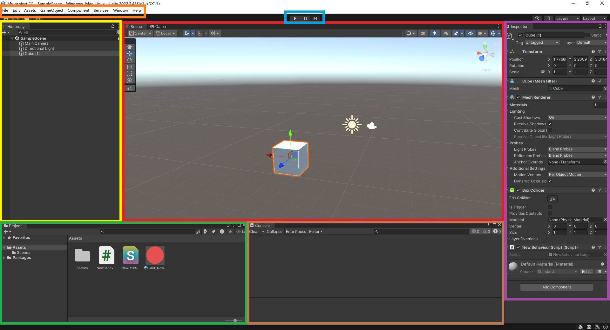
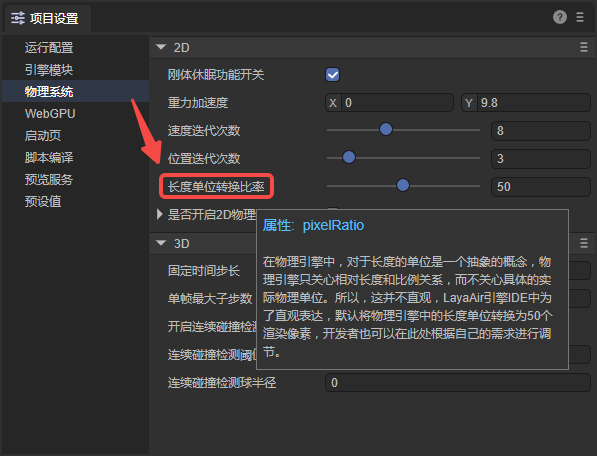

# 为Unity开发者准备的LayaAir3指南

> 编写此文档时使用的LayaAir-IDE版本为3.2.1

Unity是移动端的3D引擎龙头。LayaAir是小游戏与HTML5市场的主流3D引擎龙头。

相对于Unity，LayaAir引擎更注重全平台发布，不仅支持发布为移动端平台的Native安装包（安卓、iOS、鸿蒙Next），还支持发布为Windows平台的exe安装包，尤其是在HTML5网页平台，和小游戏平台（微信、抖音、淘宝、支付宝、OPPO、vivo、小米等）有着更为明显的优势。例如，引擎基础包体小，加载效率高，性能表现更优秀等。

越来越多市场重心倾斜于小游戏与网页市场的开发者纷纷开始转向LayaAir引擎，以获得更好的用户体验以及更全面的平台发布效果。并节省大量的研发成本。

因此，本篇文档为熟悉Unity的用户概述了LayaAir的主要技术差异，帮助Unity开发者快速入门LayaAir引擎。

下载LayaAir编辑器点击[这里](https://layaair.com/#/engineDownload)，克隆引擎源码点击[这里](https://github.com/layabox/LayaAir)。

## 一、概述

### 1.1 LayaAir-IDE

使用LayaAir进行开发，高度依赖LayaAir-IDE。其中，Unity编辑器（图1-1）和LayaAir-IDE（图1-2）各区域的功能对比如下，相同颜色表示相同的功能。

（图1-1 ）Unity编辑器

（图1-2）LayaAir3-IDE编辑器

### 1.2 面板术语简表

LayaAir支持[自定义布局](../IDE/layouts/readme.md)，可以拖放面板、弹出悬浮显示等。在使用时，还可以点击面板右上角的“？”图标，查看相关文档说明。下表左侧是Unity中常见术语，右侧则是对应的（或近似的）LayaAir-IDE的术语。

| Unity                | LayaAir                                                      |
| -------------------- | ------------------------------------------------------------ |
| Toolbar              | 菜单栏                                                       |
| Hierarchy            | [层级](../IDE/Hierarchy/readme.md)                           |
| Project              | [项目资源](../IDE/assets/readme.md) / [小部件](../../IDE/uiEditor/widgets/readme.md) |
| Play/Pause/Step      | [IDE中预览 / 浏览器中预览 / 移动端预览 / PC端预览 / 预览选项](../IDE/Game/readme.md) |
| Scene View/Game View | [场景](../IDE/shortcutKeyCombinations/readme.md) / [动画状态机](../../IDE/animationEditor/aniController/readme.md) / [预览运行](../IDE/Game/readme.md) / [项目设置](../IDE/projectSettings/readme.md) |
| Console              | 控制台 / [时间轴动画](../../IDE/animationEditor/timelineGUI/readme.md) |
| Inspector            | [属性设置](../IDE/Inspector/readme.md)                       |

### 1.3 项目和文件

LayaAir项目与Unity项目一样，也保存在专门的目录结构中，并且有自己的项目文件，扩展名为`.laya`。此文件的文件名就是项目名。

[项目目录](../IDE/projecFolders/readme.md)包含不同子目录，保存了游戏的资产内容和源代码，以及各种配置文件。

在LayaAir中，保存游戏资产的目录是 **Assets** 文件夹，源代码（TypeScript类）可以存放在 **src** 目录下，方便管理。

LayaAir里支持一些最常见的文件类型：

| 资产类型 | 支持的格式                          |
| -------- | ----------------------------------- |
| 3D       | .fbx、.obj、.gltf、.glb             |
| 纹理     | .png、.jpg、.tiff、.tif、.tga、.dds |
| 音频     | .mp3、.wav                          |
| 视频     | .mp4                                |
| 字体     | .ttf                                |

## 二、资产

### 2.1 常见资产类型

LayaAir中常见的资源如下：

| 文件的后缀         | 文件类型说明           |
| :----------------- | :--------------------- |
| **.ls**            | 场景文件。             |
| **.lh**            | 预制体文件。           |
| **.shader**        | 着色器文件。           |
| **.bps**           | 着色器蓝图文件。       |
| **.bpsf**          | 着色器蓝图函数文件。   |
| **.bp**            | 程序蓝图文件。         |
| **.lmat**          | 材质数据文件。         |
| **.bundledef**     | 脚本集定义文件。       |
| **.cubemap**       | 立方体纹理文件。       |
| **.rendertexture** | 渲染纹理文件。         |
| **.tex2darray**    | 2D纹理集文件。         |
| **.lavm**          | 动画遮罩文件。         |
| **.mcc**           | 2D动画状态机文件。     |
| **.mc**            | 2D动画数据文件。       |
| **.controller**    | 3D动画状态机文件。     |
| **.lani**          | 3D动画数据文件。       |
| **.atlascfg**      | 自动图集配置文件。     |
| **.lighting**      | 光照贴图烘焙配置文件。 |
| **.fnt**           | 位图字体文件。         |

### 2.2 从Unity导出资源到LayaAir

如果想将Unity项目中的资源导出到LayaAir中进行开发，需要使用“Unity资源导出插件”。

需要注意的是，这个插件并不支持导出所有类型的资源，具体的支持情况和使用方法请参考[《Unity资源导出插件》](../../3D/advanced/Unity/readme.md)文档。

## 三、开发流程

### 3.1 基础使用流程

开发者可以参考文档[《开发流程: Hello World》](../IDE/helloWorld/readme.md)了解整体的开发流程，其中包括了环境配置、创建项目、基本设置、运行调试等一些必会的操作。

### 3.2 UI编辑

在LayaAir中，如果是纯2D的项目，则直接删除场景中的”Scene3D“节点。开发者可以使用各种[小部件](../../IDE/uiEditor/widgets/readme.md)进行UI的编辑。

### 3.3 蓝图与TS

在LayaAir中开发游戏时，会编写脚本代码用于逻辑控制，脚本需要使用TypeScript语言进行开发。

而程序蓝图功能，让开发者既可以用连连看的方式来写一个脚本组件，也可以扩展内置的UI控件。

程序蓝图的使用可以参考[《程序蓝图》](../../IDE/ShaderBlueprint/blueprint/readme.md)文档。

### 3.4 动画编辑

与在Unity中创建和编辑动画类似，LayaAir提供了相关功能。

如果是创建一个动画文件，编辑自定义的动画，参考[《时间轴动画编辑详解》](../../IDE/animationEditor/timelineGUI/readme.md)文档。

如果已经有可用的动画文件，可以参考[《动画状态机详解》](../../IDE/animationEditor/aniController/readme.md)文档，学习如何使用动画文件。 

### 3.5 渲染

LayaAir和Unity都可以通过Shader实现丰富多彩的效果，使用方式都是将Shader应用到材质上，再将材质应用到物体上。

使用3D着色器参考[《自定义Shader3D》](../../3D/advanced/customShader/readme.md)文档，使用2D着色器参考[《自定义Shader2D》](../../2D/advanced/customShader/readme.md)文档。

### 3.6 物理系统

LayaAir内置的是Box2D的2D物理引擎，和Bullet、PhysX的3D物理引擎。

2D物理引擎的使用参考[《2D物理编辑》](../../IDE/physicsEditor/physics2D/readme.md)文档，3D物理引擎的使用参考[《3D物理编辑》](../../IDE/physicsEditor/physics3D/readme.md)文档。

当然，开发者也可以自己将其它第三方物理引擎内置到LayaAir引擎中，通过LayaAir引擎的物理接口，直接切换使用各种物理引擎，具体的流程可以参考[《自定义物理引擎库》](../../3D/advanced/customPhysicsEngine/readme.md)文档。

### 3.7 自定义插件

LayaAir-IDE支持用户自定义插件，开发更多的扩展功能。插件系统在Electron框架的基础上封装了大部分功能，插件开发者不需要学习相关的前端框架，只需要使用IDE提供的UI框架即可完成自定义的插件。

在LayaAir-IDE中开发插件可以参考[《插件开发说明》](../../IDE/layapackage/plug-in/readme.md)文档，导入使用LayaAir资源商店中的插件参考[《插件导入使用说明》](../../IDE/layapackage/pluginImport/readme.md)文档。

### 3.8 构建发布

LayaAir发布项目支持众多平台，使得项目可以一次开发，在各个平台上发布运行。同时，由于使用同一套代码，保证了游戏在各个平台上体验的一致性。

在构建发布时，先进行[通用](../../released/generalSetting/readme.md)的设置，然后再配置各个平台的选项。目前支持的平台有：[Web端](../../released/web/readme.md)、小游戏平台（[微信小游戏](../../released/miniGame/wechat/readme.md)、[抖音小游戏](../../released/miniGame/byteDance/readme.md)、[OPPO小游戏](../../released/miniGame/OPPO/readme.md)、[vivo小游戏](../../released/miniGame/vivo/readme.md)、[小米快游戏](../../released/miniGame/xiaomi/readme.md)、[支付宝小游戏](../../released/miniGame/alipaygame/readme.md)、[淘宝小游戏](../../released/miniGame/tbgame/readme.md)）、移动端（[Android](../../released/native/build_Tool/readme.md)、[iOS](../../released/native/build_Tool/readme.md)、[鸿蒙NEXT](../../released/native/build_Harmony/readme.md)）、PC端（[Windows](../../released/native/build_Windows/readme.md)）

## 四、LayaAir引擎生态

对于Unity开发者，LayaAir的教程、社区、资源商店能够帮助他们快速掌握LayaAir的使用。

### 4.1 教程

LayaAir官方提供了文档教程和视频教程。

除了本篇中提到的各模块的文档，点击左侧的目录可以看到更多详细的介绍。

视频教程请查看LayaAir的[B站主页](https://space.bilibili.com/1736809941)。

### 4.2 开发者社区

开发者进入[社区](https://ask.layaair.com/)后，可以在社区进行提问、分享经验、反馈BUG等。

### 4.3 资源商店

资源商店助力开发者在引擎生态中实现盈利，还能帮助他们以更高的效率和更低的成本开发产品。

LayaAir3[资源商店](https://store.layaair.com/)使得开发者可以在资源商店里添加免费或收费资源用于开发项目。还支持开发者认证成为个人或企业开发者，用以上传基于IDE开发的插件，或者美术资源、音效资源、开发工具、项目或功能DEMO源码等。

资源商店的上传流程可以查看[视频教程](https://www.bilibili.com/video/BV1oQ4y1E7j3/?share_source=copy_web&vd_source=f3dd357b10b2bb3c4e1be310439eb5cd)。

## 五、常见问题

**Windows在本地如何存在多个LayaAir-IDE版本？**

目前只能存在一个安装版，但是不影响绿色版。可以把当前版本复制出来到别的目录，把主程序（.exe）发送一个快捷方式到桌面，用绿色版。下次再安装就不会被覆盖这个版本了。

**手机扫码无法预览是怎么回事？**

如果安装了虚拟机等软件，可能会创建虚拟网卡，导致手机和PC不在同一局域网下。可以禁用虚拟机网卡，或者通过`ipconfig`命令查到IP后，在LayaAir-IDE的项目设置面板中，设置预览地址。

（图5-1）

**为什么IDE中显示的属性名字不是中文？**

如果想让属性名显示的也是中文，需要在菜单栏中的“编辑->首选项”面板中，勾选“允许翻译引擎符号”。

（图5-2）

**物理系统中的测量单位是什么？**

在LayaAir-IDE的项目设置面板中，可以自定义长度单位转换比率。

（图5-3）

**为什么有些模块无法使用？**

在LayaAir-IDE中，使用相应的模块需要在项目设置面板中进行勾选，否则在运行时会报找不到模块或方法的错误。

（图5-4）

**是否支持WebGPU？**

支持，需要在项目设置面板中进行勾选。

（图5-5）

