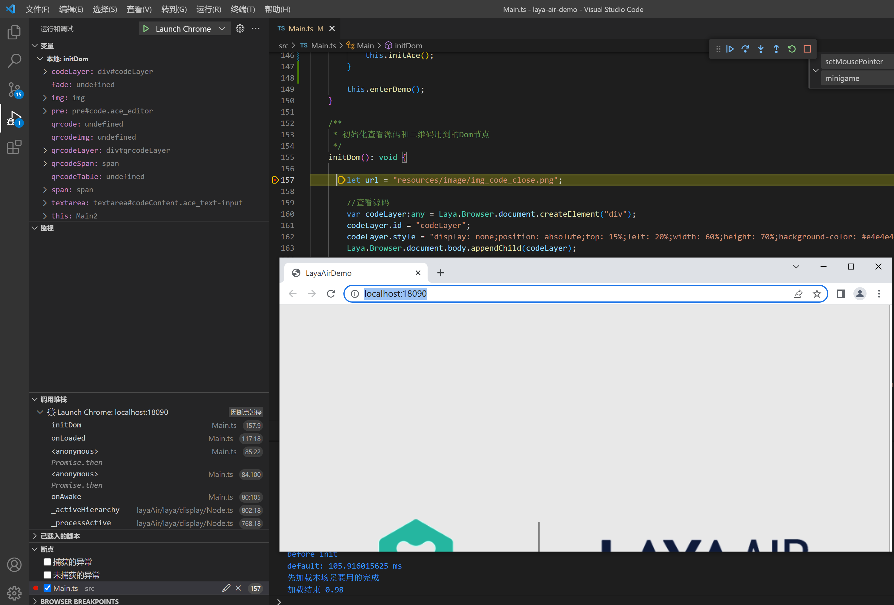

# VScode本地调试


通常我们可以使用Chrome的DevTools来断点调试，但是如果想在vsCode中直接对项目源码断点调试。我们可以通过本篇文档了解如何在vscode中直接调试。


## 一，创建launch.json

如图1-1所示，在项目目录的.vscode目录下，创建launch.json文件，用来配置vscode工程的启动参数

 

（图1-1）


## 二、添加配置参数

在launch.json文件中，直接拷贝下面的参数

```json
{
    "version": "0.2.0",
    "configurations": [
    {
        "name": "Launch Chrome",
        "request": "launch",
        "type": "chrome",
        "url": "http://localhost:18090",
        "webRoot": "${workspaceFolder}/src",
        "sourceMapPathOverrides": {
            "webpack:///src/*": "${webRoot}/*"
        }
    },
    {
        "name": "Attach to Chrome",
        "request": "attach",
        "type": "chrome",
        "port": 18090,
        "webRoot": "${workspaceRoot}",
        "urlFilter":"http://localhost:18090/*"
    }
    ]
}
```

其中，这里加了两个调试配置， “Launch Chrome” 是直接通过 vscode 打开 Chrome 浏览器，也就是本地调试，整个 Chrome 实例都是可以用 vscode 控制的，”Attach to Chrome” 是调试外部环境的 Chrome 实例，也就是说这个 Chrome 浏览器的窗口是你另外打开的。

注意：用Chrome运行项目时，上面配置信息中的端口号有可能会需要修改，下面将介绍如何查看


## 三、更改端口号

默认情况下，LayaAir 3.0项目都会使用18090作为默认端口，如果你想确定一下，可以通过点击IDE的“浏览器方式打开”可以看到端口号，如图3-1所示
 

（图3-1）


## 四、调试项目

在vsCode中，在ts代码中加入断点，并在vsCode菜单“运行”中点击“启动调试”或者按F5，就可以启动Chrome打开项目，进行断点调试，如图4-1所示



（图4-1）