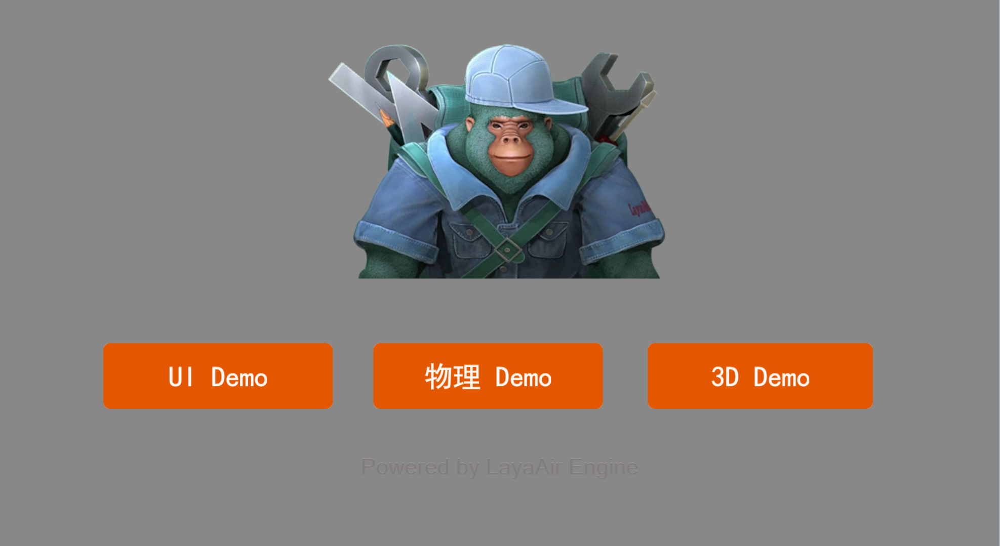
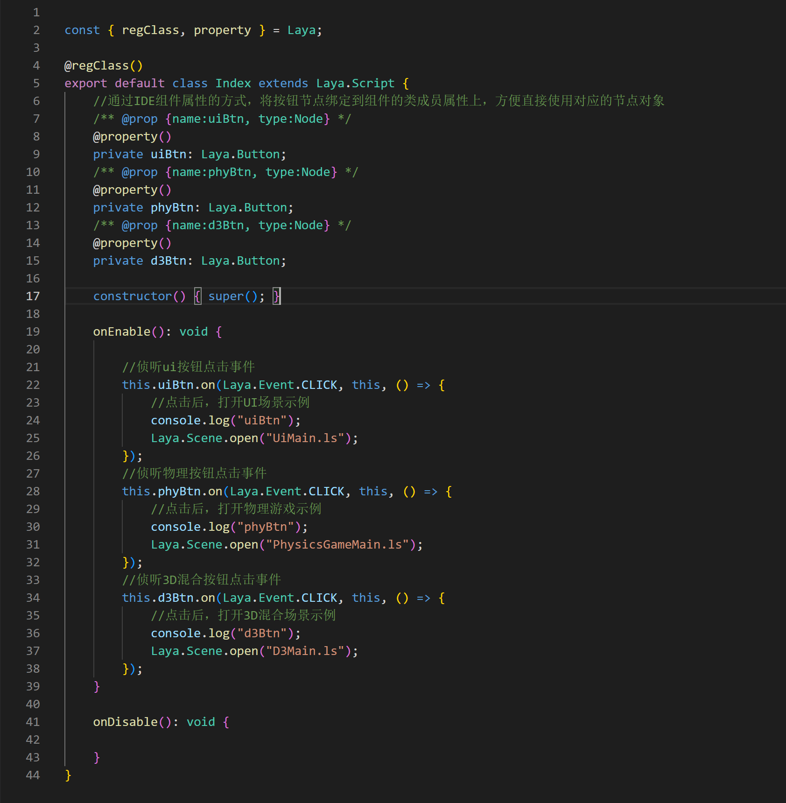
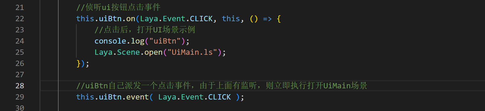
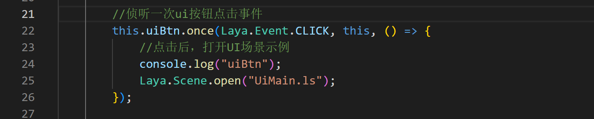
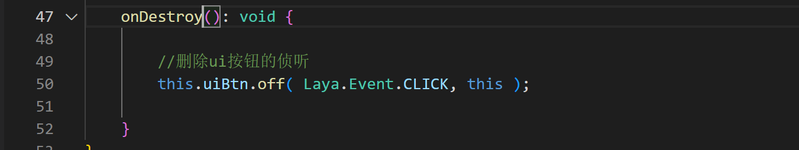
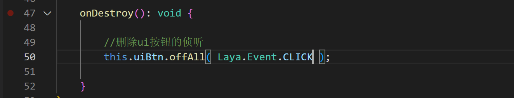
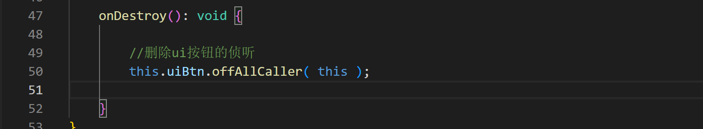
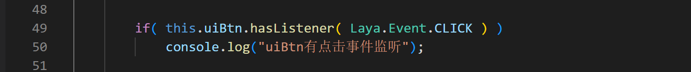
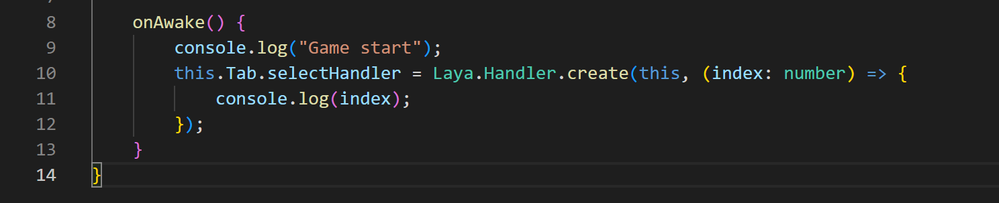
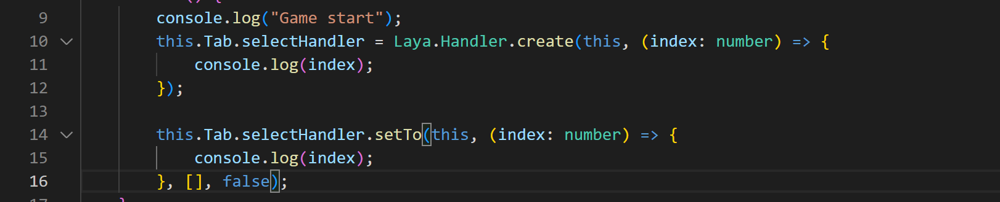

# 事件管理

### 什么是事件

事件Event指的是由系统事先设定的、能被对象识别和响应的动作，事件是指对象对于外部动作的响应，当对方发生了某个事件，就会执行于此事件对应的代码。比如用鼠标在一个对象上按下，这个对象预先设定了识别鼠标按下这个事件，就会执行对应的代码。

### 事件的分类

1，引擎内置的事件

2，自定义的事件

我们使用的事件可以是引擎内置的事件，也可以是自定义的事件，使用自定义类型的事件叫自定义事件。

### 引擎内置的事件

LayaAir3.0引擎中的事件主要包含三部分

`Laya.Event` 事件类型，事件接口，不同的事件类型都要实现此接口。
`Laya.EventDispatcher` 事件派发，每个传递过来的事件都会由它分发给特定的处理者。
`Laya.Handler` 事件处理，不同的处理器需实现该接口。

### 事件类型 `Laya.Event`

`Laya.Event` 是事件类型的集合，当事件发生时`Laya.Event`对象将作为参数传递给事件监听器。

 

例如 `Laya.Event.CLICK:string = "click"`

`CLICK` 静态属性用于定义事件对象的`type`类型属性值为单击事件。这个事件是由鼠标点击触发后系统派发的事件，开发者也可以调用event()方法派发这些事件，如何派发事件会在下面的内容涉及。

 

（图1）

点击3个按钮的任意一个，可以进入对应的功能。我们看看代码是如何使用`CLICK` 的

 

（图2）

### 事件派发 `Laya.EventDispatcher` 

事件派发`Laya.EventDispatcher`模式是监听模式的一种扩展，由事件驱动，每当有事件产生的时候，由事件分发器`Laya.EventDispatcher`分发给特定的事件处理器`Laya.Handler` 处理该事件。`Laya.EventDispatcher`表示事件发送者、事件捕获传递与分发。

`Laya.EventDispatcher` 事件分发器是可调度事件类的基类，比如作为基础节点的Node类继承自`Laya.EventDispatcher`类，只要继承此类就可以作为一个事件发送者发送事件给它的监听者。那么比如上面示例代码中的Button就是继承自`Laya.EventDispatcher`，可以用`.on`的方法来监听`CLICK`事件

`Laya.EventDispatcher` 具有如下功能：

1，事件派发 `event(type: string, data: any = null)`

用于派发事件，例如我们可以在代码中来派发一个`CLICK`事件

 

（图3）

2，持续事件侦听 `on(type: string, caller: any, listener: Function, args: any[] = null)`

用于向事件派发器注册指定类型的事件监听器，使事件监听器能够接收事件通知。图3中 `this.uiBtn.on` 是使用了持续监听

当监听到事件后，会调用作用域 `caller` 的回调方法 `listener`

3，单次事件侦听 `once(type: string, caller: any, listener: Function, args: any[] = null)`

用于向事件分发器注册指定类型的事件监听器，使事件监听器能够接收事件通知，事件监听器响应一次后会自动移除。

 

（图4）

例如上述按钮的监听方式也可以改为单次事件监听

4，删除指定的侦听 `off(type: string, caller: any, listener: Function, onceOnly: boolean = false)`

用于从事件分发器对象中删除监听器

 

（图5）

当这个场景删除销毁时，最好删除按钮的事件监听，保证释放掉所有引用

5，删除指定事件类型的所有侦听 `offAll(type: string = null)`

用于从事件分发器对象中删除指定事件类型的所有监听器

 

（图6） 

例如`uiBtn`按钮注册了多个事件的监听，我们可以用`offAll`方法来一次性删除所有监听 

6，删除指定作用域的所有侦听 `offAllCaller(caller: any)`

用于从事件分发器对象中删除指定作用域的所有监听器

 

（图7）

例如`uiBtn`按钮注册了多个事件的监听，我们可以用`offAllCaller`方法来一次性删除this作用域上的所有监听  

7，检查是否已注册侦听 `hasListener(type: string)`

用于判断事件分发器对象是否为特定类型的事件注册了监听器

 

（图8）

### 事件处理 `Laya.Handler`

当监听到事件后，用来处理事件的处理器

- 处理器的属性包括：

  1，`caller: Object | null;` 执行域

  2，`method: Function | null` 执行方法

  3，`args: any[] | null` 参数

  4，`once = false` 表示是否只执行一次。如果为true，回调后执行recover()进行回收，回收后会被再利用，默认为false

- 处理器的方法包括：

  1，`create()`	从对象池内创建一个Handler

`Laya.Handler` 事件处理器，推荐使用`Laya.Handler.create()`方法从对象池创建，以减少对象创建消耗。当创建的`Handler`对象不再使用后，可使用`Laya.Handler.recover()`将其回收到对象池，回收后不要再使用此对象，否则会导致不可预料的错误。需要注意的是，由于鼠标事件也使用了对象池，不正确的回收以及调用，可能会影响事件的执行。

 

`Tab`会监听用户点了某个标签，并从对象池创建一个处理器

​	2，`clear(): Handler`	清理对象引用

```typescript
this.Tab.selectHandler.clear();  
```

​	3，`recover(): void`	清理并回收到 Handler 对象池内

```typescript
this.Tab.selectHandler.recover();
```

​	4，`run(): any`	执行处理器

```typescript
this.Tab.selectHandler.run(); \\可以自行调用run()
```

​	5，`runWith(data: any): any` 	执行处理器，并携带额外数据

```typescript
this.Tab.selectHandler.runWith(1); \\可以自行调用runWith(),并传入参数1
```

​	6，`setTo(caller: any, method: Function | null, args: any[] | null, once = false): Handler `	设置此对象的指定属性值。

 

可以自行更改指定的属性


