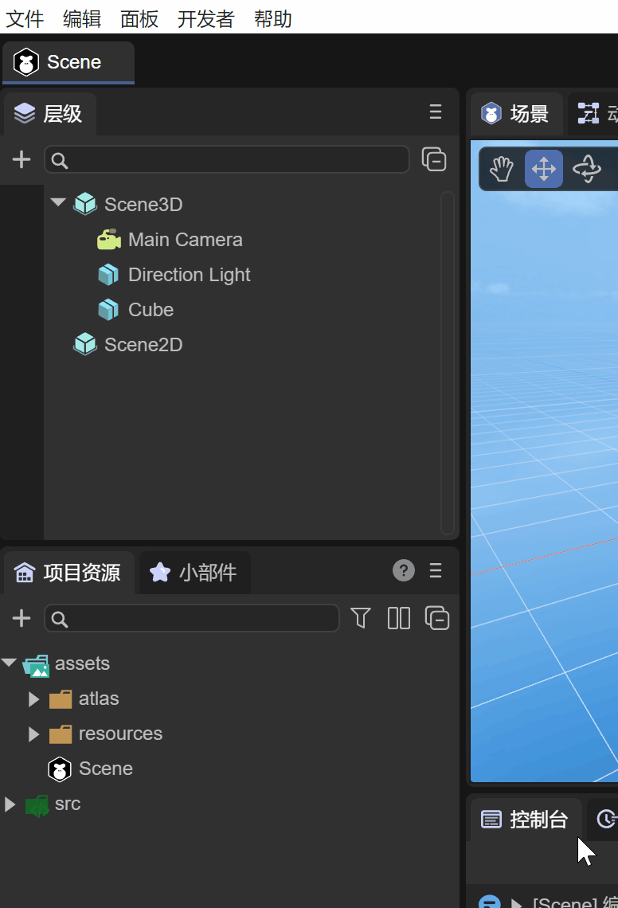
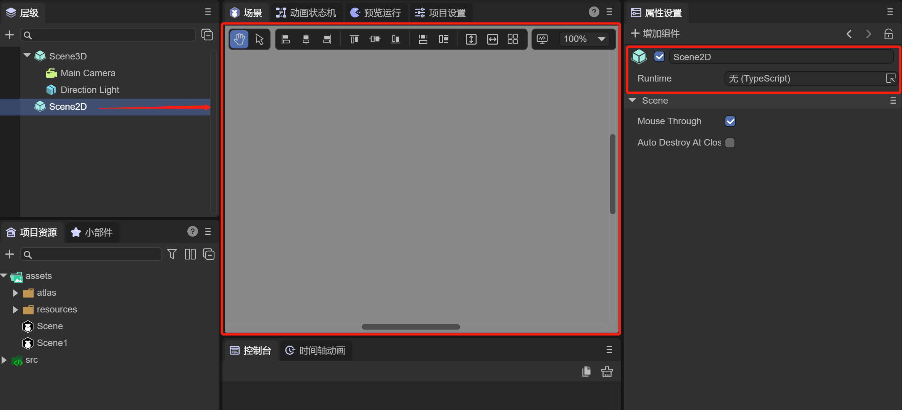
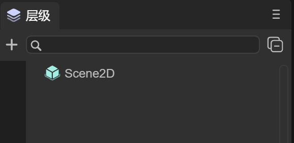
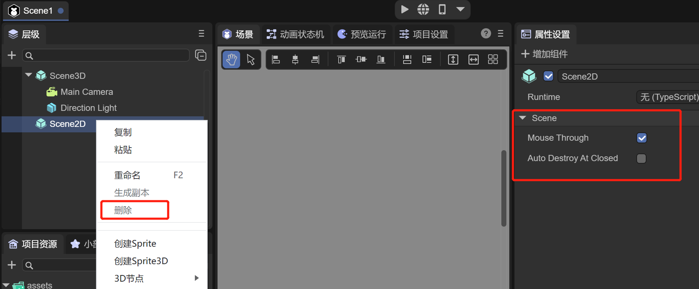
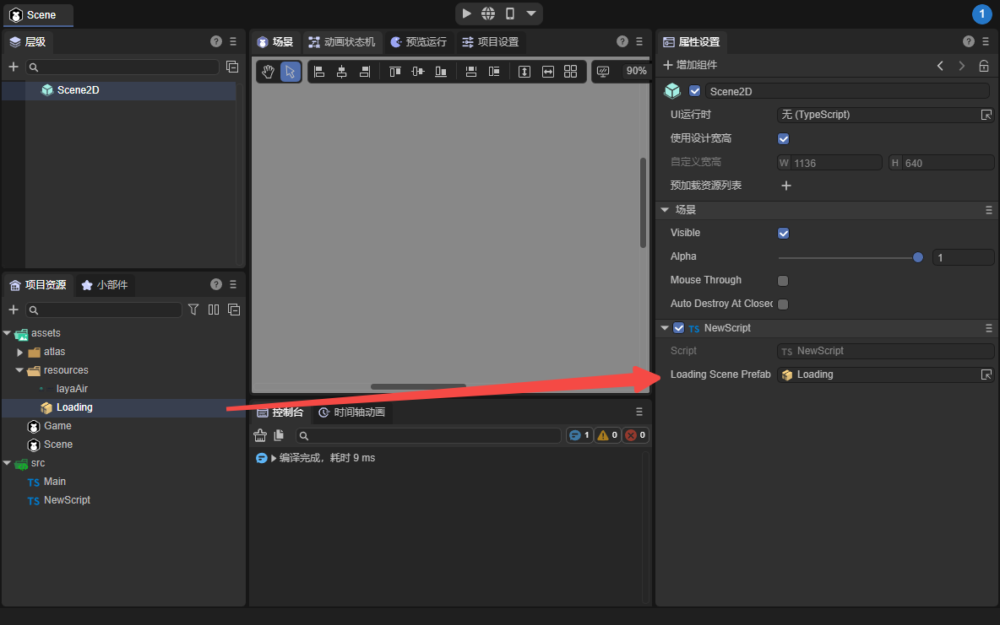

# 场景的管理

LayaAir3.0继续延用2.0开发思路为组件化，脚本化，场景管理开发，项目采用Scene管理方式，来管理场景，LayaAir 已经对Scene做了一系列方案，使得开发者无需考虑场景，关卡，页面的资源，内存管理，只需要单纯的调用接口，管理场景，其他的交给引擎去做，只需专注游戏逻辑开发即可。

在2.0项目开发中，无论是创建场景Scene，页面View，对话框Dialog，3d场景scene3d，文件类型和后缀都是scene。但是3.0中场景的划分有所区别，不再是统一的后缀scene方式。


## 一、IDE中的场景

### 1.1 新建场景

使用IDE新建一个3D项目，在IDE中创建一个场景，并保存，默认情况下，会在assets目录下，保存为Scene1.ls。如动图1-1所示

  

（动图1-1） 

通过资源管理器打开assets目录，可以看到Scene1的后缀是ls文件，这个场景ls文件，与2.0的区别是，它包括了Scene3D场景和Scene2D场景。如图1-2所示

 

（图1-2）

`Scene3D`：编辑3D场景的根节点，可以参考[《3D场景编辑的基础交互》](https://layaair.layabox.com/3.x/doc/IDE/sceneEditor/basic/readme.html)文档和[《3D场景环境设置》](https://layaair.layabox.com/3.x/doc/IDE/sceneEditor/environment/readme.html)文档来详细了解3D场景的操作和使用，如图1-3所示


（图1-3）

`Scene2D`：编辑2D场景的根节点，可以参考[《UI编辑器基础交互》](https://layaair.layabox.com/3.x/doc/IDE/uiEditor/basic/readme.html)文档和[《UI继承类》](https://layaair.layabox.com/3.x/doc/IDE/uiEditor/runtime/readme.html)文档来详细了解2D场景的操作和代码使用，如图1-4所示

 

（图1-4）

**但是重要的一点是，在同一个IDE创建的场景中，可以支持编辑3D场景和2D场景**


### 1.2 场景划分

如果针对某个场景，开发者只需要3D场景或者只需要2D场景，那怎么办呢？

- 对于只需要2D场景时，可以点击Scene3D，点击鼠标右键选择删除，那么剩下的场景就是一个单纯的Scene2D场景，如图1-5所示

 

（图1-5）

- 对于只需要3D场景时，可以发现Scene2D是不可以删掉的，如图1-6所示

 

（图1-6）

之所以无法删除，是因为Scene2D有一个很重要的属性 `Auto Destroy At Closed`

只要不编辑Scene2D，那么Scene2D只是带有属性的一个Sprite节点，不会对3D场景有任何影响


### 1.3 autoDestroyAtClosed属性

```typescript
/**场景被关闭后，是否自动销毁（销毁节点和使用到的资源），默认为false*/
autoDestroyAtClosed: boolean = false;
```

当勾选 `Auto Destroy At Closed`后，场景在关闭时会自动调用场景的销毁 Destroy() 方法


### 1.4 mouseThrough属性

另外一个属性是 `Mouse Through`，默认是勾选的

由于2D场景和3D场景都可以接收鼠标事件，这时可能会有冲突。

如果勾选 `Mouse Through`，Scene2D下脚本事件 onMouseClick 等将不会响应，会传递到Scene3D中

如果不勾选 `Mouse Through`，Scene2D下脚本事件 onMouseClick 等将会响应


## 二、代码中使用

### 2.1 场景类

```typescript
/**
 * 场景类，负责场景创建，加载，销毁等功能
 * 场景被从节点移除后，并不会被自动垃圾机制回收，如果想回收，请调用destroy接口，可以通过unDestroyedScenes属性查看还未被销毁的场景列表
 */
export class Scene extends Sprite {
    /**创建后，还未被销毁的场景列表，方便查看还未被销毁的场景列表，方便内存管理，本属性只读，请不要直接修改*/
    static readonly unDestroyedScenes: Set<Scene> = new Set();

    /**场景被关闭后，是否自动销毁（销毁节点和使用到的资源），默认为false*/
    autoDestroyAtClosed: boolean = false;
    _scene3D: any;
```

场景类首先继承自Sprite，也就是本身是一个Scene2D节点，编辑2D界面，实际上就是在它下面添加2D子节点组件。而属性 _scene3D是用来管理Scene3D的，这与IDE中对应的Scene2D和Scene3D相关联。


### 2.2 打开场景

#### 1，基础使用 

首先来看看场景类中最基础的使用方式，打开一个场景

```typescript
    /**
     * 加载并打开场景
     * @param	url			场景地址
     * @param	closeOther	是否关闭其他场景，默认为true（可选），【注意】被关闭的场景，如果没有设置autoDestroyAtClosed=true，则资源可能不能被回收，需要自己手动回收
     * @param	param		打开页面的参数，会传递给onOpened方法（可选）
     * @param	complete	打开完成回调，返回场景实例（可选）
     * @param	progress	加载进度回调（可选）
     */
    static open(url: string, closeOther: boolean = true, param: any = null, complete: Handler = null, progress: Handler = null): Promise<Scene> {
        Scene.showLoadingPage();
        return Scene.load(url, Handler.create(null, this._onSceneLoaded, [closeOther, complete, param]), progress);
    }
```

        

（图2-1）

例如创建名为 OpenScene 的场景，保存在assets路径下 uiDemo/page/OpenScene.ls，代码中可以这样打开场景，同时不关闭其它场景

```typescript
Laya.Scene.open("uiDemo/page/OpenScene.ls", false);
```

也可以打开一个预制体实现的UI，例如代码

```typescript
Laya.Scene.open("dailog.lh");
```

运行效果如动图所示

  

（动图）


#### 2，传参与接收参数

 

（图2-2）

例如创建名为Msg的场景，用于进入这个场景时会传递文字，可以使用如下代码：

```typescript
Laya.Scene.open("uiDemo/Msg.ls", false, { "text": "没有勾选项，请先勾选" });
```

通过 `Laya.Scene.open` 附带传递参数给下一个场景，数据为 `{ "text": "没有勾选项，请先勾选" }`

`onOpened`方法中会接受传入的参数，`param.text` 就是 "没有勾选项，请先勾选"，如图2-3所示

 

（图2-3）


### 2.3 关闭场景

#### 1，关闭指定的场景

```typescript
/**
 * 根据地址，关闭场景（包括对话框）
 * @param	url		场景地址
 * @param	name	如果name不为空，name必须相同才能关闭
 * @return	返回是否关闭成功，如果url找不到，则不成功
*/
static close(url: string, name?: string): boolean {
```

例如通过传入指定的地址参数，来关闭某一个场景

```typescript
Laya.Scene.close("uiDemo/page/OpenScene.ls");
```


#### 2，关闭当前场景

`this.close()`

 

（图2-4）

采用Runtime的方式，可以方便使用 `this.close()` 来关闭场景


#### 3，关闭所有场景（不包括dialog）

```typescript
/**
 * 关闭所有场景，不包括对话框，如果关闭对话框，请使用Dialog.closeAll()
 * 【注意】被关闭的场景，如果没有设置autoDestroyAtRemoved=true，则资源可能不能被回收，需要自己手动回收
*/
static closeAll(): void {
```


#### 4，关闭后调用的生命周期方法

```typescript
/**
 * 关闭完成后，调用此方法（如果有关闭动画，则在动画完成后执行）
 * @param type 如果是点击默认关闭按钮触发，则传入关闭按钮的名字(name)，否则为null。
 */
onClosed(type: string = null): void {
    //trace("onClosed");
}
```

 场景的Runtime类，当场景关闭的时候，会被调用 `onClosed()` 方法，可以在方法内实现各种资源的释放


### 2.4 场景的加载页面

 `Laya.Scene.setLoadingPage(loadPage: Sprite)`

设置loading界面，引擎会在调用open方法后，延迟打开loading界面，在页面添加到舞台之后，关闭loading界面

 `Laya.Scene.showLoadingPage(param: any = null, delay: number = 500)`

显示loading界面，打开参数，如果是scene，则会传递给 `onOpened` 方法，延迟打开时间，默认500毫秒

 `Laya.Scene.hideLoadingPage(delay: number = 500)` 

隐藏loading界面


例如要打开一个新场景，使用加载页面，那么就先定义一个脚本代码，加入可能拖入loading场景的Laya.Prefab属性，如图2-5所示

 

（图2-5）

在要打开的场景Scene.ls下，挂上脚本，并拖入Loading.ls场景


（图2-6）

这样就可以使用Loading场景作为加载场景了


### 2.5 销毁和垃圾回收

```typescript
/**
 * 根据地址，销毁场景（包括对话框）
 * @param	url		场景地址
 * @param	name	如果name不为空，name必须相同才能关闭
 * @return	返回是否销毁成功，如果url找不到，则不成功
*/
static destroy(url: string, name?: string): boolean {
```

```typescript
/**
 * 销毁当前没有被使用的资源,该函数会忽略lock=true的资源。
*/
static gc(): void {
    Resource.destroyUnusedResources();
}
```

代码使用如下：

```
Laya.Scene.destroy("scene.ls");
Laya.Scene.gc();
```

