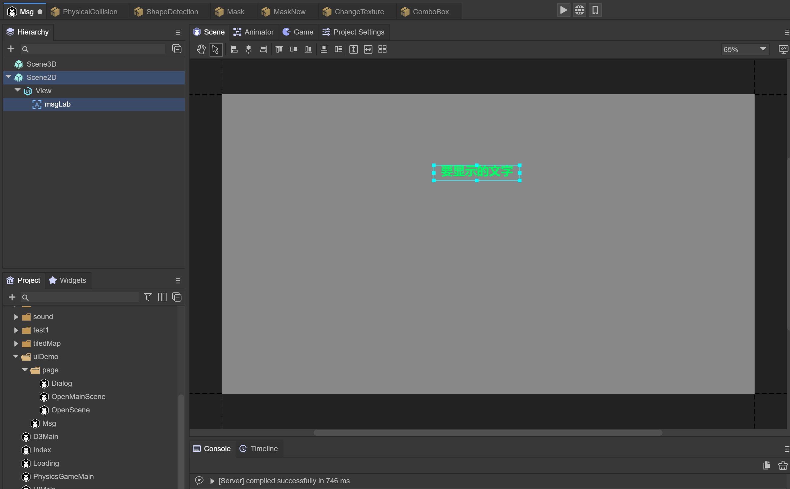

# 场景的管理

`Laya.Scene` 场景类，负责场景创建，加载，销毁等功能

场景被从节点移除后，并不会被自动垃圾机制回收，如果想回收，请调用destroy接口，可以通过 `unDestroyedScenes` 属性查看还未被销毁的场景列表

### 打开场景

#### 1，基础使用 

`Laya.Scene.open(url: string, closeOther: boolean = true, param: any = null, complete: Handler = null, progress: Handler = null)`

        

（图1）

创建名为 OpenScene 的场景，保存在路径下 uiDemo/page/OpenScene.ls

```typescript
Laya.Scene.open("uiDemo/page/OpenScene.ls", false);
```

代码中可以这样打开场景，同时不关闭其它场景


#### 2，传参与接收参数

 

（图2）

创建名为Msg的场景，用于进入这个场景时会传递文字

```typescript
Laya.Scene.open("uiDemo/Msg.ls", false, { "text": "没有勾选项，请先勾选" });
```

通过 `Laya.Scene.open` 附带传递参数给下一个场景，数据为 `{ "text": "没有勾选项，请先勾选" }`

 

（图3）

在Msg场景内，加入Runtime类，`onOpened`方法中会接受传入的参数，`param.text` 就是 "没有勾选项，请先勾选"

 

 （图4）*注意：场景打开完成后，调用此方法（如果有弹出动画，则在动画完成后执行）*


### 关闭场景

**1，关闭指定的场景** 

`Laya.Scene.close(url: string, name: string = "")`

根据地址，关闭场景（包括对话框）

**2，关闭当前场景** 

`this.close()`

 

（图5）

采用Runtime的方式，可以方便使用 `this.close()` 来关闭场景

**3，关闭所有场景（不包括dialog**）

`Laya.Scene.closeAll()`

**4，关闭后调用的生命周期方法**

 

（图6）

 场景的Runtime类，当场景关闭的时候，会被调用 `onClosed()` 方法，可以在方法内实现各种资源的释放

### 场景的加载页面

设置 `Laya.Scene.setLoadingPage(loadPage: Sprite)`

设置loading界面，引擎会在调用open方法后，延迟打开loading界面，在页面添加到舞台之后，关闭loading界面

显示 `Laya.Scene.showLoadingPage(param: any = null, delay: number = 500)`

显示loading界面，打开参数，如果是scene，则会传递给 `onOpened` 方法，延迟打开时间，默认500毫秒

隐藏 `Laya.Scene.hideLoadingPage(delay: number = 500)` 

 

（图7）

定义一个脚本代码，加入可能拖入loadingScene的Laya.Prefab属性

 

（图8）

在Scene.ls场景下，挂上脚本，并拖入Loading.ls场景


### 销毁

销毁当前没有被使用的资源 `Laya.Scene.gc()`

根据地址，销毁场景（包括dialog）`Laya.Scene.destroy(url: string, name: string = "")`

 

（图9）