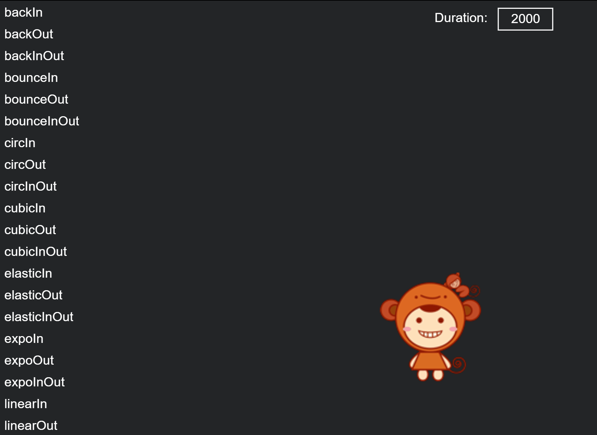
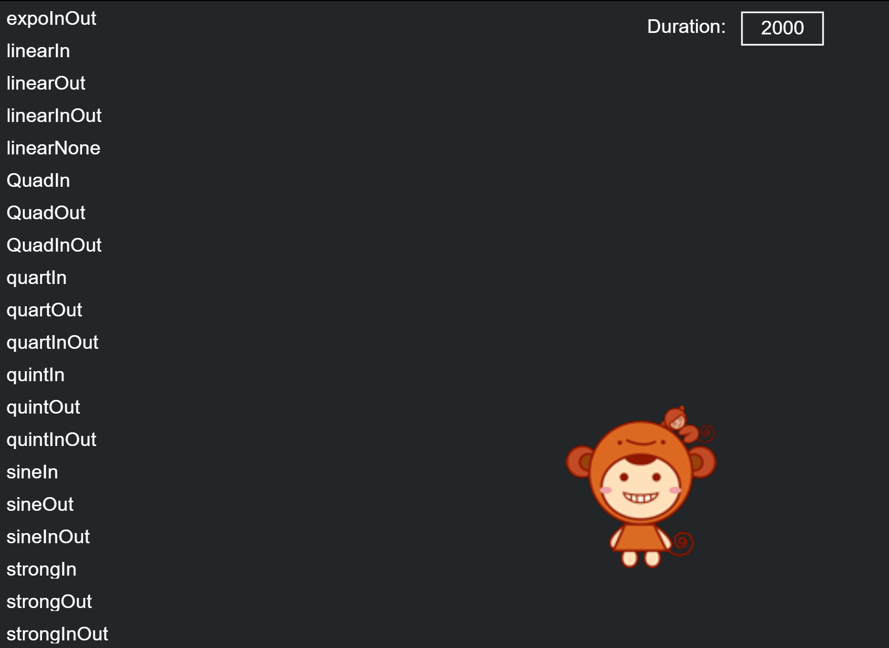
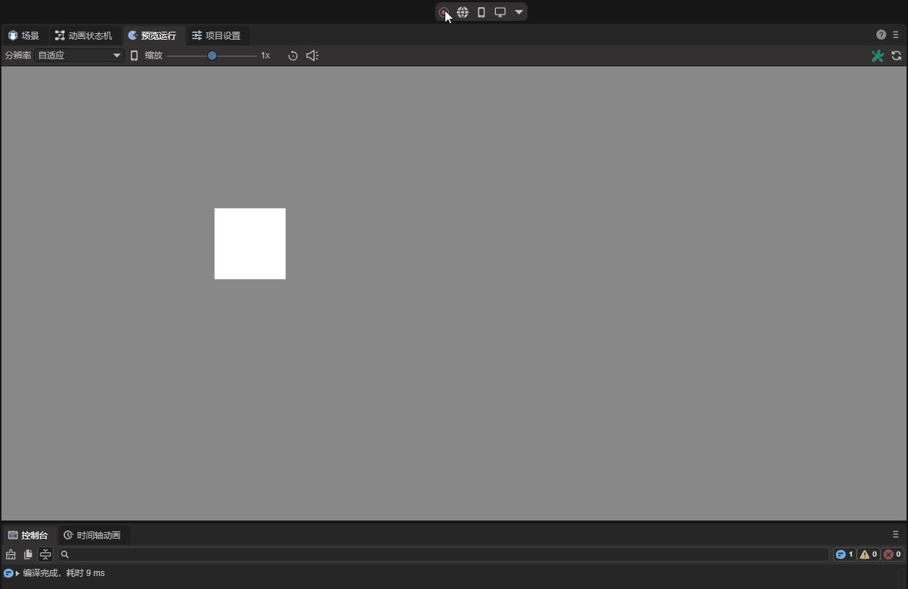
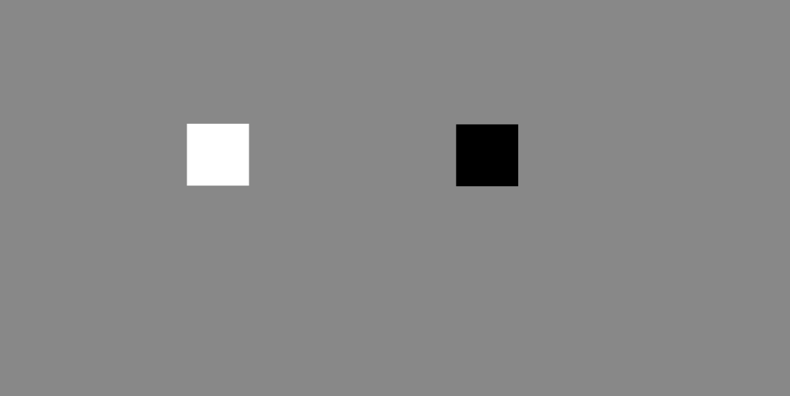
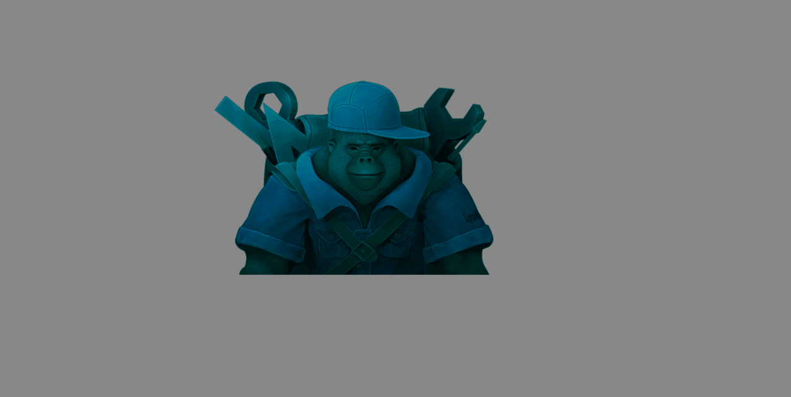
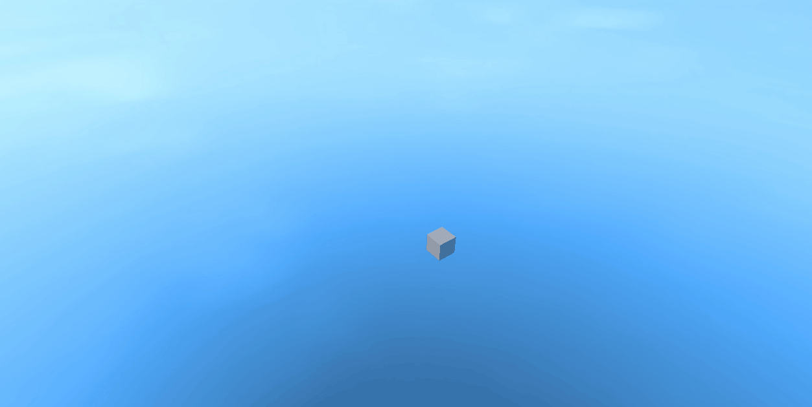

# 缓动

## 一、概述

缓动的最大用处就是应用在设计的运动表现上，可以结合物理、数学等原理真实地模拟显示生活中的运动现象，更加符合自然规律及人类认知，并使对象按照用户期望的行为交互，提供连续性体验。游戏开发中缓动动画比较常见，它是提升游戏UI体验的重要因素之一，例如对话框弹出、关闭，按钮的动效出现与消失，道具飞入背包等。

在历史的版本中，LayaAir引擎提供的Tween缓动类与Ease类来实现缓动的效果。

从LayaAir3.3版本开始，对Tween系统进行了全面优化升级。这些变化包括兼容常用用法如Laya.Tween.to和Laya.Tween.from，保持大部分API不变，但不再支持非主流的new Tween()用法。

缓动属性的类型支持不仅限于number，还新增了对Vector2、Vector3、Vector4、Color、Point以及字符串形式颜色值的支持。新的Tween对象设计得非常轻量，因此默认不重用，以避免因对象重用而引发的问题。此外，新系统不再使用Handler，从而杜绝了Handler重用带来的混乱。同时，改进后的Tween系统支持更丰富的选项以及串行和并行任务功能，为开发者提供更灵活强大的工具来实现理想的动画效果。


## 二、Ease


`Ease` 类定义了大量的缓动函数，以便实现 `Tween` 动画的具体缓动效果。LayaAir引擎的Tween类与Ease类结合使用，能基本满足游戏开发的缓动效果需求。

我们主要看以下几种缓动效果来理解：


### 2.1 匀速运动（linearIn）


比较少的情况下，会用匀速运动，会显得比较僵硬。不符合物理世界的规律，真实的运动状态下，物体的速度是会随着运动状态发生变化的。




### 2.2 加速运动（expoIn）


以零速率开始运动，然后在执行时加快运动速度。


### 2.3 快速加速运动（strongIn）


以零速率开始运动，然后在执行时加快运动速度




### 2.4 往后再反向（backIn）

开始时往后运动，然后反向朝目标移动


## 三、Tween

### 3.1 基础用法

在使用新版的Tween系统时，开发者不再需要在一个方法内传入复杂的参数，只需要根据程序设计的需求，向代码中添加或删除对应的方法即可。这种设计使代码简洁明了，并且易于修改。

下面，我们来看一段代码，这段代码提供了一个基础的Tween使用示例：

```typescript
   /**
    * 创建一个基础的缓动
    * aSprite为一个2D精灵
    */
	Laya.Tween.create(aSprite).duration(1000).to("x", 500).to("y", 300);
```

将这段代码添加在节点上的脚本中，运行查看效果，如图3-1-1所示：



（图3-1-1）

下面我们来讲解一下这段代码：

**1.** 使用`create()`方法创建一个缓动，此方法可以传入缓动的目标对象作为参数：

```typescript
        /**
         * @zh 创建一个新的缓动对象。使用返回的对象可以设置缓动的属性和其他选项。
         * 缓动会自动开始，无需额外API调用。如果不想tween被立刻执行，可以调用pause，后续再调用resume。
         * @param target 缓动的目标对象。可以为空。
         * @param lifecycleOwner 生命周期对象，当销毁时，缓动会自动停止。一般情况下，如果任务的目标对象有 destroyed 属性，则不需要设置此属性。如果任务的目标对象没有 destroyed 属性，则可以设置此属性。
         * @returns 返回一个Tween对象。
         */
         static create(target?: any, lifecycleOwner?: { destroyed: boolean; }): Tween;
```

如果缓动的目标对象不是具有生命周期的对象，例如一个Transform3D，我们可以额外传递一个参数告诉底层其关联的生命周期对象。


**2.** 使用`duration()`方法设置缓动的持续时间，单位为毫秒(ms)：

```typescript
        /**
         * @zh 设置当前任务的持续时间。
         * @param value 持续时间，以毫秒为单位。
         * @return Tween对象。
         */
        duration(value: number): this;
```


**3. **使用`to()`方法设置缓动的属性：

```typescript
        /**
         * @zh 缓动对象的属性到指定值。
         * 属性类型可以是数字，字符串，布尔值，Vector2, Vector3, Vector4, Color。如果是字符串，则隐含为颜色值。
         * @param propName 属性名称。
         * @param value 属性目标值。
         * @return Tween对象。
         */
        to(propName: string, value: any): this;
```

除了`to()`方法，还有`from()`和`go()`两种方法可以用于设置缓动的属性：

```typescript
        /**
         * @zh 缓动对象的属性从指定值到当前值。
         * @param propName 属性名称。
         * 属性类型可以是数字，字符串，布尔值，Vector2, Vector3, Vector4, Color。如果是字符串，则隐含为颜色值。
         * @param value 属性目标值。
         * @return Tween对象。
         */
        from(propName: string, value: any): this;

        /**
         * @zh 缓动对象的属性从指定的起始值到指定的结束值。
         * @param propName 属性名称。
         * 属性类型可以是数字，字符串，布尔值，Vector2, Vector3, Vector4, Color。如果是字符串，则隐含为颜色值。
         * @param startValue 属性起始值。
         * @param endValue 属性结束值。
         * @return Tween对象。
         */
        go<T>(propName: string, startValue: T, endValue: T): this;
```

Tween中还有许多方法用于实现各种效果，这里不再列举，有需要的开发者可以参考API文档。


### 3.2 生命周期

开发者可以调用缓动的`kill()`方法提前结束缓动。如果保存了`create()`方法返回的Tween对象，那直接调用Tween上的`kill()`方法即可。此外，也可以通过`Laya.Tween.getTween()`或是`Laya.Tween.getTweens()`方法查询对象关联的缓动。

```typescript
        //获取对象上的第一个缓动
		let tween = Tween.getTween(aSprite);
        if (tween != null)
            tween.kill();

		//获取对象上的全部缓动
        let tweens = Tween.getTweens(sSprite);
        tweens.forEach(tween => tween.kill());
```

`kill()`方法有一个可选参数complete，这个参数表示当调用`kill()`方法提前结束缓动时，是否需要将各个属性设置到最终状态。例如，如果有一个将x坐标缓动到500的缓动，当运行到x=250时调用`kill()`，则x坐标将保持在250；如果调用`kill(true)`，则x坐标将立刻设置为500。

调用`kill(true)`:


调用`kill(false)`:


如果缓动的目标对象被销毁，那么缓动会立刻结束。

```typescript
        Laya.Tween.create(aSprite).duration(1000).to("x", 100)

        aSprite.destroy(); //上面的缓动会立刻结束
```

如果缓动的目标对象不是具有生命周期的对象，例如一个Transform3D，我们可以额外传递一个参数告诉底层其关联的生命周期对象。

```typescript
        Laya.Tween.create(aCube.transform, aCube).duration(1000).to("x", 100)

        aCube.destroy(); //上面的缓动也会立刻结束
```


### 3.3 回调函数

Tween系统支持三种回调：启动回调、更新回调和结束回调。

**启动回调**：在缓动开始时，`onStart()`会被调用，需要注意的是，`delay()`方法会使缓动延迟开始执行，如果开发者调用了`delay()`方法，那缓动的启动回调会在延迟结束后执行。

```typescript
        Laya.Tween.create(aSprite).duration(1000).to("x", 100)
			//2000毫秒后，onStart方法才会被调用
			.delay(2000)
			//启动回调
            .onStart(tweener => {
            	//在启动回调中设置了x的终值为200
                tweener.endValue.set("x", 200);
            });
```

**更新回调**：在每次更新缓动时，`onUpdata()`会被调用。下面这段代码，开启了一个纯计算的缓动，具体效果将由开发者在onUpdate中实现。

```typescript
        //创建纯计算的缓动
		Laya.Tween.create(null).duration(1000).go(null, 0, 1000)
			//更新回调
            .onUpdate(tweener => {
                let value = tweener.get(null);
                //开发者可在此实现具体的效果
            });
```

**结束回调**：在缓动结束时，`then()`会被调用，开发者可以在其中设置相应的逻辑。需要注意的是，在调用`kill()`方法时，如果设置参数值为true，也会调用结束回调。

```typescript
        //创建缓动
		let tween = Laya.Tween.create(aSprite).duration(1000).to("x", 0)
			//结束回调
            .then(this.onComplete, this);

		//也会执行then()方法
        if (tween != null)
            tween.kill(true);
```


### 3.4 缓动函数

开发者可以通过`ease()`方法设置一个缓动函数，实现调整数值变化的速度。

```typescript
    //使用ease()方法时，可以传入缓动函数作为参数
	Laya.Tween.create(aSprite).duration(1000).to("x", 600).ease(Laya.Ease.cubicOut);


	//也可以直接用函数名称
	Laya.Tween.create(aSprite).duration(1000).to("x", 600).ease("cubicOut");
```

运行效果如图，可以看到物体以较快的速度开始运动，在运动过程中速度逐渐变慢：


有些缓动函数可能带有额外参数。开发者可以在`ease()`方法中传入这些参数。例如`elasticOut()`方法可以额外设置弹性的幅度和生效时间。

```typescript
    //为缓动函数传递参数
	Laya.Tween.create(aSprite).duration(1000).to("x", 600).ease("elasticOut", 5);
```


开发者也可以自定义缓动函数

```typescript
	//调用开发者自定义的缓动函数
	Laya.Tween.create(aSprite).duration(1000).to("x", 600).ease(myEase);

	//开发者自定义的缓动函数
	function myEase(t: number, b: number, c: number, d: number) : number {
    	//...
	}
```


### 3.5 串行和并行

本节主要介绍两个方法：`chain()`和`parallel()`。

`chain()`：当开发者想要顺序执行多个缓动效果时，就可以使用`chain()`方法，此方法会将多个缓动效果串行在一起，并依次执行这些缓动效果。例如，开发者想要将aSprite的x在1秒内移动到600，然后在两秒内将y移动到400，就可以这样设置代码：

```typescript
	//将两个缓动效果串行在一起
	Laya.Tween.create(aSprite).duration(1000).to("x", 600)
    	.chain().duration(2000).to("y", 400);
```

运行效果如图： 


`chain()`方法会默认继承前一个缓动的目标对象，开发者也可以自行更改目标对象，例如：

```typescript
	//在1秒内将aSprite的x移动到600，然后再在2秒内将bSprite的y移动到400
	Laya.Tween.create(aSprite).duration(1000).to("x", 600)
    	.chain(bSprite).duration(2000).to("y", 400);
```




`parallel()`：一般来说，我们如果需要同时缓动多个属性，只需连续调用`to()`、`from()`或`go()`即可。但是，这些方法都共享同一个目标对象、持续时间、缓动函数等选项，比如我们调用`duration(1000)`，那所有缓动的持续时间都是一秒；如果此时我们希望一个缓动的持续时间为2秒，就需要使用`parallel()`方法。`parallel()`方法可以让多个缓动并行执行，且每个缓动可以设置不同的选项。示例代码如下：

```typescript
        //这段代码使用了串行与并行的方法
        Laya.Tween.create(aSprite).duration(1000).to("x", 600)
            .parallel().duration(2000).to("y", 400)
            .chain().duration(1000).to("visible", false);
```

上例实现了在1秒内移动x到600，并且同时在2秒内移到y到400。这两个缓动完成后，延迟1秒执行visible = false。


注意，使用`kill()`方法将终止整个缓动，包括所有串行和并行任务。如果需要终止单一任务，可以使用findTweener获得其中一段任务对象。

```typescript
        //创建缓动，并为缓动添加名称
		Laya.Tween.create(aSprite).name("first").duration(1000).to("x", 100)
            .chain().duration(2000).to("y", 100);

		//根据名称找到缓动
        let tweener = Laya.Tween.findTweener("first");
        if (tweener != null) //需要判空，因为如果这段缓动已经执行完毕，会返回null
            tweener.kill(); //会终止这段缓动，并立刻执行下一段
```


### 3.6 自定义插值函数

开发者可以通过`interp()`方法设置自定义的插值函数。引擎内置了几个特别的插值函数实现了一些常见的需求。

#### 3.6.1 震动效果

使用`Laya.Tween.shake`这个插值函数可以实现将物体在一段时间内震动的效果。震动效果不使用终值，所以`to()`方法里的x的终值参数传入0即可。

```typescript
        //创建缓动
        Laya.Tween.create(aSprite).duration(1000).to("x", 0)
            //通过插值函数实现震动效果
            .interp(Laya.Tween.shake, 10);
```

运行效果如图：


#### 3.6.2 分离颜色通道插值

当对整数类型或者字符串类型的颜色色值进行缓动时，可能得不到需要的效果，例如从0x000000到0xFF0000，并不会和预想的那样红色逐渐加深，而是中间会出现各种颜色，如图所示：




这种情况下，就需要分离颜色通道，针对每个通道进行计算；引擎中内置的插值函数`Laya.Tween.sperateChannel`可以实现这个需求。

```typescript
        //创建缓动
        Laya.Tween.create(aImage).duration(1000).go("color", "#000000", "#FF0000")
            //通过插值函数分离颜色通道
            .interp(Laya.Tween.seperateChannel);
```

运行效果如图：


#### 3.6.3 曲线路径

开发者可以通过引擎内置的插值函数`Laya.Tween.useCurvePath`来实现让物体沿路径运动的功能。路径可以由一段或多段直线、二次贝塞尔曲线、三次贝塞尔曲线和B样条曲线所组成。当使用这个插值时，to/from/go传入的初值和终值都会忽略，坐标值完全从曲线上取样。

```typescript
        //创建一条路径
		let path = new Laya.CurvePath();
        path.create(
            //设置路径上的点
            Laya.PathPoint.create(0, 0, 0),
            Laya.PathPoint.create(-6, 1, 1),
            Laya.PathPoint.create(3, 3, 3),
        );

		//创建缓动
        Laya.Tween.create(aCube.transform, aCube)
            .duration(2000)
            .to("localPosition", Laya.Vector3.ZERO)
			//设置插值函数，让物体沿曲线路径行动
            .interp(Laya.Tween.useCurvePath, path)
```

运行效果如图：




