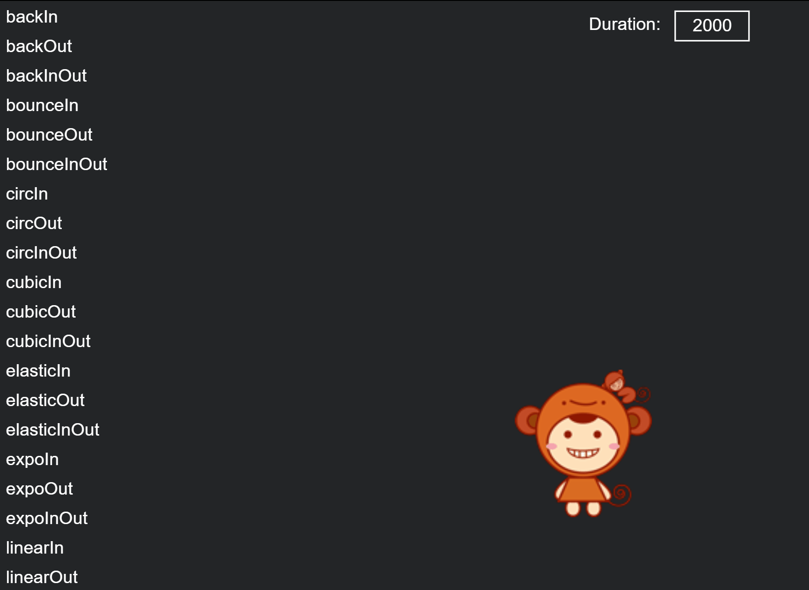
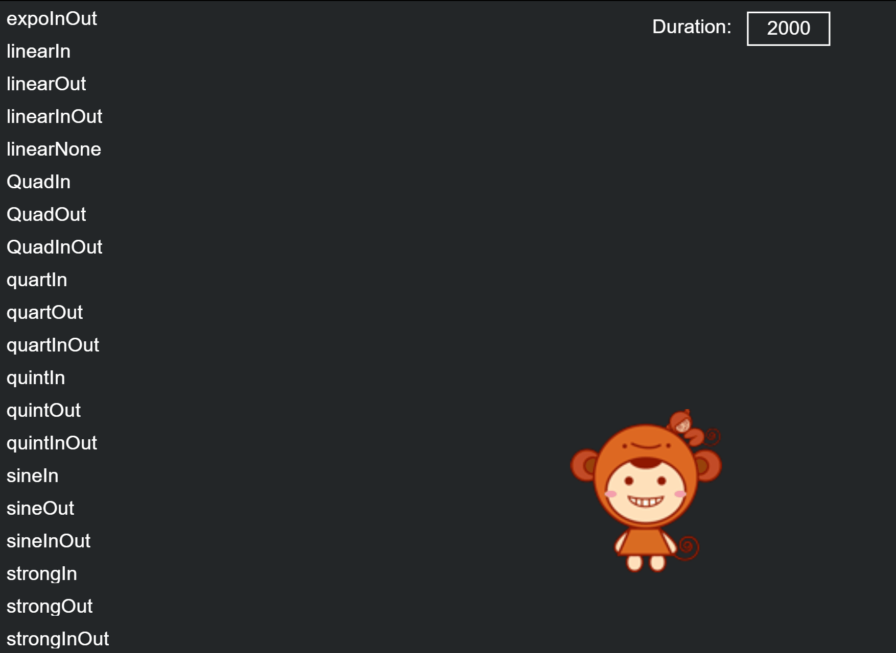

# 缓动


## 一、概述

缓动的最大用处就是应用在设计的运动表现上，可以结合物理、数学等原理真实地模拟显示生活中的运动现象，更加符合自然规律及人类认知，并使对象按照用户期望的行为交互，提供连续性体验。游戏开发中缓动动画比较常见，它是提升游戏UI体验的重要因素之一，例如对话框弹出、关闭，按钮的动效出现与消失，道具飞入背包等，我们可以直接使用LayaAir引擎提供的Tween缓动类与Ease类来快捷实现。

接下来我们分别介绍 Tween 和 Ease 类


## 二、Ease

`Ease` 类定义了大量的缓动函数，以便实现 `Tween` 动画的具体缓动效果。LayaAir引擎的Tween类与Ease类结合使用，能基本满足游戏开发的缓动效果需求。

我们主要看以下几种缓动效果来理解：


### 2.1 匀速运动（linearIn）

比较少的情况下，会用匀速运动，会显得比较僵硬。不符合物理世界的规律，真实的运动状态下，物体的速度是会随着运动状态发生变化的。

 


### 2.2 加速运动（expoIn）

以零速率开始运动，然后在执行时加快运动速度。

 


### 2.3 快速加速运动（strongIn）

以零速率开始运动，然后在执行时加快运动速度

 


### 2.4 往后再反向（backIn）

开始时往后运动，然后反向朝目标移动

  

更多的效果可以通过示例查看


## 三、Tween

`Tween` 缓动类用以实现目标对象属性的缓动，例如目标对象的x或y轴的缓动距离等目标值设置，以及缓动开始、停止、清理等设置。


### 3.1 常用API介绍

缓动类 `Tween` 提供了较多的方法，而我们常用的是两种，分别为`from()`与`to()`方法，这两个方法的参数设置完全一样，但效果有所不同，from是从缓动目标点向初始位置产生运动（从缓动目标位置来），to是从初始位置向缓动目标的位置产生运动（到缓动目标位置去），后面会结合实例详细说明，开发者可以先了解一下这两个方法的基础说明：

```
    /**
     * 从props属性，缓动到当前状态。
     * @param	target 目标对象(即将更改属性值的对象)。
     * @param	props 变化的属性列表，比如{x:100,y:20,ease:Ease.backOut,complete:Handler.create(this,onComplete),update:new Handler(this,onComplete)}。
     * @param	duration 花费的时间，单位毫秒。
     * @param	ease 缓动类型，默认为匀速运动。
     * @param	complete 结束回调函数。
     * @param	delay 延迟执行时间。
     * @param	coverBefore 是否覆盖之前的缓动。
     * @param	autoRecover 是否自动回收，默认为true，缓动结束之后自动回收到对象池。
     * @return	返回Tween对象。
     */
    static from(target: any, props: any, duration: number, ease: Function = null, complete: Handler = null, delay: number = 0, coverBefore: boolean = false, autoRecover: boolean = true): Tween {
        return Pool.getItemByClass("tween", Tween)._create(target, props, duration, ease, complete, delay, coverBefore, false, autoRecover, true);
    }
    
    /**
     * 缓动对象的props属性到目标值。
     * @param	target 目标对象(即将更改属性值的对象)。
     * @param	props 变化的属性列表，比如{x:100,y:20,ease:Ease.backOut,complete:Handler.create(this,onComplete),update:new Handler(this,onComplete)}。
     * @param	duration 花费的时间，单位毫秒。
     * @param	ease 缓动类型，默认为匀速运动。
     * @param	complete 结束回调函数。
     * @param	delay 延迟执行时间。
     * @param	coverBefore 是否覆盖之前的缓动。
     * @param	autoRecover 是否自动回收，默认为true，缓动结束之后自动回收到对象池。
     * @return	返回Tween对象。
     */
    static to(target: any, props: any, duration: number, ease: Function|null = null, complete: Handler|null = null, delay: number = 0, coverBefore: boolean = false, autoRecover: boolean = true): Tween {
        return Pool.getItemByClass("tween", Tween)._create(target, props, duration, ease, complete, delay, coverBefore, true, autoRecover, true);
    }

```


### 3.2 参数说明

`to()`和`from() `这两种方法都支持静态方法，因此我们不需要去实例化Tween类就可以使用。

`to()`和`from()`它们的参数理解起来都较简单，这里我们重点强调一下props、duration、ease、complete、delay参数。

**props**

props 是目标对象需要改变，从而产生缓动效果的属性。对象的公共属性都可以进行设置，比如最常用的x、y位置属性，及alpha透明属性，以及旋转、轴心、大小等其他属性。属性的设置是采用对象数据的形式，比如 {x:100,y:20,ease:Ease.backOut,complete:Handler.create(this,onComplete),update:new Handler(this,onComplete)}

**duration**

duration 是执行缓动效果花费的时间，单位是豪秒，时间越多，缓动效果越慢。

**ease**

ease 为缓动类型，它可以使用Ease类下定义的各种函数来改变动画的变化过程。

**complete**

complete 为缓动完成后回调方法。比如按钮出现的缓动，在缓动过程中我们不能让用户点击，这时就可以用到缓动完成回调，在回调函数中再加入按钮监听。

**delay**

delay 是延迟执行的时间，稍后会通过实例中的延迟执行制作出文本缓动的波动效果。


### 3.3 缓动实例

下列代码中，我们先通过 Tween.from() 方法，实现 “LayaBox” 字符的文本缓动动画。

`from()` ：

```
    //创建缓动文本
    private createTween():void{
        //"LayaBox字符串总宽度"
        var w:number = 800;
        //文本创建的起始位置(>>在此使用右移运算符，相当于/2 用>>效率更高)
        var offsetX:number = Laya.stage.width - w >> 1;
        //显示的字符串
        var demoString:string = "LayaBox";
        var letterText:Laya.Text;
        //根据"LayaBox"字符串长度创建单个字符，并对每个单独字符使用缓动动画
        for(var i:number = 0,len:number = demoString.length;i<len;++i){
            //从"LayaBox"字符串中逐个提出单个字符创建文本
            letterText = this.createLetter(demoString.charAt(i));
            letterText.x = w/len*i+offsetX;
            //文本的初始y属性
            letterText.y = 300;
            //对象letterText属性y从缓动目标的100向初始的y属性300运动，每次执行缓动效果需要3000毫秒，缓类型采用elasticOut函数方式，延迟间隔i*100毫秒执行。
            Laya.Tween.from(letterText,{y:100},3000,Laya.Ease.elasticOut,null,i*1000);
        }
    }
    //创建单个字符文本，并加载到舞台
    private createLetter(char:string):Laya.Text{
        var letter:Laya.Text = new Laya.Text();
        letter.text = char;
        letter.color = "#ffffff";
        letter.font = "Impact";
        letter.fontSize = 180;
        this.owner.addChild(letter);
        return letter;
    }
```

 

（动图3-1）

结合实例代码，然后通过动图2-1的运动效果，我们可以看出，文本”Layabox”在初始位置（*y轴300*）出现之后，瞬间消失，然后从缓动方法 Tween.from 设置的目标`{ y : 100 }`（*y轴100*）向初始位置发生运动（从上到下的缓动效果）。

由于这个方法是先在初始位置显示，再瞬间消失从缓动的目标位置向初始位置运动。会产生一个视觉差，感觉更像反弹效果。所以我们继续了解 Tween.to 的效果，开发者可以根据需要选择到底使用哪种缓动方法。

`to()` ：我们可以继续采用上面的实例，只是将 Tween.from 改变为 Tween.to

```
//对象letterText属性y从初始的y属性向缓动目标的y的100属性运动，缓动效果需要3000毫秒，缓类型采用elasticOut函数方式，延迟间隔1000毫秒执行。
Laya.Tween.to( letterText , {y:100}, 3000, Laya.Ease.elasticOut, null, 1000 );
```

运行效果如动图3-2所示

 

（动图3-2）


### 3.4 理解Props参数

无论 Tween.from 还是 Tween.to，第二个参数Props（属性）可以影响缓动效果的运动轨迹等。

由于 Tween.from 与 Tween.to 的缓动效果本来就是相反的，所以 Tween.from 有一种向下落的感觉，而动图3-2的 Tween.to 有一种向上弹起的感觉。

如果我们将初始y的属性值 与缓动目标的y属性值对调一下，再来看看，用 Tween.to 实现的落下效果与 Tween.from 有什么不同。

继续延续之前的示例，修改代码如下。

```
//文本的初始y属性
letterText.y = 100;
//Laya.Tween.from(letterText,{y:100},3000,Laya.Ease.elasticOut,null,i*1000);//注释本行改为将Laya.Tween.from改变为Laya.Tween.to
Laya.Tween.to(letterText, { y : 300 }, 3000, Laya.Ease.elasticOut, null, i * 1000);
```

运行效果如动图3-3所示

 

（动图3-3）

由于动图3-3中，是初始y属性在100，Tween.to 的效果是从初始属性向缓动目标的属性进行运动。所以缓动目标的y属性在300时，就会产生出从初始y轴的100向y轴300进行运动，也就是落下的效果。与 Tween.from 实现落下效果会有明显的不同。所以开发者在运用时要注意两者的效果区别。


### 3.5 理解缓动持续时间（*duration*）与延迟执行（*delay*）参数

继续沿用前面的示例，我们将第三个参数duration修改为1000毫秒，将第六个参数delay修改为100毫秒，效果如动图5所示。无论是缓动的速度还是下落间隔的速度都会产生较明显的变化。因此可以看出，通过持续时间或延迟时间的调整也可以实现不同的动画效果目标。这里不再深入，开发者可以自行调节体验。

 

（动图3-4）

动图3-4效果所修改代码如下：

```
//文本的初始y属性
letterText.y = 100;
//Laya.Tween.from(letterText,{y:100},3000,Laya.Ease.elasticOut,null,i*1000);//注释本行改为将Laya.Tween.from改变为Laya.Tween.to
Laya.Tween.to(letterText, { y : 300 }, 1000, Laya.Ease.elasticOut, null, i * 100);
```


### 3.6 理解ease参数

第四个参数ease对应`laya.utils.Ease`类的各个方法，本节中我们改为`Ease.bounceIn`效果，如动图3-5所示。

 

（动图3-5）

动图3-5效果所修改代码如下：

```
//文本的初始y属性
letterText.y = 100;
//Laya.Tween.from(letterText,{y:100},3000,Laya.Ease.elasticOut,null,i*1000);//注释本行改为将Laya.Tween.from改变为Laya.Tween.to
Laya.Tween.to(letterText, { y : 300 }, 1000, Laya.Ease.bounceIn, null, i * 100);
```


### 3.7 理解完成回调（*complete*）参数

第五个参数complete用于执行完缓动效果后的回调。我们继续沿用之前的示例，在缓动结束后，增加一个让字体颜色变红的回调方法。

使用示例：

```
Laya.Tween.to(letterText, { y : 300 }, 1000, Laya.Ease.bounceIn, Laya.Handler.create(this,this.changeColor,[letterText]), i * 100);
```

增加的 changeColor 方法如下

```
    /**
     * 缓动完成后的回调方法
     * txt  缓动对象
     */    
    private changeColor(txt:Laya.Text):void{
        //将文本字体改变成红色
        txt.color = "#ff0000";
    }
```

代码运行效果如动图3-6所示

 

（动图3-6）


### 3.8 通过Props参数实现过程回调

complete（*完成回调*）参数，不仅可以在第五个参数中实现，也可以在第二个参数Props中实现。但是，为了代码更加清晰易读，我们并不建议将完成回调放在Props中实现。

这里我们只介绍一下在Props中实现update更新回调。也就是说如果我们想在缓动过程中就执行回调方法，那第五个参数中是不可能实现的，因为第五个参数一定是缓动结束后才执行。所以，我们继续沿用之前的示例，在Props参数里增加一个字体颜色的更新回调。

使用示例：

```
/**
* 对象letterText属性y从100缓动到300的位置，每一帧都通过回调方法更新颜色
* 用1000毫秒完成缓动效果
* 缓动类型采用bounceIn
* 单个字符的缓动效果结束后，使用changeColor回调函数将字符改变为红色
* 延迟间隔i*100毫秒执行
*/
Laya.Tween.to(letterText, { y : 300, update: new Laya.Handler(this, this.updateColor,[letterText])}, 1000, Laya.Ease.bounceIn, Laya.Handler.create(this,this.changeColor,[letterText]), i * 100);
```

增加的 changeColor 方法如下

```
    /**
     * 缓动进行时的回调更新方法
     * txt  缓动对象
     */
    private updateColor(txt:Laya.Text):void{
        var c:number = Math.floor(Math.random()*3);
        switch (c) {
            case 0:
                txt.color = "#eee000";
                break;
            case 1:
                txt.color = "#ffffff";
                break;
            case 2:
                txt.color = "#ff0000";
                break;
            default:
                txt.color = "#eee000";
                break;
        }
    }
```

代码运行时，由于update回调是每一帧都在执行，所以在缓动的过程中，有一种闪光字的效果。如动图3-7所示

 

（动图3-7）

