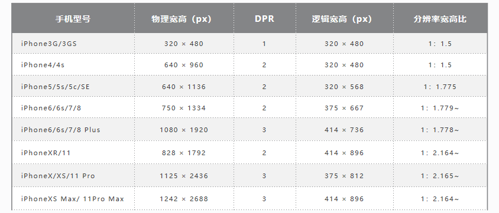
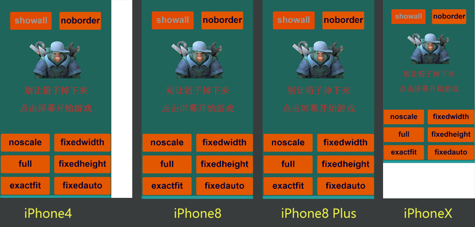

## LayaAir屏幕适配及有效抗锯齿

> Author: Charley  

有的时候看到一些3D游戏锯齿感特别明显，与一些开发者沟通后发现，其实很多人并不清楚怎么能去掉明显的锯齿感，而这并不是只有新开发者才遇到的问题，很多游戏研发经验丰富的开发者，甚至是使用LayaAir引擎开发了很多游戏的开发者也会不清楚。另外，最近也遇到有开发者想了解刘海屏如何适配，所以通过本篇文章全面介绍一下。

为了兼顾新手开发者来理解这个事，本篇从基础概念入手，详细介绍LayaAir引擎的各个屏幕适配缩放模式，刘海屏适配思路，以及如何有效的抗锯齿。

## 一、基础概念

以下基础概念非常重要，会影响到后面引擎适配原理的理解，请大家认真阅读。

### 1.1 物理分辨率

物理分辨率简单理解就是硬件所支持的分辨率，以像素（px）为单位，所以我们称这个硬件上的每一个像素点为物理像素，也叫设备像素。将屏幕实际存在的像素以`行数 × 列数`这样的数学表达方式体现出来，就是物理分辨率。

而LayaAir引擎运行于浏览器或其它运行器环境上，进行屏幕适配时，物理分辨率实际上是指浏览器或运行环境上的屏幕分辨率。以`屏幕宽的像素数量 × 屏幕高的像素数量`这样来体现。因此，横屏与竖屏得到的物理分辨率宽高，会有所差别。

例如：iPhone8 在默认的竖屏状态下，物理分辨率宽高表达为`750 × 1334`。横屏状态下，物理分辨率宽高表达为`1334 × 750` 。

### 1.2 缩放因子与逻辑分辨率

#### 1.2.1 缩放因子 起源

iOS绘制图形是以 point （pt）为单位，在早期的时候`1 point=1 pixel`。在2010年推出的iPhone4 开始采用 Retina(视网膜) 屏幕显示技术 ，物理分辨率提升了4倍，此时，如果iPhone4 还是`1pt=1px`这个方案，将会导致如下图一样的显示效果。

 （图1）

在图1中，按 iPhone3GS的`320 × 480`进行全屏设计，那在iPhone4下的显示效果则如图1左侧，原来的满屏内容只占了四分之一，其余部分留空。而按iPhone4分辨率 `640 × 960`进行全屏设计，那在iPhone3GS的屏幕下显示效果则如图1右侧，大量内容超出可显示区。

很显然，apple不会让图1的事情发生。实际上，iPhone4的缩放因子为[@2X](https://github.com/2X)，也就是在这个机型上1个point 用`2×2`的像素矩阵来表示，如图2中效果所示，完美解决图1中可能发生的问题。

 

（图2）

随着时代的发展，后续的机型物理分辨率也越来越高，1个point占用的物理像素也越来越多，见下图。

 

（图3）

> 缩放因子的概念在安卓机型中也适用

#### 1.2.2 逻辑分辨率

逻辑分辨率简单理解就是软件所使用的分辨率，我们设计适配全靠他，也是用乘法数学表达方式来体现。为了更好的理解这个概念，我们先看一组数据表格。

 

（图4）

通过图4的数据，我们可以看出，随着手机设备的更新，物理分辨率已经越来越高，如果我们按物理分辨率来进行屏幕适配，先不算安卓，光iPhone的机型就很碎片化了，还好，在缩放因子的作用下，我们看到逻辑分辨率基本上变化不大，所以我们后面讲的引擎适配，主要是针对逻辑分辨率进行适配。

### 1.3 设备像素比

我们基于浏览器开发时，之前介绍的缩放因子概念对应的是**DPR** (Device Pixel Ratio)，中文叫设备像素比 。LayaAir引擎中通过 `Laya.Browser.pixelRatio` 可以获得浏览器的DPR值。

这里稍展开讲几句，在浏览器里，默认是由用户来控制缩放的，例如，我们在手机浏览器双指扩张，发现网页会放大，但清晰度并不减小。这就是用户自主缩放导致，并非是由DPR值来决定缩放。如果我们想和APP开发那样，通过逻辑分辨率来适配，让浏览器依据设备的DPR来决定一个CSS像素占用几个物理像素。那需要在入口HTML页面的的meta标签中用 viewport进行了相关的配置。代码如下：

```
 <meta name='viewport' content='width=device-width,initial-scale=1.0,minimum-scale=1.0,maximum-scale=1.0,user-scalable=no'/>
```

> 以上代码LayaAir引擎中默认添加，并强制添加不得删除。

通过上面这段viewport的配置，那页面在禁止用户手动缩放的同时，也会按设备的DPR进行自动缩放。

### 1.4 逻辑宽高

逻辑宽高是指逻辑分辨率的宽高。浏览器里，可以缩放的逻辑分辨率像素是CSS像素，在设置了viewport的情况下，浏览器会根据DPR的值决定一个CSS占用多少个像素，例如DPR为3时，1个CSS像素就占用`3×3`个物理像素。

LayaAir引擎里可以通过`Laya.Browser.clientWidth`获取逻辑分辨率的宽，通过`Laya.Browser.clientHeight`获取逻辑分辨率的高。

在手机等移动设备的竖屏状态下，窄面为宽，长面为高。如果发生了屏幕翻转的横屏状态，则长的一面为宽，窄面为高。

在PC浏览器中，则是获取的浏览器窗口可视宽高。

### 1.5 物理宽高（屏幕宽高）

物理宽高对应的是之前介绍的物理分辨率概念，也称为屏幕宽高。开发者可以通过引擎封装的接口获得宽高值，通过`Laya.Browser.width`可以得到屏幕宽上有多少像素，通过`Laya.Browser.height`可以得到屏幕高上有多少像素。

> 只有在全屏的时候屏幕宽高是硬件屏幕宽高，开发者需要理解的是，屏幕宽高实际是指运行环境窗口宽高，例如在浏览器上运行就是浏览器显示窗口的宽高。

LayaAir引擎中的物理宽高是通过`逻辑宽高*DPR`计算而来。而奇葩的iPhone6/7/8各Plus机型，逻辑分辨率是`736×414`，DPR的值是3，相乘得到的结果显然与真实的各Plus机型物理分辨率`1920×1080`不符合。

讲到这里，开发者了解到有这回事即可，不用担心适配错误，由于LayaAir引擎在入口网页的meta标签中用 viewport进行了相关的配置，所以会按DPR自动进行缩放，最终会自动缩放到对应到实际的物理分辨率。

> 至于Plus机型为什么要这样奇葩的设置，这里就不展开讲了，有兴趣的同学可以自行百度搜索答案。

### 1.6 设计宽高

设计宽高是开发者在设计产品时采用的宽高，面对众多机型，选择哪个作为设计宽高，也是一些新手开发者有点迷茫的，这里简单多说几句。

 

（图5）

设计宽高，首先要考虑的是优先兼容多数的常用屏幕比例。通过上面图5的表格，我们看到去掉过时的机型，基本上手机屏幕就分两类，一类是宽高比约为`1:1.78`的非全面屏手机，另一类是宽高比约为`1:2.17`全面屏手机。各品牌的安卓机型屏幕比例，大多也是这两种或者接近这两种。

基于性能优先的原则，通常开发者都会选择分辨率小一些的作为主效果设计，然后向其它比例屏幕进行适配。比如：常见的`宽750高1334`或`宽720高1280`。

> 以上宽高描述是指竖屏模式设计，横屏需反过来。

打开LayaAir 3.0 IDE 的项目设置面板`Project Settings`面板，可以直接设置，效果如图6所示。

 

（图6）

### 1.7 画布宽高

众所周知，`<canvas>`是HTML5中的画布，其 `width、heigth` 属性就是画布宽高。

画布宽高在noscale、exactfit、noborder这几个LayaAir引擎适配模式下会直接采用设计宽高值，其它适配模式下，会根据适配规则产生变化。画布宽高的值对画面最终的清晰度以及性能都会产生影响，甚至边缘锯齿或画面模糊也与此处画布宽高值有关。

我们在IDE里任意运行一个页面， 在打开的chrome里用F12进入调试模式后，入口页面中找到id为 `layaCanvas`的canvas标签。记住这个位置，图7中红圈标记的，就是画布的初始宽高，后面理解屏幕适配模式的时候，大家可以多关注这里。

 

（图7）

### 1.8 适配宽高

由于Canvas是基于位图像素绘图的，画布宽高对画面质量及性能有影响，又或者诸如plus特殊的分辨率等问题。所以不能通过直接改变画布宽高来适配，否则会出来一些适配问题。在LayaAir引擎中会根据不同的适配模式规则，计算出适配宽高需要缩放的比例，然后通过transform的matrix（矩阵）来对画布缩放至逻辑分辨率范围内，再通过viewport与DPR机制缩放还原。

基于以上种种，我们需要了解，**适配宽高才是LayaAir引擎适配规则处理后的最终效果宽高**，会直接影响通过DPR还原后的最终效果。

大家在理解各个适配模式的时候，可以在HTML入口页面中观察画布宽高与transform的matrix（矩阵）缩放效果来对比不同模式之间的差异。例如图8中红圈标记所示，适配宽高分别为249.99975和444.666222。还原至物理分辨率大小后，虽然有精度上的细微损失，但已经很难看出。

 

（图8）

### 1.9 舞台宽高

舞台宽高是指LayaAir引擎的stage宽高，引擎的节点对象都是在stage上进行添加与控制的，在stage范围内，可以控制显示、进行事件监听，碰撞检测等，所以对stage宽高的适配还是非常重要的。

在DevTools控制台，我们可以通过引擎API(`Laya.stage.width`和`Laya.stage.height`)，查看舞台宽高。

默认情况下，stage宽高直接等于设计宽高。在full、fixedwidth、fixedheight、fixedauto的适配模式下，stage宽高会根据适配规则产生变化。本篇第三节会详细介绍。


## 二、抗锯齿相关介绍

### 2.1 锯齿产生的原因

我们屏幕的像素点，是由行与列的矩阵序列组成。也就是说屏幕中是不存在斜线的。基于像素绘图的画布，要是画横竖的直线，那绝对是相当的平滑。可是画曲线和斜线怎么办。只能是由两个相邻的像素点不断重复延伸组成，如果这句话不好理解，我们想象一下楼梯，从侧面去看，大概就是这个样子。示意效果如图9-1所示。

 

（图9-1）

另外，3D模型的基础构成是三角面组成的多边形网格，绘制3D多边形构成的模型，这和我们矢量画斜线、画曲线、画圆，是一样的道理。所以非矩形的矢量图形和3D模型，产生锯齿这是正常的。

### 2.2 引擎内置的抗锯齿

LayaAir引擎内置了抗锯齿方法，

3D抗锯齿，可以在Camera里设置，LayaAir提供了精度高的MSAA抗锯齿方案，以及性能高的FXAA抗锯齿方案，如图9-2所示。

 

（图9-2）

> 了解更多3D抗锯齿参数的区别，可以阅读[《使用3D摄像机》](../../../3D/Camera/readme.md)文档。

2D抗锯齿，想开启的话可以在Project Settings里设置，如图9-3所示。

  

（图9-3）

开启抗锯齿后，边缘锯齿会变得平滑模糊，示意效果如图9-4所示。

 

（图9-4）

模糊后的锯齿相对会平滑一些，在像素密度比较高的屏幕上，肉眼很难看出。从而达到消灭锯齿感的目标。

### 2.3  开启抗锯齿，为什么还有锯齿感

有的开发者发现，抗锯齿功能开启了，为什么还会感觉到锯齿感呢？

有两个原因，

第一，是抗锯齿的方案问题，比如3D抗锯齿的MSAA与FXAA在精度上存在着一些细小的差别。

第二，哪怕是精度再高的抗锯齿，也不可能真的去掉锯齿，只是通过一些算法，让边缘过渡的更平滑。从而减轻锯齿现象。在一些像素密度比较大的屏幕上，让肉眼难以识别，并非真的让锯齿消失。

所以，开发者如果想进一步减轻锯齿感，那就让画布保持与物理分辨率同步。否则拉伸缩放画布进行全屏适配的方案，可能会导致抗锯齿效果减弱。

### 2.4 让画布使用物理分辨率

LayaAir引擎的适配模式里，只有full模式，默认就让画布采用了物理分辨率。

> full模式除了让画布保持物理分辨率，相当于没有做适配方案。对于UI布局来说，适配门槛较高，只适用纯3D游戏或UI布局非常简单的3D游戏。

所以，我们推荐另一种方案，通过开启视网膜画布模式`useRetinalCanvas`配置，让所有适配模式都采用物理分辨率作为画布的大小。

这两种方案，我们可以通过IDE的项目设置面板进行设置，效果如图10所示。

 

(图10)

#### 2.5.1 动态开启视网膜画布模式

如果想动态控制视网膜画布模式的开和关，也可以在项目代码里添加配置代码。代码如下：

```typescript
if(条件){    
    Laya.stage.useRetinalCanvas = false;
}else{    
    Laya.stage.useRetinalCanvas = true;
}
Laya.stage.alignH = "left";
```

这里需要提醒一下的是，需要同步设置Stage的scaleMode、width、height、alignH、alignV中的任意一个，这样修改才会生效。

因为，设置上面这些属性，会调引擎适配方法，从而修改画布等相关适配数据。

#### 2.5.2 开启视网膜画布模式的利弊

理论上讲，开启视网膜画布模式，在超出设计宽高的机型上，会产生更多的性能消耗。因为画布上的像素越多，性能消耗越大。所以很多2D游戏，都会采用相对小一些的分辨率作为游戏设计宽高。

但从实际应用来讲，物理宽高所带来的性能压力也并没有那么多风险。要知道，一些小游戏平台是强制要求必须物理分辨率的。因此，LayaAirIDE在导出某些小游戏平台版本的时候，会强行开启视网膜画布模式（useRetinalCanvas）。

另外，开启视网膜画布模式，除了能解决一些小游戏平台中的问题，以及可以减轻锯齿现象外，其实还可以让适配变的更简单。因为不使用视网膜画布模式，还想避免锯齿现象，移动端只能使用full模式，而full模式除了让画布和舞台采用了物理分辨率之外，并没有作任何适配，所以对于2D UI，全部需要开发者手工适配。

所以，建议开启视网膜画布模式，尤其是3D游戏。如果考虑某些机型的性能压力，开发者可以在存在压力的机型，或者有性能压力的功能上，通过逻辑控制，动态开启或关闭视网膜画布模式。

## 三、LayaAir屏幕适配模式详解

LayaAir引擎的适配模式有8种，为了让大家真正理解各适配模式的适配策略，以便更好的进行屏幕适配。本节以LayaAirIDE创建的2D示例项目为例，将设计宽高调整为`750×1334`的竖屏界面，分别就各个适配模式对比不同机型进行讲解。

在适配对比的机型选择方面，iPhone4的`640 × 960`代表老旧机型，宽高比为1.5，只是为了对比适配效果。iPhone8的`750 × 1334`是我们为设计宽高选定的机型，宽高比约为1.78，无论哪个模式都是完美的1：1适配。iPhone8 Plus代表着同样约为1.78宽高比，但物理分辨率和DPR都与iPhone8不同的同比例机型。iPhoneX代表着宽高比大于2的各种全面屏机型。

### 3.1 最容易理解的适配模式

#### 3.1.1 默认的不缩放模式noscale

noscale模式是引擎默认的模式。该模式下，在任何屏幕都会始终保持设计时的物理分辨率原样效果，相当于将不缩放的设计宽高画布直接贴在屏幕上。物理宽高和设计宽高相等的屏幕会全屏显示，物理宽高低于设计宽高的会显示不全，物理宽高超过设计宽高的会漏出屏幕背景（白屏）。

该模式通常不被使用，仅有少数不使用引擎适配方案，有着自定义适配规则的开发者来使用。

noscale模式，不同机型对比效果如图11-1中所示。

 

（图11-1）

#### 3.1.2 物理分辨率画布模式full

full模式表示着画布宽高和舞台宽高一定是完整的全屏状态，但和noscale模式一样，并没有对设计宽高做缩放处理。在full模式下，画布大小直接取值物理分辨率，物理宽高是多少，画布就有多大，该模式下设计宽高参数的设置无意义，直接设置`0,0`即可。

该模式仍需要自己定义适配规则，多用于3D游戏。如果有UI界面，不想自己定义适配规则的，后面还会介绍更优的3D适配方案。

full模式，不同机型对比效果如图11-2中所示。

 

（图11-2）

特别说明一下，背景屏幕颜色为黑色的是画布背景色，不是stage背景色。通过Project Settings可以改变默认的画布背景色。

 

（图11）

在noscale模式下的白屏背景那是浏览器默认的，说明画布就那么大，画布没覆盖到的地方就是白屏背景。

假如在noscale模式下，开启了视网膜画布模式，那显示效果将会与图11-2的full模式效果相同，但区别是，full模式舞台（stage）宽高也是物理宽高，所以在游戏画面覆盖到的地方仍然可以有点击等事件响应。而noscale开启视网膜画布模式，只是强行将画布改为物理宽高，并没有改变舞台宽高，所以游戏画面（设计宽高）外的部分并不会对点击等事件产生响应。

#### 3.1.3 强行拉伸全屏模式exactfit

exactfit是一种不等比的全屏拉伸适配模式，画布宽高与舞台宽高会等于游戏设计宽高 。然后完全不考虑比例强行缩放至逻辑宽高全屏。所以除非是设计宽高与物理宽高相等，否则就会有一些因拉伸产生的变形。屏幕分辨率宽高比与设计宽高比差距越大的，变形的越明显。

拉伸至物理宽高全屏，所以除非是设计宽高与物理宽高相等，否则就会有一些因拉伸产业的变形。不同机型的宽高比例差距越大，变形的越明显。

该模式是所有适配模式中，唯一不需要开发者作额外的适配调整，就能保障在任何机型下都可以全屏显示、不留空白、不被裁切的适配模式，缺点也很明显，就是当物理宽高比例与设计宽高比例不同时，会产生拉伸变形，适用于对界面产生形变没有严格要求的开发者。

exactfit模式，不同机型对比效果如图11-3中所示。

 

（图11-3）

### 3.2 移动端推荐的适配模式

在移动端，我们通常会需要保持设计宽高等比缩放的全屏适配方案。而以下几种模式正是我们推荐开发者优先采用的适配模式。如果是3D游戏，建议开启视网膜画布（useRetinalCanvas）模式。

#### 3.2.1 保宽适配模式fixedwidth

fixedwidth保宽模式就是在保障设计宽的内容一定全屏显示的等比缩放模式。这种模式推荐应用于竖屏游戏。

在这个模式下，画布宽和舞台宽会等于设计宽。但**画布高和舞台高**会按物理宽与设计宽的比例**进行缩放后改变**，不采用我们配置的设计高。所以，当改变后的画布和舞台高大于原来的设计高，底部就会露出画布背景色。如果改变后的画布和舞台高小于原来的设计高，那就会被裁剪掉多出的部分。

fixedwidth模式，不同机型对比效果，如图12-1所示。

 

（图12-1）

看到图12-1的黑色背景色，或者有开发者看到这里会想，我需要的是全屏适配，这个不适合。其实不用担心，这是为了让大家理解fixedwidth的适配规则，故意没有处理。由于在这个模式下，舞台的宽高已经被缩放拉满全屏，所以。开发者完全可以通过相对布局属性（top和bottom），把背景拉到全屏以及按钮拉到屏幕相对位置显示。实现各个屏幕下都做到完美的全屏适配。

#### 3.2.2 保高适配模式fixedheight

fixedheight保高模式就是在保障设计高的内容一定全屏显示的等比缩放模式。这种模式推荐应用于横屏游戏。

在这个模式下，画布高和舞台高会等于设计高。但**画布宽和舞台宽**会按物理高与设计高的比例**进行缩放后改变**，不采用我们配置的设计宽。所以，当改变后的画布和舞台宽小于原来的设计宽，那就会被裁剪掉多出的部分，如图12-2所示。如果改变后的画布和舞台宽大于原来的设计宽，底部就会露出画布背景色，如图12-3所示。

 

(图12-2)

 

(图12-3)

图12-2和图12-3仍然是故意没有处理。通过相对布局属性（left和right），把背景拉到全屏以及按钮拉到屏幕相对位置显示。实现各个屏幕下都做到完美的全屏适配。

#### 3.2.3 自动保宽高模式fixedauto

fixedauto自动保宽高模式就是在保障设计宽高的内容，在任意机型的分辨率下一定都在全屏内显示。这是一种设计宽高永远不会被裁剪的等比缩放全屏适配模式，但有可能会留出画布的背景色，如图12-4所示。 所以还是需要通过相对布局属性，进行全屏适配。该模式横屏游戏和竖屏游戏都适合。

 

（图12-4）

这种模式，其实最终采用的是fixedwidth或者fixedheight，是通过物理宽高比和设计宽高比进行对比判断。物理宽高比小于设计宽高比的采用fixedwidth模式，否则就采用fixedheight。

### 3.3 其它适配模式

#### 3.3.1 显示全部的高清模式showall

showall模式的适配结果与fixedauto非常像，也是保障设计宽高一定会在屏幕内全部显示，但区别和问题是，showall模式的画布和舞台并未做到所有分辨率下的全屏适配，而是取（物理宽/设计宽）与（物理高/设计高）的最小比值，进行等比缩放，并且改变了舞台和画布大小。因此，留下的空白部分，就是舞台无法控制的部分，导致在与设计宽高比例不同的手机上，就真正的无法全屏适配了。

但也并非没有好处，好处就是都不需要用相对布局二次适配了，设计效果什么样就一定是什么样，肯定是全部显示，不变形，不被裁切。而且由于改变了画布的大小，在物理分辨率差异比较大的屏幕上，也不会因为设计分辨率小了而导致模糊，仍然是高清的。坏处就是做不到手机全屏适配，所以该模式，通常不会被用到手机适配上， **在PC浏览器运行的横屏页游，推荐使用该模式。**

showall模式，不同机型对比效果，如图13-1所示。

 

（图13-1）

showall模式由于画布宽高已经进行了缩放改变，本身就是高清的适配模式，所以这种模式无需使用视网膜画布模式（useRetinalCanvas），用了之后，画布采用了物理分辨率，反而不好。

#### 3.3.2 肯定不留底边的模式noboder

noboder的适配规则与showall，恰恰相反，是取（物理宽/设计宽）与（物理高/设计高）的最大比值进行缩放。会导致当分辨率宽高比与设计宽高比不同的屏幕上，设计效果一定会超出屏幕，被裁切掉一部分。所以也就无法留出画布或者舞台的底边了。

另外，该模式画布与舞台宽高会保持与设计宽高相同，所以全屏适配全靠对画布的缩放，没有使用视网膜模式的情况下，物理分辨率远超设计分辨率的时候，会因拉伸产生模糊。

noboder模式，不同机型对比效果，如图13-2所示。

 

（图13-2）

虽然说该模式，通过相对布局二次适配，也可以让被裁剪的按钮等回归到屏幕内容之中，但二次适配的方式要更加复杂。所以不推荐使用该模式。

### 3.4 刘海屏适配思路

自从推出iPhoneX全面屏手机以来，全面屏手机越来越多，但实际上绝大多数机型做不到真正的全面，所以就有了凹凸屏，刘海屏，水滴屏等叫法，这就给我们适配带来了麻烦。但找到规律之后，其实也并不是太复杂。下面分享一种常见的处理思路，大家根据这种适配思路来具体调节适配。

#### 3.4.1 如何识别刘海屏

目前市面上的机型，虽然分辨率碎片化严重，但是仔细总结一下，可以发现一个规律，那就是分辨率的宽高比就那么几个。至少，全面屏的机型，宽高比肯定是大于2。所以，我们可以获取屏幕分辨率的宽高，然后计算出宽高比。大于2的，就当成刘海屏进行适配处理。

> 至于分的更细的，大家可以继续仔细研究。本节只是介绍一种思路。

#### 3.4.2 相对布局

LayaAirIDE的UI组件中提供了基于父容器的相对布局属性，如top、bottom、left、right。我们可以把需要特别处理的按钮都统一放到一个容器组件中，例如box。然后，我们在场景Runtime类的onAwake生命周期中，控制这个容器的相对布局属性，就可以实现在刘海屏下进行特殊的位置处理了。

示例代码如下：

```typescript
onAwake():void{    
    //宽高比大于2为刘海屏    
    if((Browser.clientHeight/Browser.clientWidth)>2)
    {        
        this.scaleGroup.top = 25; //回避顶部刘海示例代码        
        this.scaleGroup.bottom = 50;//回避底部线示例代码    
    }
}
```

#### 3.4.3 如何调试

由于Chrome的调试中没有提供刘海遮挡的虚拟机，除了真机调试外，可以在微信小游戏开发工具中进行模拟调试。


### 3.5 其它适配相关学习

除了适配模式外，还有一些其它适配相关的内容，例如横竖屏适配、画布对齐等。

可以前往IDE的基础文档查看《[项目设置详解](../../IDE/projectSettings/readme.md)》。


