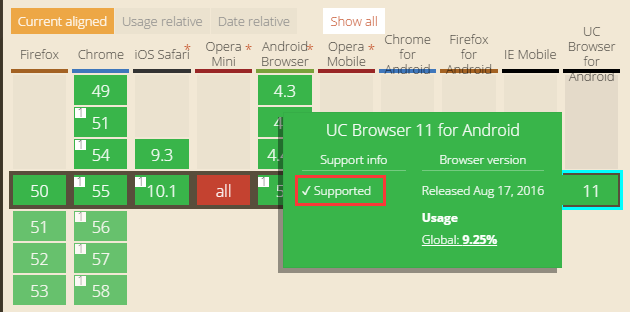

# 用Geolocation获位置信息


## 地理位置

如果设备支持Geolocation，并且所使用的浏览器支持，就可以使用Geolocation获取设备的当前地理位置。可以打开网页[http://caniuse.com/#search=geolocation](http://caniuse.com/#search=geolocation)查看有哪些浏览器版本支持Geolocation。显示Supported表示支持。



​	Geolocation返回的GeolocationInfo，包含以下信息：

- `latitude` —— 纬度（度）。
- `longitude` —— 经度（度）。
- `altitude` —— 相对于海平面的海拔高度（米）。如果设备不提供海拔数据，`altitude` 的值为null。
- `accuracy` —— 返回经纬度的精度，以米为单位。
- `altitudeAccuracy` —— 返回海拔的精度，以米为单位。`altitudeAccuracy` 可能为`null`。
- `heading` —— 返回设备的移动方向（角度），指示距离北方的角度。0度表示指向正北方，方向以顺时针旋转（这表示东方是90度，西方是270度）。如果`speed`是0，`heading`会是`NaN`。如果设备无法提供`heading`信息，值为`null`。
- `speed` —— 返回设备每秒的移动速度（米）。`speed`可能为`null`。
- `timestamp` —— 获取得到设备当前位置的时间。

​	Geolocation静态属性值包含以下通用设置：

- `enableHighAccuracy` —— 布尔值，如果设为true并且设备能够提供更精确地位置，则应用尽可能获取最佳结果。注意着可能导致更长的响应时间和更大的电量消耗（如开启了移动设备的GPS）。如果设置为false，将会得到更快速的响应和更少的电量消耗。默认值为false。
- `timeout` —— 代表返回位置的最大时间（毫秒）限制。默认值是`Infinity`，意味着`getCurrentPosition()`直到位置可用时才会返回。
- `maximumAge` —— 代表可返回的可用缓存位置的最大时限。如果设置为0，意味着设备不使用缓存位置，始终尝试获取实时位置。如果设置为`Infinity`，设备必须返回缓存位置无论其寿命。默认值：0。

### 1、获取当前定位

使用静态方法`Geolocation.getCurrentPosition()`获取当前的位置，`getCurrentPosition()`只触发一次。

```typescript
    /**
     * 获取设备当前位置。
     * @param	onSuccess	带有唯一<code>Position</code>参数的回调处理器。
     * @param	onError		可选的。带有错误信息的回调处理器。错误代码为Geolocation.PERMISSION_DENIED、Geolocation.POSITION_UNAVAILABLE和Geolocation.TIMEOUT之一。
     */
    static getCurrentPosition(onSuccess: Handler, onError: Handler = null): void {
        Geolocation.navigator.geolocation.getCurrentPosition(function (pos: any): void {
            Geolocation.position.setPosition(pos);
            onSuccess.runWith(Geolocation.position);
        },
            function (error: any): void {
                onError.runWith(error);
            },
            {
                enableHighAccuracy: Geolocation.enableHighAccuracy,
                timeout: Geolocation.timeout,
                maximumAge: Geolocation.maximumAge
            });
    }
```

在LayaAir IDE中，给Scene2D添加一个自定义的组件脚本，添加如下代码，实现鼠标点击后，获取地理位置。

```typescript
const { regClass, property } = Laya;

@regClass()
export class NewScript extends Laya.Script {

    constructor() {
        super();
    }

    onMouseClick(evt: Laya.Event): void {
        // 尝试获取当前位置
        Laya.Geolocation.getCurrentPosition(
            Laya.Handler.create(this, this.onSuccess),
            Laya.Handler.create(this, this.onError)
        );
        console.log("click");
    }

    // 成功获取位置后触发
    onSuccess(info: Laya.GeolocationInfo): void {
        console.log('经纬度: (' + info.longitude + '°, ' + info.latitude + '°)，精确度：' + info.accuracy + 'm');

        if (info.altitude != null)
            console.log('海拔：' + info.altitude + 'm' + (info.altitudeAccuracy != null ? ('，精确度：' + info.altitudeAccuracy + 'm') : ''));

        if (info.heading != null && !isNaN(info.heading))
            console.log('方向：' + info.heading + "°");

        if (info.speed != null && !isNaN(info.speed))
            console.log('速度：' + info.speed + "m/s");
    }

    // 获取位置失败后触发
    onError(err: any): void {
        var errType: String;
        if (err.code == Laya.Geolocation.PERMISSION_DENIED)
            errType = "Permission Denied";
        else if (err.code == Laya.Geolocation.POSITION_UNAVAILABLE)
            errType = "Position Unavailable";
        else if (err.code == Laya.Geolocation.TIMEOUT)
            errType = "Time Out";
        console.log('ERROR(' + errType + '): ' + err.message);
    }
}
```

以上示例代码演示使用`getCurrentPosition()`获取当前的位置信息，成功时打印地理位置信息，失败时打印错误信息和错误原因。

开发者如果点击IDE内的浏览器预览，上述示例则会打印Permission Denied（没有权限）的错误信息，原因是getCurrentPosition()获取位置信息时，Geolocation中navigator.geolocation的使用，只能使用https协议，普通的http协议是无法执行的，而IDE默认打开的谷歌浏览器里使用的是http协议。

这里提供一种测试办法，开发者可以先[Web发布](../../../../released/web/readme.md)，然后用anywhere命令启动https进行测试。这里要注意，示例中将获取地理位置的方法放在了鼠标点击事件中，原因是navigator.geolocation只有响应用户的手势操作时，才会返回地理信息。所以如果直接放在onStart()等全局方法里面是不行的，得是像onMouseClick()这样的手势事件的响应函数才可以。

> 获取位置信息需要开启代理。

### 2、监视位置改变

除了获取当前位置之外，还可以监视位置的改变。使用`Geolocation.watchPosition()`监视位置改变，该函数返回一个监视器ID值，可以使用`Geolocation.clearWatch()`并传入该ID值来取消由`watchPosition()`注册的位置监听器。

```typescript
    /**
     * 监视设备当前位置。回调处理器在设备位置改变时被执行。
     * @param	onSuccess	带有唯一<code>Position</code>参数的回调处理器。
     * @param	onError		可选的。带有错误信息的回调处理器。错误代码为Geolocation.PERMISSION_DENIED、Geolocation.POSITION_UNAVAILABLE和Geolocation.TIMEOUT之一。
     */
    static watchPosition(onSuccess: Handler, onError: Handler): number {
        return Geolocation.navigator.geolocation.watchPosition(function (pos: any): void {
            Geolocation.position.setPosition(pos);
            onSuccess.runWith(Geolocation.position);
        },
            function (error: any): void {
                onError.runWith(error);
            },
            {
                enableHighAccuracy: Geolocation.enableHighAccuracy,
                timeout: Geolocation.timeout,
                maximumAge: Geolocation.maximumAge
            });
    }

    /**
     * 移除<code>watchPosition</code>安装的指定处理器。
     * @param	id
     */
    static clearWatch(id: number): void {
        Geolocation.navigator.geolocation.clearWatch(id);
    }
```

以下示例同第1节示例的测试方法相同，需要发布后进行测试。

```typescript
const { regClass, property } = Laya;

@regClass()
export class NewScript extends Laya.Script {

    constructor() {
        super();
    }
    
    onKeyDown(): void {
        // Geolocation.watchPosition函数签名
        Laya.Geolocation.watchPosition(
            Laya.Handler.create(this, this.updatePosition),
            Laya.Handler.create(this, this.onError));
        console.log("keydown");
    }
    
    updatePosition(info: Laya.GeolocationInfo): void {
        console.log('经纬度: (' + info.longitude + '°, ' + info.latitude + '°)，精确度：' + info.accuracy + 'm');
    }
    
    onError(err: any): void {
        var errType: String;
        if (err.code == Laya.Geolocation.PERMISSION_DENIED)
            errType = "Permission Denied";
        else if (err.code == Laya.Geolocation.POSITION_UNAVAILABLE)
            errType = "Position Unavailable";
        else if (err.code == Laya.Geolocation.TIMEOUT)
            errType = "Time Out";
        console.log('ERROR(' + errType + '): ' + err.message);
    }
}
```

`watchPosition()`具有和`getCurrentPosition()`一样的函数签名。更多关于`watchPosition()`的应用，可以查看文档[《使用百度地图》](../baiduMap/readme.md)。