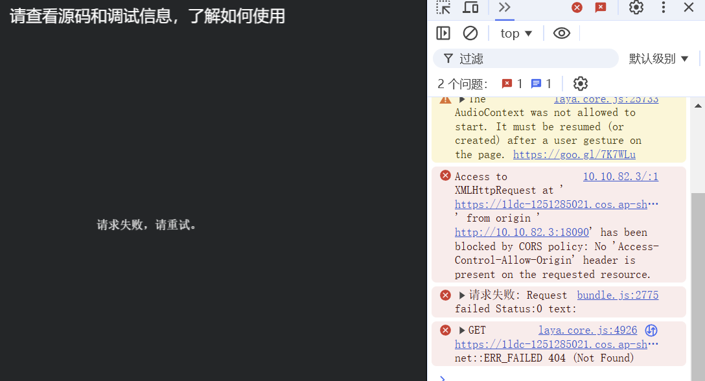

# HTTP通信

> Author: Charley

LayaAir3引擎提供了强大的HTTP通信模块，通过`HttpRequest`类来进行网络请求，支持包括`GET`、`POST`等常用HTTP方法。这一模块为游戏开发者提供了便捷的远程数据交互功能，使得游戏能与外部服务器进行通信，实现如数据上传、下载、获取资源等功能。

本文档将详细介绍LayaAir引擎中HTTP请求的基本操作、常用方法、事件处理、以及如何扩展`HttpRequest`类以满足特殊需求。

## 一、 HTTP基础概念

**HTTP（HyperText Transfer Protocol）**，即超文本传输协议，是一种用于客户端和服务器之间通信的协议。它定义了请求和响应的格式，是Web应用程序的基础协议。通过HTTP，客户端（如浏览器或移动应用）可以向服务器发送请求，获取资源（如文件、图片、数据等），或向服务器提交数据。

HTTP是由请求和响应两部分构成。

其中，**请求**通常由请求行、请求头部、空行和请求体（可选）组成，**响应**由状态行、响应头部、空行和响应体组成。

### 1.1.HTTP 请求的组成

- 请求行包含请求方法（如 GET、POST、PUT、DELETE 等）、请求的 URL（统一资源定位符）和 HTTP 协议版本。例如，“GET /index.html HTTP/1.1”，这里的 “GET” 是请求方法，表示获取资源，“/index.html” 是请求的资源路径，“HTTP/1.1” 是协议版本。

  > 本篇文档仅介绍比较常用的GET和POST请求

- 请求头部包含了关于请求的附加信息，如客户端可接受的内容类型（Accept）、语言（Accept - Language）、用户代理（User - Agent，用于标识客户端软件，如浏览器的类型和版本）等。例如，“Accept: text/html,application/xhtml+xml,application/xml;q = 0.9,image/webp,image/apng,*/*;q = 0.8” 表示客户端可以接受多种内容类型，并且对不同类型有不同的优先级（通过 q 值表示）。

### 1.2 HTTP响应的组成

- 状态行包括 HTTP 协议版本、状态码和状态消息。状态码是一个三位数字，用于表示请求的处理结果。例如，“200 OK” 表示请求成功，服务器成功返回了请求的资源；“404 Not Found” 表示请求的资源不存在；“500 Internal Server Error” 表示服务器内部出现错误。
- 响应头部包含了关于响应的各种信息，如内容类型（Content - Type）、内容长度（Content - Length）、服务器软件（Server）等。例如，“Content - Type: text/html; charset = UTF - 8” 表示响应体的内容是 HTML 格式，字符编码是 UTF - 8。
- 响应体则是服务器返回的实际内容，如网页的 HTML 代码、图像数据等。


## 二、使用引擎的请求方法

XMLHttpRequest（XHR）是一个 JavaScript 对象，它提供了一种在浏览器中以异步方式发送 HTTP（或 HTTPS）请求并处理服务器响应的机制。例如，获取远程资源、提交表单数据、发送JSON数据等。

在LayaAir引擎中，`HttpRequest`类是用来发送HTTP请求的核心类。它封装了原生的`XMLHttpRequest`，并提供了更加简化的接口和事件机制，使得开发者能更加轻松地与远程服务器进行数据交换。

通过该对象，开发者可以使用浏览器提供的请求功能（如`GET`、`POST`等）来与服务器进行通信。

### 2.1 发送HTTP请求

LayaAir引擎支持常用的HTTP请求GET与POST，下面分别通过示例进行介绍。

#### 2.1.1 发送请求的API

在LayaAir引擎的HttpRequest类中，可以采用send方法发送GET与POST请求，参数说明如下：

```typescript
/**
 * 发送 HTTP 请求。
 * @param	url				请求的地址。大多数浏览器实施了一个同源安全策略，并且要求这个 URL 与包含脚本的文本具有相同的主机名和端口。
 * @param	data			(default = null)发送的数据。
 * @param	method			(default = "get")用于请求的 HTTP 方法。值包括 "get"、"post"、"head"。
 * @param	responseType	(default = "text")Web 服务器的响应类型，可设置为 "text"、"json"、"xml"、"arraybuffer"。
 * @param	headers			(default = null) HTTP 请求的头部信息。参数形如key-value数组：key是头部的名称，不应该包括空白、冒号或换行；value是头部的值，不应该包括换行。比如["Content-Type", "application/json"]。
 */
send(url: string, data?: any, method?: "get" | "post" | "head", responseType?: "text" | "json" | "xml" | "arraybuffer", headers?: string[]): void;
```

#### 2.1.2  GET请求示例

GET 请求主要通过 URL 传递。在 URL 中，参数跟在 “?” 后面，多个参数用 “&” 分隔，如 “https://example.com/search?q = keyword&page = 1”。这使得数据在 URL 中可见，并且受到 URL 长度的限制。

由于数据在 URL 中传输，相对不太安全。主要侧重于从服务器获取资源，不会改变服务器的状态。比如查询数据等。

GET请求的示例代码如下：

```typescript
//创建HttpRequest对象
const xhr = new Laya.HttpRequest();
//发送HTTP的GET请求，数据会附加在URL中，适用于无需发送大量数据的情况。
xhr.send('https://httpbin.org/get', null, 'get', 'text');
```

#### 2.1.3  POST请求示例

POST 请求的数据放在请求体中，请求体中的数据在 URL 中不可见。这对于包含敏感信息（如密码）的数据传输更为安全，而且请求体的数据大小限制通常比 GET 请求的 URL 参数长度限制要宽松得多。

相于GET请求，POST一定程度上提高了安全性。主要用于向服务器提交数据，这些数据通常会导致服务器状态的改变，例如创建新的资源、更新现有资源的部分内容等。

POST请求的示例代码如下：

```typescript
//创建HttpRequest对象
const xhr = new Laya.HttpRequest();
//发送HTTP的POST请求，数据包含在请求体内，适用于传输大量数据或敏感信息。
xhr.send('https://httpbin.org/post', 'name=test&age=20', 'post', 'text');
```


### 2.2、获取HTTP响应

在发送完HTTP请求后，我们可以通过事件的帧听，针对不同的事件响应，做出相应的逻辑处理。

#### 2.1 支持的事件类型

LayaAir中的`HttpRequest`继承自`EventDispatcher`，因此支持多种事件类型，用于HTTP请求后的响应逻辑，常用的事件有：

- **`Event.PROGRESS`**：用于跟踪 HTTP 请求的上传和下载进度，例如文件下载时，值为1时表示已完成。
- **`Event.COMPLETE`**：请求完成后触发，表示响应数据已经完全接收。
- **`Event.ERROR`**：请求出错时触发，常用于网络故障等异常情况。

#### 2.2 实战HTTP响应

在发送HTTP请求之后，我们直接通过异步事件的帧听，在事件回调方法里处理响应结果。完整的示例代码如下：

```typescript
import Event = Laya.Event;
import HttpRequest = Laya.HttpRequest;
const { regClass } = Laya;
@regClass()
export class Network_GET extends Laya.Script {
	private hr: HttpRequest;
	private logger: Laya.TextArea;
	private text: Laya.Label = new Laya.Label();

	onAwake(): void {
		this.initUI();
		this.connect();
	}
	/**
	 * 初始化UI
	 */
	private initUI(): void {
		this.showLogger();
		this.text.text = "请查看源码和调试信息，了解如何使用";
		this.text.color = "#FFFFFF";
		this.text.font = "Impact";
		this.text.fontSize = 25;
		this.text.width = 800;
		this.text.anchorX = 0.5;
		this.text.align = "center";
		this.text.y = 20;
		this.text.centerX = 0;
		this.owner.addChild(this.text);
	}

	/**
	 * 发起HTTP连接请求
	 */
	private connect(): void {
		//创建HttpRequest对象
		this.hr = new HttpRequest();
		//请求响应的进度改变时触发
		this.hr.on(Event.PROGRESS, this, this.onHttpRequestProgress);
        //请求完成后触发，表示响应数据已经完全接收。
		this.hr.once(Event.COMPLETE, this, this.onHttpRequestComplete);
        //请求出错时触发，常用于网络故障等异常情况。
		this.hr.once(Event.ERROR, this, this.onHttpRequestError);
		//示例中的URL为临时测试的地址，不保障长期有效，请自行替换为实际有效的URL地址。
		this.hr.send('https://ldc-1251285021.cos.ap-shanghai.myqcloud.com/engine/3.2/libs/laya.box2D.js', null, 'get', 'text');
	}

	/**
	 * 显示HTTP响应日志
	 */
	private showLogger(): void {
		this.logger = new Laya.TextArea();
		this.logger.scrollType = 2;
		this.logger.vScrollBarSkin = "resources/res/ui/vscroll.png";
		this.logger.fontSize = 18;
		this.logger.color = "#FFFFFF";
		this.logger.align = 'center';
		this.logger.valign = 'middle';
		this.logger.left = this.logger.right = this.logger.bottom = 10;
		this.logger.top = 60;
		this.logger.text = "等待响应...\n";
		this.owner.addChild(this.logger);
	}

	/**
	 * 请求出错时触发的回调
	 * @param e 事件对象
	 */
	private onHttpRequestError(e: any = null): void {
		console.error("请求失败:", e);
		this.logger.text = "请求失败，请重试。\n";
	}

	/**
	 * 请求进度改变触发的回调
	 * @param e 事件对象
	 */
	private onHttpRequestProgress(e: any = null): void {
		//进度的百分比
		const progress = e * 100;
		console.log("请求进度:", progress.toFixed(2) + "%");
		// 更新日志显示
		this.logger.text = `当前下载进度: ${progress.toFixed(2)}%\n`;
		// 加载完成后清除进度事件帧监听
		if (progress == 100) {
			this.logger.text = `当前下载进度: 100%\n`;
			Laya.timer.clear(this, this.onHttpRequestProgress);
			console.log("加载进度完成，清除进度事件帧听");
		}
	}
	/**
	 * 请求完成时触发的响应回调
	 * @param e 事件对象
	 */
	private onHttpRequestComplete(e: any = null): void {
		this.logger.text += "收到数据：" + this.hr.data;
		console.log("收到数据：" + this.hr.data);
	}
}
```

通过上面的示例代码，我们可以看出，如果正常响应的话，可以收到进度更新以及请求完成的响应，如图1-1所示：

 

(图1-1) 

如果我们的地址无效等问题出现时，则会触发错误的事件响应，如图1-2所示：

 

（图1-2） 

> POST请求与响应除了在send的时候传参不同，其它流程是完全一样的。就不再重复举例了，如果不能理解，可以使用LayaAir3-IDE创建API示例模板项目，模板项目中分别针对GET与POST提供了示例代码。

### 2.3  使用原生的XMLHttpRequest

由于我们封装的`HttpRequest`类方法，主要针对游戏互动应用场景的通用需求，并没有包括XMLHttpRequest对象的全部功能。如果有超出引擎内置功能的需求，也可以直接通过`HttpRequest`类的`http`属性直接使用原生的XMLHttpRequest对象能力。

示例代码如下：

```typescript
const { regClass } = Laya;
@regClass()
export class Network_GET extends Laya.Script {
	onAwake(): void {
		this.useXhr();
	}
    
    /** 测试使用原生的XMLHttpRequest 对象 */
	useXhr(): void {
		// 引用 XMLHttpRequest 对象
		var xhr = new Laya.HttpRequest().http;

		// 设置请求的 URL 和方法
		xhr.open('GET', 'https://ldc-1251285021.cos.ap-shanghai.myqcloud.com/layaair-3.2/win/LayaAirIDE-win-x64-3.2.1.exe', true);

		// 设置响应类型为 blob（可以是文件类型）
		xhr.responseType = 'blob';

		// 监听下载过程中的 progress 事件
		xhr.addEventListener('progress', function (event: any) {
			if (event.lengthComputable) {
				// 计算下载的百分比
				var percent = (event.loaded / event.total) * 100;
				console.log('下载进度: ' + percent.toFixed(2) + '%');
			}
		});

		// 设置请求完成后的处理函数
		xhr.onload = function () {
			if (xhr.status === 200) {
				console.log("文件下载完成！");
			} else {
				console.error("请求失败: " + xhr.status);
			}
		};

		// 设置请求失败的处理函数
		xhr.onerror = function () {
			console.error("请求错误！");
		};

		// 发送请求
		xhr.send();
	}
}
```

通过上面的代码看出，我们完全是基于`XMLHttpRequest` 原生API编写的代码逻辑。

如果开发者想了解更多`XMLHttpRequest` 原生能力，可以前往以下网址了解：

[https://developer.mozilla.org/zh-CN/docs/Web/API/XMLHttpRequest](https://developer.mozilla.org/zh-CN/docs/Web/API/XMLHttpRequest)