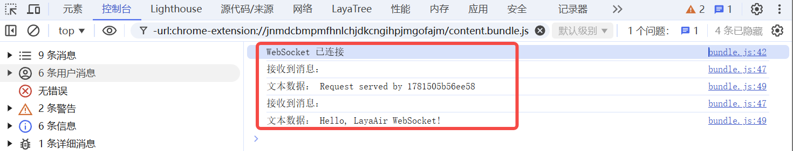
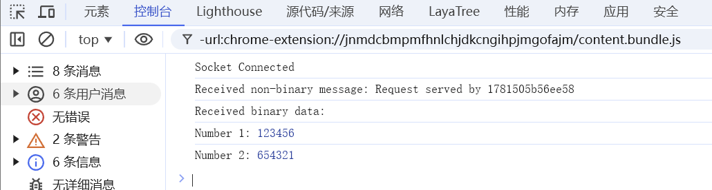
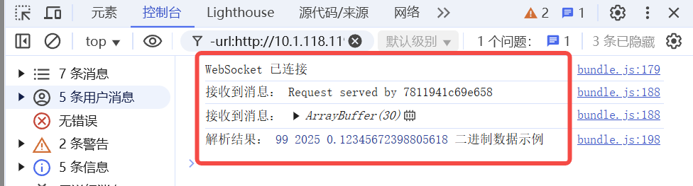

# WebSocket通信

> Author: Charley

WebSocket 协议因其全双工、低延迟的特点被广泛应用于在线游戏、实时聊天、数据推送等场景。LayaAir 引擎内置对 WebSocket 的封装（通过 `Laya.Socket`），以及结合 `Laya.Byte` 实现二进制数据的高效读写，为开发者提供了一套简单易用的网络通信接口。本篇文档将带你从零开始逐步掌握如何在 LayaAir 中利用 WebSocket 进行数据通信。

## 一、WebSocket基础概念

WebSocket 是一种网络通信协议，专门用于在客户端（如 Web 浏览器）和服务器之间建立持久的、全双工的连接。这意味着，一旦建立连接后，双方都可以随时主动发送和接收数据，而不需要像传统的 HTTP 协议那样每次都重新建立连接和等待请求响应。

### 1.1 背景与起源

在 WebSocket 出现之前，实现客户端与服务器的实时通信通常采用轮询或长轮询技术。

轮询是指客户端定期向服务器发送请求来获取最新数据，这种方式会造成大量不必要的请求，浪费带宽和服务器资源；

长轮询虽然有所改进，但仍不是真正意义上的实时通信。为了解决这些问题，HTML5 规范引入了 WebSocket 协议。

### 1.2 主要特点

#### 1.2.1 **全双工通信**

在 WebSocket 连接建立后，客户端和服务器可以在任何时刻相互发送数据，而不需要等待对方的请求。例如，在在线聊天应用中，客户端可以随时向服务器发送消息，服务器也能及时将其他用户的消息推送给客户端。

#### 1.2.2 **实时性高**：

由于是全双工通信，数据可以实时传输，没有传统轮询方式的延迟问题。这使得 WebSocket 非常适合实时性要求较高的应用，如股票行情显示、在线游戏等。

#### 1.2.3 **持久连接**

建立连接后，客户端和服务器之间的通道一直保持打开状态，直至任意一方主动关闭连接。这大大降低了频繁建立和断开连接的开销。

#### 1.2.4 **低开销**

WebSocket 建立连接后，通信时的头部信息很小，相比于 HTTP 请求的头部信息要少很多，从而减少了数据传输的开销。

#### 1.2.5 **跨域通信**

WebSocket 允许跨域通信，这使得客户端可以和不同域名的服务器进行实时数据交互，而不受同源策略的限制。

### 1.3 工作原理

#### 1.3.1 **握手阶段**

客户端通过 HTTP 请求向服务器发起 WebSocket 连接请求，请求头中包含一些特殊字段，如 `Upgrade: websocket` 和 `Connection: Upgrade`，表明客户端希望将当前的 HTTP 连接升级为 WebSocket 连接。服务器收到请求后，如果支持 WebSocket 协议，会返回一个状态码为 101 的响应，表示同意升级连接。

#### 1.3.2 **数据传输阶段**

握手成功后，TCP 连接保持打开，客户端和服务器可以通过这个连接自由地发送和接收数据。数据以帧的形式进行传输，WebSocket 协议定义了不同类型的帧，如文本帧、二进制帧等。

#### 1.3.3 **关闭连接阶段**

当客户端或服务器需要关闭连接时，会发送一个关闭帧，另一方收到关闭帧后，会发送一个确认关闭帧，然后双方关闭 TCP 连接。

## 二、Laya.Sokcet通信基础

LayaAir 中用于 WebSocket 通信的核心类是 `Laya.Socket`。下面详细介绍它的使用方法。

### 2.1 建立连接的方式

#### 2.1.1 构造函数传参

直接在构造时传入主机地址和端口，即刻尝试连接。

```typescript
// 注意：host 参数不需要“ws://”前缀，默认就是ws
let socket = new Laya.Socket("192.168.1.2", 8899);
//如果需要wss安全协议，第5个参数需要为true。
// let socket = new Laya.Socket("192.168.1.2", 8899, null, null, true);
```

#### 2.1.2 **connect 方法**

先创建 Socket 对象，再调用 `connect(host, port)` 建立连接。

```typescript
let socket = new Laya.Socket();
socket.connect("192.168.1.2", 8899);
//如果需要wss安全协议，第3个参数需要为true。
// let socket = new Laya.Socket("192.168.1.2", 8899, true);
```

#### 2.1.3 connectByUrl 方法

直接传入完整的 WebSocket URL（需包含协议的前缀，如 “ws://”）。

```typescript
let socket = new Laya.Socket();
socket.connectByUrl("ws://localhost:8989");
```

### 2.2 事件监听与处理

由于 WebSocket 的连接和数据传输均为异步过程，因此建立连接后，通常要注册以下事件监听器：

- **Event.OPEN**：连接成功建立后触发。
- **Event.MESSAGE**：收到服务器发送的数据时触发。
- **Event.CLOSE**：连接关闭时触发。
- **Event.ERROR**：连接出错时触发。

示例代码：

```typescript
// 注册事件监听示例
this.socket.on(Laya.Event.OPEN, this, this.onSocketOpen);
this.socket.on(Laya.Event.MESSAGE, this, this.onMessageReceived);
this.socket.on(Laya.Event.CLOSE, this, this.onSocketClose);
this.socket.on(Laya.Event.ERROR, this, this.onConnectError);
```


## 三、webSocket数据通信实例

### 3.1 字符串数据通信

发送字符串数据示例：

```typescript
// 发送字符串数据
this.socket.send("Hello, LayaAir!");
```

服务器收到的数据直接为字符串，客户端接收后也直接处理即可。

接收字符串数据的完整示例：

```typescript
const { regClass } = Laya;

@regClass()
export class WebSocketDemo extends Laya.Script {
    private socket: Laya.Socket;

    //组件被启用后执行，例如节点被添加到舞台后
    onEnable(): void {
        this.socket = new Laya.Socket();

        // 注册事件监听
        this.socket.on(Laya.Event.OPEN, this, this.onSocketOpen);
        this.socket.on(Laya.Event.MESSAGE, this, this.onMessageReceived);
        this.socket.on(Laya.Event.CLOSE, this, this.onSocketClose);
        this.socket.on(Laya.Event.ERROR, this, this.onConnectError);

        // 建立连接（此处使用 connectByUrl 方式，实际可根据需要选择其他方式）
        this.socket.connectByUrl("wss://echo.websocket.org:443");
    }


    /** 连接成功回调，发送字符串数据 */
    private onSocketOpen(e: any): void {
        console.log("WebSocket 已连接");

        // 发送字符串示例
        this.socket.send("Hello, LayaAir WebSocket!");
    }

    /**  接收数据回调 */
    private onMessageReceived(msg: any): void {
        console.log("接收到消息：");
        if (typeof msg === "string") {
            console.log("文本数据：", msg);
        } else {
            console.log("接收到非字符串数据", msg);
        }
        // 清除输入缓存，避免残留数据
        this.socket.input.clear();
    }

    /** 连接关闭回调 */
    private onSocketClose(e: any): void {
        console.log("WebSocket 连接已关闭", e);
    }

    /** 连接错误回调 */
    private onConnectError(e: any): void {
        console.error("WebSocket 连接出错：", e);
    }
}
```

示例代码成功连接后，控制台打印效果，如图1-1所示：

 

（图1-1）

如果连接出错和关闭，控制台打印效果，如图1-2所示：


（图1-2）

### 3.2 二进制数据通信

#### 3.2.1 二进制通信优势

相比字符串数据通信方式，二进制数据的体积通常比文本（如JSON）减少 50%-80%，解码比文本解析快 3-5 倍（无序列化/反序列化开销），可直接操作内存，减少临时对象创建等优势。

#### 3.2.2 二进制通信数据类型

在WebSocket协议中，支持的基础二进制类型有Blob和ArrayBuffer。

**Blob** 侧重于存储和传输文件，主要是应用于网页交互场景等。而 **ArrayBuffer** 更适用于数据处理，例如游戏数据的交互。

由于ArrayBuffer在游戏引擎中是最优的选择，所以在**LayaAir引擎的封装中写死了二进制数据类型是"arraybuffer"**，不支持Blob。

#### 3.2.3 ArrayBuffer数据通信

**ArrayBuffer** 是 JavaScript 中用来表示 **原始二进制数据** 的一种基本数据结构，它本身并不直接存储数据，而是提供了一块固定大小的内存区域，使用 **TypedArray** 或 **DataView** 数据类型访问和操作这些数据。

完整示例代码如下：

```typescript
const { regClass } = Laya;
import Socket = Laya.Socket;
import Event = Laya.Event;

@regClass()
export class ArrayBufferSocketDemo extends Laya.Script {
    private socket: Socket;

    onEnable(): void {
        this.socket = new Socket();
        this.socket.connectByUrl("wss://echo.websocket.org:443");

        this.socket.on(Event.OPEN, this, this.onSocketOpen);
        this.socket.on(Event.MESSAGE, this, this.onMessageReceived);
        this.socket.on(Event.ERROR, this, this.onConnectError);
    }

    private onSocketOpen(): void {
        console.log("Socket Connected");

        // 创建一个 ArrayBuffer，大小为 8 字节
        let buffer = new ArrayBuffer(8);
        let view = new DataView(buffer);

        // 写入整数
        view.setInt32(0, 123456, true);  // 小端字节序
        view.setInt32(4, 654321, true);

        // 发送数据
        this.socket.send(buffer);
    }

    private onMessageReceived(message: any): void {
        if (message instanceof ArrayBuffer) {
            // 创建 DataView 来解析 ArrayBuffer
            const view = new DataView(message);
            try {
                // 解析数据
                const num1 = view.getInt32(0, true); // 小端字节序
                const num2 = view.getInt32(4, true);

                // 打印解析结果
                console.log("Received binary data:");
                console.log("Number 1:", num1);
                console.log("Number 2:", num2);
            } catch (error) {
                console.error("Error parsing binary data:", error);
            }
        } else {
            console.log("Received non-binary message:", message);
        }
    }

    private onConnectError(): void {
        console.log("Connection Error");
    }
}
```

将脚本添加到场景中运行，我们看到控制台中的打印如图2-1所示。

 

（图2-1）

#### 3.2.4 二进制图像传输示例

有的时候，可能需要从服务端读取二进制图像并显示，这里我们给出一个模拟二进制图像的一个示例脚本，供开发者入门参照。

完整示例代码如下：

```typescript
const { regClass } = Laya;

@regClass()
export class ArrayBufferSocketDemo extends Laya.Script {
    private socket: Laya.Socket;

    onEnable(): void {
        this.socket = new Laya.Socket();
        this.socket.connectByUrl("wss://echo.websocket.org:443");
        this.socket.on(Laya.Event.OPEN, this, this.onSocketOpen);
        this.socket.on(Laya.Event.MESSAGE, this, this.onMessageReceived);
        this.socket.on(Laya.Event.ERROR, this, this.onConnectError);
    }

    private onSocketOpen(): void {
        console.log("Socket 已连接");
        /** 一个二进制图片资源路径（本地或在线），请自行替换本地二进制图片路径，
         * 或从官网下载示例图片(路径：https://layaair.com/3.x/demo/resources/res/test.bin)
         */
        const imageUrl = "resources/res/test.bin";
        // 加载二进制图片文件
        Laya.loader.fetch(imageUrl, "arraybuffer").then((arrayBuffer: ArrayBuffer) => {
            // 直接发送加载后的 ArrayBuffer 数据
            this.socket.send(arrayBuffer);
            console.log("发送 ArrayBuffer 数据", arrayBuffer);
        });
    }
    private onMessageReceived(message: any): void {
        if (message instanceof ArrayBuffer) {
            console.log("收到 ArrayBuffer 数据", message);

            // 跳过用于加密的前4个字节，只处理有效数据，如果资源没有加密，第二个参数可以不写。
            const uint8Array = new Uint8Array(message, 4);

            // 将 ArrayBuffer 转换为图片数据并加载到 LayaAir 引擎中
            const img = new Laya.Image();
            img.size(110, 145); // 设置图片显示大小
            img.skin = Laya.Browser.window.URL.createObjectURL(new Blob([uint8Array], { type: 'image/png' }));
            img.centerX = 0; // 设置图片居中显示

            // 将图片添加到舞台显示
            Laya.stage.addChild(img);
        } else {
            console.log("收到数据:", message);
        }
    }

    private onConnectError(): void {
        console.log("Connection Error");
    }
}
```

运行效果如图3-1所示。


(图3-1)

### 3.3 基于Laya.Byte二进制通信

#### 3.3.1 TypedArray基础概念

类型化数组（TypedArray）是 JavaScript 中用于高效处理二进制数据的重要工具，它本质上是基于 `ArrayBuffer` 的视图。`ArrayBuffer` 是一个固定长度的二进制数据缓冲区，而 TypedArray 则为开发者提供了一种以特定数据类型（诸如整数、浮点数等）来访问 `ArrayBuffer` 中数据的方式。

需要明确的是，TypedArray 并非单个对象，而是一系列构造函数的统称。这些构造函数各自对应着不同的数据类型，用于创建特定类型的二进制数组。例如，`Uint8Array` 构造函数可以创建一个按字节读取和操作数据的类型化数组，适用于处理图像像素数据、音频样本等以字节为单位的数据；`Float32Array` 构造函数则可创建一个按 32 位浮点数来读取和处理数据的数组，常用于科学计算、图形处理等对精度和性能要求较高的场景。

借助 TypedArray，开发者能够避免直接操作原始字节数据所带来的复杂性，无需手动处理字节的偏移、转换和编码等问题。它使得开发者可以像操作普通数组一样便捷地处理二进制数据，提高了开发效率。

常见的 TypedArray 视图数据类型如下：

| 类型             | 说明                           |
| ---------------- | ------------------------------ |
| **Uint8Array**   | 用于操作 8 位无符号整数数组。  |
| **Int8Array**    | 用于操作 8 位有符号整数数组。  |
| **Uint16Array**  | 用于操作 16 位无符号整数数组。 |
| **Int16Array**   | 用于操作 16 位有符号整数数组。 |
| **Uint32Array**  | 用于操作 32 位无符号整数数组。 |
| **Int32Array**   | 用于操作 32 位有符号整数数组。 |
| **Float32Array** | 用于操作 32 位浮点数数组。     |
| **Float64Array** | 用于操作 64 位浮点数数组。     |

#### 3.3.2 DataView基础概念

`DataView` 是 JavaScript 中用于处理二进制数据的一个强大工具，用于在 `ArrayBuffer` 上读取和写入二进制数据。`DataView` 本身不存储数据，而是作为 `ArrayBuffer` 的一种视图，提供了一组方法来按不同的数据类型访问底层二进制内容。

与 `TypedArray` 不同，`DataView` 不会对整个 `ArrayBuffer` 绑定特定的数据类型，而是允许在同一个 `ArrayBuffer` 上以不同的数据类型进行访问。这意味着，开发者可以在相同的缓冲区内混合读取 `Int8`、`Uint16`、`Float32` 等不同类型的数据，而 `TypedArray` 只能使用其构造时指定的单一数据类型。

在读写多字节数据时，`DataView` 允许开发者指定字节序，即数据在内存中的存储顺序。可以选择大端字节序或小端字节序，通过方法的布尔参数来控制，这在处理不同系统和网络协议时非常重要。

此外，`DataView` 允许精确控制数据的访问位置。开发者可以从 `ArrayBuffer` 的任意字节偏移位置读取或写入数据，而 `TypedArray` 只能顺序访问。这种灵活性使 `DataView` 特别适用于解析复杂的二进制数据结构。例如，你要在 `ArrayBuffer` 里读取不同类型的数据（比如先读取 `Int16`，然后再读取 `Float32`），`TypedArray` 就做不到。

当然，`TypedArray` 也有很多特有的优势。

例如，`TypedArray` 性能更高，适用于大规模数值运算，并且提供了类似普通数组的方法（如 `map`、`forEach`、`set`），让开发者可以像操作普通数组一样操作二进制数据，等。

**什么时候使用 `TypedArray`？**

- 处理**大规模数值计算**（如音频、视频、物理仿真）。
- 与**Web APIs** 交互（如 `WebGL`、`fetch`、`Web Audio`）。
- **需要高性能访问** `ArrayBuffer` 数据时。

**什么时候使用 `DataView`？**

- 需要**读取不同的数据类型**（如 `Int16`、`Float32` 混合使用）。
- 需要**手动指定字节序**（如解析网络协议、文件格式）。
- 需要**随意访问 `ArrayBuffer` 的任何字节**，而不是连续数据。

#### 3.3.3 Laya.Byte的优势

LayaAir引擎的`Byte` 类，将TypedArray与DataView优势结合起来，进行了封装。提供了高效、灵活的二进制数据读写方案。

在数据存储和管理方面，`Byte` 类借助 `TypedArray`（如 `Uint8Array`）实现高效的数据存储。`TypedArray` 具有连续内存存储的特性，能够像普通数组一样进行快速索引访问，非常适合存储大量二进制数据块，这使得 `Byte` 类在处理大数据时能保持良好的性能。`Byte`类还具备**自动扩容**机制，能够在数据超出当前缓冲区容量时动态调整大小，避免手动管理内存的复杂性。

在数据读写操作上，`Byte` 类利用 `DataView` 实现对不同数据类型和字节序的灵活处理。`DataView` 允许在同一个 `ArrayBuffer` 中以不同的数据类型和字节序读写数据，满足了不同系统和协议的多样化需求。开发者可以通过设置 `endian` 属性轻松切换字节序，使用 `DataView` 的方法精确读写多字节的数据类型，如整数、浮点数等。

在性能优化上，`TypedArray` 的批量操作能力与 `DataView` 的精确读写能力相结合，使得 `Byte` 类在处理二进制数据时既高效又灵活。对于大数据块，可利用 `TypedArray` 快速批量写入；对于特定类型数据，则使用 `DataView` 精确读写，避免了不必要的类型转换和内存开销。

此外，`Byte` 类还能在使用TypedArray与DataView这两种对象进行数据操作时统一进行错误处理和边界检查，例如在读写数据时检查是否超出数据范围，若超出则抛出异常，增强了代码的健壮性。

#### 3.3.4 创建 Laya.Byte 对象并设置端序

“设置端序”就是在告诉程序在处理多字节数据（例如 16 位、32 位整数或浮点数）时，采用哪种字节排列顺序。简单来说，就是指定数据在内存中存储时字节的顺序是“大端模式”还是“小端模式”。

BIG_ENDIAN：大端字节序，地址低位存储值的高位，地址高位存储值的低位。有时也称之为网络字节序。

LITTLE_ENDIAN： 小端字节序，地址低位存储值的低位，地址高位存储值的高位。

在网络通信、文件读写等场景中，数据在不同系统间传输时可能需要统一格式。如果发送方和接收方对数据的端序理解不同，就会出现数据解析错误。因此，在数据传输中，双方必须协商并统一使用相同的端序，为确保前后端一致，建议统一设置为小端（LITTLE_ENDIAN）。

示例代码如下：

```typescript
//  初始化用于二进制数据处理的 Laya.Byte
let byte = new Laya.Byte();
// 设置字节序为小端模式
byte.endian = Laya.Byte.LITTLE_ENDIAN;
```

#### 3.3.5 用 Laya.Byte 写入和发送数据

创建完对象并设置端序后，我们根据协议顺序调用相应的写入方法（如 writeByte、writeInt16、writeFloat32、writeUTFString 等），然后发送数据。

示例代码如下：

```typescript
// 按顺序写入数据
byte.writeByte(1);
byte.writeInt16(20);
byte.writeFloat32(20.5);
byte.writeUTFString("LayaAir WebSocket");

//发送时必须传入 byte.buffer（ArrayBuffer 对象），而非直接传入 byte 对象。
socket.send(byte.buffer);
```

#### 3.3.6 接收数据与完整示例

在接收到服务器发送的 ArrayBuffer 后，我们如同发送的流程一样，还是通过 Laya.Byte 读取数据。

完整的示例代码如下：

```typescript
const { regClass } = Laya;

@regClass()
export class WebSocketDemo extends Laya.Script {
    private socket: Laya.Socket;
    private byte: Laya.Byte;

    onEnable() {
        // 创建 Socket 对象
        this.socket = new Laya.Socket();
        //  初始化用于二进制数据处理的 Laya.Byte
        this.byte = new Laya.Byte();
        // 设置字节序为小端模式
        this.byte.endian = Laya.Byte.LITTLE_ENDIAN;

        // 注册事件监听
        this.socket.on(Laya.Event.OPEN, this, this.onSocketOpen);
        this.socket.on(Laya.Event.MESSAGE, this, this.onMessageReceived);
        this.socket.on(Laya.Event.CLOSE, this, this.onSocketClose);
        this.socket.on(Laya.Event.ERROR, this, this.onConnectError);

        // 建立连接（此处使用 connectByUrl 方式，实际可根据需要选择其他方式）
        this.socket.connectByUrl("wss://echo.websocket.org:443");
    }

    // 连接成功回调
    private onSocketOpen(e: any): void {
        console.log("WebSocket 已连接");
        // 按顺序写入数据：一个字节、一个 16 位整数、一个 32 位浮点数、一段字符串
        this.byte.writeByte(99);
        this.byte.writeInt16(2025);
        this.byte.writeFloat32(0.12345672398805618);
        this.byte.writeUTFString("二进制数据示例");

        // 发送时必须传入二进制数据byte.buffer（ArrayBuffer 对象），而非传入 byte 对象
        this.socket.send(this.byte.buffer);
        //清空缓冲区，避免数据残留影响后续操作。
        this.byte.clear();
    }

    // 接收数据回调
    private onMessageReceived(msg: any): void {
        console.log("接收到消息：", msg);

        // 判断消息类型是否为 ArrayBuffer（二进制数据）
        if (msg instanceof ArrayBuffer) {
            // 创建 Laya.Byte 实例，用于操作二进制数据
            let byte = new Laya.Byte();
            // 设置字节序列的字节序
            byte.endian = Laya.Byte.LITTLE_ENDIAN;
            // 将 ArrayBuffer 中的二进制数据写入 Laya.Byte 对象中
            byte.writeArrayBuffer(msg);

            // 重置字节流的位置指针，从0开始读取数据
            byte.pos = 0;

            // 从字节流中读取一个字节（8位）
            let a = byte.getByte();  // 获取一个字节（1个byte）
            // 从字节流中读取一个16位整数（2个字节）
            let b = byte.getInt16();  // 获取一个16位整数
            // 从字节流中读取一个32位浮点数（4个字节）
            let c = byte.getFloat32();  // 获取一个32位浮点数
            // 从字节流中读取一个UTF-8编码的字符串
            let d = byte.getUTFString();  // 获取一个UTF-8字符串

            // 打印解析结果
            console.log("解析结果：", a, b, c, d);
        }
        // 清空 socket 输入流中的数据，确保下次读取是干净的
        this.socket.input.clear();
    }


    // 连接关闭回调
    private onSocketClose(e: any): void {
        console.log("WebSocket 连接已关闭");
    }

    // 连接错误回调
    private onConnectError(e: any): void {
        console.error("WebSocket 连接出错：", e);
    }
}
```

运行效果如图4-1所示，通过Laya.Byte成功发送和接收了二进制数据，并将数据读取打印出来。

 

（图4-1）

## 四、其它API

熟悉完主要的流程，其它的API可以查看引擎源码，或官网的API文档

https://layaair.com/3.x/api/

https://github.com/layabox/LayaAir