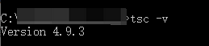

# 搭建开发环境

> Author: Charley

在熟悉开发环境之前，请开发者们准备好相关的工具环境~

## 一、下载并安装LayaAir IDE

IDE内集成了引擎，直接下载IDE即可。

下载地址：https://layaair.com/#/engineDownload


## 二、搭建TS开发环境

LayaAir 3.0只支持TypeScript语言开发，所以TypeScript的安装环境还是要准备好。

### 2.1 下载并安装Node.js

#### 2.1.1 检查是否已安装node.js环境

使用TypeScript开发需要Node.js环境，如果没有安装过的，请前往官方下载(建议LTS版本)。

在安装前，如果不确定是否有现成的环境，可以先确认一下node环境是否已安装，打开命令行工具（windows是cmd），输入指令 `npm -h`

```typescript
npm -h
```

按回车键后，如果能看到npm的命令说明、版本号，以及安装路径等信息，如图1-1所示（类似信息即可），那说明已经安装过了，如果不影响使用，可以跳过下载和安装node环境的步骤。

 

(图1-1)

#### 2.1.2 Node.js官网下载并安装

如果没有安装环境，而直接前往node官网下载安装即可，推荐LTS版本，如图1-2所示，URL地址为：https://nodejs.org/en/

 

（图1-2）

图1-2仅作为参照使用，打开链接直接下载LTS版本即可。

> 注意：默认链接打开的是window(x64)，非64位的电脑，可以点击Other Downloads，下载对应的版本即可。

下载完成后，找到刚刚下载的Node.js安装包，一步一步的安装即可，安装完全时界面如图1-3所示。


（图1-3）

安装完成之后，可以按2.1小节介绍的方式，在命令行下输入 `npm -h` 检查一下安装状态。

### 2.2 安装TSC

Node环境没问题后，就可以使用npm来安装TypeScript编译环境了。

#### 2.2.1 命令行安装typescript

直接在命令行工具里输入指令“`npm install -g typescript`”，按回车键，如图2-1所示，即可开始下载并进行TypeScript环境的安装，此时一定要保持网络的畅通。

```
npm install -g typescript
```

 

（图2-1）

开发者如果安装时遇到图2-2的情况，通常是缓存冲突导致。（没遇到的直接跳过本步骤。）

 

（图2-2）

这时候，可以使用缓存清理命令 `npm cache clean --force`，回车执行该命令，重新输入安装指令即可。

```
npm cache clean --force
```

> [!Tip|label:Tips]
>
> 如果没有翻墙，npm可能会安装不太顺利，此时，建议执行`npm cache clean --force` 把npm缓存清掉。
>
> 然后使用cnpm来安装。

当我们看到 “`All packages installed `”这些字样的时候，可以确认完成了 TypeScript 环境的安装，如图2-3所示，关闭命令行工具即可。

   
（图2-3）

图3-1中tsc目录中就是我们TypeScript编译环境的安装目录，有了这个，LayaAirIDE里就能通过这个Compiler将TypeScript编译成为JavaScript。

#### 2.2.2 检查TypeScript编译环境版本

在命令行输入“tsc -v” 命令可查看当前TypeScript编译的版本，如图2-4所示。

```
tsc -v
```

  

（图2-4）

如果显示出版本号，说明TypeScript Compiler（tsc）安装成功。

## 三、安装浏览器

推荐采用Chromium内核的浏览器作为LayaAir运行与调试环境，例如windows自带的Edge浏览器或谷歌的chrome浏览器。

chrome官网下载地址：

https://www.google.cn/intl/zh-CN/chrome/


## 四、下载安装VSCode

VSCode是一个应用广泛的编码工具，也是LayaAir引擎推荐的编码工具。

VSCode官网下载地址：

https://code.visualstudio.com/Download

