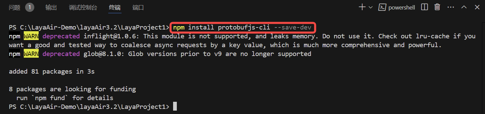
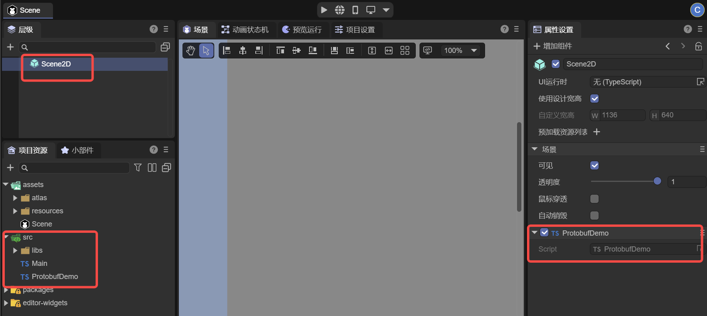
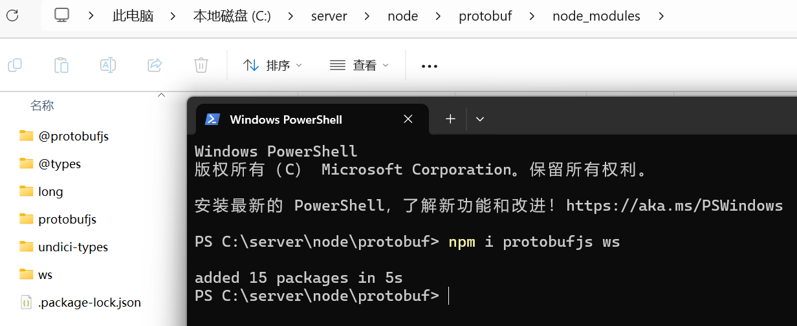
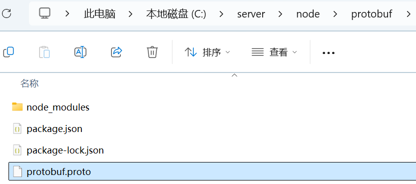
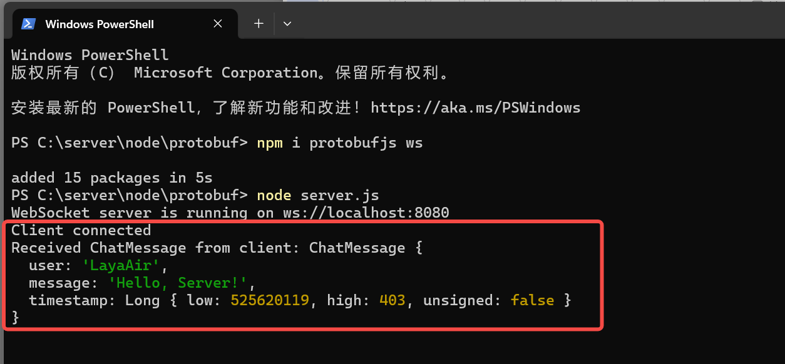

# ProtocolBuffer通信

> Author: Charley

Protocol Buffers（简称 Protobuf）是谷歌开发的一种高效、灵活且轻便的数据序列化格式。

它主要用于结构化数据的序列化和反序列化。在数据传输和存储场景中，Protobuf 能够将复杂的数据结构（如包含多种数据类型的对象，像是包含整数、字符串、嵌套对象、数组等）转换为紧凑的二进制格式，大大减少了数据的体积，这对于网络传输来说能够降低带宽占用并且提高传输速度。而且在序列化后的二进制数据进行反序列化时，能够精准地还原出原始的数据结构和数据值。

与其他数据序列化格式（如 XML 和 JSON）相比，Protobuf 具有更高的性能。它的二进制格式使得解析速度更快，并且因为其定义的消息结构是强类型的，在编译阶段就可以对消息格式进行检查，减少了运行时错误。此外，通过`.proto`文件可以清晰地定义消息的结构，包括消息中的字段、字段类型、是否为必需字段等信息，这种定义方式方便团队协作开发，并且易于维护和更新数据结构的定义。

## 一、Protobuf的准备工作

### 1.1 安装 `protobufjs-cli`

首先，随便打开一个命令行，通过npm安装protobufjs-cli，用于生成静态代码等。

```sh
npm install protobufjs-cli --save-dev
```

 

(图1-1)

> npm 环境都没有的，请先安装好 Node.js 后再继续阅读。

### 1.2 编写`.proto`文件

`.proto` 文件用于定义数据结构和消息格式，它是 Protobuf 的核心，客户端与服务端都基于该文件协议进行通信。在 `chat.proto` 文件中，开发者需要定义消息的结构、字段的类型、字段名、字段的编号等。

我们在`项目根目录\src\libs\protobuf\`目录下创建一个`protobuf.proto`空文件，然后用编辑器打开，并编写如下示例代码：

```protobuf
syntax = "proto3"; // 指定使用 Protobuf 3 语法

// 定义一个 ChatMessage 消息
message ChatMessage {
  string user = 1;     // 用户名，字段编号是 1
  string message = 2;  // 消息内容，字段编号是 2
  int64 timestamp = 3; // 消息时间戳，字段编号是 3
}
```

**各个部分的作用：**

1. **`syntax = "proto3";`**：指定使用 Protobuf 3 语法。`proto3` 是 Protobuf 写本文时的最新版本，具有简化的语法和更广泛的支持。
2. **`message`**：定义了一个消息结构。每个消息是一个包含多个字段的数据结构。
3. **`string`、`int32`、`int64`** 等：指定字段的类型，Protobuf 支持多种数据类型，如字符串、整数、浮动点数等。

> 更多关于.proto的使用，请自行百度搜索相关教程，本篇文档仅作基础流程的使用说明指引。

### 1.3 生成 `.js` 和 `.d.ts` 文件

通过 `protobufjs-cli` 工具生成的 `.js` 和 `.d.ts` 文件是根据 `.proto` 文件按需生成的，只包含项目 `.proto` 文件中定义的消息类型和字段所需，而不会包含整个 `protobufjs` 库的内容。因此，与官方提供的完整js库相比，按需生成的文件通常更轻量，所在本文中仅介绍该种方式的使用流程。

#### 1.3.1 配置工具指令

`protobufjs-cli`工具有`pbjs`和`pbts`这两个指令，分别用于生成JavaScript 库文件`.js`和TypeScript 声明文件`.d.ts`。由于指令参数较多，通常会配置在项目中，直接调用快捷指令即可。

示例代码如下：

```json
"scripts": {
    "pbjs": "pbjs -t static-module -w commonjs -o ./src/libs/protobuf/protobuf.js ./src/libs/protobuf/protobuf.proto",
    "pbts": "pbts -o ./src/libs/protobuf/protobuf.d.ts ./src/libs/protobuf/protobuf.js"
  },
```

效果如图1-2所示：

 

**`pbjs`指令参数的作用：**

将 `.proto` 文件编译为 JavaScript 文件。生成的 `.js` 文件包含所有消息类型的定义和序列化方法，适合直接在项目中使用。

1. **`-t static-module`**

   - `-t`：指定生成代码的目标类型，即目标代码的格式。
   - `static-module`：表示生成“静态模块”代码，它直接将 `.proto` 文件中的内容转化为 JavaScript 模块，而不是生成动态消息类。
     使用 `static-module` 可以在没有 `protobufjs` 库的情况下直接使用生成的代码。对于文件较少或模块化需求明确的情况，这种方式更高效。

2. **`-w commonjs`**

   - `-w`：指定生成模块的代码风格。
   - `commonjs`：表示生成符合 CommonJS 规范的代码，适合使用 `require` 导入的项目。

3. **`-o ./src/libs/protobuf/protobuf.js`**

   - `-o`：指定输出文件路径。
   - `./src/libs/protobuf/protobuf.js`：这是编译后生成的 JavaScript 文件路径。
     在运行 `pbjs` 命令后，所有的 `.proto` 文件内容会被编译到这个 `protobuf.js` 文件中。

4. **`./src/libs/protobuf/protobuf.proto`**

   这是需要编译的 `.proto` 文件路径。该文件包含我们之前定义的消息格式和结构。

**`pbts` 指令参数的作用：**

根据生成的 `.js` 文件生成 TypeScript 类型声明文件。`.d.ts` 文件包含对应的类型定义，使 TypeScript 项目获得完整的类型支持。

1. **`-o ./src/libs/protobuf/protobuf.d.ts`**

   - `-o`：指定输出文件路径。
   - `./src/libs/protobuf/protobuf.d.ts`：这是生成的 `.d.ts` 文件的路径，包含所有生成的类型定义。
     此文件将定义所有的消息类型、字段和方法，以便在 TypeScript 项目中获得类型提示和编译检查。

2. **`./src/libs/protobuf/protobuf.js`**

   这是前一个命令生成的 `protobuf.js` 文件的路径，`pbts` 会读取这个文件内容来生成相应的 `.d.ts` 文件。`.d.ts` 文件包含与 `.proto` 文件中定义的结构相对应的 TypeScript 类型，方便在 TypeScript 项目中直接使用。

#### 1.3.2 生成文件

由于`pbts`指令需要依赖于`pbjs`指令生成的`protobuf.js`，所以我们先执行`pbjs`的指令，

```shell
npm run pbjs
```

然后执行pbts的指令。

```shell
npm run pbts
```

两次指令执行完，可以看到指定的输出路径下生成了`protobuf.js`和`protobuf.d.ts`两个文件，如图1-3所示

 

（图1-3）

## 二、编码使用Protobuf

### 2.1 创建脚本导入Protobuf

当生成了`protobuf.js`和`protobuf.d.ts`之后，我们就可以直接在ts的项目中直接使用了。

我们先为场景添加一个空的脚本，命名为`ProtobufDemo`，如图2-1所示。

 

（图2-1）

> 脚本不会创建的先阅读官方的相关基础文档。

然后基于当前的脚本路径，直接去引入生成的protobuf模块即可。如下面的代码所示：

```typescript
// src/ProtobufDemo.ts
// 引入生成的 protobuf 模块，路径相对于当前文件
import * as protobuf from "./libs/protobuf/protobuf";
const { regClass } = Laya;
@regClass()
export class ProtobufDemo extends Laya.Script {
    onEnable() {
        console.log("Game start");
   }
}
```

### 2.2 Protobuf示例脚本

引入了protobuf模块就可以直接在项目中使用了，这里我们写了一个简单的示例DEMO，完整代码如下：

```typescript
// src/ProtobufDemo.ts
// 引入生成的 protobuf 模块，路径相对于当前文件
import * as protobuf from "./libs/protobuf/protobuf";
const { regClass } = Laya;

@regClass()
export class ProtobufDemo extends Laya.Script {
    private ChatMessage: any;
    private socket: WebSocket | null = null;

    onStart() {
        console.log("Game start");
        // 初始化 protobuf
        this.initializeProtobuf();

        // 初始化 WebSocket 连接
        this.initializeWebSocket();
    }

    // 初始化 protobuf 并加载消息定义
    private initializeProtobuf() {
        // ChatMessage 是 .proto 文件中定义的消息类型，包含了字段 user、message 和 timestamp，分别用于表示用户名、消息内容和时间戳。
        this.ChatMessage = protobuf.ChatMessage;
    }

    // 初始化 WebSocket 并处理消息
    private initializeWebSocket() {
        this.socket = new WebSocket("ws://localhost:8080");
        this.socket.binaryType = "arraybuffer";
        // 连接成功时发送测试消息
        this.socket.onopen = () => {
            console.log("WebSocket connected");

            // 发送 ChatMessage 类型的打招呼消息，user 字段表示消息发送者的用户名。message 字段包含消息内容。timestamp 是当前时间戳。
            const greetingMessage = { user: "LayaAir", message: "Hello, Server!", timestamp: Date.now() };
            //调用 encode 方法，将 greetingMessage 对象编码为二进制格式（即序列化），通过.finish()返回一个 Uint8Array类型的二进制缓冲区。
            const greetingBuffer = this.ChatMessage.encode(greetingMessage).finish();
            //socket不为 null 或 undefined时，将二进制数据 greetingBuffer 通过 WebSocket 发送到服务器。
            this.socket?.send(greetingBuffer);
        };

        // 接收服务器返回的消息
        this.socket.onmessage = (event) => {
            //将 event.data 转换为 Uint8Array 类型，以便传递给解码函数 handleServerResponse 进行处理。
            const buffer = new Uint8Array(event.data);
            this.handleServerResponse(buffer);
        };

        // 连接关闭处理
        this.socket.onclose = () => {
            console.log("WebSocket closed");
        };

        // 连接错误处理
        this.socket.onerror = (error) => {
            console.error("WebSocket error:", error);
        };
    }
    private handleServerResponse(buffer: Uint8Array) {
        // 尝试解码为 ChatMessage，使用 decode 方法，将接收到的 Uint8Array 数据 buffer 反序列化为 ChatMessage 类型的 JavaScript 对象。
        const chatMessage = this.ChatMessage.decode(buffer);
        console.log("Received ChatMessage from server:", chatMessage);
    }
}
```

代码中已加入详细的注释，这里就不再详细分析了。

## 三、测试Protobuf通信

### 3.1 搭建一个简单的服务器环境

Protobuf通信自然是离不开服务端，所以我们先基于node搭建一个简单的服务器。

首先，我们随便找一个目录，使用npm安装WebSocket 服务器模块`ws`用于发送和接收二进制数据等基础的双向通信，以及安装Protobuf模块`protobufjs`，确保双方能够正确解析消息。

```sh
npm install protobufjs ws
```

执行完安装命令后，我们可以看到多出来的node_modules目录下已经成功的完成了protobufjs和ws模块的安装，如图3-1所示。

  

（图3-1）

### 3.2 建立`.proto` 文件

在服务器端，创建一个与客户端相同的 `.proto` 文件，以便服务器也能解析和生成 Protobuf 格式的数据。我们可以直接将客户端的 `protobuf.proto` 文件复制到服务器项目中。确保该文件与客户端定义的一致性，以便双方能使用相同的结构进行通信。

示例的目录结构如图3-2所示。

 

(图3-2)

### 3.3 编写服务端代码

接下来，创建一个简单的 WebSocket 服务器，使用 `ws` 模块来处理连接请求，并用 `protobufjs` 来加载处理 `.proto` 文件中的定义，以便对接收的数据进行解码和响应。

**示例 `server.js` 文件：**

```javascript
//C:\server\node\protobuf\server.js
const WebSocket = require("ws");
const protobuf = require("protobufjs");

// 加载 .proto 文件，与客户端一致
protobuf.load("./protobuf.proto", (err, root) => {
    if (err) throw err;

    // 获取消息类型
    const ChatMessage = root.lookupType("ChatMessage");

    // 创建 WebSocket 服务器，并定义了8080端口，需要与客户端请求的端口保持一致
    const wss = new WebSocket.Server({ port: 8080 });

    wss.on("connection", (ws) => {
        console.log("Client connected");

        // 监听消息
        ws.on("message", (data) => {

            // 将接收到的二进制数据buffer解码(反序列化)为ChatMessage对象
            const receivedMessage = ChatMessage.decode(new Uint8Array(data));
            console.log("Received ChatMessage from client:", receivedMessage);

            // 回复一个打招呼消息
            const responseMessage = { user: "Server", message: `Hello, ${receivedMessage.user}!`, timestamp: Date.now() };
            const responseBuffer = ChatMessage.encode(responseMessage).finish();
            ws.send(responseBuffer);
        });

        // 监听关闭事件
        ws.on("close", () => {
            console.log("Client disconnected");
        });
    });

    console.log("WebSocket server is running on ws://localhost:8080");
});
```

### 3.4 执行测试代码

完成代码编写后，我们在命令行中，使用node在服务器目录中启动服务端代码，

```sh
node server.js
```

运行后效果如图3-3所示。

 

(图3-3) 

由于客户端的脚本我们在前文中是基于场景创建的，那么我们也可以直接运行场景，在`预览运行`界面，我们打开`开发者工具`的控制台，可以看到客户端成功联结上服务端，并且还收到了来自服务端返回的消息。如图3-4所示。

  

(图3-4)

我们再切回到服务端的命令行界面，也可以看到来自客户端消息的打印信息，如图3-5所示。

 

(图3-5)

至此，一个在LayaAir3项目内，基于Protobuf通信的完整流程已验证通过。


