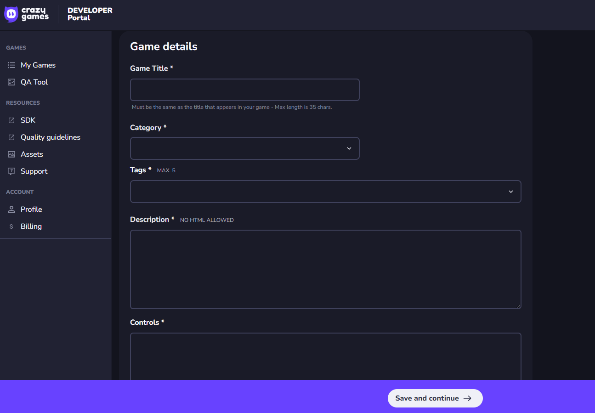
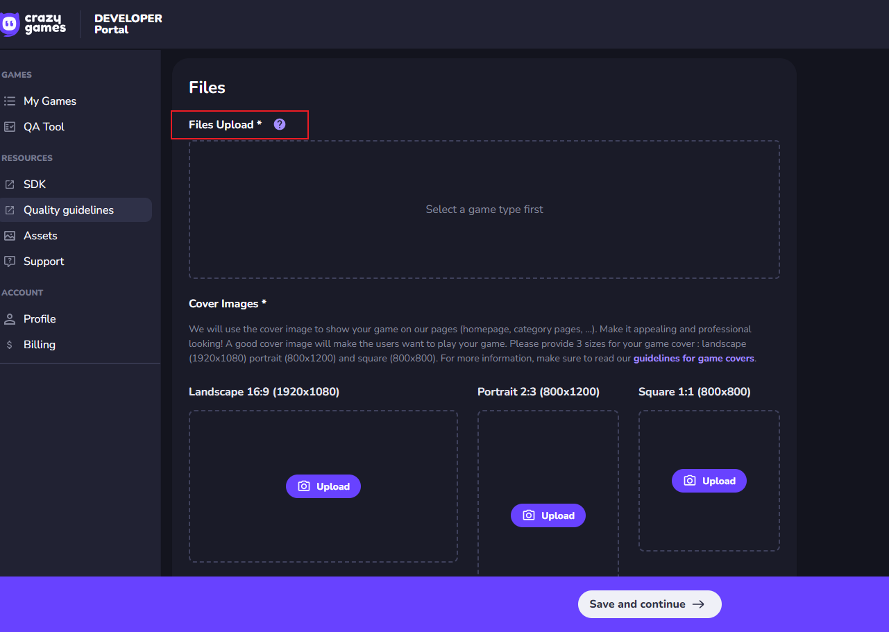
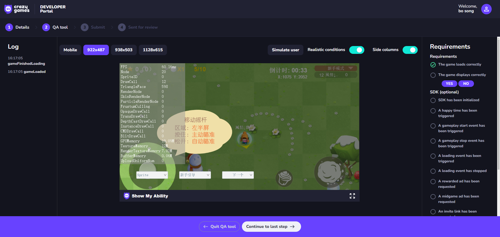

# CrazyGames平台发布

## 1. 在LayaAir-IDE中发布为CrazyGames平台

如图1-1所示，使用LayaAir-IDE将项目发布为CrazyGames平台。

（图1-1）

发布界面中的配置文件`File Extension`等，以及`Common`的配置可以参考[Web配置](../web/readme.md)与[发布通用配置](../generalSetting/readme.md)。

发布完毕后，在项目根目录/release/下，会新增一个crazygames文件夹包含发布的项目内容。

（图1-2）

## 2. 进入CrazyGames的开发者后台

点击这个网址进入后台（https://developer.crazygames.com/games）可以在这里提交自己的HTML5类型的游戏。

## 3. 上传游戏并测试

可以将发布出来的项目上传到CrazyGames平台。

（图3-1）

（图3-2）

上传完游戏后，点击Save and continue，进入QATool进行测试，这里模拟了CrazyGames真实平台的情况。

## 4. web端CrazyGames平台运行情况

在web端CrazyGames中运行API项目示例的3D：

（图4-1）

在web端CrazyGames中运行API项目示例的2D：

（图4-2）

