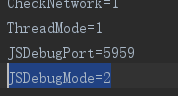
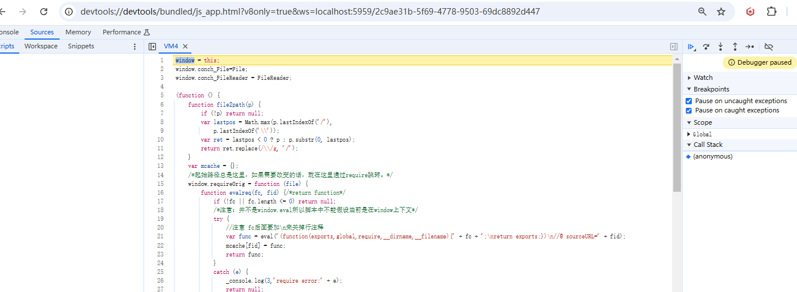

# 在鸿蒙NEXT真机上调试JavaScript代码

## 一、调试的原理

LayaAir-IDE发布后的代码，最终都会被编译为JS。而JavaScript代码的调试，是使用调试机上的Chrome浏览器进行的。鸿蒙NEXT测试机上的LayaNative启动的时候，会同时启动一个WebSocket服务器。Chrome浏览器通过WebSocket与LayaNative连接通信，从而实现使用Chrome对项目的JavaScript的调试。

在调试项目中的JavaScript的代码时，有以下两种调试模式可以选择：

（1）Debug/Normal模式

在该模式下，鸿蒙NEXT测试机上的项目可以直接启动并运行，Chrome浏览器可以在项目运行后连接调试。

（2）Debug/Wait模式

在该模式下，鸿蒙NEXT测试机上的项目启动后，会一直等待Chrome浏览器的连接。当Chrome连接成功后，才会继续执行JavaScript脚本。当需要对启动时加载的JavaScript脚本进行调试时，请优先选择该模式。

**注意：在调试的工程中请确保调试机与鸿蒙NEXT测试机在同一局域网中。**

## 二、调试LayaAir-IDE构建的鸿蒙NEXT项目

### 步骤1:   构建项目

使用LayaAir-IDE对项目进行构建，生成鸿蒙NEXT的工程。

> 参考[鸿蒙NEXT构建](../readme.md)。

### 步骤2：修改调试模式

使用DevEco Studio打开构建后的工程。

打开`ohos/entry/src/main/resources/rawfile/config.ini`，修改`JSDebugMode`的值,设置需要的调试模式。如图2-1所示，

（图2-1）

JSDebugMode的取值和含义如下：

|取值|含义|
|:--:|:--:|
|0|关闭调试功能|
|1|Debug/Normal模式|
|2|Debug/Wait模式|

> 当项目正式发布后，请将JSDebugMode的值设置为0，否者会对项目运行时的性能有影响。

### 步骤3：编译并运行项目

使用DevEco Studio编译工程。

- 如果选择的是Debug/Normal模式，等待鸿蒙NEXT测试机成功**启动并运行**项目。

（图2-2）

- 如果选择的是Debug/Wait模式，等待鸿蒙NEXT测试机成功**启动**项目。

（图2-3）

### 步骤4：检查端侧端口是否打开成功

hdc shell "netstat -anp | grep 5959"。结果为5959端口状态为“LISTEN"即可。

（图2-4）

### 步骤5：转发端口

hdc fport tcp:5959 tcp:5959。转发PC侧端口5959到端侧端口5959。结果为"Forwardport result:OK"即可。

（图2-5）
### 步骤6：使用Chrome连接工程
在chrome浏览器地址栏输入"localhost:5959/json"，回车。获取端口连接信息。

（图2-6）

### 步骤7：进行调试
拷贝"devtoolsFrontendUrl"字段url内容到地址栏，回车，进入DevTools源码页，将看到在应用中执行的JS源码，此时暂停在第一行JS源码处。
用户可在源码页打断点，通过按钮发出各种调试命令控制JS代码执行，并查看变量。

（图2-7）

