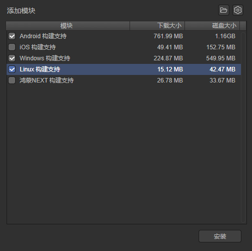
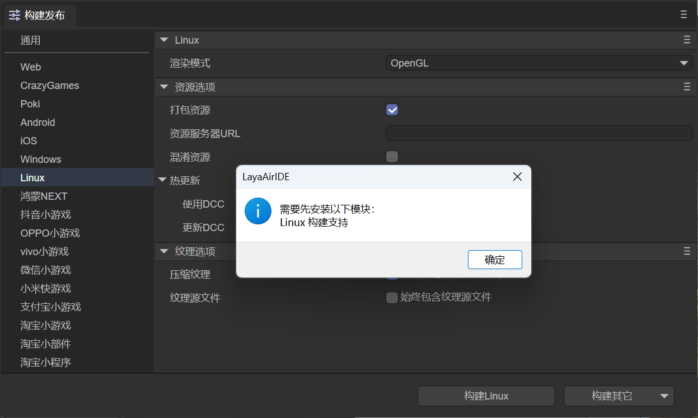

# 构建Linux工程

从LayaAir3.3版本开始，增加支持发布Linux项目。

## 一、适配的开发环境
目前Linux项目在下面的环境配置下通过测试：

- Ubuntu 22.04.5 LTS (GNU/Linux 6.8.0-49-generic x86_64)
- cmake version 3.22.1
- gcc version 11.4.0

**注意：目前只支持x86_64架构**

## 二、安装构建发布的环境

在构建发布Liunx之前，我们需要先添加Linux的发布环境模块，如图2-1所示，点击`文件`菜单栏下的`添加模块`选项，

 

（图2-1）

当弹出图2-2所示的模块面板，选择Linux构建支持，点击安装即可。

 

（图2-2）

如果我们不先添加模块，当点击`构建Liunx`按钮后，也会提示先安装模块，如图2-3所示。

 

（图2-3）

点击确定后，会自动打开图2-2所示的模块安装界面。

## 三、构建配置说明

在构建发布面板中，选择Linux，可以配置Linux的发布设置，如图3-1所示：

 

（图3-1）

配置的说明如下：

### 3.1 渲染模式

有OpenGL和WebGL两种渲染模式，一般默认选择OpenGL即可。

### 3.2 打包资源

是否把为当前平台导出的资源（resource目录）打包到native项目中。打包的资源会放到特定的目录中，以供后续生成不同平台的App。

如果希望提供单机版，则必须选择打包资源，即勾选“打包资源”，并且保留“资源服务器URL”为空。把资源直接打进App包中，可以避免网络下载，加快资源载入速度。

> 把资源打包的缺点是会增加包体的大小。
>
> 如果想发布勾选“打包资源”的在线游戏，必须在server端打dcc，否则就会失去打包的优势。

### 3.3 资源服务器URL

填写服务器地址即可，注意要在地址后加上index.js。

例如：http://192.168.31.109:8000/index.js

### 3.4 混淆资源

如果勾选，在打包资源的时候，会随机混淆资源，主要作用是避免在上架的时候被平台扫描到某些敏感函数。

### 3.5 热更新（DCC）

启用DCC后，可以打包资源，也可以不打包。

> 参考[DCC文档](../native/LayaDcc_Tool/readme.md)。

### 3.6 纹理选项

`压缩纹理`：一般需要勾选“允许使用压缩纹理格式”，如果不勾选，则忽略所有图片对于压缩格式的设置。

`纹理源文件`：可以不勾选“始终包含纹理源文件”，如果勾选，则即使图片使用了压缩格式，仍然把源文件（png/jpg)打包。目的是遇到不支持压缩格式的系统时，fallback到源文件。

## 四、项目编译

进入上面app构建器构建出来的Linux项目工程目录，执行下面的命令进行编译。

```bash
./build.sh
```
执行命令后，可执行文件被写入install_cmake/bin目录。当前测试项目名称为LayaBox，如下图所示生成可执行文件为LayaBox，桌面环境下点击即可运行。 

 

（图4-1）


