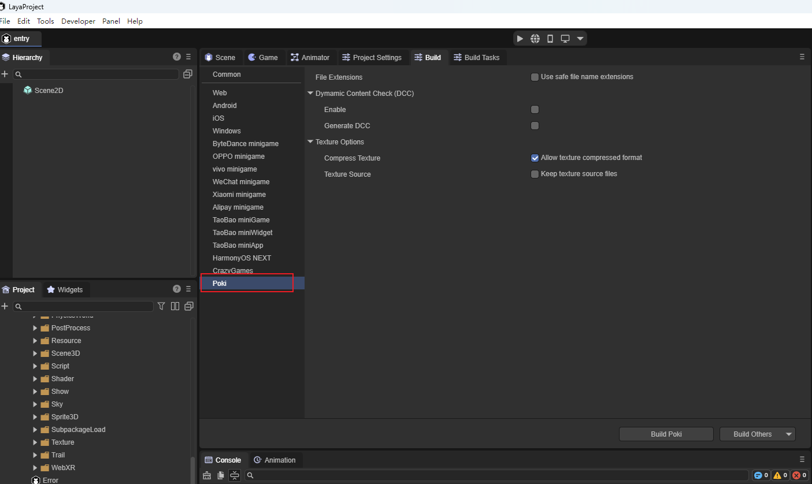
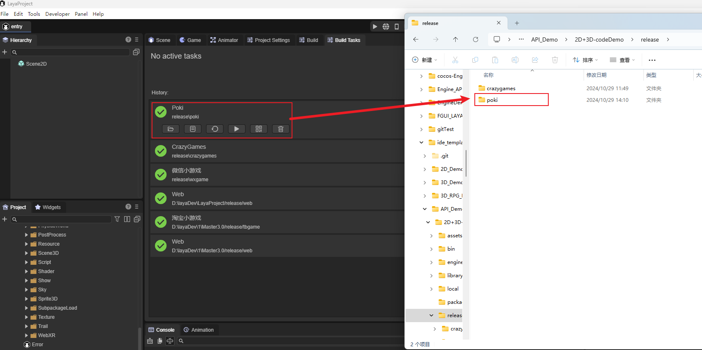
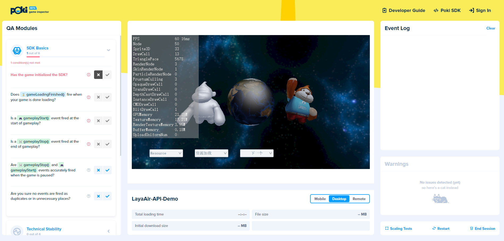

# Poki平台发布

## 1. 在LayaAir-IDE中发布为Poki平台

将项目在LayaAir-IDE中发布为Poki平台，

（图1-1）

发布界面中的配置文件`File Extension`等，以及`Common`的配置可以参考[Web配置](../web/readme.md)与[发布通用配置](../generalSetting/readme.md)。

发布后在项目根目录/release目录下会新增Poki目录，包含项目的发布内容。

（图1-2）

## 2. 进入Poki的Inspector工具上传并测试

进入Poki的Inspector工具：[Inspector](https://inspector.poki.dev/?)。

在Poki的Inspector后台中，可以上传web项目，也可以通过url地址来运行游戏。这里选择在服务器中托管的web url，如图2-1所示，点击open即可打开进行测试。

（图2-1）

## 3. web端Poki平台运行情况

运行IDE创建的API项目3D示例：

（图3-1）

运行IDE创建的API项目2D示例：

（图3-2）

