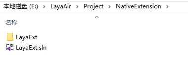
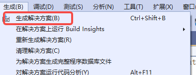
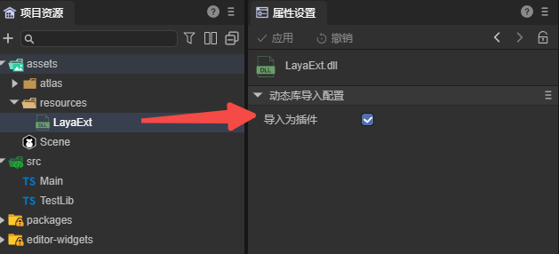

# Windows扩展

## 一、简介

LayaAir支持增加自定义的扩展，用户可以通过LayaNative提供的扩展工具，通过生成动态链接库的形式，为项目提供扩展功能。

扩展的功能主要是导出c++函数或者类给js调用。因为LayaNative经过重构，封装了v8接口，这样用户开发扩展的时候就不再需要LayaNative的源码了，而是直接根据扩展工具中提供的头文件和lib库就可以自己扩展js接口，从而扩展引擎功能。

由于其他平台，尤其是iOS对动态链接库的严格限制，目前LayaNative的扩展功能只对Windows平台开放。


## 二、扩展工具

### 2.1 安装

生成动态链接库需要使用LayaAir提供的扩展工具（laya-ext-creator），开发者需要使用命令行进行安装，打开控制台，输入命令进行安装：

```
npm install laya-ext-creator -g
```

安装完成后，接着执行命令`laya-ext-creator`创建LayaNative扩展模板项目。按要求输入项目名称和目录，如图2-1所示，


（图2-1）

创建的项目如图2-2所示，双击.sln可以打开项目（需要使用Visual Studio2022），继续编辑和编译。



（图2-2）

创建的目录结构如下：

```
LayaExt
  ├── LayaExt.sln
  └── LayaExt/
       ├──layaRuntime/      扩展的SDK
       |     ├── include/
       |     └── lib/
       |          └── x64
       |               └── conch.lib
       ├──dllmain.cpp
       ├──exports.cpp       包含示例代码
       ├──LayaExt.vcxproj
       └──framework.h

```


### 2.2 生成动态链接库

打开项目后，点击图2-3中的“生成解决方案”，



（图2-3）

控制台的输出如下图2-4所示，


（图2-4）

最终在对应的目录中可以看到生成的动态链接库，


（图2-5）


### 2.3 模版项目介绍

开发者可以在扩展工具创建的模板项目的基础上，编辑自定义的扩展功能。此模板项目在exports.cpp中封装了几个简单的函数，可供参考。

int参数

```c
jsvm_value jsAdd(jsvm_env env, jsvm_callback_info info) {
    jsvm_status status;
    size_t argc = 2;
    jsvm_value args[2];
    jsvm_value _this;
    jsvm_get_cb_info(env, info, &argc, args, &_this, nullptr);

    int int1,int2;
    jsvm_get_value_int32(env, args[0], &int1);
    jsvm_get_value_int32(env, args[1], &int2);

    jsvm_value result;
    jsvm_create_int32(env, int1+int2, &result);
    return result;
}
```

字符串参数

```c
jsvm_value jsStr(jsvm_env env, jsvm_callback_info info) {
    jsvm_status status;
    size_t argc = 1;
    jsvm_value args[1];
    jsvm_value _this;
    jsvm_get_cb_info(env, info, &argc, args, &_this, nullptr);

    char strBuff[1024];
    size_t strLen = 0;
    jsvm_get_value_string_utf8(env, args[0], strBuff, 1024, &strLen);
    std::string cstr;
    cstr.assign(strBuff, strLen);
    cstr += " C++ 增加";

    jsvm_value retstr;
    jsvm_create_string_utf8(env, cstr.c_str(), cstr.length(), &retstr);
    return retstr;
}

```

ArrayBuffer参数

```c
jsvm_value jsBin(jsvm_env env, jsvm_callback_info info) {
    jsvm_status status;
    size_t argc = 1;
    jsvm_value args[1];
    jsvm_value _this;
    jsvm_get_cb_info(env, info, &argc, args, &_this, nullptr);

    char* buff = nullptr;
    size_t byteLen = 0;
    jsvm_get_arraybuffer_info(env, args[0], (void**) & buff, &byteLen);
    buff[0] = 22;

    jsvm_value retLen;
    jsvm_create_int32(env, byteLen, &retLen);
    return retLen;
}
```

> 更多参数可以参考头文件。

在`LayaExtInit`函数中，导出上面这些函数，使得JavaScript代码可以调用这些原生功能。

```c
extern "C" {
    LAYAEXTAPI void LayaExtInit(jsvm_env env, jsvm_value exp) {
        //注册新的函数
        jsvm_value fn;
        jsvm_create_function(env, "testAdd", SIZE_MAX, jsAdd, nullptr, &fn);
        jsvm_set_named_property(env, exp, "nativeAdd", fn);

        jsvm_value fn1;
        jsvm_create_function(env, "testStr", SIZE_MAX, jsStr, nullptr, &fn1);
        jsvm_set_named_property(env, exp, "nativeStr", fn1);

        jsvm_value fn2;
        jsvm_create_function(env, "testBin", SIZE_MAX, jsBin, nullptr, &fn2);
        jsvm_set_named_property(env, exp, "nativeBin", fn2);

    }
}
```


## 三、在LayaAir-IDE中使用DLL

使用扩展工具导出动态链接库（.dll）后，可以将该文件放置到assets或src的任意目录，并且勾选“导入为插件”，如图3-1所示。



（图3-1）

然后在IDE中，创建一个脚本文件，命名为`TestLib.ts`，添加如下代码：

```typescript
interface ITestLib {
    nativeAdd(a: number, b: number): number;
}

export const testLib: ITestLib = Laya.importNative("LayaExt.dll");
```

接着在组件脚本`Main.ts`中添加代码：

```typescript
import { testLib } from "./TestLib";
const { regClass, property } = Laya;

@regClass()
export class Main extends Laya.Script {

    onStart() {
        alert(testLib.nativeAdd(10, 11));
    }
}
```

因为LayaNative的扩展功能只支持Windows平台，所以只能通过Windows预览或发布为Windows项目才能得到正确的结果。运行效果如图3-2所示，


（图3-2）


