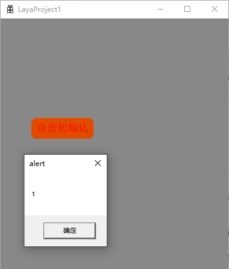
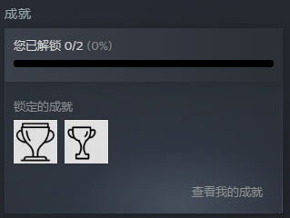
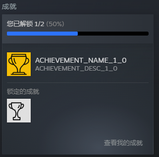

# Steam扩展实例

## 一、概述

LayaAir支持增加自定义的Windows扩展，用户可以通过LayaNative提供的扩展工具，通过生成动态链接库的形式，将Steam官方提供的扩展[功能](https://partner.steamgames.com/doc/features)集成到用LayaAir开发的游戏中，以便在游戏上架Steam商店后使用这些功能。

对接Steam的扩展功能需要使用Steam官方提供的[Steamworks API](https://partner.steamgames.com/doc/api)，通过访问此 API 提供的基础系统，可以充分利用Steam中的所有扩展功能，包括用户打开 Steam 叠加界面时暂停游戏、邀请好友、允许玩家解锁 Steam 成就等。

在集成Steam扩展前，开发者需要准备以下内容：

- 阅读[Windows扩展](../extension/readme.md)文档，集成Steam扩展功能需要使用LayaNative扩展工具，安装步骤都在此文档中。
- 在[SteamWorks](https://partner.steamgames.com/)中创建开发者账号，填写信息、付款并等待审核通过。账号审核后，在主面板上创建一个[应用程序](https://partner.steamgames.com/doc/store/application)，获取到应用的AppID。
- 下载[Steamworks SDK](https://partner.steamgames.com/downloads/steamworks_sdk.zip)并解压缩，将Steamworks API头文件夹 `public/steam` 复制到LayaNative扩展工具中（本文使用的SDK版本为steamworks_sdk_161）。


## 二、初始化

在使用Steam扩展功能前，必须先进行初始化。这样就可设置全局状态，并填入可以通过与此接口名称匹配的全局函数访问的接口指针。可以通过调用 [SteamAPI_Init](https://partner.steamgames.com/doc/api/steam_api#SteamAPI_Init) 函数完成初始化。 

> 注意：**必须**调用此函数并返回成功，才能访问任何 [Steamworks 接口](https://partner.steamgames.com/doc/sdk/api#steamworks_interfaces)。

在初始化时，需要注意以下几点：

- 初始化时，Steam客户端需要运行起来，并使用SteamWorks中的开发者账号登录。
- Steamworks API 需要得到游戏的 AppID 才会初始化。使用LayaAir构建发布Windows项目后，在可执行文件（.exe）旁创建名为 `steam_appid.txt` 的文本文件，其中只包含 AppID，不含有任何其他内容。

### 2.1 封装初始化功能

在LayaNative扩展工具中，可以添加一个SteamManager类，并通过如下代码，调用Steam SDK中的接口，进行初始化，

```c
bool SteamManager::Initialize()
{
    // 是否进行过初始化
    if (m_bInitialized)
    {
        return true;
    }

    SteamErrMsg msg;    

    if (SteamAPI_InitEx(&msg) != ESteamAPIInitResult::k_ESteamAPIInitResult_OK)
    {
        // Steam初始化失败, 请确保Steam客户端正在运行
        return false;
    }

    m_bInitialized = true;
    
    return true;
}
```

然后在exports.cpp中，实现Steam初始化`Initialize`的接口封装，

```c
jsvm_value jsInitializeSteam(jsvm_env env, jsvm_callback_info info) {
    bool success = SteamManager::GetInstance()->Initialize();
    printf("init steam!!!");
    jsvm_value result;
    JSVM_CALL_CHECK(jsvm_create_int32(env, success ? 1 : 0, &result));
    return result;
}
```

最后，在`LayaExtInit`函数中，导出初始化功能，使得JavaScript代码可以调用这些原生功能。

```c
extern "C" {
    LAYAEXTAPI void LayaExtInit(jsvm_env env, jsvm_value exp) {
        ...
        // 注册Steam初始化函数
        jsvm_value fnInitSteam;
        jsvm_create_function(env, "initializeSteam", SIZE_MAX, jsInitializeSteam, nullptr, &fnInitSteam);
        jsvm_set_named_property(env, exp, "initializeSteam", fnInitSteam);
    }
}
```


### 2.2 生成动态链接库

> 生成动态链接库与其使用的方法可以参考[Windows扩展](../extension/readme.md)文档。

生成的动态链接库`steam_demo.dll`如图2-1所示，


（图2-1）

还需要一个`steam_api64.dll`，可以在[Steamworks SDK](https://partner.steamgames.com/downloads/steamworks_sdk.zip)的`redistributable_bin/win64`目录下找到。

最后，将这两个dll导入到LayaAir-IDE中的游戏项目即可。


### 2.3 完成初始化

在LayaAir-IDE中，新建一个`extlib.ts`脚本，添加如下代码，设置初始化Steam的接口，

```typescript
interface IExtendLib {
    // 初始化Steam
    initializeSteam(): number;  // 返回1表示成功，0表示失败
}

export const extendLib: IExtendLib = Laya.importNative("steam_demo.dll");
```

然后在Scene2D上新建一个组件脚本，当点击按钮时，完成初始化。

```typescript
import { extendLib } from "./extlib";

const { regClass, property } = Laya;

@regClass()
export class NewScript extends Laya.Script {

    @property({type: Laya.Button})
    public initBtn: Laya.Button;

    onEnable(): void {
        this.initBtn.on(Laya.Event.CLICK, this.onInit);
    }

    onInit() {
        alert(extendLib.initializeSteam());
    }

}
```

构建发布Windows后，需要在exe的同级目录下，新建一个`steam_appid.txt` 文件，其中只包含 AppID。


（图2-2）

在Steam客户端登录的前提下，双击可执行文件，如果返回值为“1”，如图2-3所示，则表示初始化成功。



（图2-3）

初始化成功后，就可以继续使用Steam的更多扩展了。


## 三、成就

[成就](https://partner.steamgames.com/doc/features/achievements/ach_guide)可以用来鼓励并奖励玩家在游戏中的互动和取得的里程碑。成就通常用来记录游戏中的击杀数、里程数、开箱数或其它常见行为。解锁后，这些成就将会在玩家窗口的角落弹出，并会在该玩家的成就页面上标示。

### 3.1 设定游戏的成就

首先需要在后端的 Steamworks 应用程序管理的[成就配置](https://partner.steamgames.com/apps/achievements/)页面进行设置。这里给出一个成就列表的示例，如图3-1所示，


（图3-1）

这里的“API名称”，在成就功能相关接口中，会作为参数用到（可以理解为此游戏成就的ID）。


### 3.2 获取数据与建立回调

在设置成就前，需要先初始化，并且处理初始调用`RequestStats` 的回调，因此，需要在初始化的方法中，加入处理该回调的过程。代码如下所示，

```c
bool SteamManager::Initialize()
{
    // 初始化的代码
    ......
    
    // 请求用户统计数据
    CSteamID userID = SteamUser()->GetSteamID(); // 获取用户ID
    SteamUserStats()->RequestUserStats(userID);

    // 重置成就，可用于测试时使用
    // SteamUserStats()->ResetAllStats(true);

    return true;
}
```

> [官方文档](https://partner.steamgames.com/doc/features/achievements/ach_guide)中，处理`RequestStats`给出的是[RequestCurrentStats](https://partner.steamgames.com/doc/api/ISteamUserStats#RequestCurrentStats)函数，但在steamworks_sdk_161中该接口已经被注释掉了，因此采用[RequestUserStats](https://partner.steamgames.com/doc/api/ISteamUserStats#RequestUserStats)进行处理。

除了获取用户数据，还需要建立一个[回调](https://partner.steamgames.com/doc/sdk/api#callbacks)，用于通知Steam现在的成就状态，代码如下，

```c
void SteamManager::SteamCallback()
{
    // 每帧调用
    if (m_bInitialized)
    {
        SteamAPI_RunCallbacks();
    }
}
```


### 3.3 封装成就功能

在SteamManager类中，添加如下代码，调用Steam SDK中的接口实现成就功能，参数`achievementID`就是图3-1中的“API名称”，

```c
bool SteamManager::SetAchievement(const char* achievementID)
{
    if (!m_bInitialized || !SteamUserStats())
    {
        // Steam未初始化或统计接口不可用
        return false;
    }

    if (!SteamUser()->BLoggedOn())
    {
        // Steam用户未登录
        return false;
    }

    // 检查成就是否已解锁
    bool alreadyAchieved = false;
    if (SteamUserStats()->GetAchievement(achievementID, &alreadyAchieved))
    {
        if (alreadyAchieved)
        {
            printf("成就已经解锁", achievementID);
            return false;
        }
    }

    bool result = SteamUserStats()->SetAchievement(achievementID);
    if (result)
    {
        // 立即存储更新
        return SteamUserStats()->StoreStats();
    }
    return false;
}
```

然后在exports.cpp中，封装`SteamCallback`和`SetAchievement`，代码如下，

```c
jsvm_value jsSteamCallback(jsvm_env env, jsvm_callback_info info) {
    SteamManager::GetInstance()->SteamCallback();
    jsvm_value result;
    JSVM_CALL_CHECK(jsvm_create_int32(env, 1, &result));
    return result;
}

jsvm_value jsSetAchievement(jsvm_env env, jsvm_callback_info info) {
    size_t argc = 1;
    jsvm_value args[1];
    jsvm_value _this;
    JSVM_CALL_CHECK(jsvm_get_cb_info(env, info, &argc, args, &_this, nullptr));

    bool success = SteamManager::GetInstance()->SetAchievement(achievementID);
    jsvm_value result;
    JSVM_CALL_CHECK(jsvm_create_int32(env, success ? 1 : 0, &result));
    return result;
}
```

最后，在`LayaExtInit`函数中，导出初始化功能，使得JavaScript代码可以调用这些原生功能。

```c
extern "C" {
    LAYAEXTAPI void LayaExtInit(jsvm_env env, jsvm_value exp) {
        // 注册Steam相关函数
        ......

        // 注册成就相关函数
        jsvm_value fnSetAchievement;
        jsvm_create_function(env, "setAchievement", SIZE_MAX, jsSetAchievement, nullptr, &fnSetAchievement);
        jsvm_set_named_property(env, exp, "setAchievement", fnSetAchievement);

        jsvm_value fnSteamCallback;
        jsvm_create_function(env, "steamCallback", SIZE_MAX, jsSteamCallback, nullptr, &fnSteamCallback);
        jsvm_set_named_property(env, exp, "steamCallback", fnSteamCallback);
    }
}
```


### 3.4 设定成就

生成动态链接库并导入到LayaAir-IDE后，在`extlib.ts`脚本中，添加如下代码，编辑设置Steam成就的接口，

```typescript
interface IExtendLib {
    // 初始化Steam
    initializeSteam(): number;  // 返回1表示成功，0表示失败
    
    // 设置（解锁）某个成就
    setAchievement(achievementID: string): number;  // 返回1表示成功，0表示失败

    steamCallback(): number;  // Steam回调函数，返回1表示成功，0表示失败
}

export const extendLib: IExtendLib = Laya.importNative("steam_demo.dll");
```

然后在Scene2D上新建一个组件脚本，当点击按钮时，完成初始化，再点击按钮，设置指定成就。

```typescript
import { extendLib } from "./extlib";

const { regClass, property } = Laya;

@regClass()
export class NewScript extends Laya.Script {

    @property({type: Laya.Button})
    public initBtn: Laya.Button;

    @property({type: Laya.Button})
    public setAchieve: Laya.Button;

    onEnable(): void {
        this.initBtn.on(Laya.Event.CLICK, this.onInit);
        this.setAchieve.on(Laya.Event.CLICK, this.achievememtsettings);
    }

    // 每帧执行
    onUpdate(): void {
        extendLib.steamCallback();
    }

    onInit() {
        alert(extendLib.initializeSteam());
    }

    achievememtsettings(): void {
        if (extendLib.initializeSteam()) {
            // 解锁成就
            extendLib.setAchievement("NEW_ACHIEVEMENT_1_0");
        }
    }
}
```

> NEW_ACHIEVEMENT_1_0 是图3-1中的“API名称”。


### 3.5 效果展示

最终的运行效果如动图3-2所示，先初始化，再解锁成就，


（动图3-2）

点击完成成就按钮后，桌面会显示弹框，如图3-3所示，


（图3-3）

在成就完成前，Steam客户端显示的状态如图3-4所示，



（图3-4）

解锁成就后，状态如图3-5所示，



（图3-5）


