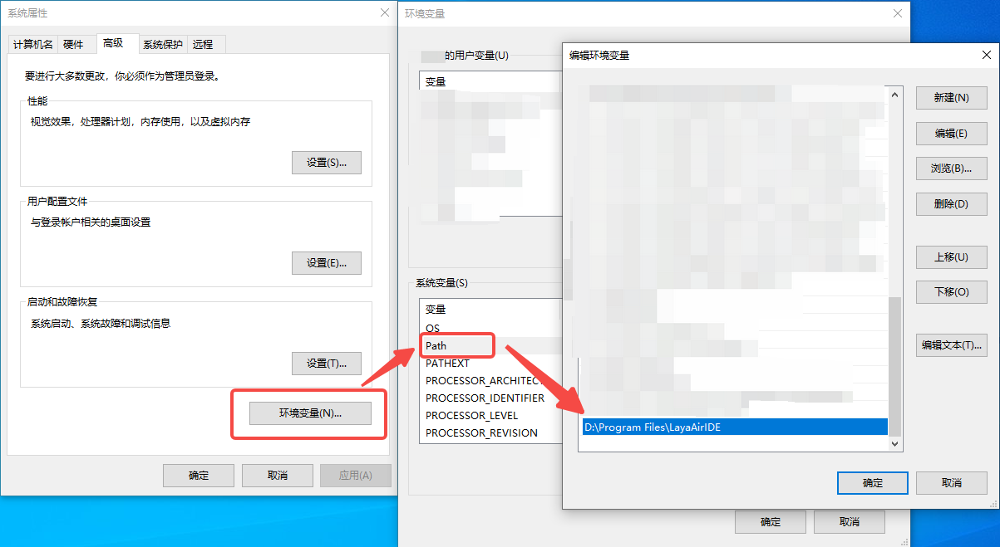

# 命令行支持

## 一、启动编辑器

下载LayaAir-IDE后，在本地环境变量中添加Path，如图1-1所示，其中`D:\Program Files\LayaAirIDE`为安装路径，



（图1-1）

然后打开命令行窗口，即可在终端中启动IDE，命令为：

```
> LayaAirIDE --project=/path/to/project
```

**--project:**  要打开的项目路径（全路径）。例如，在`C:\Users\ASUS\Desktop\LayaProject`有一个LayaAir项目，在终端中输入`LayaAirIDE --project=C:\Users\ASUS\Desktop\LayaProject`即可打开该项目，如图1-2所示。


（图1-2）


## 二、执行脚本

还可以在终端中输入命令，并在后台执行脚本，命令为：

```
> LayaAirIDE --project=/path/to/project --script=MyScript.buildWeb
```

**--project:**  项目路径（全路径）。

**--script:** 指定执行的脚本文件。

例如，在项目中添加`MyScript.ts`脚本文件，并添加如下代码，然后就可以使用命令`LayaAirIDE --project=C:\Users\ASUS\Desktop\LayaProject --script=MyScript.buildWeb`构建Web平台，如图2-1所示。后台脚本执行结束后，后台进程会自动退出。

```typescript
@IEditorEnv.regClass()
class MyScript {
    static async buildWeb() {
        return IEditorEnv.BuildTask.start("web").waitForCompletion();
    }
}
```


（图2-1）

下面给出各平台的发布脚本，

```typescript
@IEditorEnv.regClass()
class MyScript {
    // 构建web
    static async buildWeb() {
        return IEditorEnv.BuildTask.start("web").waitForCompletion();
    }

    // 构建微信小游戏
    static async buildWxgame() {
        return IEditorEnv.BuildTask.start("wxgame").waitForCompletion();
    }

    // 构建抖音小游戏
    static async buildBytedancegame() {
        return IEditorEnv.BuildTask.start("bytedancegame").waitForCompletion();
    }

    // 构建oppo小游戏
    static async buildOppogame() {
        return IEditorEnv.BuildTask.start("oppogame").waitForCompletion();
    }

    // 构建vivo小游戏
    static async buildVivogame() {
        return IEditorEnv.BuildTask.start("vivogame").waitForCompletion();
    }

    // 构建小米快游戏
    static async buildXmgame() {
        return IEditorEnv.BuildTask.start("xmgame").waitForCompletion();
    }

    // 构建支付宝小游戏
    static async buildAlipaygame() {
        return IEditorEnv.BuildTask.start("alipaygame").waitForCompletion();
    }

    // 构建淘宝小游戏
    static async tbgame() {
        return IEditorEnv.BuildTask.start("tbgame").waitForCompletion();
    }
}
```

对应的终端命令为：

```
// 构建web
>LayaAirIDE --project=C:\Users\ASUS\Desktop\LayaProject --script=MyScript.buildWeb
// 构建微信小游戏
>LayaAirIDE --project=C:\Users\ASUS\Desktop\LayaProject --script=MyScript.buildWxgame
// 构建抖音小游戏
>LayaAirIDE --project=C:\Users\ASUS\Desktop\LayaProject --script=MyScript.buildBytedancegame
// 构建oppo小游戏
>LayaAirIDE --project=C:\Users\ASUS\Desktop\LayaProject --script=MyScript.buildOppogame
// 构建vivo小游戏
>LayaAirIDE --project=C:\Users\ASUS\Desktop\LayaProject --script=MyScript.buildVivogame
// 构建小米快游戏
>LayaAirIDE --project=C:\Users\ASUS\Desktop\LayaProject --script=MyScript.buildXmgame
// 构建支付宝小游戏
>LayaAirIDE --project=C:\Users\ASUS\Desktop\LayaProject --script=MyScript.buildAlipaygame
// 构建淘宝小游戏
>LayaAirIDE --project=C:\Users\ASUS\Desktop\LayaProject --script=MyScript.tbgame
```

还可以指定执行脚本参数，命令为：

```
> LayaAirIDE --project=/path/to/project --script=Script.Speak --script-args="say \"hello world\""
```

**--project:**  项目路径（全路径）。

**--script:** 指定执行的脚本文件。

**--script-args**: 指定执行的脚本参数。上述示例中，脚本的参数就会传递("say", "hello world")。

例如，在项目中新建脚本文件Script.ts，然后添加如下代码：

```typescript
@IEditorEnv.regClass()
class Script {
    
    static speak(arg1: any, arg2: any) {
        console.log(arg1); 
        console.log(arg2); 
    }
}
```

然后打开终端，输入命令`LayaAirIDE --project=C:\Users\ASUS\Desktop\LayaProject --script=Script.speak --script-args="say \"hello world\""`后，如图2-2所示，可以看到进行了成功的输出。

> 注意：传入的参数中，外层的引号用来定义参数字符串的边界。反斜杠是转义字符，它与内层引号的组合用于指示这里的双引号是字符串内容的一部分，而不是边界标识。


（图2-2）


