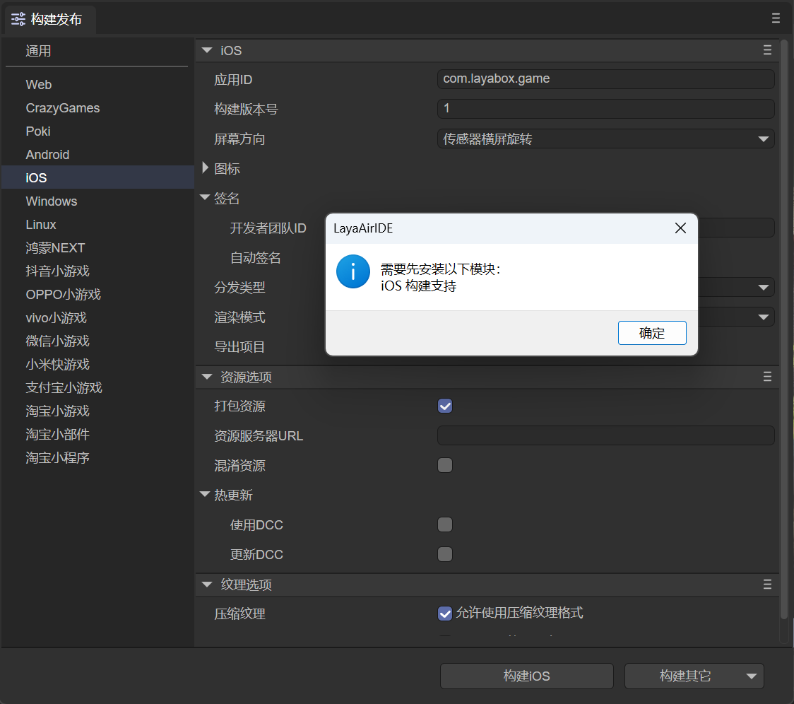
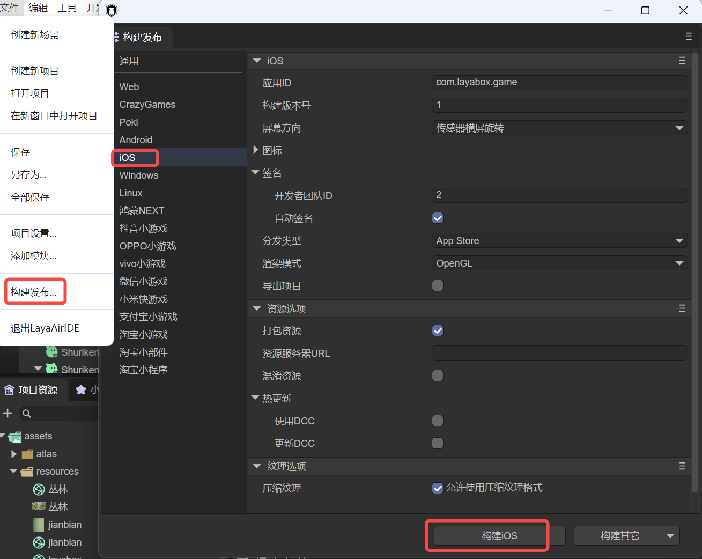

# iOS构建发布

一、安装构建发布的环境

在构建发布iOS之前，我们需要先添加iOS的发布环境模块，如图1-1所示，点击`文件`菜单栏下的`添加模块`选项，

  

（图1-1）

如果我们不先添加发布环境，当点击构建iOS时，也会弹出安装模块的提示，如图1-2所示。

 

（图1-2）

如果弹出提示，点击确定，可以自动跳转到安装界面，点击安装，会自动下载并安装好安卓构建所需要的环境。

由于构建工具需的库文件比较大，因此并没有直接包含在LayaAirIDE中，在第一次使用这个工具的时候，会先下载相应的支持模块。

> 文件较大，下载时需要耐心等待。

## 二、构建发布

在`文件`菜单中，打开“`构建发布`”选项，选择 `iOS` 平台标签，如图2-1所示，

  

（图2-1）

首先，我们先了解各个常用配置的作用。

### 2.1 应用ID

应用的包名，这个正常情况下是不可见的。一般采用反域名命名规则（有利于分辨和避免与系统中已经有的APP冲突)。

例如 : com.layabox.runtime.demo

包名必须是 xxx.yyy.zzz 的格式，至少要有两级，即xxx.yyy 。否则打包会失败。  

### 2.2 构建版本号

Native工程的版本，开发者自己定义识别用的。

### 2.3 打包资源

是否把为当前平台导出的资源（resource目录）打包到native项目中。打包的资源会放到特定的目录中，以供后续生成不同平台的App。

如果希望提供单机版，则必须选择打包资源，即勾选“打包资源”，并且保留“资源服务器URL”为空。把资源直接打进App包中，可以避免网络下载，加快资源载入速度。

> 把资源打包的缺点是会增加包体的大小。
>
> 如果想发布勾选“打包资源”的在线游戏，必须在server端打dcc，否则就会失去打包的优势。

### 2.4 混淆资源

如果勾选，在打包资源的时候，会随机混淆资源，主要作用是避免在上架的时候被平台扫描到某些敏感函数。

### 2.5 资源服务器URL

填写服务器地址即可，注意要在地址后加上index.js。

例如：http://192.168.31.109:8000/index.js

### 2.6 热更新（DCC）

启用DCC后，可以打包资源，也可以不打包。

> 参考[DCC文档](../native/LayaDcc_Tool/readme.md)。

### 2.7 屏幕方向

> 参考[横竖屏设置](../native/screen_orientation/readme.md)。

### 2.8 图标

应用图标是用户在设备上看到的应用的视觉标志。为了适应不同的设备和显示情况，你需要准备多种分辨率的图标文件。

通过在项目设置中指定这些图标文件，可以确保应用在各类iOS设备上都能以最佳图标显示。

### 2.9 签名

签名是重要的安全措施，用于验证应用程序的来源和完整性。

- 开发者团队ID：这是苹果开发者账号的唯一标识符，用于标识开发者的身份。所有应用在上传到App Store之前，都必须使用有效的开发者ID进行签名。这个ID通常是一个10位字符的字符串，由字母和数字组成。

- 自动签名：Xcode可以自动处理签名过程，通过启用自动签名功能，Xcode将自动生成相应的证书和配置文件，帮助简化发布过程。

### 2.10 分发类型

不同的分发类型帮助开发者在开发、测试和发布的各个阶段更好地管理应用。在选择适当的分发类型时，开发者应该根据应用的开发阶段和目标用户进行权衡。

**App Store：**

- 这种分发类型用于将应用发布到苹果App Store。

- 应用需要经过苹果的审核流程，必须符合App Store的指南和政策。

- 在这种模式下，应用的构建需要进行签名并生成发布配置文件。

**Debugging：**

- 这种分发类型用于开发过程中的调试。

- 调试构建包含符号信息和调试工具所需的数据，通常没有优化，以便更容易找到和修正问题。

- 这种模式不适合分发给最终用户，因为它们包含更多的开发细节。

**Enterprise：**

- 企业分发适用于企业内部分发应用，尤其是用于开发内部工具或业务应用，而无需通过App Store。

- 需要一个苹果企业开发者账号以支持这种类型的分发。

- 应用可以通过企业的内部渠道进行安装，比如使用MDM（移动设备管理）系统。

**Release Testing：**

- 这种分发类型一般用于发布之前的测试。

- 在发布测试阶段，构建将进行优化，且包含更少的调试信息，以更接近最终的生产环境。

- 此选项可能用于预发布版本，让测试人员对准备发布的应用进行测试，确保质量和性能。

### 2.11 渲染模式

有OpenGL和WebGL两种渲染模式，一般默认选择OpenGL即可。

### 2.12 导出项目

勾选后，构建发布的项目将不会自动打包成ipa包，而是发布为原生包XCode工程。

### 2.13 纹理选项

`压缩纹理`：一般需要勾选“允许使用压缩纹理格式”，如果不勾选，则忽略所有图片对于压缩格式的设置。

`纹理源文件`：可以不勾选“始终包含纹理源文件”，如果勾选，则即使图片使用了压缩格式，仍然把源文件（png/jpg)打包。目的是遇到不支持压缩格式的系统时，fallback到源文件。

## 三、构建XCode工程

构建iOS项目需要准备好Mac电脑和XCode，要求系统最低版本为10.0

### 3.1 构建好的项目工程的使用

构建发布时，如果勾选`导出项目`，则会导出构建好的XCode工程，可以用对应的开发工具打开进行二次开发和打包等操作。

iOS项目可以使用 xcode 软件进行导入和开发。打开XCode(ios)项目后需要选择真正的ios设备进行构建。

XCode工程的门槛较高。如果是新手，不具备相关知识，请先去学习了解相关XCode的基础开发知识。

这里提供了一篇简单的**参考资料：**

[《IOS打包发布App详细流程》](https://github.com/layabox/layaair-doc/tree/master/Chinese/LayaNative/packagingReleases_IOS)

### 3.2 手动切换单机版和网络版

构建完成之后，可以通过直接在项目中修改代码来切换单机版和网络版。

项目目录下的 resource/scripts/index.js 脚本的最后有个执行loadUrl的函数，这里会加载首页地址，修改这里的地址就能切换单机版和网络版，单机版的地址固定为 `http://stand.alone.version/index.js`。

例如，一开始是网络版，地址为：  

 `loadUrl(conch.presetUrl||"http://10.10.20.19:7788/index.js");`   

要改成单机版的话，修改这里：  

 `loadUrl(conch.presetUrl||"http://stand.alone.version/runtime.json");`  

反之亦然。  

> 一旦修改了url地址，原来打包的资源就都失效了。这时候，需要手动删除 cache目录下内容，重新用layadcc来生成打包资源，参见[LayaDCC工具](../native/LayaDcc_Tool/readme.md)。

### 3.3 资源

通过IDE构建好工程，

- 如果选择的是单机版（打包资源）版本，会把所有的H5项目的资源（包括：脚本、图片、html、声音等）全部打包到了这个目录下：

release\ios\ios_project\resource\cache

- 如果是联网且不打包资源的版本，资源则使用发布目录下的resource目录（release\resource）。
