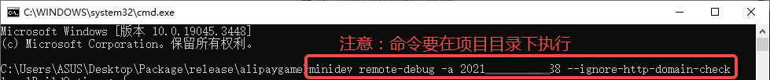

# 支付宝小游戏

## 一、概述

支付宝小游戏不需要用户进行下载，是点开即玩的全新游戏类型。

相较 APP，小游戏有着开发周期短、开发成本低等特性，能够让开发者更简单的参与到开发过程中。实现快速上线，快速变现。

推荐要看一下支付宝小游戏的[文档](https://www.yuque.com/zhifubaoxiaoyouxi-zromu/ts2ry9)，其中第一篇[《如何快速上线一个小游戏》](https://www.yuque.com/zhifubaoxiaoyouxi-zromu/ts2ry9/cd5abg3aaneeoopq)能够帮助开发者快速发布上线小游戏项目，安装小游戏开发工具也会用到这篇文章的内容。LayaAir引擎的文档更多的是引擎相关的，当然也会混合了一些小游戏[接口](https://www.yuque.com/zhifubaoxiaoyouxi-zromu/ts2ry9/dzptpo)的应用介绍。


## 二、构建发布为支付宝小游戏

### 2.1 选择目标平台

在LayaAir的文件菜单栏中，选择构建发布选项。然后在弹出的界面里，选择目标平台为`支付宝小游戏`，如图2-1所示：


（图2-1）

`ES6转ES5`：若构建发布后，需要使用支付宝小游戏开发工具的“真机调试”功能，则需要勾选该选项。一般建议勾选。


### 2.2 发布后的小游戏目录介绍

发布后的目录结构如图2-2所示 ：


（图2-2）

**`js` 项目文件 与 `libs` 引擎库目录**

项目代码和类库

**`resources`资源目录 与 `Scene.ls`**

resources资源目录和场景资源文件Scene.ls，小游戏由于初始包的限制，建议将初始包的内容提前规划好，最好能放到统一的目录下，便于初始包的剥离。

**`game.js`支付宝小游戏的入口文件**

游戏项目入口JS文件与适配库JS等都是在这里进行引入。IDE创建项目的时候已生成好，一般情况下，这里不需要动。

**`game.json` 小游戏的配置文件**

开发者工具和客户端需要读取这个配置，完成相关界面渲染和属性设置。

**`project.config.json` 小游戏的项目配置文件**

文件里包括了小游戏项目的一些信息。

**`my-adapter.js` 支付宝小游戏适配库文件**

用于适配支付宝小游戏。


## 三、使用支付宝小游戏开发工具

调试LayaAir构建发布后的支付宝小游戏项目，需要安装小游戏开发工具。步骤如下：

### 3.1 申请小游戏应用

不论是调试还是发布支付宝小游戏，都需要一个AppID。获取这个AppID需要登录[开发者官网](https://open.alipay.com/)，登录自己的开发者账号（支付宝账号），创建小游戏，具体的操作可以参考支付宝的[文档](https://www.yuque.com/zhifubaoxiaoyouxi-zromu/ts2ry9/cd5abg3aaneeoopq)。创建一个小游戏后，就会生成一个AppID，开发者在调试和发布环节都会用到它。


### 3.2 安装小游戏开发工具

支付宝小游戏开发工具需要通过命令行使用，开发者可以打开命令行面板（以管理员身份运行），输入如下命令进行安装：

```bash
npm i -g minidev@1.8.10
```

安装过程中，可能会因为网络问题造成卡顿，要注意的是，这里的node.js版本不能过低，最起码要高于12。

> 字符@后面的1.8.10表示小游戏开发工具的版本，开发者在安装时要根据需求选择合适的版本。


### 3.3 登录支付宝开发者账号

下载好小游戏开发工具后，就要进行登录了，登录也是通过命令行。

接着上一步，执行`minidev login`命令后，会出现一个二维码，开发者使用支付宝扫码登陆开发者账号即可。

如图3-1所示，登录成功后会显示“完成授权”字样。


（图3-1）


### 3.4 预览或真机调试

准备好小游戏开发工具后，就要调试LayaAir构建发布的小游戏项目了。支付宝给出了预览和真机调试两种方式，都需要通过命令行来执行。一般LayaAir项目构建发布为支付宝小游戏后，都是**使用真机调试**。因为真机调试会在PC的浏览器上打开调试面板，而预览只能在手机端打开调试面板。

#### 3.4.1 预览

预览，要求安装的小游戏开发工具版本`\>= @ali/minidev@1.2.10`。

在项目目录执行命令：`minidev preview -a 2021xxx --ignore-http-domain-check`，其中“2021xxx”为3.1节中生成的AppID。效果如图3-2所示：


（图3-2）

执行后的结果如图3-3所示，


（图3-3）

用支付宝扫码预览效果，如图3-4所示，可以点击右上角的三个点打开调试面板。


（图3-4）

> 实际操作时，不推荐使用预览，开发者有兴趣可以查看支付宝[文档](https://www.yuque.com/zhifubaoxiaoyouxi-zromu/ts2ry9/cd5abg3aaneeoopq)中的相关详细内容。

#### 3.4.2 真机调试

真机调试，要求安装的小游戏开发工具版本`\>= @ali/minidev@1.3.0`，真机调试需要在图2-1中，即LayaAir构建发布为支付宝小游戏时勾选**ES6转ES5**。

在项目目录执行命令：`minidev remote-debug -a 2021xxx --ignore-http-domain-check`，其中“2021xxx”为3.1节中生成的AppID。效果如图3-5所示：



（图3-5）

执行后的结果如图3-6所示，会生成一个地址用于远程调试，并且生成一个二维码，开发者使用支付宝扫码就可以查看效果。


（图3-6）

此时在PC的浏览器上打开远程地址，会显示出调试面板，如图3-7所示，


（图3-7）

> 对于个人开发者来说，真机调试可能会遇到看不到对应小游戏等问题，支付宝的[文档](https://www.yuque.com/zhifubaoxiaoyouxi-zromu/ts2ry9/sorpbdvftm6tkcc6)中总结了一些常见问题。


### 3.5 上传与发布

若想将调试好的支付宝小游戏真正发布到线上，还需要上传和发布操作。

上传，要求安装的小游戏开发工具版本`\>=@ali/minidev@1.4.2`，也需要在项目目录中使用命令执行：`minidev upload -a 2021xxx -v 0.0.1 --game`，其中“2021xxx”为3.1节中生成的AppID。上传之后，在开放平台，就可以对上传的版本生成体验码。

发布，审核通过后，在[小程序官网](https://mini.open.alipay.com/channel/miniIndex.htm)进行发布上线。

> 上传命令的具体参数要求可以参考支付宝[文档](https://www.yuque.com/zhifubaoxiaoyouxi-zromu/ts2ry9/cd5abg3aaneeoopq)。


## 四、分包加载

下面介绍LayaAir IDE给支付宝小游戏分包的方法，开发者可以先看一下[《Web发布》](../../web/readme.md)的分包。可以通过以下步骤进行分包加载，如图4-1所示，勾选开启分包，然后选择要分包的文件夹即可。开发者还可以选择是否开启远程包。


（图4-1）

>支付宝小游戏分包限制：
>
>- 整个小游戏所有主包+分包大小不超过 20M
>- 主包不超过 4M
>- 单个普通分包不限制大小
>
>请参考支付宝小游戏[文档](https://www.yuque.com/zhifubaoxiaoyouxi-zromu/ts2ry9/bsqy3cit5ztbxl1q)。

调试分包加载时使用的支付宝小游戏开发工具，需要升级到`1.8.10`及以上版本。

IDE自动加载分包需要在发布时勾选分包的“启动时自动加载”选项。如果是代码引用资源，方法与web发布略有不同，加载代码示例如下：

```typescript
const { regClass, property } = Laya;

@regClass()
export class Script extends Laya.Script {

    @property({ type: Laya.Scene3D })
    scene3d: Laya.Scene3D;

    constructor() {
        super();
    }

    // 组件被激活后执行，此时所有节点和组件均已创建完毕，此方法只执行一次
    onAwake(): void {

        //支付宝小游戏
        Laya.loader.loadPackage("sub1", this.printProgress).then(() => {
            Laya.loader.load("sub1/Cube.lh").then((res: Laya.PrefabImpl) => {
                let sp3: Laya.Sprite3D = res.create() as Laya.Sprite3D;
                this.scene3d.addChild(sp3);
            });
        })

        Laya.loader.loadPackage("sub2", this.printProgress).then(() => {
            Laya.loader.load("sub2/Sphere.lh").then((res: any) => {
                let sp3 = res.create();
                this.scene3d.addChild(sp3);
            });
        })
        
    }

    printProgress(res: any) {
        console.log("加载进度" + JSON.stringify(res));
    }

}
```

代码中`printProgress`会打印加载进度日志，效果如下所示：


（图4-2）

