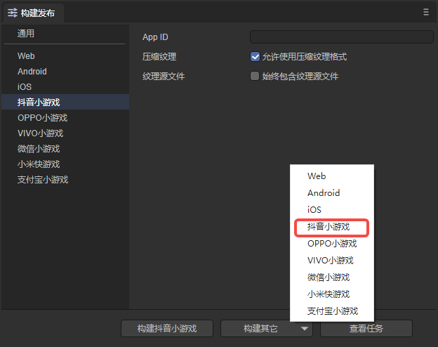
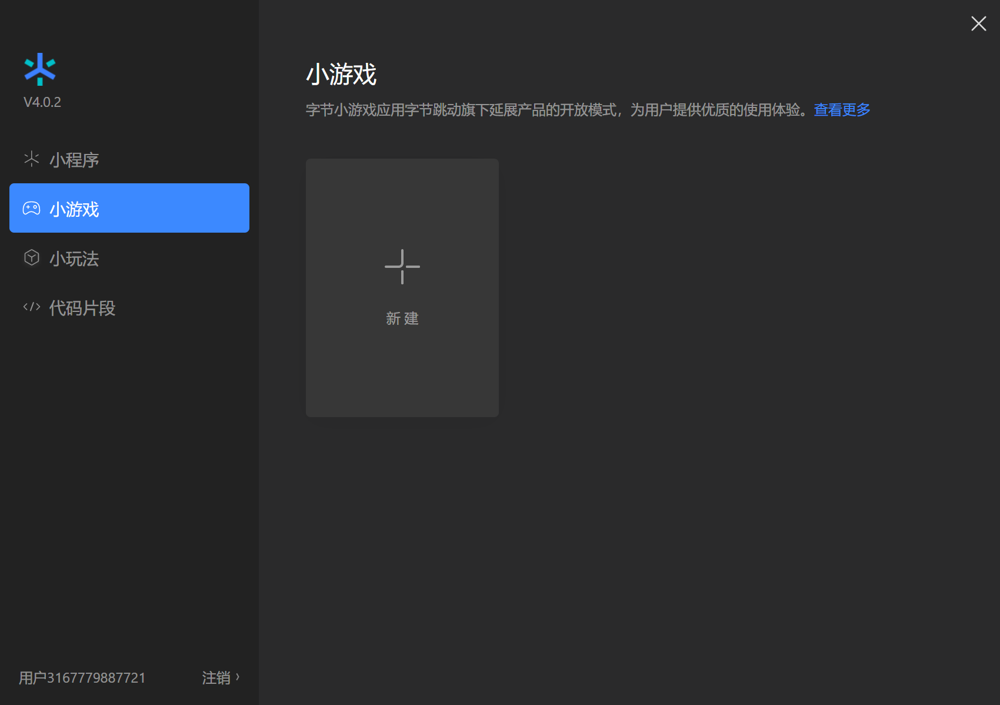

# 字节跳动小游戏

## 一、概述

字节小游戏是基于字节跳动全产品矩阵开发，不需用户进行下载，点开即玩的全新游戏类型。

相较 APP，小游戏有着开发周期短、开发成本低等特性，能够让开发者更简单的参与到开发过程中。实现快速上线，快速变现。

小游戏有无需下载、玩法简单等特性，与图文、视频等场景有着天然的搭配性。字节跳动全产品矩阵以内容分发为核心，通过内容带动小游戏分发，由内容为小游戏带量以及裂变。

推荐要看一看字节小游戏官方的文档，LayaAir引擎的文档更多的是引擎相关的，当然也会混合了一些小游戏接口的应用介绍，但是仔细看看字节官方文档肯定没错。

**链接如下：**

https://microapp.bytedance.com/docs/zh-CN/mini-game/guide/mini-game

**下载并安装字节开发者工具**

字节开发者工具主要用于小游戏产品的预览与调试、真机测试、上传提交等。是小游戏开发的必备工具。

**开发工具下载地址**：
https://microapp.bytedance.com/docs/zh-CN/mini-game/develop/developer-instrument/developer-instrument-update-and-download/

**字节小游戏API地址**：

https://microapp.bytedance.com/docs/zh-CN/mini-game/develop/api/mini-game/bytedance-mini-game

## 二、发布为字节小游戏

### 2.1 选择目标平台

点击构建项目，在弹出的构建项目界面里，选择发布平台为字节小游戏。如图2-1所示

 

（图2-1）

### 2.2 发布后的小游戏目录介绍

发布后的目录结构如图2-2所示

 

（图2-2）

**`js` 项目文件 与 `libs` 引擎库目录**

项目代码和类库

**`resources`资源目录 与 Scene.js**

resources资源目录和资源文件Scene.js，小游戏由于初始包的限制，建议将初始包的内容在规划好，最好能放到统一的目录下，便于初始包的剥离。

**`game.js`字节小游戏的入口文件**

游戏项目入口JS文件与适配库JS等都是在这里进行引入。IDE创建项目的时候已生成好，一般情况下，这里不需要动。

**`game.json` 小游戏的配置文件**

开发者工具和客户端需要读取这个配置，完成相关界面渲染和属性设置。比如屏幕的横竖屏方向。

**`projectconfig.json` 小游戏的项目配置文件**

文件里包括了小游戏项目的一些信息，如果想修改appid等信息，可以直接在这里面编辑。

**`microgame-adapter.js` 字节小游戏适配库文件**

## 三、用字节开发者工具创建小游戏项目

**自 2022 年 9 月 2 日起，字节跳动开发者工具已经改为抖音开发者工具**

### 3.1 开发者帐号登录，选择项目类型

关于抖音开发平台的帐号创建与登录，以及小游戏项目的创建，工具的使用，产品的发布，可以查看抖音的小游戏开发者文档：

https://developer.open-douyin.com/docs/resource/zh-CN/mini-game/guide/minigame/sign

打开”抖音开发者工具“，用抖音APP扫码登录。然后选择**小游戏**点击进入项目设置，选择新建，如图3-1所示。

 

（图3-1）

### 3.2 导入小游戏项目

选择导入目录，就是在LayaAirIDE发布后的目标目录（通常在项目根目录下的release\bytedancegame）

 

（图3-2）

选择bytedancegame目录之后，如图3-3所示

 

（图3-3）

`AppID` 测试账号，可以点击注册，不输入也可以开发调试，可以使用测试号，不过功能会受到限制。所以最好还是输入 `AppID`

### 3.3 字节开发者工具的编译

完成小游戏项目的创建后，即可在工具内预览效果和调试。如图3-4所示

（图3-4）

### 3.4 真机测试与调试

由于LayaAirIDE里也可以调试项目效果，除非是适配相关的问题，基本上两边的效果不会有不一一致的情况。所以这里最重要的是点击**预览**功能，通过抖音扫码，在抖音内进行真机测试与调试。如图3-5所示

 

（图3-5）

