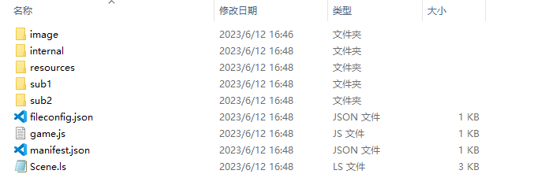
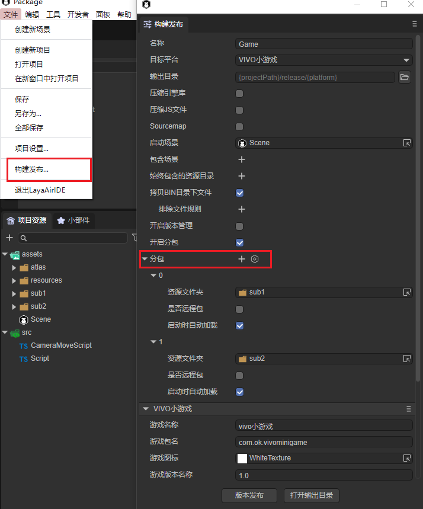
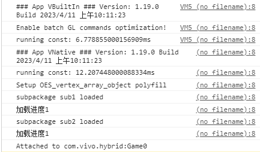

# VIVO小游戏


## 一、概述

推荐要看一看vivo小游戏官方的[文档](https://minigame.vivo.com.cn/documents/#/guide/)，LayaAir引擎的文档更多的是引擎相关的，当然也会混合了一些小游戏接口的应用介绍，但是仔细看看vivo官方文档肯定没错。

vivo小游戏中没有可视化开发调试工具，所以只能是在LayaAir IDE中配置好相关参数，然后直接在LayaAir IDE内一键发布成功（生成一个rpk的包）。至于调试方式，则是通过vivo手机里安装一个apk调试环境（[vivo小游戏调试器](https://minigame.vivo.com.cn/documents/#/download/debugger)），在apk里选择打开rpk的文件，然后通过Chrome在PC上用数据线连接手机进行调试。

>在vivo小游戏发布前，需要先进行[通用](../../generalSetting/readme.md)设置。


## 二、发布为vivo小游戏


### 2.1 选择目标平台

在构建发布面板中，侧边栏选择目标平台为vivo小游戏。如图2-1所示，


（图2-1）

点击“构建vivo小游戏”，或“构建其它”选项中的“vivo小游戏”，即可发布项目为vivo小游戏。

下面介绍一下这些功能参数的填写：

> 从LayaAir3.2开始，游戏名称、游戏图标、游戏版本名称（版本）都在通用设置中进行配置。

**游戏包名**

游戏包名的格式是 `com.company.module` 第一位com不要变，第二位是公司名，第三位是项目名。都要写英文，例如：`com.layabox.demoGame`。

**游戏版本**

游戏版本与版本名称用处不同，这里是渠道平台用于区别版本更新。每次提审都要至少递归+1，自己测试无所谓。但是提审这里的值必须要比上次提审的值至少要+1，+N也是可以的，绝对不能等于或者小于上个版本值，建议是提审版本号递归+1。这里需要注意的是，游戏版本必须为正整数。

**最小平台版本**

vivo目前在官网支持的最小平台版本号可以点击[这里](https://minigame.vivo.com.cn/documents/#/lesson/game/configuration?id=%e6%94%af%e6%8c%81%e7%9a%84%e6%9c%80%e5%b0%8f%e5%b9%b3%e5%8f%b0%e7%89%88%e6%9c%ac%e5%8f%b7)查看。

**日志等级**

七种日志等级，先级从高到底依次为OFF、ERROR、WARN、INFO、LOG、DEBUG、TRACE，可以方便地知道当前程序的运行状态。

**是否使用正式版签名**

如果只是测试版本调试，这里可以不用勾选。正式上线发布前（提版本到平台）必须勾选。

如果勾选了，就会启用正式版签名。关于release签名:

①对于公司,一般一个公司只用一个签名，如果公司已经有签名了，推荐使用公司的签名。如果没有的话，IDE中的发布集成了这个功能，方便开发者生成签名。

②对于个人开发者，可以多个项目使用一个正式签名。只需要生成一次即可。

如果已经release签名了，将签名文件放到Laya项目 sign/release 文件夹下。

**压缩纹理**

`压缩纹理`：一般需要勾选“允许使用压缩纹理格式”，如果不勾选，则忽略所有图片对于压缩格式的设置。

`纹理源文件`：可以不勾选“始终包含纹理源文件”，如果勾选，则即使图片使用了压缩格式，仍然把源文件（png/jpg)打包。目的是遇到不支持压缩格式的系统时，fallback到源文件。


### 2.2 发布后的小游戏目录介绍

点击版本发布，由于在发布前会检查rpk发布环境（用于生成rpk包），如果没有发布环境的，则会开始下载。

发布后的目录结构如图2-3所示，图2-2是`build`文件夹下的目录。

 

（图2-2）

 

（图2-3）

`engine`：

js项目文件与libs引擎库目录，是项目代码和类库。

`resources`：

资源目录和资源文件，小游戏由于初始包的限制，建议将初始包的内容在规划好，最好能放到统一的目录下，便于初始包的剥离。

`game.js`：

vivo小游戏的入口文件，游戏项目入口JS文件与适配库JS等都是在这里进行引入。IDE创建项目的时候已生成好，一般情况下，这里不需要动。

`manifest.json`： 

小游戏的项目配置文件，文件里包括了小游戏项目的一些信息，如果想修改，可以直接在这里面编辑。


## 三、用vivo小游戏调试器


### 3.1 vivo小游戏发布、调试环境准备

1、vivo品牌的手机

2、下载安装vivo的调试APP，下载页面：https://minigame.vivo.com.cn/documents/#/download/debugger

进入页面后，点击 立即下载 ，即可下载安装。至于如何安装vivo调试APP，这里就不介绍了。

3、下载vivo小游戏引擎

当前**调试APP**内置的vivo引擎版本是1034，这个版本存在已知BUG，我们必须要前往vivo小游戏官网下载最新版本的小游戏引擎apk。

下载页面为：

https://minigame.vivo.com.cn/documents/#/download/engine

当前的推荐的版本是**`1090`**，下载安装后，我们可以看到vivo快应用调试器的平台版本号那里也是显示的1090。

4、PC电脑的chrome浏览器与手机数据连接线。

5、安装nodejs 环境 [node官网：https://nodejs.org/en/]

就是下载安装，比较简单，也不细介绍。能在命令行里调起npm命令就算是成功了。

6、安装ADB

ADB可以用于授权，以及发布推送等，可以前往ADB的官网下载并安装。

[ ADB官网下载: http://adbshell.com/downloads ]

> 简单提示一下，下载 ADB Kits，下载后的压缩包，建议解压放到一个路径简单一些的目录（如: `D:\adb`）。要记得添加环境变量（不知如何添加环境变量的可自行百度）。


### 3.2 vivo小游戏发布与接入完整流程

#### 3.2.1 安装并进入快应用调试器

要启动电脑PC的chrome调试环境，我们要先安装好vivo小游戏的调试APP（快应用调试器），如图3-1所示。然后点击进入。

  

（图3-1）

#### 3.2.2 在快应用调试器界面扫码安装vivo小游戏的rpk包

进入快应用调试器之后，我们可以看到如图3-2所示的APP操作界面。

   

(图3-2)

把发布目录下/dist目录内的rpk包传到手机里，通过点 `本地安装` 按钮来安装。

#### 3.2.3 保持物理线路连接以及授权

对于比较有相关经验的开发者，确保USB手机连接线物理线路是已连接状态，并且USB调试授权也没问题的，可以跳过本步骤。

相关操作如下：

1、先用手机连接线将手机与PC保持物理上的连接。

2、在之前打开的命令行下，输入adb shell，如图3-3所示。则是未获得USB调试模式授权。

 

（图3-3）

此时，我们要关注手机端，是否出现如图3-4所示的提示，如果有，则点 确定 允许USB调试。

 

（图3-4）

3、再次验证授权。

当USB调试模式授权成功之后，我们再次输入adb shell，应该如图3-5所示。

 

（图3-5）

总之，在这个环节里，我们要保障PC是有权限调试这个手机设备的。

#### 3.2.4 启动chrome调试环境

之前扫码安装后，会自动进入刚刚安装的游戏或者DEMO。

要启动调试，就要先退出来。

然后，如图3-6所示，点击**开始调试**，进入vivo小游戏的调试模式。

  

（图3-6）

真机进入调试模式后，我们再到PC上打开chrome浏览器。

这时候别忘了，要联接USB数据线，将手机设备与PC相联，权限的问题上面已经说过，不再重复。

我们要在手机端查找到手机的IP（不知道怎么查的自行百度）并记住他。一定要注意的是，手机网要和PC网始终保持在同一个局域网段。

在chrome浏览器的输入栏里输入：

```
chrome-devtools://devtools/bundled/inspector.html?v8only=true&ws={IP}:5086/00010002-0003-4004-8005-000600070008
```

将{IP}替换为手机IP地址即可，如图3-7所示。

 

(图3-7)

至此，vivo小游戏从发布到启动chrome调试的完整流程已介绍完。如果想了解关于更多vivo小游戏的接入流程与文档介绍，记住这个网址：

[https://minigame.vivo.com.cn](https://minigame.vivo.com.cn/)


## 四、vivo小游戏分包

开发者可以先看一下[通用](../../generalSetting/readme.md)设置的分包。可以通过以下步骤进行分包加载，如图4-1所示，点击构建发布后，勾选开启分包，然后选择要进行分包的文件夹即可，IDE自动加载分包需要在发布时勾选分包的“启动时自动加载”选项。



（图4-1）

将“sub1”、“sub2”设置为分包的资源文件夹后，manifest.json里会自动生成配置信息。分包加载的能力首先依赖于编译时工具，根据开发者在manifest.json中配置的subpackages规则，将项目打包成多个分包。这些分包的大小是有限制的，目前vivo小游戏的分包大小有如下限制：

```json
<分包大小限制20M：主包限制4m + 分包大小16M>
com.application.demo.rpk整体压缩包(包名+.rpk) 
------------- com.application.demo.rpk 原整包(包名+.rpk) (兼容老版本引擎的原整包=分包主包+分包A+分包B)
------------- main.rpk 分包主包(main+.rpk) （4M）
------------- pkgA.rpk pkgA分包(子包名+.rpk) (A+B 16M)
------------- pkgB.rpk pkgB分包(子包名+.rpk)
```

> 参考vivo小游戏[分包加载](https://minigame.vivo.com.cn/documents/#/lesson/base/subpackage)。

如果是代码引用资源，加载代码示例如下：

```json
const { regClass, property } = Laya;

@regClass()
export class Script extends Laya.Script {
    //declare owner : Laya.Sprite3D;

    @property({ type: Laya.Scene3D })
    scene3d: Laya.Scene3D;

    constructor() {
        super();
    }

    /**
     * 组件被激活后执行，此时所有节点和组件均已创建完毕，此方法只执行一次
     */
    onAwake(): void {
        //小游戏加载分包
        Laya.loader.loadPackage("sub1", this.printProgress).then(() => {
            Laya.loader.load("sub1/Cube.lh").then((res: Laya.PrefabImpl) => {
                let sp3: Laya.Sprite3D = res.create() as Laya.Sprite3D;
                this.scene3d.addChild(sp3);
            });
        })

        Laya.loader.loadPackage("sub2", this.printProgress).then(() => {
            Laya.loader.load("sub2/Sphere.lh").then((res: any) => {
                let sp3 = res.create();
                this.scene3d.addChild(sp3);
            });
        })
    }

    printProgress(res: any) {
        console.log("加载进度" + JSON.stringify(res));
    }
}
```

这里介绍一下`printProgress`打印的内容，在小游戏调试器平台打我们导出的项目后，连接vivo官网提供的调试地址会打印如下日志：



（图4-2）

vivo小游戏官方提供了`qg.loadSubpackage()`API来触发分包的加载，调用`qg.loadSubpackage()`在加载完成后，通过`qg.loadSubpackage()`的成功回调来通知加载完成。

同时，`qg.loadSubpackage()`会返回一个 LoadSubpackageTask ，可以通过 LoadSubpackageTask 获取当前下载进度。


## 五、常见问题

**粒子渲染黑屏问题**

vivo小游戏勾选使用3D粒子有时会遇到卡死、黑屏问题，这是由于vivo支持instance扩展以及支持vao扩展存在[问题](https://github.com/vivominigame/issues/issues/248)导致的。

建议直接配置vao为true来避免直接修改引擎的麻烦，可以在项目中配置vivo的[发布模板](../readme.md)：在发布模板的manifest.json中配置好vao，并设置最小平台版本为最低支持引擎版本（1102）以上。


