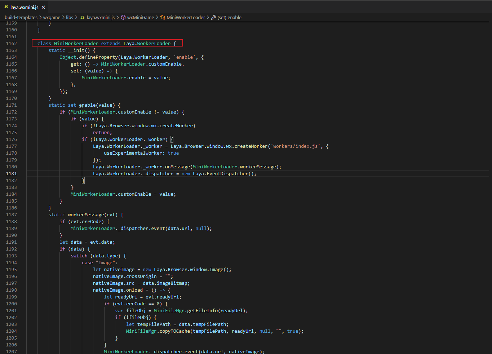
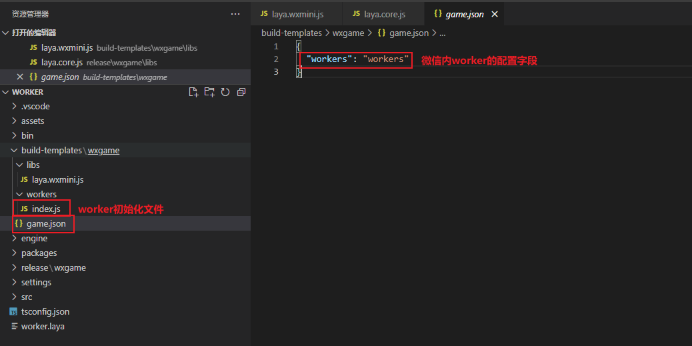

# 微信小游戏Worker的使用

​		目前由于微信小游戏的Worker功能与浏览器之间还是存在差异，浏览器中使用new Worker来初始化Woker进程，微信小游戏中需要指定配置好worker路径后通过wx.createWorker方法来创建Worker，在适配库中使用class MiniWorkerLoader接口来自定义实现微信小游戏的Worker内容，从而尽可能将Worker的使用接入引擎的统一处理流程，在项目层减少各平台Worker的适配，并且可以扩展到其他小游戏平台的Worker使用中；

​		现在提供一个简单的项目demo来展示简单的图片加载使用与worker的可扩展内容。

```markdown
示例项目中接入了网络图片的使用流程，其他类型的文件可以在root/build-templates/wxgame/workers/index.js模板文件中实现
```

## 1、适配库的Worker监听

​	我们在微信小游戏适配库laya.wxmini.js中增加了MiniWorkerLoader类，继承自Laya.WorkerLoader，并重定向WorkerLoader的enable属性到MiniWorkerLoader类的enable属性中进行微信Worker的初始化，使用wx.createWorker方法创建Worker线程，如下图所示：

 

​		并在微信Worker线程的onMessage回调中注册为MiniWorkerLoader的workerMessage，在回调中我们需要将网络图片下载后的本地缓存地址传入给创建好的nativeImage中，并派发完成事件；在这一步中我们也将图片的缓存地址写入到了资源映射表中。

​		在加载过程中会执行下图中MiniWorkLoader基类的load方法，将url传入到woker线程中进行处理：

 

## 2、微信小游戏Worker的处理

​		我们在项目发布模板中增加了Worker路径的配置与Woker内index.js的简单图片处理逻辑，由于Worker为单独线程，不能使用主线程内的Window作用域的下内容，Worker线程中有一个暴露为全局的worker对象，包含文件管理功能、下载上传功能、网络通信功能与音频播放功能等。

[wx.createWorker]: https://developers.weixin.qq.com/minigame/dev/api/worker/wx.createWorker.html	"创建一个Worker线程"

### 2.1 项目发布模板

​		我们在示例项目目录中增加worker目录与game.json中worker的配置目录，如下图所示：

 

### 2.2 workers目录下index.js的处理

​		在workers/index.js中增加事件监听、图片处理与事件派发：

```js
console.log("worker/request/index.js")
// 在 Worker 线程执行上下文会全局暴露一个 `worker` 对象，直接调用 worker.onMessage/postMessage 即可
worker.onMessage(function (data) {
    console.log("worker ------------", worker);
    worker.downloadFile({
        url:data.url,
        success:function(res){
            console.log("worker downloadfile url:" + data.url);
            res.type = "Image";	// 资源类型，在MiniWorkerLoader的workerMessage回调中进行处理，目前只模拟了图片类型
            res.url = data.url;
            res.imageBitmap = res.tempFilePath;	// 小游戏不支持ImageBitMap也不支持window的任何功能，这里传入缓存地址然后使用原生Image进行实现
            worker.postMessage({
                errCode:0,
                data:res,
                readyUrl:data.url
            });
        },
        fail:function(res){
            console.log("worker downloadfile url:" + data.url);
            res.type = "Image";
            worker.postMessage({
                errCode:1,
                data:res,
                readyUrl:data.url
            });
        }
    });
});
```

​		上面代码中，onMessage用来接收从引擎层MiniWorkerLoader的load方法发送的url地址，通过downloadFile接口下载图片到本地并将图片的本地缓存地址发送到主线程的workerMessage方法中，从而创建原生的Image对象进行使用；这里面可以根据需求来扩展音频、网络连接、本地文件处理等功能。