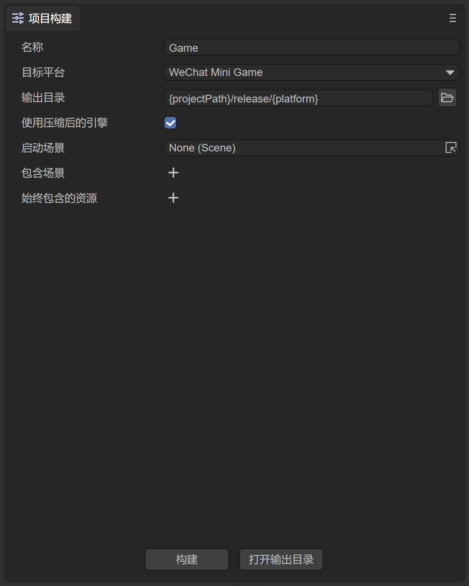
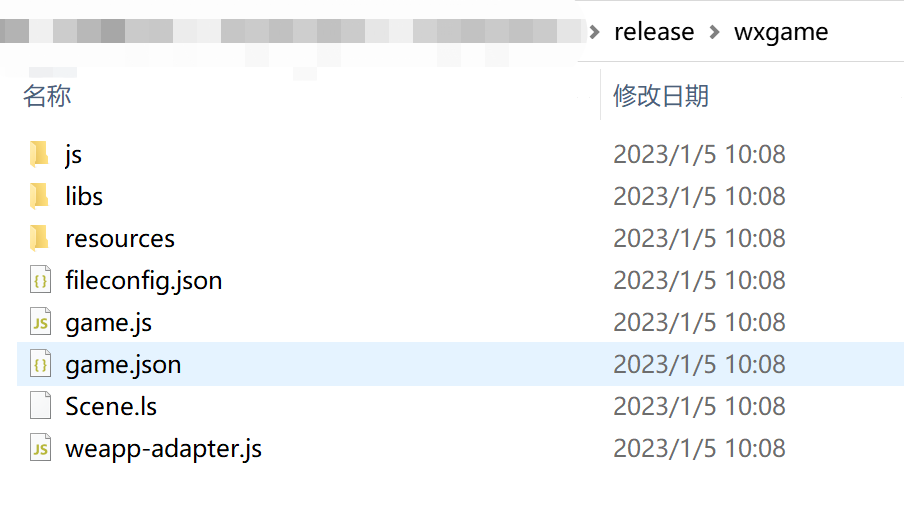
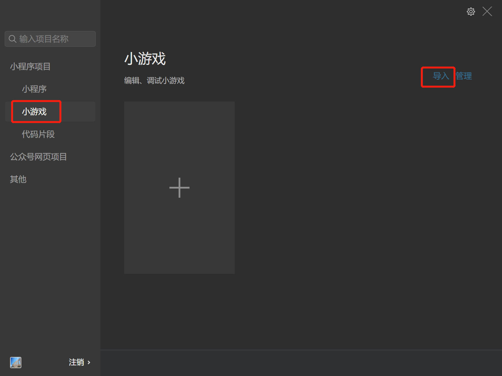
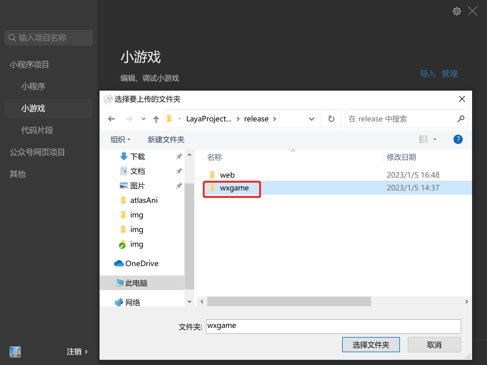
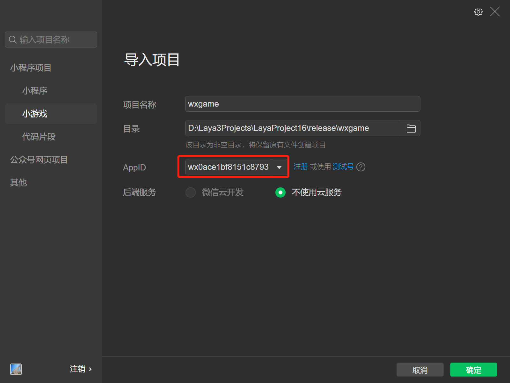
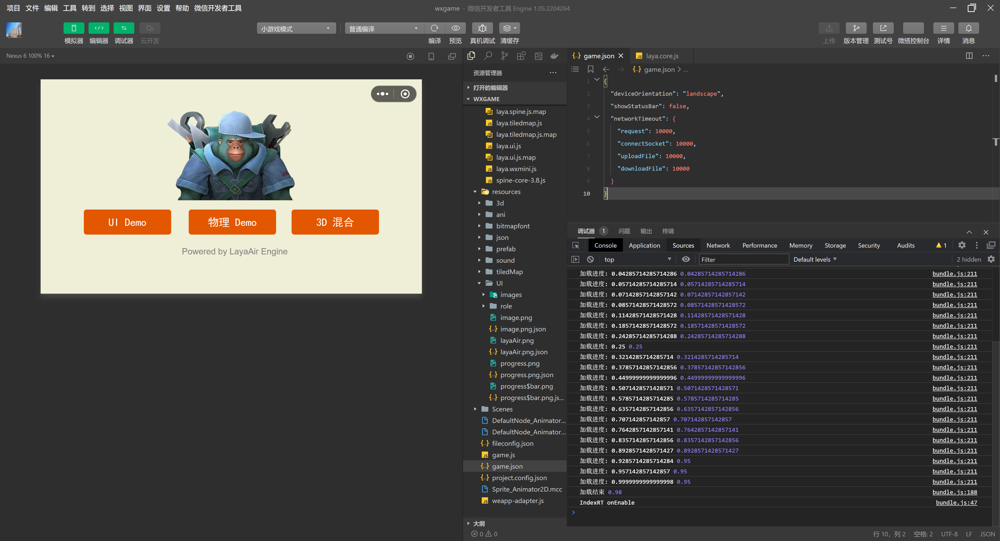

# 微信小游戏


## 一、概述

微信小游戏的运行环境并不是浏览器，也不能在浏览器中运行，而是运行于微信APP中的Runtime。尽管微信小游戏的接口兼容大部分Canvas和Webgl，具有即点即玩，无需下载安装的HTML5特性。显然，从严格的定义来讲，微信小游戏不是标准的HTML5游戏。

强烈推荐要看一看微信小游戏官方的文档，LayaAir引擎的文档更多的是引擎相关的，当然也会混合了一些小游戏接口的应用介绍，但是仔细看看微信官方文档肯定没错。

**链接如下：**

https://developers.weixin.qq.com/minigame/dev/index.html

**下载并安装微信开发者工具**

微信开发者工具主要用于小游戏产品的预览与调试、真机测试、上传提交等。是小游戏开发的必备工具。

**开发工具下载地址**：
https://developers.weixin.qq.com/minigame/dev/devtools/download.html

如果是采用微信官方API开发的话，还是要有一些要注意的，比如不支持DOM与BOM、小游戏只能有一个画布、不支持Eval、不支持XML等等……

但是，对于LayaAir引擎的开发者来讲，不用刻意去了解到底有哪些差异，照正常的LayaAir引擎开发规则去开发就可以了。

**微信小游戏API地址**：

https://developers.weixin.qq.com/minigame/dev/api/


## 二、发布为微信小游戏


### 2.1 选择目标平台

点击构建项目，在弹出的构建项目界面里，选择发布平台为微信小游戏。如图2-1所示

 

（图2-1）


### 2.2 发布后的小游戏目录介绍

发布后的目录结构如图2-2所示

 

（图2-2）

**`js` 项目文件 与 `libs` 引擎库目录**

项目代码和类库

**`resources`资源目录 与 Scene.js**

resources资源目录和资源文件Scene.js，小游戏由于初始包的限制，建议将初始包的内容在规划好，最好能放到统一的目录下，便于初始包的剥离。

**`game.js`微信小游戏的入口文件**

游戏项目入口JS文件与适配库JS等都是在这里进行引入。IDE创建项目的时候已生成好，一般情况下，这里不需要动。

**`game.json` 小游戏的配置文件**

开发者工具和客户端需要读取这个配置，完成相关界面渲染和属性设置。比如屏幕的横竖屏方向，状态栏的显示、小游戏分包等，都是在这里配置。具体如何配置，以及参数的使用，可以[查看微信小游戏的开发文档](https://mp.weixin.qq.com/debug/wxagame/dev/index.html?t=2018115)。

**`fileconfig.json` 小游戏的项目配置文件**

文件里包括了小游戏项目的一些信息，如果想修改appid等信息，可以直接在这里面编辑。

> 项目参数libVersion的值一定要是game，这里一般不会出错。但是，万一出现了LayaAirIDE里发布正常，也引用了适配库，发布为小游戏后，在开发者工具里还是有报错的话，可以检查libVersion里的值是不是game。不是的话要改为game。

**`weapp-adapter.js` 微信小游戏适配库文件**


## 三、用微信开发者工具创建小游戏项目

### 3.1 开发者帐号登录，选择项目类型

打开”微信web开发者工具“，用开发者的微信扫码登录。然后选择**小游戏**点击进入项目设置，选择导入，如图3-1所示。

 

（图3-1）

### 3.2 导入小游戏项目

选择项目目录，就是在LayaAirIDE发布后的目标目录（通常在项目根目录下的release\wxgame）

 

（图3-2）

选择wxgame目录之后，如图3-3所示

 

（图3-3）

`AppID` 测试账号，可以点击注册，不输入也可以开发调试，可以使用测试号，不过功能会受到限制。所以最好还是输入 `AppID`

### 3.3 微信开发者工具的编译

完成小游戏项目的创建后，即可在工具内预览效果和调试。如图3-4所示



（图3-4）

### 3.4 真机测试与调试

由于LayaAirIDE里也可以调试项目效果，除非是适配相关的问题，基本上两边的效果不会有不一一致的情况。所以这里最重要的是点击**预览**功能，通过手机微信扫码，在微信内进行真机测试与调试。如图3-5所示

 

（图3-5）

**注意：上传真机的时候，默认不能超过4M，配置分包不能超过8M**


至此，一个完整的小游戏开发流程就结束了。是不是很简单。采用LayaAirIDE开发的小游戏项目，基本上是无缝用于微信小游戏项目。


## 四、微信小游戏的4M本地包与动态资源加载

比如示例中引用的就是本地路径，

```typescript
Laya.Texture2D.load("res/layabox.png");
```

如果项目的目录中，全部大小加起来不超过4M的话，只要能找到本地的资源，怎么写也没问题。

但是，

微信小游戏的本地包有4M的限制，一旦超过这个限制，那就不允许上传，不允许真机预览。

所以，我们的**项目要是大于4M后，怎么处理呢？**

一种方案是分包，从小游戏基础库的2.0版本开始，可以通过配置分包，达到8M。

另一种方案就是网络动态加载，

我们在本地包内，JS代码是必须要放进去的，因为JS是不允许网络加载动态创建的。所以如果本地包内JS超过4M，首先考虑的是如何优化JS体积，比如混淆压缩，和UI代码分离。还是不行的话，只能是通过小游戏的分包方案解决。如果JS没有超过4M，那还可以视情况再放一些预加载用的基础资源。

总之，对于绝大多数小游戏而言，网络动态加载是必须使用的方式。

那**网络动态加载的路径怎么处理呢**。在本地加载的`load()`方法之后使用`URL.basePath`方法。

例如：

```typescript
material.diffuseTexture = Laya.Texture2D.load("res/layabox.png");
box.meshRender.material = material;
Laya.URL.basePath = "https://XXXX.com";//请把XXXX换成自己的真实网址；
//在此之下，再使用load加载资源，都会自动加入URL网址。从网络上动态加载。
```

使用`URL.basePath`方法后，再使用load加载本地路径，都会自动加上URL.basePath里的网址。这样就实现了本地与网络加载的结合。

**这样就结束了吗？并没有！**

按刚刚的写法，`res/layabox.png`明明已经上传到微信小游戏的本地目录，但是如果在使用`URL.basePath`之后，再次加载`res/layabox.png`并不会从本地加载使用，而是从网络动态加载使用。这并不是我们要的结果。

所以，引擎针对使用`URL.basePath`之后，如何再次使用本地加载，进行了**特殊目录和文件的处理**，也就是本地包白名单机制。如下例所示：

```json
MiniAdpter.nativefiles =  [
    "wxlocal",
    "res/atlas/houzi.atlas",
    "res/atlas/houzi.png",
    "common/tishi.png",
    "common/bg.png",
    "ui.json",
    "newLb/bg031.png"
];
```

**只要是MiniAdpter.nativefiles里存在的目录名或文件，引擎会自动将该目录视为本地目录**，即便使用了URL.basePath，对于包含在nativefiles白名单内的目录名或文件，都不会从网络动态加载，只会从本地加载。


## 五、微信小游戏的50M物理缓存管理

**物理缓存的意义**

微信小游戏除了本地包之外，还允许开发者使用50M的物理缓存空间。也就是说首次加载后，在物理缓存中的资源，无需远程动态加载，直接使用本地的缓存资源即可。这样，不仅让玩家节省了大量的下载流量，还拥有了如同原生APP游戏一样的打开速度。

**LayaAir引擎默认的缓存管理机制**

在LayaAir引擎里，引擎层已经自动帮开发者做好了缓存管理的机制，默认启动的是自动缓存管理机制。

在自动缓存的管理模式下，**如果检测到资源没有在本地缓存，就将远程的资源自动缓存起来。需要注意的是，自动缓存模式下只缓存图片和声音文件**，如果有其它格式的文件需要缓存，那可以通过设置MiniAdpter.AutoCacheDownFile = true; //是否自动缓存非图片声音文件

或者手动缓存的接口进行下载并缓存。

缓存文件如果超过50M，将自动清理最早缓存的内容，每次清理5M的空间，如此循环写入，保障缓存里存的永远是最新下载的50M文件。

**LayaAir引擎手动管理缓存的接口**

**1、取消自动缓存**

如果游戏常用资源大于50M，采用自动管理缓存的文件未必能达到开发者的预期。尤其是早期加载的资源，如果是常用资源，那么后面加载的资源缓存超过50M后，会将早期缓存的资源清理，那么下次使用的时候又要重新加载一次。所以常用资源大于50M的时候，建议开发者自行权衡哪些资源缓存起来意义更大，对用户体验更好。这时候，就可以取消自动缓存模式。

如果不需要引擎自动管理缓存，可以将MiniAdpter.autoCacheFile设置为false。需要注意的是，自动缓存关闭后，由于不会自动清理，超过50M后将会导致写入缓存失败，所以一定要建立好缓存策略，决定哪些文件要缓存，哪些文件需要手动清理。

**2、手动下载文件并缓存本地**

当不打算使用自动缓存功能，或者在自动缓存模式下，缓存json等自动缓存并不缓存的文件内容时，可以使用downLoadFile方法，去下载目标文件并缓存到本地。

```typescript
/**
* 下载文件 
* @param fileUrl 文件地址(全路径)
* @param fileType 文件类型(image、text、json、xml、arraybuffer、sound、atlas、font)
* @param callBack 文件加载回调,回调内容[errorCode码(0成功,1失败,2加载进度)
* @param encoding 文件编码默认 ascill，非图片文件加载需要设置相应的编码，二进制编码为空字符串
*/             
public static function downLoadFile(fileUrl:String, fileType:String = "",callBack:Handler = null,encoding:String = "ascii"):void
```

**3、清除缓存文件**

由于微信小游戏的缓存上限是50M物理空间，所以无论自动管理缓存还是手动管理缓存，达到上限后都需要清理缓存。每次清理的缓存大小默认为5M，如果想改变每次缓存清理的默认值，通过修改

MiniAdpter.minClearSize属性即可。

如果要删除指定的缓存文件或全部缓存文件时，可以使用remove或removeAll方法。

```typescript
/**
* 删除指定缓存文件
* @param fileUrl文件路径(绝对地址)
* @param callBack 删除回调函数
*/
public static function remove(fileUrl:String,callBack:Handler):void {}
```

```typescript
/**
* 清空缓存空间全部文件内容 
*/  
public static function removeAll():void{}
```

