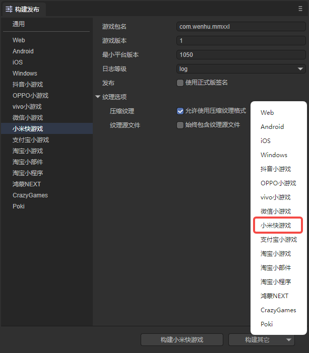

# 小米快游戏


## 一、概述

推荐要看一看小米快游戏官方的文档，LayaAir引擎的文档更多的是引擎相关的，当然也会混合了一些小游戏接口的应用介绍，但是仔细看看OPPO官方文档肯定没错。

**链接如下：**

https://dev.mi.com/distribute/doc/details?pId=1450

小米快游戏中没有可视化开发调试工具，所以只能是LayaAirIDE中配置好相关参数，然后直接在LayaAirIDE内一键发布成功（生成一个rpk的包）。至于调试方式，则是通过小米手机里安装一个apk调试环境，在apk里选择打开rpk的文件，然后通过chrome在PC上用数据线连接手机进行调试。


## 二、发布为小米快游戏


### 2.1 选择目标平台

点击构建项目，在弹出的构建项目界面里，选择发布平台为小米快游戏。如图2-1所示

 

（图2-1）

下面我们来介绍一下这些功能参数的填写

**1、游戏名称**

一般都填写中文汉字，英文也可以。用于应用商店、桌面图标、弹窗等游戏入口处。一个好的名字是游戏能不能吸量的重要元素。OPPO是10个汉字以内就可以。我们的建议是都不要超过6个汉字，游戏名太长没什么好处。

**2、游戏包名**

游戏包名的格式是 `com.company.module` 第一位com不要变，第二位是公司名，第三位是项目名。都要写英文，例如：`com.layabox.demoGame`。

**3、游戏图标**

游戏图标也是重要的游戏入口标识，和游戏名称一样，是非常重要的吸量元素，如果游戏图标设计的好，游戏名称起的好。同样的位置会获得比其它游戏更多的点击率。游戏图标需要提供 `192*192` 的正方形尺寸。

**4、游戏版本名称**

游戏版本名称是真实的版本，一般是用于功能性版本的区别。比如我有个大版本改动。原来是1.0，可以变成2.0，如果只是改改Bug，那1.0完全可以改成1.1。以此类推，我们建议采用浮点数命名。比如“0.1”、“1.3”、“5.0”……

**5、游戏版本**

游戏版本与版本名称用处不同，这里是渠道平台用于区别版本更新。每次提审都要至少递归+1，自己测试无所谓。但是提审这里的值必须要比上次提审的值至少要+1，+N也是可以的，绝对不能等于或者小于上个版本值，建议是提审版本号递归+1。这里需要注意的是，游戏版本必须为正整数。

**6、最小平台号**

最小平台号，按调试器上显示的平台版本号，进行填写即可。

**7、日志等级**

七种日志等级，先级从高到底依次为OFF、ERROR、WARN、INFO、DEBUG、TRACE、ALL，可以方便地知道当前程序的运行状态。

**8、是否使用正式版签名**

如果只是测试版本调试，这里可以不用勾选。正式上线发布前（提版本到平台）必须勾选。

如果勾选了，就会启用正式版签名。关于release签名:

①对于公司,一般一个公司只用一个签名，如果公司已经有签名了，推荐使用公司的签名。如果没有的话，IDE中的发布集成了这个功能，方便开发者生成签名。

②对于个人开发者，可以多个项目使用一个正式签名。只需要生成一次即可。

如果已经release签名了，将签名文件放到Laya项目 sign/release 文件夹下

**9、设置分包**

让开发者在开发完成后，能够按照分包配置将需要分包的文件夹内的 js 或者某个 js， 打包签名生成 .rpk 文件；将项目中分包之外的其他文件打包成主包；再将整个包打成 .rpk 文件。

> 小米快游戏分包加载包大小的限制
>
> - 整个小游戏所有分包大小之和不超过 16 M
> - 单个分包大小无限制
> - 加上主包 4M，最终的 rpk 包大小不超过 20M


### 2.2 发布后的小游戏目录介绍

点击版本发布，由于在发布前会检查rpk发布环境（用于生成rpk包），如果没有发布环境的，则会开始下载。

发布后的目录结构如图2-2所示

 

（图2-2）

**`js` 项目文件 与 `libs` 引擎库目录**

项目代码和类库

**`resources`资源目录 与 Scene.js**

resources资源目录和资源文件Scene.js，小游戏由于初始包的限制，建议将初始包的内容在规划好，最好能放到统一的目录下，便于初始包的剥离。

**`main.js`小米快游戏的入口文件**

游戏项目入口JS文件与适配库JS等都是在这里进行引入。IDE创建项目的时候已生成好，一般情况下，这里不需要动。

**`manifest.json` 小游戏的项目配置文件**

文件里包括了小游戏项目的一些信息，如果想修改，可以直接在这里面编辑。


## 三、用小米快游戏调试器


### 3.1 小米快游戏发布、调试环境准备

1、小米品牌的手机（注意必须是MIUI 8.5或以上版本）。

2、下载安装小米的测试APP，下载页面：https://dev.mi.com/console/doc/detail?pId=1738

进入页面后，下拉找到第3步，**调试自测**那一栏里，直接按提示下载即可。

3、PC电脑的chrome浏览器与手机数据连接线。

4、安装nodejs 环境 [node官网：https://nodejs.org/en/]

就是下载安装，比较简单，也不细介绍。能在命令行里调起npm命令就算是成功了。

5、安装ADB

建议安装ADB，因为有些时候，因为授权或者别的莫名其怪的原因。会导致无法正常启动chrome联真机调试。所以安装ADB 可以验证和有助于手机与PC电脑的连接授权。如果确保无USB调试授权问题的，也可以不装。

[ ADB官网下载: http://adbshell.com/downloads ]

简单提示一下，下载 ADB Kits，下载后的压缩包，建议解压放到一个路径简单一些的目录（如: `D:\adb`）。要记得添加环境变量（不知如何添加环境变量的可自行百度）。


### 3.2 小米快游戏发布与接入完整流程

#### 3.2.1 安装并进入快应用调试器

要启动电脑PC的chrome调试环境，我们要先安装好小米快游戏的调试APP（快应用调试器），如图3-1所示。然后点击进入。

 

（图3-1）

#### 3.2.2 在快应用调试器界面扫码安装小米快游戏的rpk包

进入快应用调试器之后，我们可以看到如图3-2所示的APP操作界面。

 

(图3-2)

把发布目录下/dist目录内的rpk包传到手机里，通过点`本地安装`按钮来安装。

#### 3.2.3 保持物理线路连接以及授权

对于比较有相关经验的开发者，确保USB手机连接线物理线路是已连接状态，并且USB调试授权也没问题的，可以跳过本步骤。

##### 相关操作如下：

1、先用手机连接线将手机与PC保持物理上的连接。打开手机的开发者模式，且打开Usb调试。

此时，我们要关注手机端，是否出现如图3-3所示的提示，如果有，则点 确定 允许调试。

  

（图3-3）

2、验证授权。

当USB调试模式授权成功之后，我们输入adb devices，应该如图3-4所示。

 

（图3-4）

总之，在这个环节里，我们要保障PC是有权限调试这个手机设备的。

#### 4.4 启动chrome调试环境

小米快游戏在PC上没有工具的开发调试环境，是通过USB联接到手机设备，然后在PC命令行模式下，通过 `npm run debug` 命令调起Chrome调试器（前提要保障PC是已安装了chrome浏览器的）来联调手机真机环境的rpk包，如图3-5所示。

 

(图3-5)

当我们能看到`Debugger URL opened in Chrome.`这个提示的时候，说明chrome已被成功调起，并与真机中的画面保持一致。如图3-6所示。真机中的各种操作，会完全同步到PC这个chrome里，我们就按chrome的调试方式来调试小米快游戏项目即可。


(图3-6)

至此，小米快游戏从发布到启动chrome调试的完整流程已介绍完。


## 四、小米快游戏分包

**在manifest.json中配置分包名与分包路径的字段**

```
“subpackages”: [             //分包配置
       {
           "name" : "sub1Name", //子包名称
           "root" : "sub1/"     //可以指定一个目录
       }，
       {
           "name" : "sub2Name", //子包名称
           "root" : "sub2.js"   //也可以指定一个 js 文件
       }
]
```

这个manifest.json是通过IDE的发布功能自动生成的，打开IDE的构建发布可以看到设置分包选项，如图4-1所示

 

（图4-1）

subpackages里，可以有多个name与root，每一组代表一个分包，单个分包

分包路径可以指定一个目录，根目录下的 main.js 会作为入口文件，目录下所有资源将会统一打包

**这里设置的分包文件（夹）要与oppogame目录下的文件（夹）对应，这里设置只是自动生成manifest.json里的配置信息，并不会去创建文件夹和文件。一定要手动创建文件与文件夹**

**小米快游戏的分包加载示例代码**

小米快游戏官方提供了qg.loadSubpackage(Object object) API 来触发分包的下载，调用 qg.loadSubpackage 后，将触发分包的下载与加载，在加载完成后，通过 qg.loadSubpackage 的 success 回调来通知加载完成。示例代码如下：

```
const loadTaskA = qg.loadSubpackage({

    name: 'sub1Name',
    success: function (data) {
    	console.info('加载分包 sub1Name 成功')
    },
    fail: function (err) {
                  console.info('加载分包 sub1Name 失败', err)
    }
})
```

加载成功的同时，qg.loadSubpackage 会返回一个 `LoadSubpackageTask`，可以通过 `LoadSubpackageTask` 获取获取分包加载状态。示例代码如下：

```
oadTaskA.onProgressUpdate(res => {

    console.log('sub1Name 下载进度', res.progress)

    console.log('sub1Name 已经下载的数据长度', res.totalBytesWritten)

    console.log('sub1Name 预期需要下载的数据总长度',                res.totalBytesExpectedToWrite)

}
```

**分包要点**

基础库版本

**注意！开发者调试的时候需要调试器和平台都是1.6.0.0及以上，否则跟着本文操作，使用的是不支持分包的版本，调试就会出问题。**

调试器和平台下载地址：

https://dev.mi.com/console/doc/detail?pId=1738

如图：

 

（图4-2）