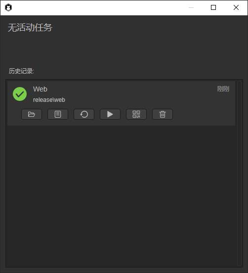

# Web发布


## 一、概述

Web发布功能是非常核心的功能，通常是指发布为HTML5版本，运行于浏览器环境、webView、LayaNative的APP环境中。在项目完成开发，或阶段性完成开发，准备提交到生产环境中进行测试时，通常会用到项目发布的功能。由于LayaAir 3.0 IDE在功能和结构上与2.0相比有很大的变化，在IDE Web发布上面来说，开发者需要更多的注意资源目录的问题，本篇将具体讲解一下


## 二、IDE中发布

### 2.1 构建项目

使用IDE 发布项目，开发者首先在文件菜单中，打开“构建项目”选项，如动图2-1所示

 

（动图2-1）


### 2.2 发布选项

项目构建选项打开后，我们来看看都有哪些选项，如图2-2所示

 

（图2-2）

名称：项目的名称，对于Web发布来说，就是html中的title名称

目标平台：选择不同的平台类型，会在发布的时候适配不同的平台

输出目录：输出目录是指要发布到的目标目录，默认在release目录下，可以在项目所在的目标，也可以是与项目无关的目录。

使用压缩后的引擎：勾选后，将使用压缩后的引擎类库

启动场景：启动项目运行时的第一个场景

包含场景：所包含的场景所引用的资源会拷贝到输出目录中

始终包含的资源：所选资源目录下的资源始终拷贝到输出目录中


### 2.3 目标平台

IDE 3.0版本，发布平台中有目前有八种选择选项，分别为：Web、Android、iOS、字节小游戏、OPPO小游戏、VIVO小游戏、小米快游戏、微信小游戏。如图2-3所示。

 

（图2-3）

`Web` 是指发布为HTML5版本，运行于浏览器环境、webView、LayaNative的APP环境中。

`Android` 是指发布为安卓平台，运行于安卓的APP环境中。

`iOS` 是指发布为iOS平台，运行于iOS的APP环境中。

`字节小游戏` 是指发布为已适配字节小游戏的项目，发布后的项目可以运行于字节开发者工具内（关于字节小游戏可阅读相关的文档）。

`微信小游戏` 是指发布为已适配微信小游戏的项目，发布后的项目可以运行于微信开发者工具内（关于微信小游戏可阅读相关的文档）。

`小米快游戏`是指发布为已适配小米快游戏的项目，发布后的项目可以运行小米开发者工具内（关于小米快游戏可阅读相关的文档）。

`OPPO小游戏`是指发布为已适配OPPO小游戏的项目，发布后的项目可以运行OPPO开发者工具内（关于OPPO小游戏可阅读相关的文档）。

`VIVO小游戏`是指发布为已适配VIVO小游戏的项目，发布后的项目可以运行VIVO开发者工具内（关于VIVO小游戏可阅读相关的文档）。

本篇主要介绍Web发布目录，除此之外的发布平台可以参考其它文档


### 2.4 发布代码使用的资源（resources）

开发者的项目中往往会使用代码方式来使用资源，那么对于IDE来说就无法识别这些资源，因此IDE指定了 `Resources` 目录为开发者满足此需求，如图2-4所示

 

（图2-4）

这是一个示例项目，只通过代码来实现资源的使用，注意`resources` 目录下有两个图片 image 和 c1，我们来看下发布后的目录，点击“构建”按钮，等待构建成功后，如图2-5所示

 

（图2-5）

我们看到web目录下会有一个 `resources` 目录，里面包括了 image 和 c1，同时我们发现还有两个json文件，实际上json文件中是资源属性信息，如下

```
{
  "sRGB": true,
  "wrapMode": 0,
  "filterMode": 1,
  "anisoLevel": 0,
  "readWrite": false,
  "mipmap": false,
  "pma": true,
  "hdrEncodeFormat": 0,
  "files": [
    {
      "file": "",
      "ext": "png",
      "format": 1
    }
  ],
  "platforms": {
    "0": 0,
    "1": 0,
    "2": 0
  }
}
```

在不需要额外操作的情况下，`resources` 目录中的任何资源都会发布到输出目录中，因此开发者可以利用 `resources` 目录作为代码使用资源的目录


### 2.5 IDE中使用的资源

上述 `resources` 目录主要是针对用代码使用资源的方式，资源需要存放到 `resources` 目录。但是在我们实际开发过程中，资源通常会放到assets目录下，包括场景和预制体文件等等，如图2-6所示，这是IDE中自带的“3D-RPG示例”项目

 

（图2-6）

这么多的资源目录，如果都改到 resources 目录是一件非常庞大的修改工作。因此IDE为开发者提供了两种更便捷的方式


#### 2.5.1 包含场景

 

（图2-7）

如图2-7所示，我们可以把Game等场景添加到包含场景中，这些场景所引用的资源都会发布到输出目录中，我们点击“构建”按钮，提示“构建成功”。然后我们打开发布后的目录

 

（图2-8）

如图2-8所示，这些目录已经成功发布到输出目录中，接下来运行看看效果，如动图2-9所示

 

（动图2-9） 

可以看到场景正常运行，但是没有发现敌人，并且没有音乐，打开调试信息，可以看到 enemy.lh 和 bgm.mp3 并没有在输出目录中，这是由于 enemy.lh 和 bgm.mp3 是通过代码执行的，并没有在项目开发过程中放在 `resources` 中，如图2-10所示

 

（图2-10） 

这时，我们可以使用第二种方式


#### 2.5.2 始终包含资源

通过再次点击“构建项目”，在始终包含资源的选项中，拖入 enemy.lh 和 bgm.mp3 资源，如图2-11所示

 

（图2-11） 

此时，再次点击“构建”，等待构建成功后，查看输出目录，如图2-12所示

 

（图2-12） 

我们发现 enemy.lh 和 bgm.mp3 文件已经分别发布到 prefab 和 music 目录中，此时运行再看看效果

 

（图2-13）

如图2-13所示，敌人已经正常运行，说明资源的发布都已经包含了


因此，通过 resources目录，包含场景，始终包含资源三种方式，可以让项目运行过程中所使用的资源都成功打包到输出目录中。开发者在项目开发的初始阶段，尽量提前规划好项目资源的目录结构，避免造成资源的重复使用，或者是项目后期不断修改资源目录，造成场景中资源引用错误的情况发生。

此时，LayaAir 3.0 IDE的Web发布流程已经介绍完了，由于LayaAir IDE的改版，在项目发布的功能上会一直不断的优化，会让发布筛选更加灵活，提升更为便利的用户体验。