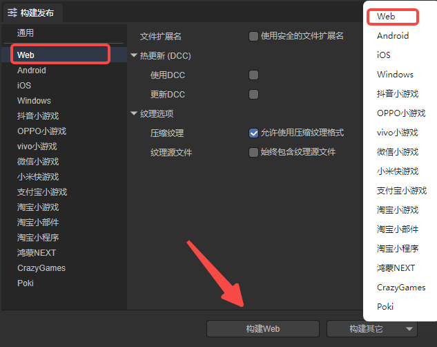

# Web发布

## 一、概述

Web发布功能是非常核心的功能，通常是指发布为HTML5版本，运行于浏览器环境、webView、LayaNative的APP环境中。在项目完成开发，或阶段性完成开发，准备提交到生产环境中进行测试时，通常会用到项目发布的功能。由于LayaAir 3.1.x IDE在结构上与3.0.x相比有很大的变化，在IDE Web发布上面来说，开发者需要更多的注意面板的变化。

> 在Web发布前，需要先进行[通用](../generalSetting/readme.md)设置。

## 二、发布为Web游戏

### 2.1 选择目标平台

在构建发布面板中，侧边栏选择目标平台为Web。如图2-1所示，

（图2-1）

点击“构建Web”，或“构建其它”选项中的“Web”，即可发布项目为Web项目。

`文件扩展名`：勾选后，使用安全的文件扩展名。

`热更新（DCC）`：参考[DCC文档](../native/LayaDcc_Tool/readme.md)。

`压缩纹理`：一般需要勾选“允许使用压缩纹理格式”，如果不勾选，则忽略所有图片对于压缩格式的设置。

`纹理源文件`：可以不勾选“始终包含纹理源文件”，如果勾选，则即使图片使用了压缩格式，仍然把源文件（png/jpg)打包。目的是遇到不支持压缩格式的系统时，fallback到源文件。

> 纹理格式的规则：
>
> 1、Web平台和**各个小游戏平台的远程包**，会同时发布PC/Android/iOS三种平台的格式；
>
> 2、微信平台会同时发布Android/iOS两种格式；
>
> 3、其他小游戏平台只发布Android格式。
>
> 4、特殊规则遵循上图说的两个选项。

发布后，点击“查看任务”，可以看到已经发布的任务。如图2-2所示，

（图2-2）

`打开文件夹`：在资源文件管理器中，打开项目发布的文件目录。

`查看日志`：查看项目发布的日志。

`再次构建`：重新构建Web项目。

`运行`：在本地运行发布后的Web项目。

`查看二维码`：生成一个二维码，可以将手机与PC连接至同一局域网下，扫码预览发布的Web项目。

`删除记录`：删除发布的记录，但不会删除发布的项目。

### 2.2 发布后的目录

发布后的目录结构如图2-3所示，

（图2-3）

**js目录 与 libs目录**：

项目代码和引擎库。

**resources目录 与 Scene.ls**：

资源文件目录和场景文件。

**fileconfig.json**：

文件里包括了一些Web项目的配置信息。

## 三、本地运行发布后的Web项目

1、运行发布后的Web项目，可以在发布后，直接点击图2-2中的运行按钮，就可以在浏览器中运行发布后的Web项目了。

2、如果开发者不小心将发布记录删除了，可以打开项目发布的文件目录。在发布目录下，使用Node.js的anywhere启动一个本地服务器运行Web项目。如动图2-4所示，在“web”文件夹中打开命令行cmd，输入`anywhere `，然后点击键盘回车键就可以启动一个本地服务器了。

（动图2-4）

