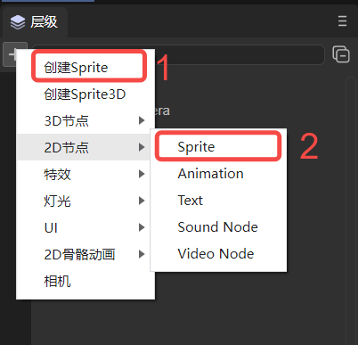

# 层级面板说明

## 一、层级面板的作用

层级管理面板，提供了节点的可视化操作，方便节点之间的管理。主要包括了2D节点与3D节点，如果是纯粹的2D项目，也可以只包括2D节点。面板如图1-1所示。

（图1-1）

层级的关系就代表着父子节点的关系，子节点会受到父节点的影响，例如父节点改变了位置，或旋转了角度，子节点也会同步产生变化。

3D节点的根节点是Scene3D，2D节点的根节点是Scene2D。2D与3D节点之间不可以混合形成父子层级关系。

## 二、层级面板的通用操作

### 2.1 创建节点

可以创建的3D节点有：

- Sprite3D（这是一个空节点）；
- 基础3D节点（Cube、Sphere、Cylinder、Capsule、Cone、Plane）；
- 特效（Particle3D、PixelLine、Trail）；
- 灯光（DirectionLight、PointLight、SpotLight、AreaLight）；
- 相机。

可以创建的2D节点有：

- 基础2D节点（Sprite、Animation、Text、SoundNode、VideoNode）；
- UI组件（Box、HBox、VBox、Image、Clip、Button、CheckBox、Radio、RadioGroup、ComboBox、Label、TextInput、TextArea、FontClip、ProgressBar、HSilder、VSlider、List、Panel、Tree、Tab、ViewStack、HScrollBar、VScrollBar、ColorPicker、View、Dialog、OpenDataContextView）；
- 2D骨骼动画（Spine、Skeleton）。

以上列出了可以创建的节点类型，下面就来介绍创建节点的方式，主要有两种：一种是创建的无父级关系的单独节点，即3D节点在Scene3D下，2D节点在Scene2D下；另一种是创建在某个节点下，作为其子节点。

如图1-1中的Sprite就是单独节点，Sphere是Cube的子节点。

#### 2.2.1 单独节点

如果不选中某个确定的节点，如动图2-1所示，假设选中了，可以点击空白处取消选中，这时点击`+`可以创建节点，这时创建的节点是单独的节点。

（动图2-1）

如动图2-2所示，不选中节点时，空白处单击右键进行创建，此时创建的也是一个单独节点。

（动图2-2）

细心的开发者可能会发现，创建的菜单栏中有两个地方可以创建Sprite，如图2-3所示，一种是直接选择`创建Sprite`，一种是在`2D节点->Sprite`下进行创建。这两种方式创建的Sprite是一样的，方式1是为了操作的方便，方式2是因为Sprite作为基础的显示精灵，在分类上属于基础的2D节点。

（图2-3）

> 注：创建空节点的快捷键可参考文档[《IDE快捷键与鼠标交互操作大全》](../shortcutKeyCombinations/readme.md)1.3.1节。

#### 2.2.2 父子节点

如动图2-4所示，如果选中某个节点进行创建，不论是点击`+`创建，还是右键进行创建，都是创建选中节点的子节点。

（动图2-4）

### 2.2 搜索节点

在搜索栏中，可以根据节点名称，搜索已经创建的节点，如下动图所示，搜索Sphere节点：

（动图2-5）

还可以结合项目资源面板，比如，项目资源面板中有一个图片LayaAir.png，将场景中Image组件的皮肤设置为这张图片，这时，可以右键此图片，选择在场景中查找引用，如动图2-6所示，这样就可以搜索到引用此资源的组件了。

（动图2-6)

### 2.3 隐藏节点

按动图2-7所示，可以隐藏节点，但是，此时的隐藏效果仅仅是在`场景`面板中，`预览运行`时该节点仍然存在。

（动图2-7）

如果是父子节点，隐藏子节点，则仅仅隐藏节点本身，如果隐藏父节点，则子节点跟着也会被隐藏，效果如动图2-8所示。

（动图2-8）

### 2.4 锁定节点

按动图2-9所示，可以锁定节点，锁定节点后，该节点在场景面板中，不会被操作。例如，动图中在锁定前可以选中Cube进行移动，但是锁定后就无法选中Cube了。

（动图2-9）

如果是父子节点，如动图2-10所示，锁定子节点，不会影响父节点。如果锁定父节点，则子节点也会跟着锁定。

（动图2-10）

> 这里需要注意，锁定节点，仅仅是让鼠标无法在场景面板中选中它，在属性设置面板中仍然可以对其进行操作。该功能常用于背景图片，将背景图设置好后，为了防止误选，可以先将背景图锁定。

### 2.5 节点的收缩与展开

IDE提供了一个全部收缩按钮，如动图2-11所示，点击后可以收缩全部子节点。

（动图2-11）

> 注：展开全部子节点的快捷键可参考文档[《IDE快捷键与鼠标交互操作大全》](../shortcutKeyCombinations/readme.md)1.3.2节。

### 2.6 节点排序

3D节点在三维坐标系中，它们的遮挡关系与它们的坐标以及相机的位置有关。但对于2D节点来说，如果按顺序添加，在层级面板中会逐个向下增加，如动图2-12所示，则先添加的会被后添加的覆盖掉。此时，如果想修改它们的遮挡关系，可以更改[ZOrder](../../../2D/displayObject/Sprite/readme.md)属性。

（动图2-12）

当然，除了修改ZOrder属性，还可以通过拖拽目标节点来改变遮挡关系，主要有以下三种：

- 拖拽为目标节点的下级节点；
- 拖拽为目标节点的同级之后；
- 拖拽为目标节点的同级之前。

> 注：拖拽目标节点的操作演示可参考文档[《IDE快捷键与鼠标交互操作大全》](../shortcutKeyCombinations/readme.md)1.3.3节。

### 2.7 右键菜单的通用功能

右键菜单除了2.1中创建节点的功能外，还有一些通用功能：

`复制`、`粘贴`：如动图2-13所示，选中节点进行复制（也可以选中多个节点），然后进行粘贴，粘贴后如果有重名节点，IDE会自动进行重命名。

（动图2-13）

> 2D节点只能粘贴到Scene2D下，3D节点只能粘贴到Scene3D下。

`重命名`：如动图2-14所示，可以对选中节点进行重命名。

（动图2-14）

`生成副本`：如动图2-15所示，可以将选中节点生成一个副本，它保留了原节点的属性（位置、大小、特有属性等）。

（动图2-15）

`删除`：如动图2-16所示，可以删除选中节点，删除父节点，子节点会跟着被删除。

（动图2-16）

>注：以上操作的快捷键可参考文档[《IDE快捷键与鼠标交互操作大全》](../shortcutKeyCombinations/readme.md)1.2节。

### 2.8 节点树

在运行时，层级面板会显示运行状态的节点树。如动图2-17所示，切换到哪个场景，就显示哪个场景的节点树。

（动图2-17）

> 动图中的示例为“2D入门示例”。

## 三、3D场景节点操作

### 3.1 3D场景根节点的删除与创建

在本篇的开始提到，如果是纯粹的2D项目，可以只包括2D节点。也就是说，可以将3D节点删除，包括3D的根节点Scene3D。如动图3-1所示，就是删除根节点Scene3D。删除后就是一个纯粹的2D场景了。

（动图3-1）

如果创建了一个纯2D项目，想增加3D场景，那么只需要添加需要的3D节点即可，如动图3-2所示，这时会自动创建该节点到Scene3D下。

（动图3-2）

### 3.2 3D基础节点

在2.1节中已经列出了可以创建的3D节点，本节就来概述说明一下它们的作用，并给出节点对应的文档详解链接。

- Sprite3D

  这是一个空节点，是最基础的3D节点，包含很多3D精灵基本的功能属性。创建后，可以对其赋予Mesh等属性，使其显示效果。详细的用途和使用方法参考文档[《使用3D精灵》](../../../3D/Sprite3D/readme.md)。

- 基础3D节点

  包含：Cube、Sphere、Cylinder、Capsule、Cone、Plane。它们是3D基础的显示对象，可以作为3D开发中的辅助工具，例如，初学者用来快速学习3D开发流程、熟练的开发者进行模拟和测试。详细的使用方法请参考文档[《3D基础显示对象》](../../../3D/displayObject/readme.md)。

- 特效

  特效相关的节点有：Particle3D、PixelLine、Trail；

  Particle3D是3D粒子系统，可以用于模拟烟、雾、水、火、雨、雪、流光等非固定形态的自然现象。详细的做法请参考文档[《3D粒子编辑模块》](../../../IDE/particleEditor/readme.md)。

  PixelLine是像素线，是通过渲染一组带有颜色的线，来绘制3D精灵。详细的介绍请参考文档[《像素线》](../../../IDE/Component/PixelLine/readme.md)。

  Trail是拖尾，拖尾渲染器可以制作物体后面的拖尾效果，比如子弹划过产生的空气柱。详细的内容请参考文档[《拖尾》](../../../IDE/Component/Trail/readme.md)。

- 灯光

  灯光节点总共有四种，分别是DirectionLight（平行光）、PointLight（点光源）、SpotLight（聚光灯）、AreaLight（区域光）。它们决定了环境的颜色和氛围，不同光源会呈现不同的效果。详细的设置方法请参考文档[《3D灯光与阴影》](../../../3D/Light/readme.md)。

- 相机

  相机节点相当于眼睛，一切景象都是通过它来渲染。详细的描述请参考文档[《使用3D摄像机》](../../../3D/Camera/readme.md)。

### 3.3 创建3D渲染节点

渲染节点是指需要进行渲染的节点，例如MeshSprite3D（静态网格精灵）、SkinnedMeshSprite3D（蒙皮动画网格精灵）等。如图3-3所示，直接从资源面板拖拽到层级面板即可。

（图3-3）

## 四、2D场景节点操作

在2.1节中已经列出了可以创建的2D节点，本节就来概述说明一下它们的作用，并给出节点对应的文档详解链接。开发者需要注意，Scene2D节点与Scene3D节点不同，它不可以被删除。

### 4.1 2D基础节点

[Sprite](../../../2D/displayObject/Sprite/readme.md)是2D精灵，是在屏幕中能够被控制的显示对象。

[Animation](../../../2D/displayObject/Animation/readme.md)是节点动画，可以方便的创建图集动画、多帧动画。

[Text](../../../2D/displayObject/Text/readme.md)是静态文本的基础组件。

[SoundNode](../../../2D/displayObject/SoundNode/readme.md)是播放声音的组件。

[VideoNode](../../../2D/displayObject/VideoNode/readme.md)是显示视频的组件。

### 4.2 UI节点

[Box](../../../IDE/uiEditor/uiComponent/Box/readme.md)是容器组件的基类，用于装载其它显示对象的组件。

[HBox](../../../IDE/uiEditor/uiComponent/HBox/readme.md)是常用于水平布局的容器组件。 

[VBox](../../../IDE/uiEditor/uiComponent/VBox/readme.md)是常用于垂直布局的容器组件。

[Image](../../../IDE/uiEditor/uiComponent/Image/readme.md)是UI里最常见的显示图像的组件，用来显示位图图像。

[Clip](../../../IDE/uiEditor/uiComponent/Clip/readme.md)组件可用于显示位图切片动画。

[Button](../../../IDE/uiEditor/uiComponent/Button/readme.md)是按钮组件，可以显示文本标签、图标或者两者同时显示。

[CheckBox](../../../IDE/uiEditor/uiComponent/CheckBox/readme.md)是多选框组件。

[Radio](../../../IDE/uiEditor/uiComponent/Radio/readme.md)是一个单选框组件。

[RadioGroup](../../../IDE/uiEditor/uiComponent/RadioGroup/readme.md)是单选框按钮组。

[ComboBox](../../../IDE/uiEditor/uiComponent/ComboBox/readme.md)是一个下拉列表选项框组件。

[Label](../../../IDE/uiEditor/uiComponent/Label/readme.md)用来显示一段文字。

[TextInput](../../../IDE/uiEditor/uiComponent/TextInput/readme.md)是文本输入框，任何需要输入的时候可以使用它。

[TextArea](../../../IDE/uiEditor/uiComponent/TextArea/readme.md)是文本域，继承于TextInput。

[FontClip](../../../IDE/uiEditor/uiComponent/FontClip/readme.md)对位图从方向上进行等比切割。

[ProgressBar](../../../IDE/uiEditor/uiComponent/ProgressBar/readme.md)用于显示进度。

[HSilder](../../../IDE/uiEditor/uiComponent/HSlider/readme.md)是横向滑动条，可以通过在滑块轨道之间移动滑块来选择值。

[VSlider](../../../IDE/uiEditor/uiComponent/VSlider/readme.md)是纵向滑动条。

[List](../../../IDE/uiEditor/uiComponent/List/readme.md)可显示项目列表。

[Panel](../../../IDE/uiEditor/uiComponent/Panel/readme.md)是一个带有裁剪功能的面板容器类，常用来设置元素的显示区域。

[Tree](../../../IDE/uiEditor/uiComponent/Tree/readme.md)组件用来显示树状结构。

[Tab](../../../IDE/uiEditor/uiComponent/Tab/readme.md)组件用于定义选项卡按钮组。

[ViewStack](../../../IDE/uiEditor/uiComponent/ViewStack/readme.md)主要用于多页面视图切换。

[HScrollBar](../../../IDE/uiEditor/uiComponent/HScrollBar/readme.md)是一个水平方向滚动条组件

[VScrollBar](../../../IDE/uiEditor/uiComponent/VScrollBar/readme.md)是一个垂直方向滚动条组件。

[ColorPicker](../../../IDE/uiEditor/uiComponent/ColorPicker/readme.md)显示包含多个颜色样本的列表。

[View](../../../IDE/uiEditor/View/readme.md)是视图组件， 常用于预制体场景的根节点。

[Dialog](../../../IDE/uiEditor/View/Dialog/readme.md)继承于View，主要用于弹窗面板。

[OpenDataContextView](../../../IDE/uiEditor/uiComponent/OpenDataContextView/readme.md)是开放数据域要用到的组件。

### 4.3 骨骼节点

[Spine](../../../IDE/uiEditor/uiComponent/skeleton/spine/readme.md)通过将图片绑定到骨骼上，然后再控制骨骼实现动画。

[Skeleton](../../../IDE/uiEditor/uiComponent/skeleton/sk/readme.md)可以将一些经常使用的骨骼动画格式转换为LayaAir引擎支持的骨骼动画格式。

