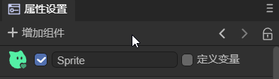

# 属性设置面板说明

## 一、通用功能

### 1.1 增加组件

在属性设置面板中，可以点击`增加组件`，来给节点添加对应的组件，如图1-1所示。

（图1-1）

- 3D节点可以增加的组件有：动画（[时间轴动画](../../../IDE/animationEditor/timelineGUI/readme.md)、[动画状态机](../../../IDE/animationEditor/aniController/readme.md)）、[3D物理](../../../IDE/physicsEditor/physics3D/readme.md)、[网格](../../../IDE/Component/Mesh/readme.md)、特效（[粒子](../../../IDE/particleEditor/readme.md)、[拖尾](../../../IDE/Component/Trail/readme.md)、[像素线](../../../IDE/Component/PixelLine/readme.md)）、[灯光](../../../3D/Light/readme.md)、渲染（[UI3D](../../../IDE/uiEditor/3DUI/readme.md) 、[反射探针](../../../IDE/Component/ReflectionProbe/readme.md)、[静态合批](../../../IDE/Component/StaticBatchVolume/readme.md)、[LOD组](../../../IDE/Component/LOD/readme.md)）、[自定义组件脚本](../../../basics/IDE/entry/readme.md)、[新建组件脚本](../../../basics/common/Component/readme.md)。
- 2D节点可以增加的组件有：动画（[时间轴动画](../../../IDE/animationEditor/timelineGUI/readme.md)、[动画状态机](../../../IDE/animationEditor/aniController/readme.md)）、[2D物理](../../../IDE/physicsEditor/physics2D/readme.md)、[自定义组件脚本](../../../basics/IDE/entry/readme.md)、[新建组件脚本](../../../basics/common/Component/readme.md)。

> “自定义组件脚本”是添加已经存在的脚本文件；“新建组件脚本”是新建一个脚本文件。

### 1.2 上一个、下一个

如图1-2所示，点击`<`可以回到看过的上一个节点，点击`>`可以看到切换前看到的结点。

（图1-2）

### 1.3 锁定

如动图1-3所示，点击锁定可以锁定属性面板，切换结点时属性设置面板不切换。

（动图1-3）

## 二、应用场景

### 2.1 节点的属性设置

#### 2.1.1 通用属性设置

**1，`激活`**

2D节点和3D节点都有激活功能，当取消勾选如图2-1所示选项后，该结点在层级面板会变灰，并且不激活父节点子节点会跟着被不激活。

（图2-1）

取消激活后，对于3D节点将不显示，即使运行时也不显示，如动图2-2所示。

（动图2-2）

但是，对于2D节点，取消激活后并不影响节点本身，只是不激活节点的脚本。例如动图2-3所示，使用脚本改变显示的文本，不激活后文本不会被改变。

（动图2-3）

2，`重命名`

可以按照如动图2-4所示的方式对节点进行重命名。

（动图2-4）

#### 2.1.2 3D节点

`静态`：

在游戏场景中，每一个Sprite3D都有静态或者动态的两种状态，当一个物体标记为静态后，就确保这个物体在游戏场景中为静态的、不会移动的物体，进而在游戏的运行过程中让游戏有更加流畅的运行体验。详细的介绍请参考[《使用3D精灵》](../../../3D/Sprite3D/readme.md)的2.3节。

`Layer`：

蒙版层，渲染相机根据蒙版层可进行可视遮罩层的控制，对精灵的渲染与否进行控制。详细的介绍请参考[《使用3D精灵》](../../../3D/Sprite3D/readme.md)的2.4节。

> Scene3D没有Layer属性。

#### 2.1.3 2D节点

**1，定义变量**

勾选后，保存场景，就可以在`UI运行时`里面进行节点的管理了。详细的做法请参考[《UI运行时》](../../../IDE/uiEditor/runtime/readme.md)的2.3节。

> Scene2D中没有定义变量属性。

**2，Scene2D特有属性**

- UI运行时：Runtime入口，详细内容请参考[《UI运行时》](../../../IDE/uiEditor/runtime/readme.md)。
- 使用设计宽高：勾选后，使用的就是`项目设置`面板中设置的宽高；不勾选，可以自定义宽高。
- 预加载资源列表：可以添加一些需要预加载的资源。

#### 2.1.4 预制体

当节点是预制体时，会有以下属性：

- 编辑：进入预制体的编辑页面。

- 定位：在项目资源面板中定位预制体资源文件。

- 覆盖属性：可以将修改覆盖到预制体中。

> 预制体的详细内容请参考[《预制体模块》](../../../IDE/prefab/readme.md)。

### 2.2 资源的属性设置

在`资源面板`中，点击以下资源类型的文件，可以在`属性设置`面板中，设置对应的属性。

- 图片：可以设置导入的图片属性，详细内容参考[《项目资源面板说明》](../../../basics/IDE/assets/readme.md)的1.4节。
- 位图字体：可以自定义位图字体，详细内容参考[《文本进阶使用》](../../../2D/advanced/useText/readme.md)的2.2节。
- 自动图集：发布后可以自动生成图集，详细内容参考[《Web发布》](../../../released/web/readme.md)的3.3.1节。
- 材质：可以创建自定义材质，详细内容参考[《材质编辑模块》](../../../IDE/materialEditor/readme.md)。
- 动画：有2D动画文件和3D动画文件，详细内容参考[《时间轴动画编辑详解》](../../../IDE/animationEditor/timelineGUI/readme.md)。
- 光照贴图烘培：可以设置光照属性，详细内容参考[《3D场景环境设置》](../../../IDE/sceneEditor/environment/readme.md)的第六节。
- 第三方JS文件：提供了单独导入的功能，详细内容参考[《引用第三方JS模块》](../../../basics/IDE/importJsLibrary/readme.md)的第二节。
- 模型：支持的模型后缀为fbx与gltf的模型文件，详细内容参考[《模型与动画的导入使用》](../../../3D/useModel/readme.md)。
- RenderTexture：可以修改渲染纹理的属性，详细内容参考[《混合使用3D》](../../../IDE/uiEditor/use3D/readme.md)的第二节。

### 2.3 代码预览

如图2-5所示，在src文件夹中选中脚本文件，就可以进行代码预览了。还可以在里面修改代码，完成后点击应用即可，但是建议开发者还是使用代码编辑器进行修改。

（图2-5）