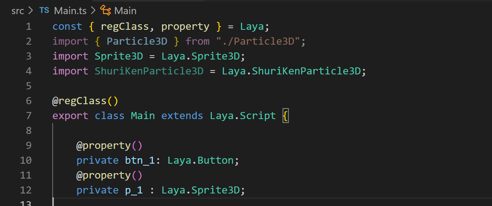
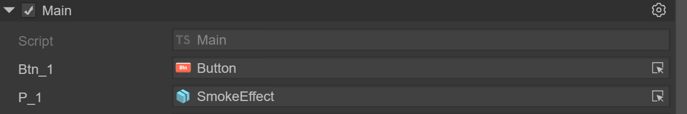
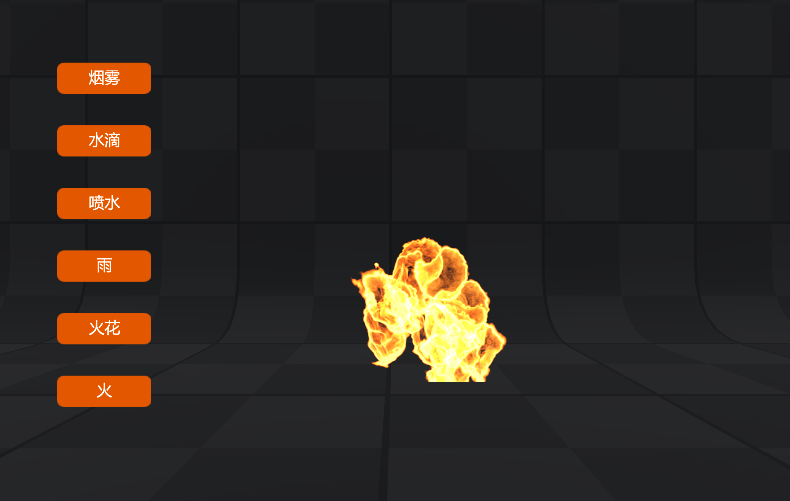

# 自定义脚本组件

LayaAir2.0开始，支持自定义脚本到编辑器，方便扩展已有组件的功能。自定义脚本继承自Laya.Script类，定了组件的事件和自身生命周期方法，不需要再自己绑定事件即可快速实现逻辑。任何组件都可以使用同一自定义脚本来实现相同的功能，比如不同页面上需要对相同的组件实现同一功能。

另外不同的页面在使用同一脚本时，可以给同一个属性指定不同的组件，可通过把属性暴露给编辑器，在编辑上指定。

## 自定义脚本的属性暴露


如果想在编辑器内展示脚本定义的属性，可用通过特殊注释来实现，比如下面的脚本类：

 

（图1）

其中：

```
const { regClass, property } = Laya;
```

写在脚本类的最上面，声明此类支持暴露类中的属性

```
@regClass()
export class Main extends Laya.Script
```

在自定义脚本类的上一行，加入@regClass()

```
@property()
private btn_1: Laya.Button; 
```

在自定义属性的上一行，加入@property()，则可以在编辑器暴露此属性，并可以拖拽场景中的相对应的节点

 

（图2）

 

（图3）

## 组件的事件

当使用自定义脚本类时，可以实现如下事件，方便快速开发业务逻辑

```
    /**
     * 开始碰撞时执行
     */
    onTriggerEnter?(other: PhysicsComponent | ColliderBase, self?: ColliderBase, contact?: any): void;

    /**
     * 持续碰撞时执行
     */
    onTriggerStay?(other: PhysicsComponent | ColliderBase, self?: ColliderBase, contact?: any): void;

    /**
     * 结束碰撞时执行
     */
    onTriggerExit?(other: PhysicsComponent | ColliderBase, self?: ColliderBase, contact?: any): void;

    /**
     * 开始碰撞时执行
     */
    onCollisionEnter?(collision: Collision): void;

    /**
     * 持续碰撞时执行
     */
    onCollisionStay?(collision: Collision): void;

    /**
     * 结束碰撞时执行
     */
    onCollisionExit?(collision: Collision): void;

    /**
     * 关节破坏时执行此方法
     */
    onJointBreak?(): void;

    /**
     * 鼠标按下时执行
     */
    onMouseDown?(evt: Event): void;

    /**
     * 鼠标抬起时执行
     */
    onMouseUp?(evt: Event): void;

    /**
     * 鼠标右键或中键按下时执行
     */
    onRightMouseDown?(evt: Event): void;

    /**
     * 鼠标右键或中键抬起时执行
     */
    onRightMouseUp?(evt: Event): void;

    /**
     * 鼠标在节点上移动时执行
     */
    onMouseMove?(evt: Event): void;

    /**
     * 鼠标进入节点时执行
     */
    onMouseOver?(evt: Event): void;

    /**
     * 鼠标离开节点时执行
     */
    onMouseOut?(evt: Event): void;

    /**
     * 鼠标按住一个物体后，拖拽时执行
     */
    onMouseDrag?(evt: Event): void;

    /**
     * 鼠标按住一个物体，拖拽一定距离，释放鼠标按键后执行
     */
    onMouseDragEnd?(evt: Event): void;

    /**
     * 鼠标点击时执行
     */
    onMouseClick?(evt: Event): void;

    /**
     * 鼠标双击时执行
     */
    onMouseDoubleClick?(evt: Event): void;

    /**
     * 鼠标右键点击时执行
     */
    onMouseRightClick?(evt: Event): void;

    /**
     * 键盘按下时执行
     */
    onKeyDown?(evt: Event): void;

    /**
     * 键盘产生一个字符时执行
     */
    onKeyPress?(evt: Event): void;

    /**
     * 键盘抬起时执行
     */
    onKeyUp?(evt: Event): void;
```


## 组件的生命周期方法

当使用自定义脚本类时，可以实现如下生命周期方法，方便快速开发业务逻辑

```
    /**
     * 被添加到节点后调用，和Awake不同的是即使节点未激活onAdded也会调用。
     */
    onAdded(): void {
    }

    /**
     * 重置组件参数到默认值，如果实现了这个函数，则组件会被重置并且自动回收到对象池，方便下次复用
     * 如果没有重置，则不进行回收复用

     */
    onReset?(): void;

    /**
     * 组件被激活后执行，此时所有节点和组件均已创建完毕，次方法只执行一次
     */
    onAwake(): void {
    }

    /**
     * 组件被启用后执行，比如节点被添加到舞台后
     */
    onEnable(): void {
    }

    /**
     * 第一次执行update之前执行，只会执行一次
     */
    onStart?(): void;

    /**
     * 每帧更新时执行，尽量不要在这里写大循环逻辑或者使用getComponent方法
     */
    onUpdate?(): void;

    /**
     * 每帧更新时执行，在update之后执行，尽量不要在这里写大循环逻辑或者使用getComponent方法
     */
    onLateUpdate?(): void;

    /**
     * 渲染之前执行
     */
    onPreRender?(): void;

    /**
     * 渲染之后执行
     */
    onPostRender?(): void;

    /**
     * 组件被禁用时执行，比如从节点从舞台移除后
     */
    onDisable(): void {
    }

    /**
     * 手动调用节点销毁时执行
     */
    onDestroy(): void {
    }
```

## 参考代码

代码实现了自定义脚本的暴露属性的标识符，生命周期方法onStart()和事件mouseDown()的实现

 

（图4）

```
const { regClass, property } = Laya;
import { Particle3D } from "./Particle3D";
import Sprite3D = Laya.Sprite3D;
import Button = Laya.Button;
import Event = Laya.Event;

@regClass()
export class Main extends Laya.Script {

    @property()
    private btn_1: Button;  
    @property()
    private p_1 : Sprite3D;           
    @property()
    private btn_2: Button;    
    @property()
    private p_2 : Sprite3D;      
    @property()
    private btn_3: Button;  
    @property()
    private p_3 : Sprite3D;      
    @property()
    private btn_4: Button;    
    @property()
    private p_4 : Sprite3D;       
    @property()
    private btn_5: Button;    
    @property()
    private p_5 : Sprite3D;     
    @property()
    private btn_6: Button;    
    @property()
    private p_6 : Sprite3D;      

    private particleList: Array<Sprite3D> = [];

    onStart() {
        console.log("Game start");

        this.particleList.push(this.p_1);
        this.particleList.push(this.p_2);
        this.particleList.push(this.p_3);
        this.particleList.push(this.p_4);
        this.particleList.push(this.p_5);
        this.particleList.push(this.p_6);
        
        this.btn_1.on(Event.MOUSE_DOWN, this, () => {
            this.hideAll();
            this.p_1.active = true;
        });
        this.btn_2.on(Event.MOUSE_DOWN, this, () => {
            this.hideAll();
            this.p_2.active = true;
        });
        this.btn_3.on(Event.MOUSE_DOWN, this, () => {
            this.hideAll();
            this.p_3.active = true;
        });
        this.btn_4.on(Event.MOUSE_DOWN, this, () => {
            this.hideAll();
            this.p_4.active = true;
        });
        this.btn_5.on(Event.MOUSE_DOWN, this, () => {
            this.hideAll();
            this.p_5.active = true;
        });    
        this.btn_6.on(Event.MOUSE_DOWN, this, () => {
            this.hideAll();
            this.p_6.active = true;
        });                                       
    }

    hideAll(): void {
        this.particleList.forEach(element => {
            (element as Sprite3D).active = false;
        });
    }

    mouseDown(e: Event): void {
        this.hideAll();           
    }
 
}
```

