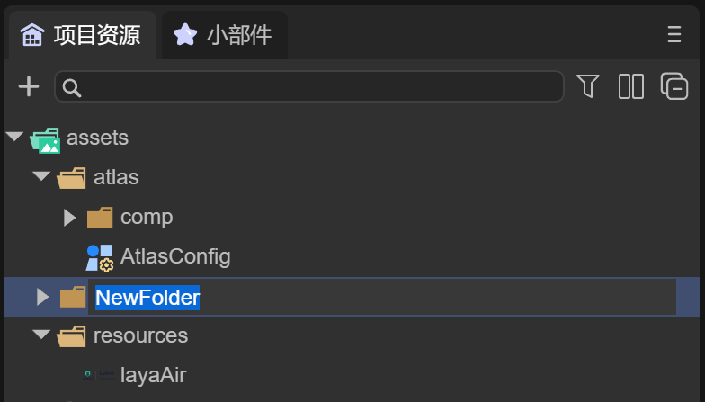

# 项目资源面板说明

## 一、2D图片资源设置

### 1.1、概述

2D图片资源，在IDE导入后，会作为3D模型的纹理格式，在2D界面开发中，通常要改为2D的图片格式，需要开发者自行编辑。

如图1-1所示

 

（图1-1）

Default：默认情况下，图片作为3D模型的Texture，只能用在材质球上。

SpriteTexture：图片作为2D的Sprite对象的图片纹理格式，通常在2D开发中使用。

### 1.2、IDE中设置成SpriteTexture

如图2-1所示，这是一张有透明通道的png图片

  

（图2-1）

放在LayaAir IDE的 assets 目录下，点击图片，看下属性设置，如图2-2所示

 

（图2-2）

默认情况下，这张图片的Texture Type是 Default 类型，通常会作为3D的模型纹理格式

在不改变图片类型的情况下，将这张图作为2D图片在Image组件中使用并运行，页面背景是蓝色，如图2-3所示

 

（图2-3）

可以看到图中绿色区域有白色毛边，因此需要更改设置，作为 SpriteTexture 并勾选 Alpha Channel ，如图2-4所示

 

（图2-4）

再看看运行效果，如图2-5所示

 

（图2-5）

未完待续……

