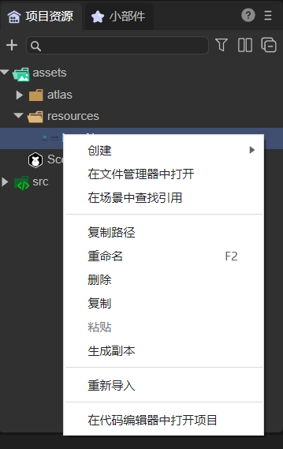
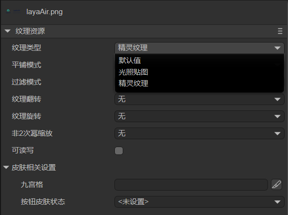
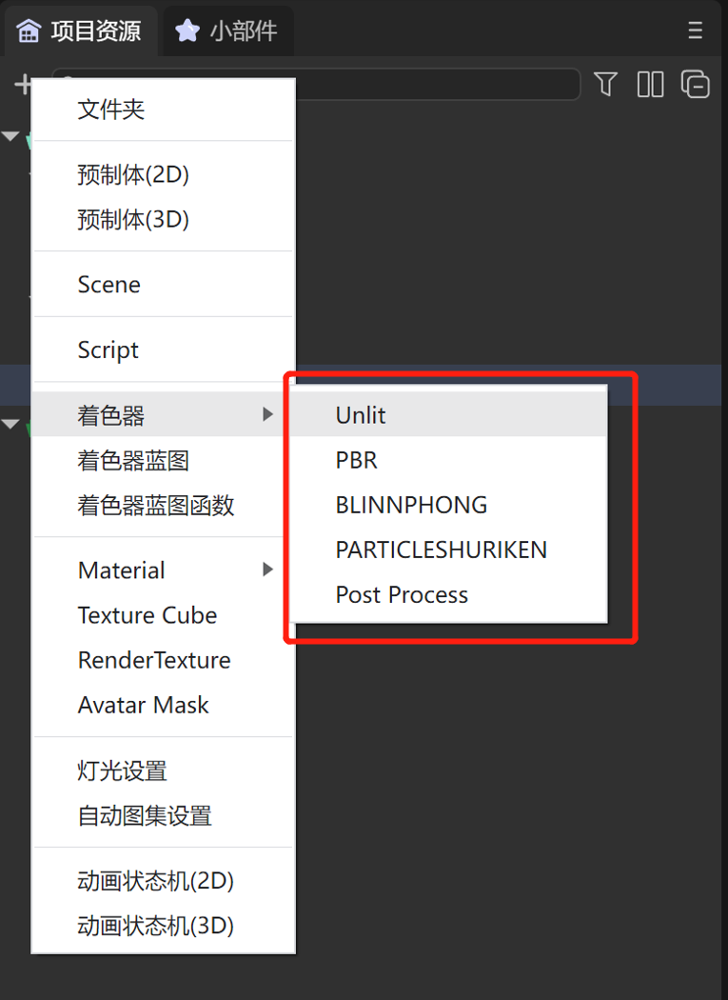
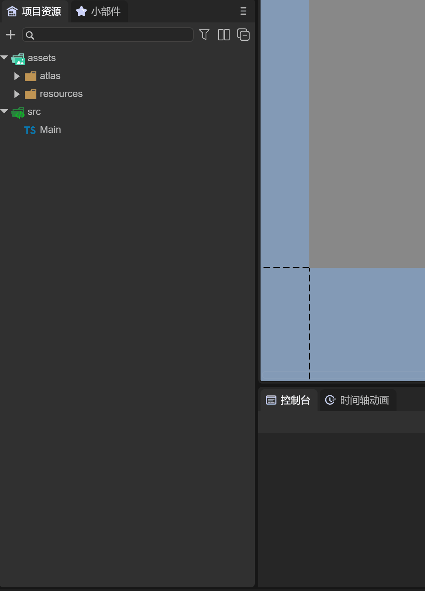
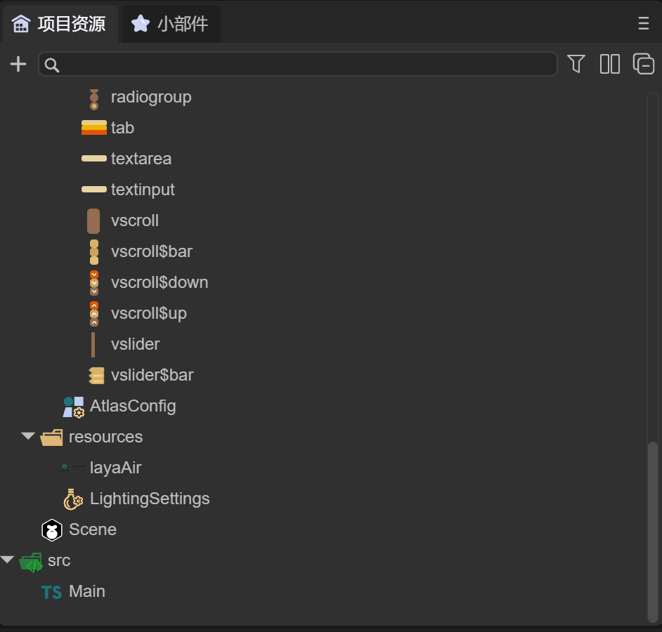

# 项目资源面板说明

## 一、资源目录

LayaAir IDE打开项目工程后，由五个部分构成，效果如图1-1所示

 

（图1-1）

- 项目资源目录
- 项目源码目录
- `+`快捷创建
- 搜索面板
- 目录设置按钮

首先我们可以简单了解一下项目资源目录和项目源码目录，然后会对其它三个功能做详解介绍

## 1.1 项目资源目录assets

assets目录是比较重要的项目目录，我们所有的场景与资源都在assets目录，IDE对项目资源的管理，都是来自于该目录。

效果如图1-2所示：

 

（图1-2）

该目录与最终的发布有着密切的关联，

例如，场景Scene中在assets里引入的资源会自动复制到发布目录。

代码里引用的资源，必须放到resources目录里，才会被复制到发布目录里。

## 1.2 项目源码目录src

src里源码目录，如图1-3所示。

 

(图1-3)

源码目录比较容易理解，通常在安装了代码编辑器后，可以双击源码来打开代码编辑器

## 1.3 右键菜单

通过鼠标右键任何目录或者文件，可以打开菜单，如图1-4所示

  

(图1-4)

通过点击“创建”，动图1-5中在assets目录下创建了一个“灯光设置”文件

  

（动图1-5）

在第二节，我们会对菜单中可以创建的八个类型进行讲解

**在文件管理器中打开**，可以快速打开文件管理器查看文件

**复制UUID**，可以查看资源的UUID属性，后续IDE会提供通过UUID查找资源的功能

**重命名和删除**，对文件的基本操作

**重新导入**，通常用于导入失败，或者有些外部依赖更改了，比如模型里有个材质，材质引用了外部贴图，但一开始贴图没放进来，后来放进来了，可以使用此功能

**在代码编辑器中打开**，可以直接打开代码编辑器查看文件信息

## 1.4 2D图片编辑成SpriteTexture

2D图片资源，assets目录下，默认会作为3D模型的纹理格式，在2D界面开发中，通常要改为2D的图片格式，需要开发者自行编辑。

如图1-6所示，这是一张有透明通道的png图片

 

（图1-6）

点击图片，看下属性设置，如图1-7所示

 

（图1-7）

`Default`：默认情况下，图片作为3D模型的Texture贴图文件，只能用在材质球上。

`SpriteTexture`：图片作为2D的Sprite对象的图片纹理格式，通常在2D开发中使用。

在不改变图片类型的情况下，将这张图作为2D图片在Image组件中使用并运行，页面背景是蓝色，如图1-8所示

 

（图1-8）

可以看到图中绿色区域有白色毛边，因此需要更改设置，作为 SpriteTexture 并勾选 Alpha Channel ，如图1-9所示

 

（图1-9）

再看看运行效果，如图1-10所示

 

（图1-10）

## 二、快速创建文件

快速创建文件有两种快速方式

- **点击 `+` 快速创建**
- **点击空白处快速创建**

1，快速创建是方便开发者可以快速创建特殊类型文件的方式，如动图2-1所示

 

（动图2-1）

2，点击项目资源面板中的空白处，选择创建，也可以做到快速创建，如动图2-2所示

 

（动图2-2）

3，这里快速创建的文件只会在assets目录下，如果想放到某个目录中，可以拖住文件放入，如动图2-3所示

 

（动图2-3）

## 2.1 创建文件夹

如图2-3所示，在快速创建菜单中，点击“文件夹”会在assets下创建一个文件夹，并可以修改文件夹名字

 

（图2-3）

## 2.2 创建预制体

在快速创建菜单中，点击“预制体2D”和“预制体3D”会创建预制体文件

### 2.2.1 预制体2D

如图2-4所示，创建预制体2D后，点击后打开，预制体只有一个Box根节点，用于2D开发

 

（图2-4）

同时，我们也可以更改Box组件为Dialog组件，如动图2-5所示

 

（动图2-5）

Dialog是弹窗面板，可以通过设置来实现弹窗效果

### 2.2.2 预制体3D

如图2-6所示，创建预制体3D后，点击后打开，预制体只包括Sprite3D对象，用于3D对象开发

 

（图2-6）

通常3D预制体用来创建可以重复使用的3D节点对象，比如场景中的主角，敌人等等

## 2.3 创建场景（scene）

如图2-7所示，在快速创建菜单中，点击“scene”会在assets下快速创建一个场景

 

（图2-7）

## 2.4 创建着色器

### 2.4.1 着色器

如图2-8所示，在快速创建菜单中，点击“着色器”会选择创建五种类型的shader文件

 

（图2-8）

通过创建shader，开发者可以对shader进行修改成自定义的shader使用，如图2-9所示

 

（图2-9）

### 2.4.2 着色器蓝图

如图2-10所示，在快速创建菜单中，点击“着色器蓝图”会在assets下快速创建一个着色器蓝图文件

 

（图2-10）

双击蓝图文件，可以通过可视化窗口来编辑

 

（图2-11）

### 2.4.3 着色器蓝图函数

如图2-12所示，在快速创建菜单中，点击“着色器蓝图函数”会在assets下快速创建一个着色器蓝图函数文件

 

（图2-12）

双击蓝图函数文件，可以通过可视化窗口来编辑

 

（图2-13）

## 2.5 创建材质及配置

### 2.4.1 材质文件

如图2-14所示，在快速创建菜单中，点击“Material”会选择创建八种类型的材质文件

 

（图2-14）

通过创建Material，开发者可以对材质进行修改，方便快速使用 

### 2.5.2 TexturCube

如图2-15所示，在快速创建菜单中，点击“TexturCube”会在assets下快速创建一个TexturCube文件

 

（图2-15）

点击Cubemap文件，可以配置

  

（图2-16）

通常Cubemap文件，用于配置天空盒的贴图，如图2-17所示

（图2-17）

具体如何使用TextureCube，开发者请参考《3D场景环境设置》中的天空盒的详细讲解

### 2.4.3 RenderTexture

如图2-18所示，在快速创建菜单中，点击“RenderTexture”会在assets下快速创建一个RenderTexture文件

 

（图2-18）

RenderTexture渲染纹理，用于将3D场景渲染到2D纹理中，混合2D开发使用，如动图2-19所示

 

（图2-19）

具体如何使用RenderTexture，开发者请参考《混合使用3》中的详细讲解

### 2.4.4 AvatarMask

如图2-20所示，在快速创建菜单中，点击“AvatarMask”会创建AvatarMask文件

 

（图2-20）

通过创建AvatarMask，开发者可以用来描述动画层遮罩

## 2.6 创建图片类型

### 2.6.1 灯光设置

如图2-21所示，在快速创建菜单中，点击“灯光设置”会创建LightingSettings文件

 

（图2-21）

通过创建LightingSettings，开发者可以设置光照属性，用来烘焙光照贴图

（图2-22）

具体如何使用灯光设置，开发者请参考《3D场景环境设置》中关于烘焙光照贴图的详细讲解

### 2.6.2 自动图集设置

如图2-23所示，在快速创建菜单中，点击“自动图集设置”会创建AtlasConfig文件

 

（图2-23）

通过创建AtlasConfig，开发者可以用来自动打包图集

具体如何使用自动打包图集，开发者请参考《Web发布》中关于图集打包的详细讲解

## 2.7 创建动画状态机

在快速创建菜单中，点击“动画状态机2D”和“动画状态机3D”会创建动画状态机。

### 2.7.1 2D动画状态机

如图2-24所示，创建动画状态机2D后，点击后打开

 

（图2-24）

### 2.7.2 3D动画状态机

如图2-25所示，创建动画状态机3D后，点击后打开

 

（图2-25）

动画状态机定义动画状态，以及动画状态之间的切换条件，来驱动对象播放不同的动画，表现出不同的行为。

具体如何使用动画状态机，开发者请参考《动画状态机详解》中的详细讲解

## 三、搜索面板

由于assets下资源会很多，通常最常用的方式是通过搜索查找

### 3.1 文字搜索

通过在搜索框中，输入“button”可以快速检索出Button组件，并可快速拖入2D场景中，如动图3-1所示

 

（动图3-1）

### 3.2 类型搜索

通过点击类型搜索按钮，选择文件类型，比如选择“LightingSettings”，可以快速检索出所有灯光设置文件，如动图3-2所示

 

（动图3-2）

## 四、目录设置面板

### 4.1 两栏显示

在开发过程中，往往在目录中的文件太多，对目录的反复浏览会比较繁琐，通过点击“两栏显示”按钮，可以解决，如图4-1所示

 

（动图4-1）

### 4.2 全部折叠

如果打开的目录太多，开发者可以通过点击“全部折叠”来关闭所有的目录，恢复到只有assets和src目录，如动图4-2所示

 

（动图4-2）

