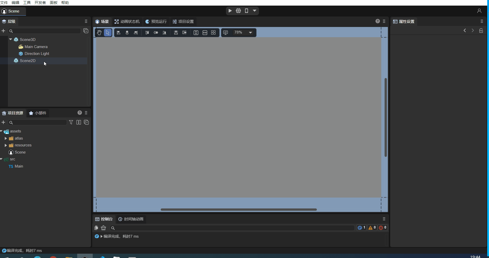

# 项目入口说明


## 一、启动场景

在使用LayaAir2.0中，只能使用Main类来作为项目的入口类，从而进行项目的初始化工作（如图1-1）。


（图1-1）

但是在LayaAir3.0中，项目的入口做了根本性的改变，首先我们知道LayaAir 3.0 IDE中可以创建多个场景，每个场景都可以单独运行来调试，但是不管是2D场景还是3D场景，都需要有一个场景作为项目的启动场景。当项目发布时，会要求指定一个场景作为启动场景。


### 1.1 设置启动场景

假设我们的项目已经制作了几个场景，比如启动画面场景、加载场景等等，下面我们来看看在IDE中是如何设置启动场景的。

如图1-2所示，我们可以在IDE的“文件 -> 构建发布”选项中打开“构建发布”菜单。

 

（图1-2）

打开“构建发布”菜单后，可以对项目进行命名，选择发布平台和发布路径等操作，其中“启动场景”用于指定项目的启动场景（如图1-3）。

 

（图1-3） 

如动图1-4所示，可以选择指定一个启动场景。

 

（动图1-4） 


### 1.2 设置启动参数

针对启动场景的设置，我们还需要进一步来确定项目的启动参数，比如屏幕适配，引擎类库等等（如图1-5）。


（图1-5） 

具体的项目屏幕适配设置及引擎初始化设置等参数设置，在[《项目设置详解》](https://layaair.layabox.com/3.x/doc/basics/IDE/projectSettings/readme.html) 文档中已经介绍了，在这里就不过多讲解了，开发者可以对项目的需求和开发需求来不断配置。

在启动场景配置好之后，想要进一步运行项目的逻辑，需要我们添加项目入口代码，LayaAir 3.0 可以通过两种代码形式：

- **自定义的组件脚本**

- **UI组件脚本**


## 二、自定义的组件脚本

使用LayaAir3.0创建工程后，会建立一个默认的场景，位于“assets”目录下的“Scene”，同时会创建一个“Main.ts”的脚本，位于“src”目录下（如图2-1）。


（图2-1）

虽然可以将这个默认的 Main.ts 脚本（如图2-2）拖入到Scene2D节点的“属性设置”面板中，作为项目的入口类，但是一般我们**不推荐使用**这种方式。下面开始介绍一般自定义组件脚本的方式。

 

（图2-2）

**自定义的组件脚本**：继承自Laya.Script类，定义了组件的事件方法和自身生命周期方法。

动图2-3演示了如何给Scene2D节点添加自定义的组件脚本。在“属性设置”面板中，点击“增加组件->新建脚本”，然后可以对要新建的脚本进行重命名（图中重命名为aaa），最后点击“创建并添加”即可创建脚本。按此方法创建的组件脚本会自动添加在“属性设置”面板中，并且它的类名（aaa）就是新建脚本时的命名（如图2-4）。



 （动图2-3）


（图2-4）

**本节内容属于IDE基础，因此这里只介绍了在IDE中创建自定义组件脚本的方式，并没有深入讲解。关于它结合代码的使用（装饰器暴露属性、事件方法、生命周期方法等）请参考[《ECS组件系统》](https://layaair.layabox.com/3.x/doc/basics/common/Component/readme.html)。**


## 三、UI组件脚本

除了自定义的组件脚本以外，也可以使用UI组件脚本作为项目入口，但是它更加特殊一些。

**UI组件脚本**：它是在Runtime属性入口进行添加，并且，只有在LayaAir3.0 IDE的Scene2D节点的“属性设置”面板中（图3-1）和2D预制体的根节点中（图3-2），可以看到 Runtime 属性。


（图3-1）


（图3-2）

> 注：2D预制体的根节点不一定必须是Box类型才有Runtime入口，其它节点类型的根节点也有这个属性。

下面以Scene2D节点为例，介绍创建UI组件脚本的方式。如动图3-3所示，在“Runtime”属性中**鼠标双击**，IDE会提示创建一个RuntimeScript.ts ，这时可以对其进行重命名（图中重命名为bbb），点击“保存”即可创建脚本。


（动图3-3）

按上述操作之后，除了生成“bbb.ts”之外，在项目工程中看到还多了一个“bbb.generated.ts”（如图3-4）。


（图3-4）

图3-5展示了“bbb.ts”默认生成的代码，其类名（bbb）就是创建时重命名的文件名，它在生成时自动继承于bbbBase类。


（图3-5）

图3-6展示了“bbb.generated.ts”默认生成的代码，这个类的名字为bbbBase，它继承了“Laya.Scene”，说明它是有场景管理能力的。


（图3-6）

> **注意：请不要修改这个代码，随着我们开发过程中不断添加新的UI组件、删除UI组件，这个代码会自动更新。**
>
> 这个类是以runtime类名字xxx为基础进行命名，命名后的文件名就是xxx.generated.ts，类名为xxxBase。


**这里只介绍了在IDE中创建UI组件脚本的方式，没有深入介绍其代码的使用（关联UI组件、与自定义组件脚本的区别等），这个内容请参考[《UI继承类》](https://layaair.layabox.com/3.x/doc/IDE/uiEditor/runtime/readme.html)。**

> 建议先学习完自定义的组件脚本及其代码使用，再学习UI组件脚本。


## 四、自定义初始化

使用IDE开发项目，Laya.init入口是屏蔽的。如果开发者需要在Laya.Init之前执行一些逻辑处理，可以使用以下方法。选择一个Typescript文件，例如Main.ts，在代码中加入：

```typescript
Laya.LayaEnv.beforeInit = function(config: Laya.IStageConfig) {
    //这个方法会在Laya.init前调用
    console.log("before init");
    
    //这里可以对config以及Laya.Config、Laya.Config3D进行自定义的修改
}

Laya.LayaEnv.afterInit = function() {
    //这个方法会在Laya.init后调用
    console.log("after init");
}
```

要注意的是，需保证这些代码所在的脚本文件是被引用的，如果被tree shaking（消除项目中未使用的代码）就无效了。

**注意：如果没有特殊需求，一般不推荐使用这种方法进行游戏初始化。开发者应该使用挂载组件脚本的方式。**

如图4-1所示，把代码加入 Main.ts 的代码最上面。

 

（图4-1）

运行可以看到，输出结果如图4-2所示：

 

（图4-2）

