# 开发流程: Hello World

## 一、使用LayaAir-IDE创建一个空项目

打开LayaAir-IDE后，如图1-1所示，点击创建项目，

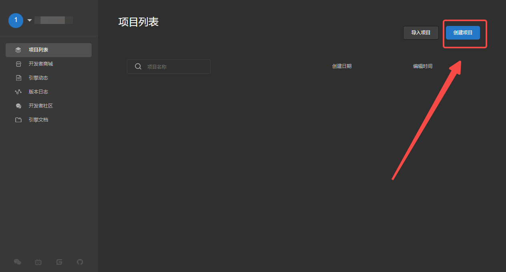

（图1-1）

点击后，如图1-2所示，开发者可以根据需要，创建2D或3D空项目。填写项目名称，并选择项目位置后，点击创建项目。

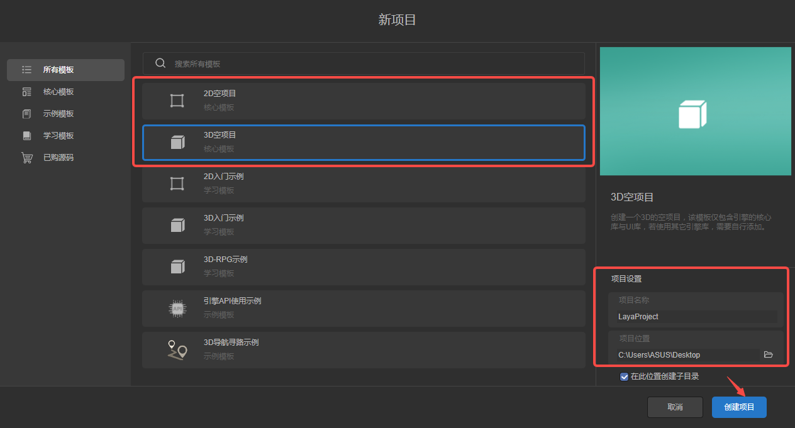

（图1-2）

创建后的2D项目如图1-3所示，

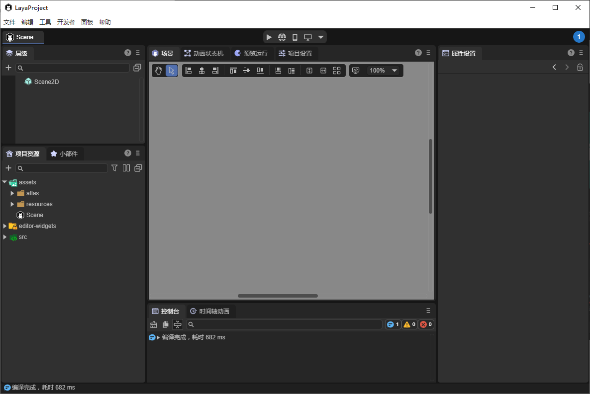

（图1-3）

3D项目如图1-4所示。

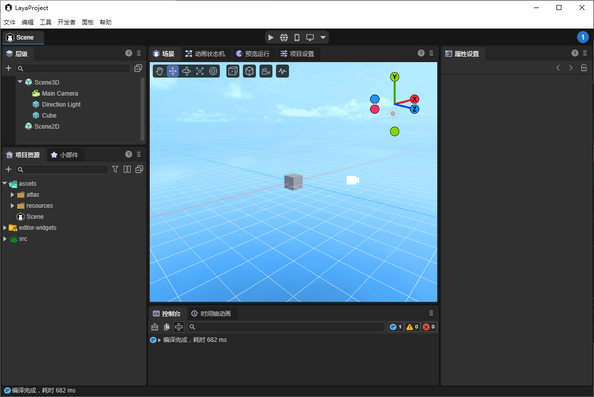

（图1-4）

创建项目后，如果开发者在开发的过程中，更偏向于查看中文属性名称，则可以选择“编辑”菜单栏下的“首选项”，在弹出的面板中选择“允许翻译引擎符号”。

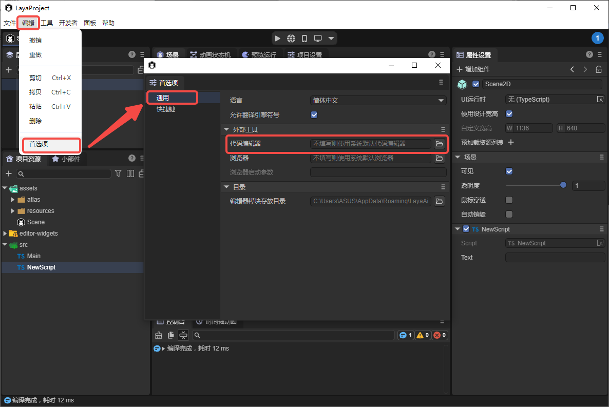

（图1-5）

## 二、预览运行

项目预览用来查看项目在不同环境中的运行效果。LayaAir-IDE提供了四种模式（版本>=3.2），如图2-1所示，分别是IDE内预览，浏览器预览，移动端预览，Windows端预览。

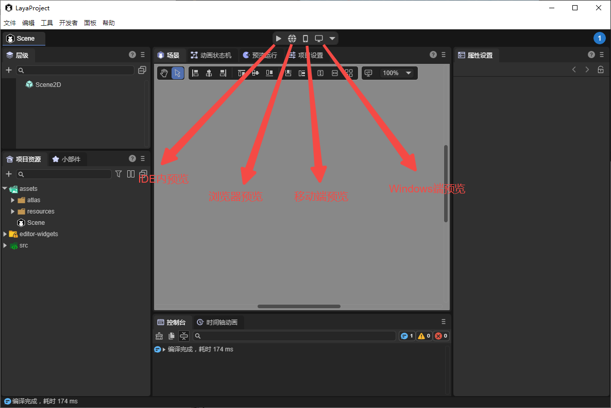

（图2-1）

`IDE内预览`：点击后，直接在IDE内预览运行效果。

`浏览器预览`：点击后，会打开浏览器预览运行效果。可以自定义预览使用的浏览器，如图2-2所示。

（图2-2）

`移动端预览`：点击后，使用移动设备扫码预览运行效果。注意要保证移动设备连接在同一局域网下，开发者可以按图2-3所示，在“项目设置”面板中，自定义预览服务器地址和端口。

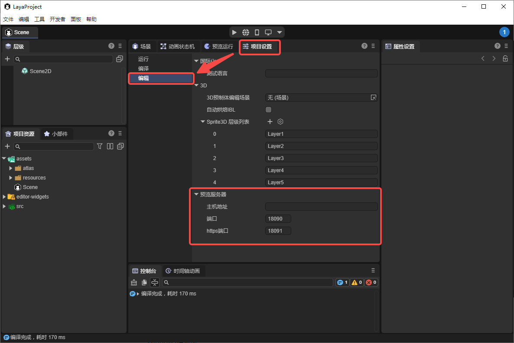

（图2-3）

`Windows端预览`：点击后，如果没有安装相应的模块，则会弹出图2-4所示的提示。

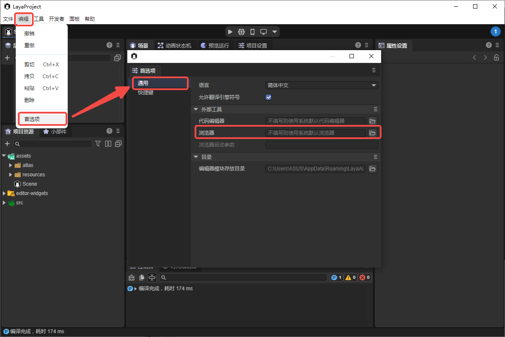

（图2-4）

点击确定后，会自动提示安装，点击安装即可。

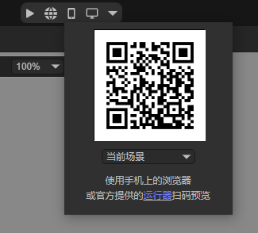

（图2-5）

## 三、入口场景说明

点击图3-1所示的图标，可以选择预览运行的入口，也就是点击预览运行后，要加载、运行的场景。

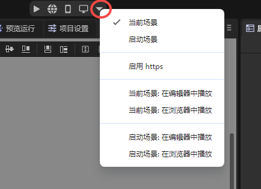

（图3-1）

当前场景，就是当前正在编辑的场景，如图3-2显示的就是当前场景。

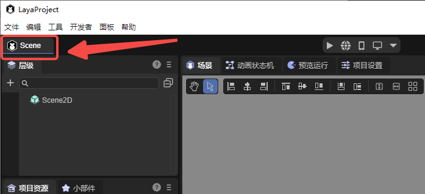

（图3-2）

启动场景，是整个项目的入口场景，也就是游戏率先加载与显示的场景。如图3-3所示，可以在“构建发布”面板中选择启动场景。

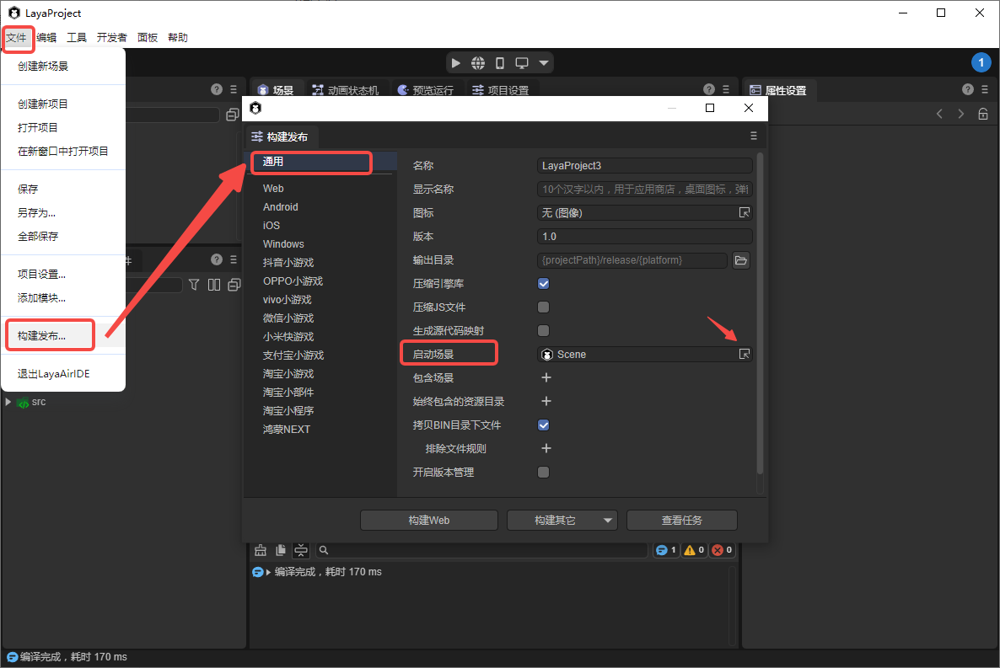

（图3-3）

> 详细内容请参考[《项目入口说明》](../entry/readme.md)。

## 四、脚本

开发者可以使用脚本执行一些特定的逻辑，添加脚本的方式如动图4-1所示，

（动图4-1）

> 自定义的组件脚本中，定义了组件的事件方法和自身生命周期方法，详细内容请参考[《实体组件系统（ECS）》](../../common/Component/readme.md)。

添加后，双击打开代码编辑器进行开发，如图4-2所示，可以在“首选项”中自定义代码编辑器。

（图4-2）

这里默认使用VS Code打开，如动图4-3所示，

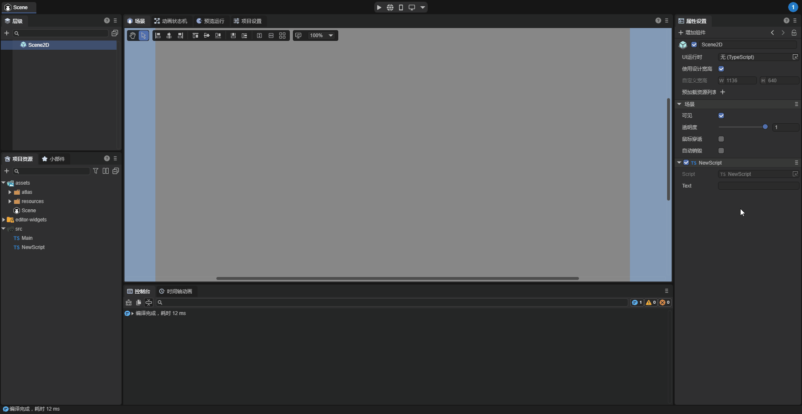

（动图4-3）

添加第一行代码，打印"Hello, World!"，如图4-4所示，

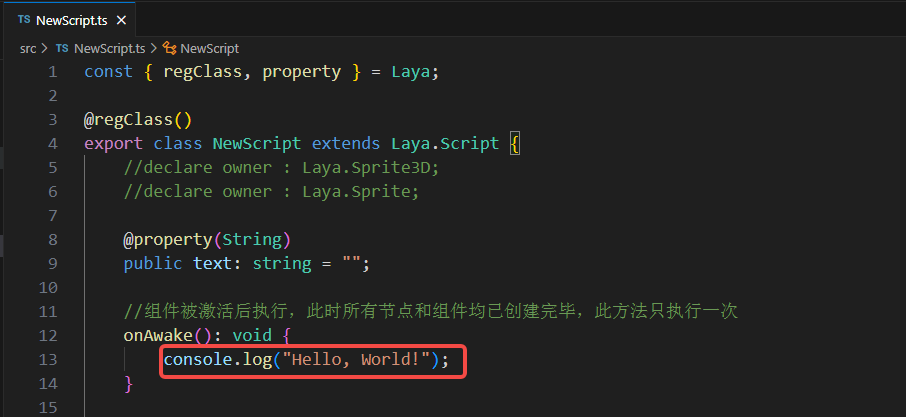

（图4-4）

回到LayaAir-IDE中，运行查看控制台，如动图4-5所示，可以看到打印了日志。

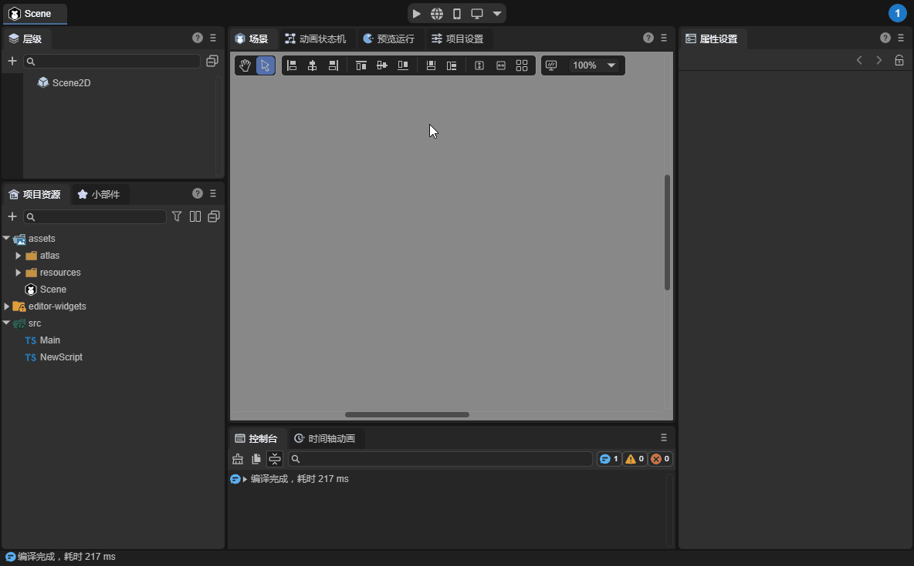

（动图4-5）

通常使用浏览器进行调试，按F12键在DevTools中查看日志。

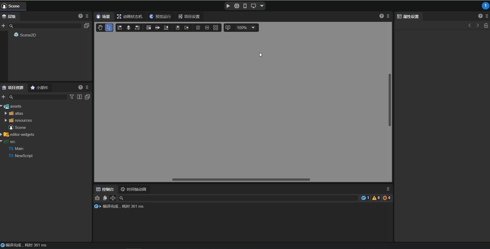

（动图4-6）

## 五、构建发布

当开发完成后，可以将项目发布出去，在“构建发布”面板中，点击“构建Web”，构建完成后，点击运行，会在浏览器中运行。

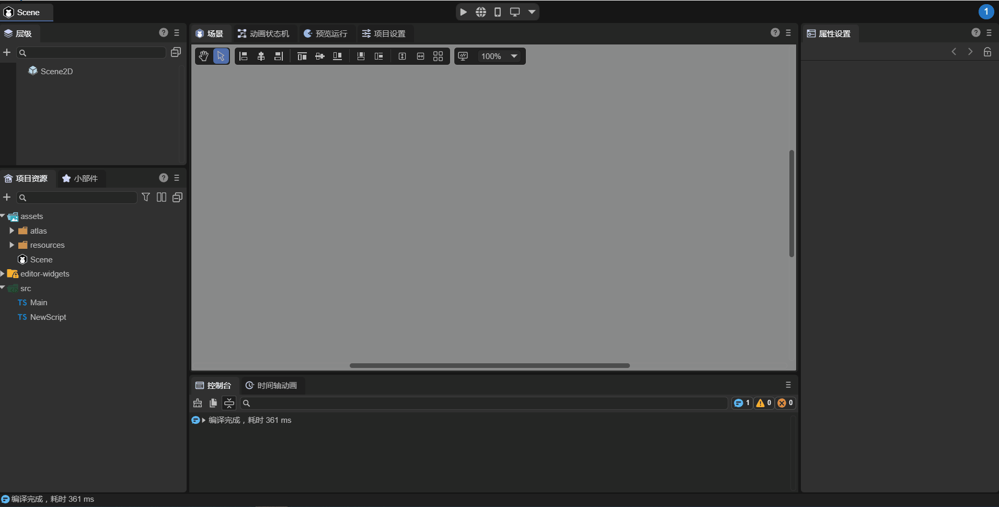

（动图5-1）

> 更多构建发布的内容可以参考[《 通用发布》](../../../released/generalSetting/readme.md)。

