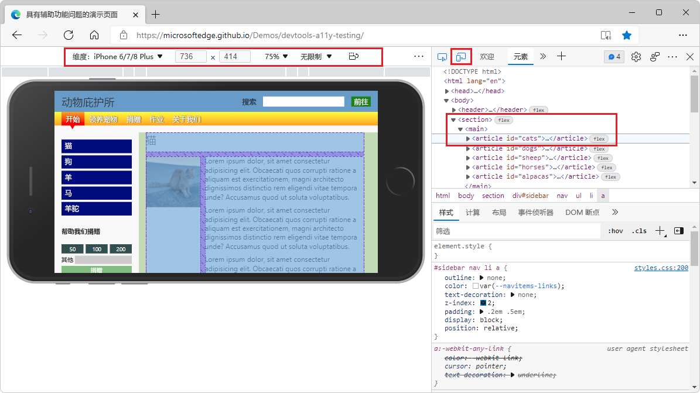

# 浏览器接口


## 一、概述

在项目开发中，往往我们需要跟外部运行环境打交道，比如在浏览器运行或者在一些小游戏平台中运行，都需要获取设备信息等等，这些功能的接口，都是通过`Laya.Browser` 来调用的。`Laya.Browser` 是浏览器代理类，封装了浏览器及原生 JavaScript 提供的一些功能，也包括小游戏等运行环境的信息。本章将介绍 `Laya.Browser` 都有哪些功能：

- **获得屏幕相关数据**
- **调用原生对象**
- **判断运行环境**

下面我们分别来详细讲解


## 二、获得屏幕相关数据

通常我们使用 Chrome 或者 MS Edge等浏览器开发项目，这些浏览器提供了非常方便的 DevTools 工具来调试。可以参考下面链接

https://learn.microsoft.com/zh-cn/microsoft-edge/devtools-guide-chromium/overview 

如图2-1所示，浏览器提供了设备仿真模式，利于方便查看和调试

 

（图2-1）

上图中选择的是iphone 6/7/8 Plus设备，但是以iphone为例，随着型号的提升，屏幕设备的分辨率也在不断变化，如图2-2所示

 

（图2-2）

从图中看到，物理宽高，`DPR`，逻辑宽高是不同的

因此，要获得这些屏幕相关信息，`Laya.Browser` 类为我们提供了如下方法，我们来看下 `Laya.Browser` 相关API ：

```typescript
    /**
     * 浏览器窗口可视宽度。
     * 通过分析浏览器信息获得。浏览器多个属性值优先级为：window.innerWidth(包含滚动条宽度) > document.body.clientWidth(不包含滚动条宽度)，如果前者为0或为空，则选择后者。
     */
    static get clientWidth(): number {
        Browser.__init__();
        return Browser._clientWidth || Browser._window.innerWidth || Browser._document.body.clientWidth;
    }

    static set clientWidth(value: number) {
        Browser._clientWidth = value;
    }

    /**
     * 浏览器窗口可视高度。
     * 通过分析浏览器信息获得。浏览器多个属性值优先级为：window.innerHeight(包含滚动条高度) > document.body.clientHeight(不包含滚动条高度) > document.documentElement.clientHeight(不包含滚动条高度)，如果前者为0或为空，则选择后者。
     */
    static get clientHeight(): number {
        Browser.__init__();
        return Browser._clientHeight || Browser._window.innerHeight || Browser._document.body.clientHeight || Browser._document.documentElement.clientHeight;
    }

    static set clientHeight(value: number) {
        Browser._clientHeight = value;
    }

    /** 浏览器窗口物理宽度。考虑了设备像素比。*/
    static get width(): number {
        Browser.__init__();
        return ((ILaya.stage && ILaya.stage.canvasRotation) ? Browser.clientHeight : Browser.clientWidth) * Browser.pixelRatio;
    }

    /** 浏览器窗口物理高度。考虑了设备像素比。*/
    static get height(): number {
        Browser.__init__();
        return ((ILaya.stage && ILaya.stage.canvasRotation) ? Browser.clientWidth : Browser.clientHeight) * Browser.pixelRatio;
    }

    /** 获得设备像素比。*/
    static get pixelRatio(): number {
        if (Browser._pixelRatio < 0) {
            Browser.__init__();
            if (Browser.userAgent.indexOf("Mozilla/6.0(Linux; Android 6.0; HUAWEI NXT-AL10 Build/HUAWEINXT-AL10)") > -1) Browser._pixelRatio = 2;
            else {
                Browser._pixelRatio = (Browser._window.devicePixelRatio || 1);
                if (Browser._pixelRatio < 1) Browser._pixelRatio = 1;
            }
        }
        return Browser._pixelRatio;
    }
```


### 2.1 逻辑宽高

LayaAir引擎里可以通过 `Laya.Browser.clientWidth` 获取逻辑分辨率的宽，通过 `Laya.Browser.clientHeight` 获取逻辑分辨率的高。

在手机等移动设备的竖屏状态下，窄面为宽，长面为高。如果发生了屏幕翻转的横屏状态，则长的一面为宽，窄面为高。

在PC浏览器中，则是获取的浏览器窗口可视宽高。

往往大部分浏览器是通过JavaScript 调用 `window.innerWidth` 来获得浏览器窗口可视宽度，但是某些特殊的浏览器有差异，因此 `Laya.Browser` 对这些问题做了很好的封装，只需要调用 `Browser.clientWidth` 和 `Browser.clientHeight` 即可。


### 2.2 物理宽高（屏幕宽高）

物理宽高也称为屏幕宽高。开发者可以通过 `Laya.Browser.width` 可以得到屏幕宽上有多少像素，通过`Laya.Browser.height` 可以得到屏幕高上有多少像素。

只有在全屏的时候屏幕宽高是硬件屏幕宽高，开发者需要理解的是，屏幕宽高实际是指运行环境窗口宽高，例如在浏览器上运行就是浏览器显示窗口的宽高。

LayaAir引擎中的物理宽高是通过逻辑宽高*`DPR`计算而来，`DPR` 就是下面要介绍的设备像素比。


### 2.3 设备像素比

图2-2中的DPR就是设备像素比，开发者可以通过 `Laya.Browser.pixelRatio` 可以得到


通过逻辑宽高。物理宽高，设备像素比 ，我们才能更好的做到屏幕适配，想了解更多详细的屏幕适配，请参考[《屏幕适配》](../../../basics/common/adaptScreen/readme.md)文档 


## 三、调用原生对象

通常原生对象有如下几个：

- **document Dom**
- **window  窗口**
- **container 画布**

`Laya.Browser` 也为我们封装了对这些对象的调用，看下API：

```typescript
    /**浏览器原生 document 对象的引用。*/
    static get document(): any {
        Browser.__init__();
        return Browser._document;
    }    

	/**浏览器原生 window 对象的引用。*/
    static get window(): any {
        return Browser._window || Browser.__init__();
    }
    
   	/**画布容器，用来盛放画布的容器。方便对画布进行控制*/
    static get container(): any {
        if (!Browser._container) {
            Browser.__init__();
            Browser._container = Browser.createElement("div");
            Browser._container.id = "layaContainer";
            Browser._document.body.appendChild(Browser._container);
        }
        return Browser._container;
    }

    static set container(value: any) {
        Browser._container = value;
    }
```

### 3.1 document Dom

LayaAir引擎里可以通过 `Laya.Browser.document` 获取原生 document 对象。

同时 `Laya.Browser` 还提供了对于 Dom 节点元素的使用方法：

```typescript
    /**
     * 创建浏览器原生节点。
     * @param	type 节点类型。
     * @return	创建的节点对象的引用。
     */
    static createElement(type: string): any {
        Browser.__init__();
        return Browser._document.createElement(type);
    }

    /**
     * 返回 Document 对象中拥有指定 id 的第一个对象的引用。
     * @param	type 节点id。
     * @return	节点对象。
     */
    static getElementById(type: string): any {
        Browser.__init__();
        return Browser._document.getElementById(type);
    }

    /**
     * 移除指定的浏览器原生节点对象。
     * @param	type 节点对象。
     */
    static removeElement(ele: any): void {
        if (ele && ele.parentNode) ele.parentNode.removeChild(ele);
    }
```

通过和原生Dom的交互，可以解决一些问题，例如，LayaAir 使用HTML DOM元素 [iframe](https://www.w3school.com.cn/jsref/dom_obj_frame.asp)。

在插入三方的一些网站的时候我们一般会用到 iframe，甚至三方的渠道基本都是用iframe嵌入一个应用。我们项目中也会遇到用iframe的情况。下面的例子就是演示在项目中应用iframe。

代码如下所示：

```typescript
var iframe:any = Laya.Browser.document.createElement("iframe");
iframe.style.position ="absolute";//设置布局定位。这个不能少。
iframe.style.zIndex = 100;//设置层级
iframe.style.left ="100px";
iframe.style.top ="100px";
iframe.src = "http://ask.layaair.com/";
Laya.Browser.document.body.appendChild(iframe);
```

这里面需要提醒开发者的就是定位和层级要记得设置。很多开发者不注意导致 iframe 跑到游戏层的下面看不见了。


### 3.2 window  窗口

LayaAir引擎里可以通过 `Laya.Browser.window` 获取原生 window 对象。

比如我们想在项目中使用 window.open(url) 打开另一个网页传输数据，示例代码如下：

```typescript
//Get发送数据
Laya.Browser.window.open("https://layaair.com/");

//Post发送数据
//url必须为真实的地址，content表示要发送的数据
let win2 = Laya.Browser.window.open(url);
win2.postMessage(content, url);// 此处最好加延迟

//监听器注册
Laya.Browser.window.addEventListener("click", (event: any) => {
	console.log(event.type);
})
```

> [Window.open()](https://developer.mozilla.org/zh-CN/docs/Web/API/Window/open) 方法、[window.postMessage()](https://developer.mozilla.org/zh-CN/docs/Web/API/Window/postMessage)方法、[Window.addEventListener()](https://developer.mozilla.org/zh-CN/docs/Web/API/EventTarget/addEventListener)方法


### 3.3 container 画布

LayaAir引擎里可以通过 `Laya.Browser.container` 获取画布容器。

比如，我们可以让画布不显示，只显示 Dom 的页面：

```typescript
Laya.Browser.container.style.display = "none";
```

>[Style display](https://www.w3school.com.cn/jsref/prop_style_display.asp) 属性


## 四、判断运行环境

在开发跨平台的项目中，往往要处理不同平台的兼容性问题，不同的运行环境，会有不同的处理方式。`Laya.Browser` 类针对这些运行环境进行了判断，对我们开发者来说，判断运行环境，只直接调用 `Laya.Browser` 类的接口即可，目前为止，这些接口都可以使用

```typescript
    /** 表示是否在移动设备，包括IOS和安卓等设备内。*/
    static onMobile: boolean;
    /** 表示是否在 IOS 设备内。*/
    static onIOS: boolean;
    /** 表示是否在 Mac 设备。*/
    static onMac: boolean;
    /** 表示是否在 IPhone 设备内。*/
    static onIPhone: boolean;
    /** 表示是否在 IPad 设备内。*/
    static onIPad: boolean;
    /** 表示是否在 Android 设备内。*/
    static onAndroid: boolean;
    /** 表示是否在 QQ 浏览器内。*/
    static onQQBrowser: boolean;
    /** 表示是否在移动端 QQ 或 QQ 浏览器内。*/
    static onMQQBrowser: boolean;
    /** 表示是否在 Safari 内。*/
    static onSafari: boolean;
    /** 表示是否在 Chrome 内 */
    static onChrome: boolean;
    /** 表示是否在 IE 浏览器内*/
    static onIE: boolean;
    /** 表示是否在 微信 内*/
    static onWeiXin: boolean;
    /** 表示是否在 PC 端。*/
    static onPC: boolean;
    /** 微信小游戏 **/
    static onMiniGame: boolean;
    /** 小米小游戏 **/
    static onKGMiniGame: boolean;
    /** OPPO小游戏 **/
    static onQGMiniGame: boolean;
    /** VIVO小游戏 **/
    static onVVMiniGame: boolean;
    /** 字节跳动小游戏*/
    static onTTMiniGame: boolean;
    /** @private */
    static onFirefox: boolean;//TODO:求补充
    /** @private */
    static onEdge: boolean;//TODO:求补充
    /** @private */
    static onLayaRuntime: boolean;
```

例如，我们可以这样在代码中判断：

```typescript
//如果是Chrome浏览器
if (Laya.Browser.onChrome) {
	console.log("Chrome");
}
```

