# ECS组件系统

ECS（实体-组件-系统）是一种主要在游戏开发领域使用的架构模式。游戏场景中的每个对象是一个**实体**(比如场景中的敌人，子弹，车辆等)，每个实体由一个或多个带有行为或功能的**组件**构成。例如，一个实体可以拥有移动相关的组件使其拥有移动能力。**系统**便是来处理实体集合的工具，也就是根据组件存储的信息构建出实体。ECS结构具有很大的灵活性，更易于扩展。

LayaAir3.0支持自定义组件脚本到编辑器，方便扩展已有组件的功能。自定义组件脚本继承自Laya.Script类，定义了组件的事件和自身生命周期方法。之前在[《项目入口说明》](https://layaair.layabox.com/3.x/doc/basics/IDE/entry/readme.html)中已经介绍了在IDE中创建自定义组件脚本的方法，本节内容就结合代码进行深入讲解。 


## 一、IDE中暴露属性

在LayaAir 3.0 IDE中，如果想在IDE内展示脚本定义的属性，需要通过加入装饰器来实现。

装饰器是TypeScript的一种语言特性，它以@开头，出现在类定义、类属性定义上方。开发者自己编写的组件或者其他的一些类，如果需要IDE识别并显示到属性面板上，或者需要序列化保存，则要用到LayaAir提供的装饰器。


### 1.1 @regClass()

所有开发者编写的组件脚本都需要使用这个装饰器才能被IDE识别。

```typescript
const { regClass } = Laya;

@regClass()
export class Script extends Laya.Script {
}
```

如果不添加@regClass()，那么IDE就无法识别这个脚本文件，对应的“属性设置”面板中就不会显示图1-1所示的组件脚本。

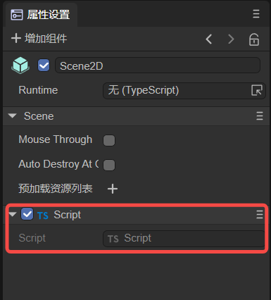

（图1-1）

再比如下面这个例子，虽然Animal不是脚本类，但它们需要被MyScript这个脚本暴露给开发者，所以也需要@regClass()。

```typescript
//MyScript.ts
const { regClass, property } = Laya;

import Animal from "./Animal";

@regClass()
export class MyScript extends Laya.Script  {
    @property({ type : Animal })
    animal : Animal;
}
//Animal.ts
const { regClass, property } = Laya;

@regClass()
export default class Animal {
    @property({ type : Number })
    weight : number;
}
```

**注意：**

**一个TS文件只能有一个类使用@regClass() !**

标记了@regClass()的类，在编辑器环境内都会被编译，但是最终发布时，如果这个类没有被其他类import，也没有被添加到节点上或者所在的预制体/场景没有发布，则这个类会被裁剪。


### 1.2 @property()

@property()用在类的属性上，表示这个属性需要保存和暴露给用户编辑。

```typescript
const { regClass, property } = Laya;

@regClass()
class Animal {
    @property({ type : Number })
    weight : number;
}
```
>@property(Number)是简写，推荐使用如上的标准写法，以下介绍时也将采用标准写法。

@property()也可以用在getter上。如果只有getter，那这个属性是只读的，在编辑器上只显示，不能编辑；如果getter和setter都有，只需要将@property()装饰器用在getter上，属性即可读写。
```typescript
const { regClass, property } = Laya;

@regClass()
class Animal {
    private _weight: number = 0;
    
    @property( { type : Number } )
    get weight() : number {
        return this._weight;
    }
    
    set weight(value: number) {
        this._weight = value;
    }
}
```
使用规则：

1. 属性名字是下划线开头的不会显示给用户编辑。如果属性名是以下划线开头，但也想显示给用户编辑，可以：@property( { type:XXX, "private" : false });
2. 如果属性只需要暴露给用户编辑，不需要序列化保存：@property( { type:XXX, serializable: false });
3. 装饰器的参数一般为一个属性类型。可以使用的基本类型有：
   1. Number 或 "number"
   2. String 或 "string"
   3. Boolean 或 "boolean"
   4. 标记了regClass的类
   5. LayaAir引擎里的大部分类型，比如 Laya.Vector3，Laya.Sprite3D，Laya.Camera
   6. 枚举类型
   7. Int8Array/Uint8Array/Int16Array/Uint16Array/Int32Array/Uint32Array/Float32Array
   8. "int"
   9. "uint"
   10. "text"
   11. "any"


### 1.3 代码示例

**1，一般用法示例，比如下面的脚本类：**

```typescript
const { regClass, property } = Laya;

@regClass()
export class Main extends Laya.Script {

    @property( { type:Laya.Camera } ) //Camera组件类型
    private camera: Laya.Camera;  

    @property( { type:Laya.Scene3D } ) //Scene3D组件类型
    private scene3D: Laya.Scene3D;

    @property( { type:Laya.DirectionLightCom } ) //DirectionLight组件类型
    private directionLight: Laya.DirectionLightCom;

    @property( { type:Laya.Sprite3D } ) //Sprite3D节点类型
    private cube: Laya.Sprite3D;  

    @property( { type:Laya.Prefab } ) //加载 Prefab 拿到的对象
    private prefabFromResource: Laya.Prefab;    

    @property( { type:Laya.ShurikenParticleRenderer } ) //ShurikenParticleRenderer组件类型
    private particle3D: Laya.ShurikenParticleRenderer;  
    
    @property( { type:Laya.Node } ) //节点类型
    private scnen2D: Laya.Node; 

    @property( { type:Laya.Box } ) //拿到 Box 组件
    private box: Laya.Box; 

    @property( { type:Laya.List } ) //拿到 List 组件
    private list: Laya.List; 

    @property( { type:Laya.Image } ) //拿到 Image 组件
    private image: Laya.Image; 

    @property( { type:Laya.Label } ) //拿到 Label 组件
    private label: Laya.Label; 

    @property( { type:Laya.Button } ) //拿到 Button 组件
    private button: Laya.Button; 

    @property( { type:Laya.Sprite } ) //拿到 Sprite 组件
    private sprite: Laya.Sprite; 

    @property( { type:Laya.Animation } ) //拿到 Animation 组件
    private anmation: Laya.Animation; 
    
    @property( { type:Laya.Vector3 } ) //Laya.Vector3类型
    private vector3 : Laya.Vector3;

    @property( { type:"string" } )  //string类型
    private string : string;
}
```

其中：

```typescript
const { regClass, property } = Laya;
```

写在脚本类的最上面。

```typescript
@regClass()
export class Main extends Laya.Script
```

在组件脚本类定义的上一行，加入@regClass()。

```typescript
@property( { type :Laya.Sprite3D } ) //Sprite3D节点类型
private cube: Laya.Sprite3D;
```

在自定义属性的上一行，加入@property()，则可以在IDE暴露此属性，并**拖入**对应的节点或组件，如图1-2所示。

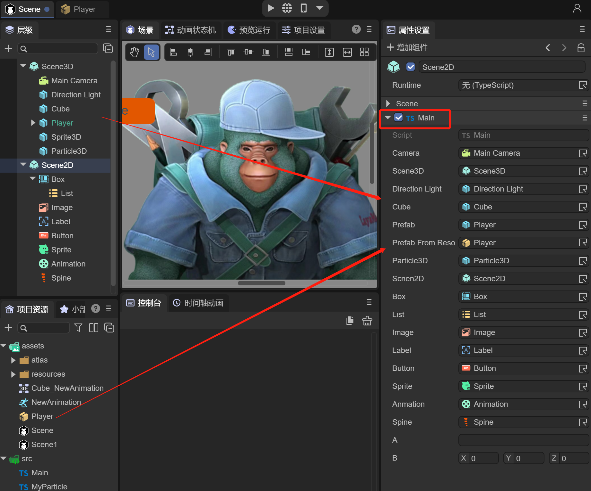 

（图1-2）

**2，属性名字是下划线开头的不会显示给用户编辑，例如以下代码：**

```typescript
@property({ type: "number" })
_velocity: number = 0;
```
>此时，velocity前是下划线，即使添加了装饰器也不能暴露在IDE中。

```typescript
@property({ type: "number", private: false })
_velocity: number = 0;
```
>这样就又暴露在IDE中了。

如果将private: false改为private: true，就可以让出现在IDE里的属性给隐藏掉。将此特点结合getter和setter，就可以对隐藏的属性进行读写。
```typescript
@property({ type: "number", private: true })
velocity_1: number = 0;
@property({ type: "number" })
get velocity1() {
    return this.velocity_1;
}
set velocity1(value: number) {
    this.velocity_1 = value;
}
```
>velocity_1本来暴露在IDE中，但private: true使其隐藏了，此时可以用getter和setter实现属性的读写。

**3，属性只暴露给用户编辑，不序列化保存。**

序列化保存的意义：在调试阶段，每次运行程序，仅仅是生成数据结构就要花很长的时间，花费的代价是非常大的。如果已经确定生成数据结构的算法不会变或不常变，那么就可以通过序列化将生成的数据结构数据存储到场景文件(文件后缀名为.ls)，下次重新运行程序时只需要从场景文件中读取该对象的数据即可，所花费时间也就读一个文件的时间，节省了编译时间。所以，一般建议在编程时，要进行序列化保存，这里只是更直观的展示序列化保存的意义。

例如以下代码：
```typescript
const { regClass, property } = Laya;

@regClass()
export class Main extends Laya.Script {
    @property({ type: "string" })
    _velocity: string = "";
    @property({ type: "string" , serializable: false})
    get velocity() {
        return this._velocity + "米/每小时";
    }
    set velocity(value: string) {
        this._velocity = value;
    }
    
    onStart() {
        console.log(this._velocity); 
    }
}
```
以上代码通过serializable: false没有进行序列化保存，若在IDE暴露的Velocity中输入"6米/每小时"，保存后，场景文件scene.ls中会保存以下信息：
```typescript
"_velocity": "6"
```
这存储的是_velocity的值。此时，IDE的运行结果，即打印的值为：6。

如果_velocity不用装饰器：
```typescript
const { regClass, property } = Laya;

@regClass()
export class Main extends Laya.Script {
    _velocity: string = "";
    @property({ type: "string" })
    get velocity() {
        return this._velocity + "米/每小时";
    }
    set velocity(value: string) {
        this._velocity = value;
    }

    onStart() {
        console.log(this._velocity); 
    }
}
```

以上代码进行了序列化保存，若在IDE暴露的Velocity中输入"6米/每小时"，保存后，场景文件scene.ls中会保存以下信息：

```typescript
"velocity": "6米/每小时"
```

这存储的是velocity()的return结果。此时，IDE的运行结果，即打印的值为：6米/每小时。

### 1.4 其它@property()属性规则

如果是数组类型，则使用中括号包含元素类型，例如 [ Number ]；

如果是字典类型，则使用中括号包含固定的字符串"Record"以及元素类型，例如["Record", String];

下面举一些例子说明：

```typescript
@property( { type : String } )
a : string;

@property( { type : Laya.Vector3 } )
b : Laya.Vector3;

@property( { type : Animal } )
c : Animal; //沿用上个例子，Animal已经被regClass

enum TestEnum {
    A,
    B,
    C
};
@property( { type : TestEnum } )
d : TestEnum; //枚举类型，会显示为下拉框供用户选择

enum StringEnum {
    A = "a",
    B = "b",
    C = "c"
};
@property( { type: StringEnum } )
e : StringEnum; //对于字符串形式的枚举，不能使用简写@property(StringEnum),必须用集合里的type参数指定

@property( { type : [Number] } )
f : number[]; //数组，用中括号包含数组元素类型

@property( { type : ["Record", String] } )
g : Record<string, string>; //字典，中括号里第一个元素固定是字符串Record，第二个元素是字典value类型。

@property( { type : "any" } )
h : any; //any类型只会被序列化，不能显示和编辑。

@property( { type : "int" } )
i : number; //int等价于 { type: Number, fractionDigits: 0 }

@property( { type : "uint" } )
j : number; //uint等价于 { type: Number, fractionDigits: 0 , min: 0 }

@property( { type : "text" } )
k : string; //text等价于 { type: String, multiline: true }
```

@property()的参数也可以是一个描述详细属性的集合，可以实现丰富的样式控制。下面以Animal类为例举一些例子：

`Animal.ts`

```typescript
const { regClass, property } = Laya;

@regClass()
export default class Animal {
    @property( { type : Number } )
    weight : number;
}

```

`Property.ts`

```typescript
const { regClass, property} = Laya;

import Animal from "./Animal"

enum TestEnum {
    A,
    B,
    C
};

enum StringEnum {
    A = "a",
    B = "b",
    C = "c"
};

@regClass()
export class Property extends Laya.Script {

    @property( { type : String } )
    a : string;
    
    @property( { type : Laya.Vector3 } )
    b : Laya.Vector3;
    
    @property( { type : Animal } )
    c : Animal; //沿用上个例子，Animal已经被regClass
    
    @property( { type : TestEnum } )
    d : TestEnum; //枚举类型，会显示为下拉框供用户选择

    @property({ type: StringEnum })
    e : StringEnum; //对于字符串形式的枚举，不能使用@property(StringEnum),必须用集合里的type参数指定
    
    @property( { type : [Number] } )
    f : number[]; //数组，用中括号包含数组元素类型
    
    @property( { type : ["Record", String] } )
    g : Record<string, string>; //字典，中括号里第一个元素固定是字符串Record，第二个元素是字典value类型。
    
    @property( { type : "any" } )
    h : any; //any类型只会被序列化，不能显示和编辑。
    
    @property( { type : "int" } )
    i : number; //int等价于 { type: Number, fractionDigits: 0 }
    
    @property( { type : "uint" } )
    j : number; //uint等价于 { type: Number, fractionDigits: 0 , min: 0 }
    
    @property( { type : "text" } )
    k : string; //text等价于 { type: string, multiline: true }

    //设置标题
    @property({ type: String, caption: "速度", tips: "设置速度" })
    l : string;

    //显示为下拉框
    @property({ type: Number, enumSource: [{name:"Yes", value:1}, {name:"No",value:0}] })
    m : number;

    //控制数字输入的精度和范围
    @property({ type: Number, range:[0,1], factionDigits: 3 })
    n : number

    //文本显示为多行输入
    @property({ type: String, multiline: true })
    o : string;

    //显示为颜色输入（如果类型是Laya.Color，则不需要这样定义，如果是字符串类型，则需要）
    @property({ type: String, inspector: "color" })
    p: string;

    //当属性改变时，调用名称为onChangeTest的函数
    @property({ type: Boolean, onChange: "onChangeTest"})
    q: boolean;

    onChangeTest() {
        console.log("onChangeTest");
    }
}
```

运行效果动图：

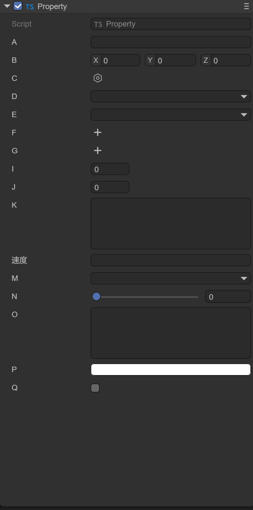


### 1.5 代码中使用属性

在IDE中暴露属性后，如何在代码里进行使用，对节点或者组件进行操作。例如，创建一个Prefab3D预制体，在默认Sprite3D节点下添加一个特效Particle3D组件（如图1-3），在Sprite3D节点上添加MyParticle.ts脚本（如图1-4）。

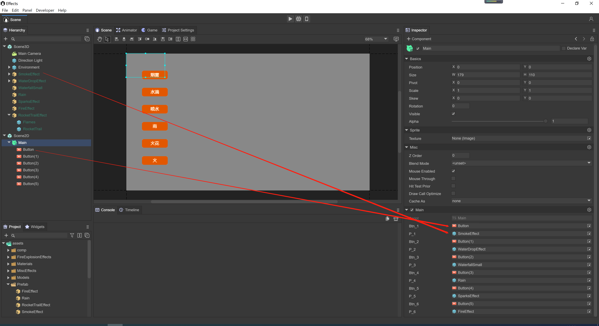 

（图1-3） 

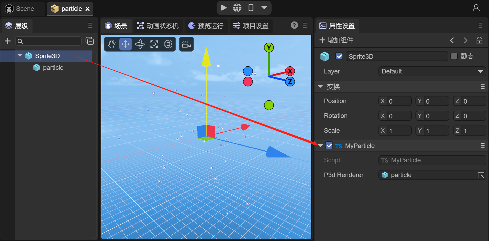 

（图1-4）  

如果要通过MyParticle.ts脚本来修改粒子特效的transform属性和粒子系统属性simulationSpeed，在MyParticle.ts脚本中可以使用如下方式：

**1，节点类型方式**

```typescript
    @property( { type :Laya.Sprite3D } ) //节点类型
    public p3d: Laya.Sprite3D;

    onAwake(): void {

        this.p3d.transform.localPosition = new Laya.Vector3(0,5,5);
        let p3dRenderer = this.p3d.getComponent(Laya.ShurikenParticleRenderer);
        p3dRenderer.particleSystem.simulationSpeed = 10;
    }
```

通过暴露@property( { type :Laya.Sprite3D } )节点类型属性，来拖入particle节点，可以获得particle节点对象。transform可以直接修改，而simulationSpeed属性则通过getComponent(Laya.ShurikenParticleRenderer).particleSystem的方式获取。


**2，组件类型方式**

```typescript
    @property( { type : Laya.ShurikenParticleRenderer } ) //组件类型
    public p3dRenderer: Laya.ShurikenParticleRenderer;

    onAwake(): void {

        (this.p3dRenderer.owner as Laya.Sprite3D).transform.localPosition = new Laya.Vector3(0,5,5);
        this.p3dRenderer.particleSystem.simulationSpeed = 10;
    }
```

通过暴露@property( { type : Laya.ShurikenParticleRenderer } )组件类型属性，来拖入particle节点，可以获得particle的ShurikenParticleRenderer组件。transform可以通过(this.p3dRenderer.owner as Laya.Sprite3D)修改，而simulationSpeed属性则通过this.p3dRenderer.particleSystem的方式获取。


**3，不支持的类型**

```typescript
    @property( { type : Laya.ShuriKenParticle3D } ) //不支持的类型
    public p3d: Laya.ShuriKenParticle3D;

    onAwake(): void {

        this.p3d.transform.localPosition = new Laya.Vector3(0,5,5);
        this.p3d.particleSystem.simulationSpeed = 10;
    }
```

不能通过直接使用Laya.ShuriKenParticle3D作为属性类型，IDE无法识别，只有节点和组件类型可以识别。


```typescript
    @property( { type : Laya.Sprite3D } )
    public p3d: Laya.ShuriKenParticle3D; //无法转换成Laya.ShuriKenParticle3D

    onAwake(): void {

        this.p3d.transform.localPosition = new Laya.Vector3(0,5,5);
        this.p3d.particleSystem.simulationSpeed = 10;
    }
```

上述方式也不行，IDE虽然标识了属性是Sprite3D节点，但是也无法转换为Laya.ShuriKenParticle3D对象。

报错信息：*[Game] Uncaught (in promise) TypeError: Cannot set properties of undefined (setting 'simulationSpeed')*


### 1.6 Prefab类型属性

当使用Laya.Prefab作为属性时，例如：

```typescript
@property( { type : Laya.Prefab } ) //加载 Prefab 的对象
private prefabFromResource: Laya.Prefab;    
```

此时，需要从assets目录下，拖入prefab资源，运行时会直接获取到加载实例化后的prefab（如图1-5）。

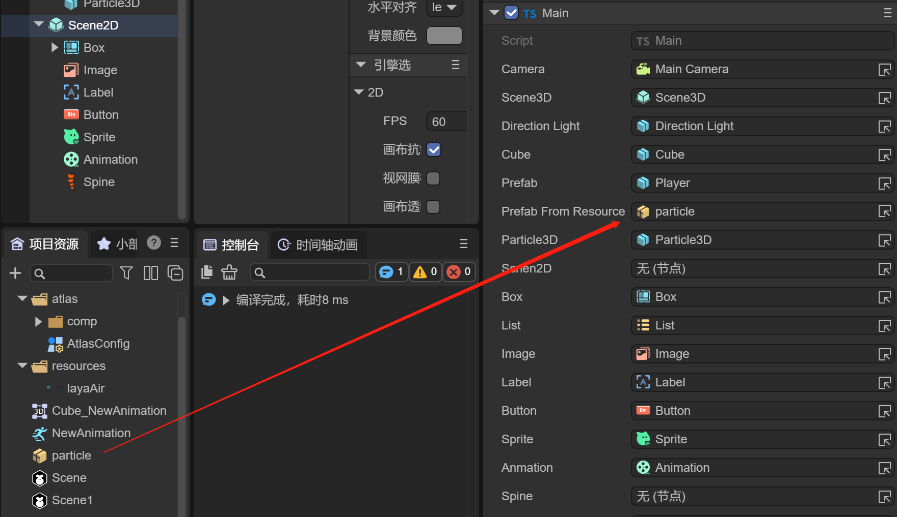 

（图1-5）


## 二、组件的事件方法

事件方法是指在某些特定的情况下，会根据条件自动触发的方法，例如碰撞事件只有在物体发生碰撞时才会触发。当使用自定义的组件脚本时，可以实现如下事件方法，方便快速开发业务逻辑。

**1，物理事件**

```typescript
    /**
     * 开始碰撞时执行
     */
    onTriggerEnter(other: Laya.PhysicsComponent | Laya.ColliderBase, self?: Laya.ColliderBase, contact?: any): void {
    }

    /**
     * 持续碰撞时执行
     */
    onTriggerStay(other: Laya.PhysicsComponent | Laya.ColliderBase, self?: Laya.ColliderBase, contact?: any): void {
    }

    /**
     * 结束碰撞时执行
     */
    onTriggerExit(other: Laya.PhysicsComponent | Laya.ColliderBase, self?: Laya.ColliderBase, contact?: any): void {     
    }

    /**
     * 开始碰撞时执行
     */
    onCollisionEnter(collision: Laya.Collision): void {
    }

    /**
     * 持续碰撞时执行
     */
    onCollisionStay(collision: Laya.Collision): void {
    }

    /**
     * 结束碰撞时执行
     */
    onCollisionExit(collision: Laya.Collision): void {
    }

    /**
     * 关节破坏时执行此方法
     */
    onJointBreak(): void {
    }
```

下面以一个小球碰撞的例子，演示物理事件。以下是程序中碰撞部分的代码片段：

```typescript
	//碰撞进入后，物体改变颜色
    public onTriggerEnter(other:Laya.PhysicsComponent):void {
		(this.owner.getComponent(Laya.MeshRenderer).material as Laya.BlinnPhongMaterial).albedoColor = new Laya.Color(0.0, 1.0, 0.0, 1.0);//绿色
	}
	
    //持续碰撞时，打印日志
	public onTriggerStay(other:Laya.PhysicsComponent):void {
        console.log("peng");
	}
	
    //碰撞离开后，物体变回原本颜色
	public onTriggerExit(other:Laya.PhysicsComponent):void {
		(this.owner.getComponent(Laya.MeshRenderer).material as Laya.BlinnPhongMaterial).albedoColor = new Laya.Color(1.0, 1.0, 1.0, 1.0);//白色
	}
```

如动图2-1所示，开始碰撞时执行onTriggerEnter，小球和立方体进入碰撞，小球变为绿色；持续碰撞时执行onTriggerStay，打印日志“peng”；碰撞离开后执行onTriggerExit，小球变为原来的颜色，立方体变为白色。

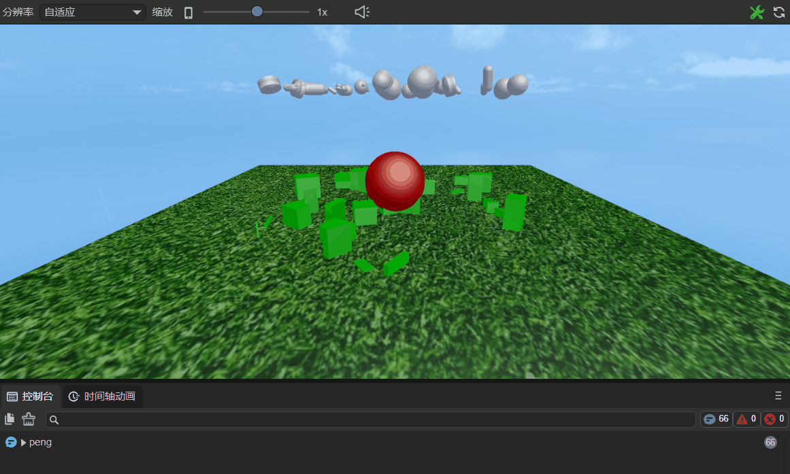

（动图2-1）


**2，鼠标事件**

```typescript
    /**
     * 鼠标按下时执行
     */
    onMouseDown(evt: Laya.Event): void {
    }

    /**
     * 鼠标抬起时执行
     */
    onMouseUp(evt: Laya.Event): void {
    }

    /**
     * 鼠标右键或中键按下时执行
     */
    onRightMouseDown(evt: Laya.Event): void {
    }

    /**
     * 鼠标右键或中键抬起时执行
     */
    onRightMouseUp(evt: Laya.Event): void {
    }

    /**
     * 鼠标在节点上移动时执行
     */
    onMouseMove(evt: Laya.Event): void {
    }

    /**
     * 鼠标进入节点时执行
     */
    onMouseOver(evt: Laya.Event): void {
    }

    /**
     * 鼠标离开节点时执行
     */
    onMouseOut(evt: Laya.Event): void {
    }

    /**
     * 鼠标按住一个物体后，拖拽时执行
     */
    onMouseDrag(evt: Laya.Event): void {
    }

    /**
     * 鼠标按住一个物体，拖拽一定距离，释放鼠标按键后执行
     */
    onMouseDragEnd(evt: Laya.Event): void {
    }

    /**
     * 鼠标点击时执行
     */
    onMouseClick(evt: Laya.Event): void {
    }

    /**
     * 鼠标双击时执行
     */
    onMouseDoubleClick(evt: Laya.Event): void {
    }

    /**
     * 鼠标右键点击时执行
     */
    onMouseRightClick(evt: Laya.Event): void {
    }
    
```

下面以onMouseDown和onMouseUp为例，在自定义的组件脚本“Script.ts”中加入以下代码：

```typescript
const { regClass, property } = Laya;

@regClass()
export class Script extends Laya.Script {
    /**
     * 鼠标按下时执行
     */
	onMouseDown(evt: Laya.Event): void {
        console.log("onMouseDown");
    }
    /**
     * 鼠标抬起时执行
     */
    onMouseUp(evt: Laya.Event): void {
        console.log("onMouseUp");
    }
}
```

如图2-2所示，将组件脚本添加到Scene2D的属性面板后，先不勾选 Mouse Through，因为如果勾选它，Scene2D下鼠标事件将不会响应。如果是一个3D场景，它会传递到Scene3D中。


（图2-2）

运行项目，如动图2-3所示，当鼠标按下时执行onMouseDown，打印“onMouseDown”；松开鼠标，鼠标弹起时执行onMouseUp，打印“onMouseUp”。


（动图2-3）


**3，键盘事件**

```typescript
    /**
     * 键盘按下时执行
     */
    onKeyDown(evt: Laya.Event): void {
    }

    /**
     * 键盘产生一个字符时执行
     */
    onKeyPress(evt: Laya.Event): void {
    }

    /**
     * 键盘抬起时执行
     */
    onKeyUp(evt: Laya.Event): void {
    }
```

> 注意：onKeyPress是产生一个字符时执行，例如字母“a”、“b”，“c”等。像上、下、左、右键，F1、 F2等不是字符输入的按键，就不会执行此方法。


## 三、组件的生命周期方法

生命周期方法是指在物体的创建、销毁、激活、禁用等过程中，会自动调用的方法。当使用自定义的组件脚本时，可以实现如下生命周期方法，方便快速开发业务逻辑。可以在每个方法中打印一条日志，方便开发者进行测试。

```typescript
    /**
     * 被添加到节点后调用，和Awake不同的是即使节点未激活onAdded也会调用。
     */
    onAdded(): void {
        console.log("Game onAdded");
    }

    /**
     * 重置组件参数到默认值，如果实现了这个函数，则组件会被重置并且自动回收到对象池，方便下次复用
     * 如果没有重置，则不进行回收复用
     */
    onReset(): void{
        console.log("Game onReset");
    }

    /**
     * 组件被激活后执行，此时所有节点和组件均已创建完毕，次方法只执行一次
     */
    onAwake(): void {
        console.log("Game onAwake");
    }

    /**
     * 组件被启用后执行，比如节点被添加到舞台后
     */
    onEnable(): void {
        console.log("Game onEnable");
    }

    /**
     * 第一次执行update之前执行，只会执行一次
     */
    onStart?(): void {
        console.log("Game onStart");
    }

    /**
     * 每帧更新时执行，尽量不要在这里写大循环逻辑或者使用getComponent方法
     */
     onUpdate(): void{
        console.log("Game onUpdate");
    }

    /**
     * 每帧更新时执行，在update之后执行，尽量不要在这里写大循环逻辑或者使用getComponent方法
     */
   onLateUpdate(): void{
        console.log("Game onLateUpdate");
    }

    /**
     * 渲染之前执行
     */
    onPreRender(): void{
        console.log("Game onPreRender");
    }

    /**
     * 渲染之后执行
     */
    onPostRender(): void{
        console.log("Game onPostRender");
    }

    /**
     * 组件被禁用时执行，比如从节点从舞台移除后
     */
    onDisable(): void {
        console.log("Game onDisable");
    }

    /**
     * 手动调用节点销毁时执行
     */
    onDestroy(): void {
        console.log("Game onDestroy");
    }
```


## 四、IDE中执行生命周期方法（@runInEditor）

在了解@regClass和@property后，开发者还可以加入 **@runInEditor**装饰器来指定组件在编辑器内加载时触发生命周期方法（onEnable，onStart等），默认不加@runInEditor装饰器时是不触发的。

如图4-1所示，通过添加@property代码，创建了一个cube属性。

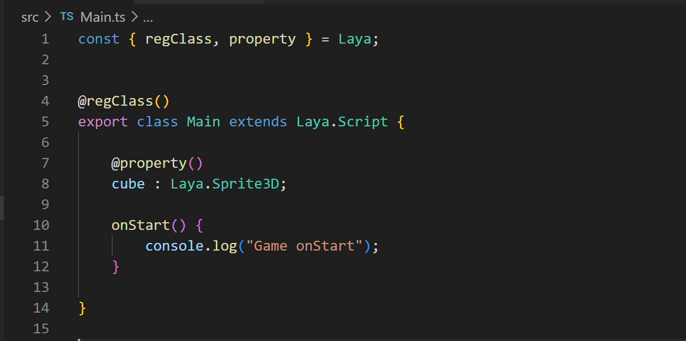 

（图4-1）

如图4-2所示，在IDE中，添加一个Cube，并将Cube拖入到上述cube属性中。


（图4-2）

此时，Cube是静止不动的，为Cube添加一些代码，让Cube可以围绕自身旋转，代码如下所示：

```typescript
const { regClass, property } = Laya;

@regClass()
export class Main extends Laya.Script {

    @property( { type : Laya.Sprite3D } )
    cube : Laya.Sprite3D;

    private rotation: Laya.Vector3 = new Laya.Vector3(0, 0.01, 0);

    onStart() {
        console.log("Game onStart");
        Laya.timer.frameLoop(1, this, ()=> {
            this.cube.transform.rotate(this.rotation, false);
        });
    }
}
```

通过IDE的运行，可以看到如动图4-3所示的效果。

 

（动图4-3）

但每次都需要运行才能在IDE中看到效果，如果想在IDE中实时看到预览效果，需要按图4-4所示的方法进行操作。

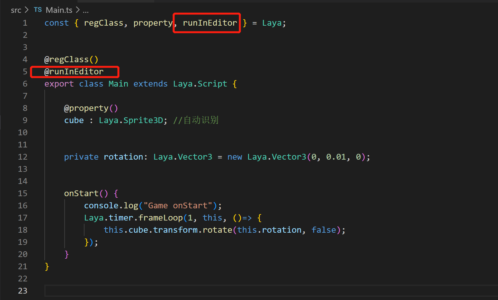 

（图4-4）

其中：

```
const { regClass, property, runInEditor } = Laya;
```

写在脚本类的最上面的声明中，加入runInEditor声明。

```
@regClass()
@runInEditor
export class Main extends Laya.Script {
```

在@regClass()下，加入@runInEditor。这样即使不运行，也可以在场景面板中看到Cube自身旋转的效果了（如图4-5）。由于IDE的update只会在有变化的情况下调用，或者一秒几帧，因此对象的动画效果会比预览时要慢一些。


（动图4-5）


## 五、IDE中添加类信息（classInfo）

当一个类被@regClass()装饰后，可以使用@classInfo提供更多的选项。如图5-1所示

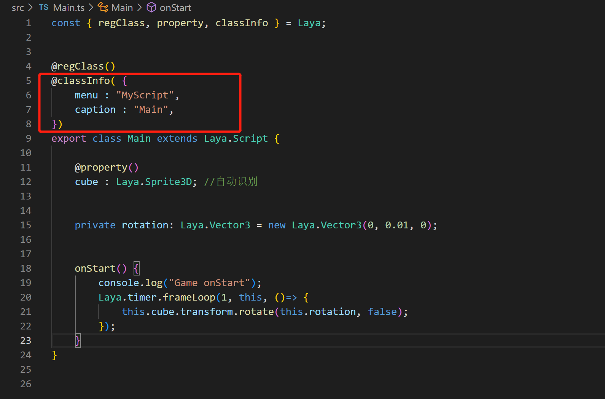 

（图5-1）

通过在@regClass()下加入:

```typescript
@classInfo( {
    menu : "MyScript",
    caption : "Main",
})
```

可以在IDE中像添加系统组件库一样添加脚本，如动图5-2所示。

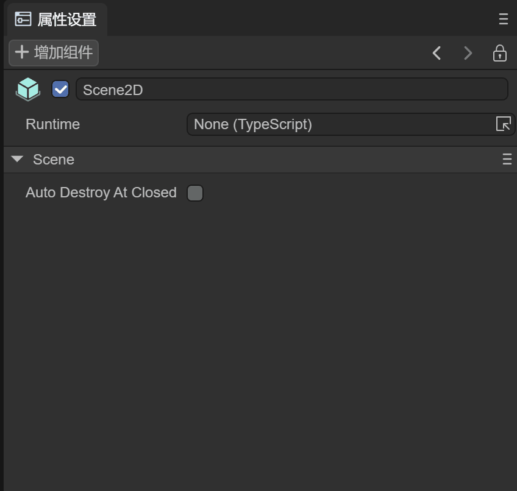 

（动图5-2）


