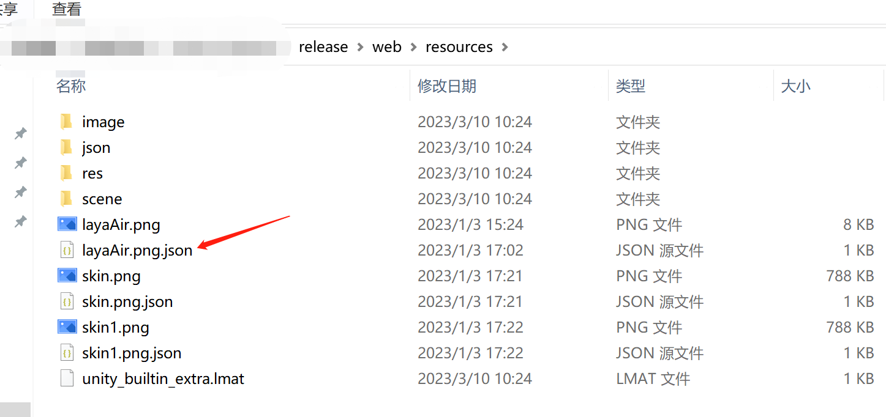
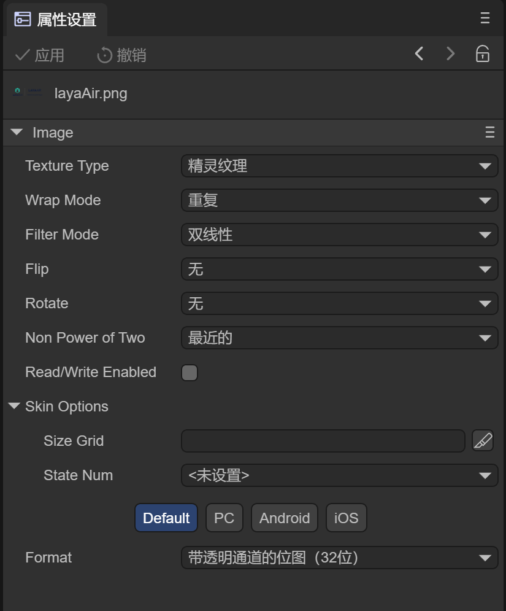

# LayaAir引擎的资源加载方法详解

> Author: Charley   

资源加载是游戏引擎的核心模块，是必须要使用的功能，LayaAir引擎提供了Loader类用于加载文本、JSON、二进制、图像等资源。

下面我们在本篇文档中彻底掌握各种资源加载的使用。

## 一、加载单个资源

### 1.1 常用资源的加载方式

通常，采用`Laya.loader.load("资源路径")`方法加载单个资源，通过`.then("回调方法")`来处理加载后的逻辑。

```typescript
Laya.loader.load(url).then((res)=> {/** 不带类型，用于常规的资源 */});
```

完整的脚本示例如下：

```typescript
const { regClass, property } = Laya;

@regClass()
export class LoaderDemo extends Laya.Script {

    onAwake(): void {
        this.loadTexture("image/bird.jpg", 500);
        this.loadTexture("https://layaair.com/3.x/demo/resources/res/apes/monkey2.png");
    }

    /**加载并显示图片 */
    loadTexture(url: string, x: number = 0, y: number = 0): void {
        Laya.loader.load(url).then((res: Laya.Texture) => {
            let img = new Laya.Image();
            img.texture = res;
            // img.skin = url; //ui组件直接设置skin也可以
            img.pos(x, y);
            this.owner.addChild(img);
        });
    }
}
```

### 1.2 带类型的加载方式

有的时候，网络资源没有后缀名，又或者，图片xxx.png并非是当成Texture使用，需要被定义为TextureCube。所以，这些时候需要通过类型进行区分。

使用方式与不带类型的基本相同，只是增加load第二个参数：类型标识字符串。

```typescript
Laya.loader.load(url, type).then((res)=> {
    //带类型，用于区别无后缀，或同一后缀不同作用的资源。
    //例如，图片xxx.png被定义为TextureCube，使用load("xxx.png", Laya.Loader.TEXTURECUBE)。得到的是TextureCube。
});
```

完整的脚本示例如下：

```typescript
const { regClass, property } = Laya;

@regClass()
export class LoaderDemo extends Laya.Script {

    onAwake(): void {
        //下面的URL未来可能会失效，仅用于示例参考
        this.loadHTMLImage("https://layaair.com/3.x/demo/resources/res/apes/monkey2.png");
    }

    /** 加载URL无后缀资源 */
    loadHTMLImage(url: string): void {
        Laya.loader.load(url, Laya.Loader.IMAGE).then((res: Laya.Texture) => {
            let sp = new Laya.Sprite();
            sp.texture = res;
            this.owner.addChild(sp);
        });
    }
}
```

#### 常用类型如下：

| 引擎全局变量            | 类型标识字符串 | 类型说明                                                     |
| ----------------------- | -------------- | ------------------------------------------------------------ |
| Laya.Loader.TEXT        | text           | 文本类型                                                     |
| Laya.Loader.JSON        | json           | JSON类型                                                     |
| Laya.Loader.XML         | xml            | XML类型                                                      |
| Laya.Loader.BUFFER      | arraybuffer    | 二进制类型                                                   |
| Laya.Loader.IMAGE       | image          | 纹理类型                                                     |
| Laya.Loader.SOUND       | sound          | 声音类型                                                     |
| Laya.Loader.VIDEO       | video          | 视频类型                                                     |
| Laya.Loader.ATLAS       | atlas          | 图集类型，加载完成后返回图集json信息(并创建图集内小图Texture) |
| Laya.Loader.HIERARCHY   | HIERARCHY      | 层级资源，比如：场景ls文件与预制体lh文件                     |
| Laya.Loader.FONT        | font           | 位图字体类型                                                 |
| Laya.Loader.TTF         | ttf            | TTF字体类型                                                  |
| Laya.Loader.MESH        | MESH           | Mesh资源                                                     |
| Laya.Loader.MATERIAL    | MATERIAL       | Material资源                                                 |
| Laya.Loader.TEXTURE2D   | TEXTURE2D      | Texture2D资源                                                |
| Laya.Loader.TEXTURECUBE | TEXTURE2D      | TextureCube资源                                              |
| Laya.Loader.SPINE       | SPINE          | Spine资源                                                    |


## 二、加载多个资源

有很多时候，我们需要把大量的资源在Loading界面进行预加载，这样走完加载进度条再进游戏，就会直接显示资源，不会产生资源空白的加载等待现象。

此时，我们就需要用到多个资源加载的方式。

### 2.1 省略类型的多资源加载方式

如果我们只是加载比较常用的资源，通过文件后缀就可以识别出来，那么省略类型的方式，肯定更为简洁。

加载多个的API和加载单个基本相同，只是加载多个时，第一个参数是资源地址数组

```typescript
Laya.loader.load([url1, url2]).then((res:Array<any>)=> {  /** 加载多个，不带类型，用于常规的资源 */   });     
```

完整的脚本示例如下：

```typescript
const { regClass, property } = Laya;

@regClass()
export class LoaderDemo extends Laya.Script {

    onAwake(): void {
        let resArr: Array<string> = [
            "image/bird.jpg",
            "image/cloud.png",
            "https://layaair.com/3.x/demo/resources/res/apes/monkey2.png"
        ];
        this.loadTextures(resArr);
    }

    /** 加载多个资源 
     * @param url 资源数组
    */
    loadTextures(url: Array<string>): void {
        Laya.loader.load(url).then((res: Array<Laya.Texture>) => {
            let sp: Laya.Sprite = new Laya.Sprite();
            this.owner.addChild(sp);
            let i: number = 0;
            //每秒重画一次
            Laya.timer.loop(1000, this, () => {
                i == res.length && (i = 0);
                //清除sp节点的所有绘图（不含子节点）
                sp.graphics.clear();
                //在sp节点上重绘纹理
                sp.graphics.drawTexture(res[i]);
                i++;
            });
        });
    }
}
```

### 2.2 可带类型的多资源加载方式

假如，多数资源不需要带类型，有的资源又需要用类型区别，该如何使用加载方法呢？

在资源数组里，为需要带类型的传入类型，不需要的传类型的，仍然可以省略。

```typescript
Laya.loader.load([url1, { url:url2, type: type }]).then((res:Array<any>)=> {  /** 加载多个，按需设置类型，满足各种需要 */   });     
```

完整的脚本示例如下：

```typescript
const { regClass, property } = Laya;

@regClass()
export class LoaderDemo extends Laya.Script {

    onAwake(): void {
        let resArr: Array<any> = [
            "image/bird.jpg",
            "image/cloud.png",
            {
                url: "https://layaair.com/3.x/demo/resources/res/apes/monkey2.png",
                type: "image"
            },
            {
                url: "https://layaair.com/3.x/demo/resources/res/apes/monkey1.png",
                type: Laya.Loader.IMAGE
            }
        ];
        this.loadTextures(resArr);
    }

    /** 加载多个资源 
     * @param url 资源数组
    */
    loadTextures(url: Array<string>): void {
        //加载回调返回的类型，如果是多样的，最好是any
        Laya.loader.load(url).then((res: Array<any>) => {
            let sp: Laya.Sprite = new Laya.Sprite();
            this.owner.addChild(sp);
            let i: number = 0;
            //每秒重画一次
            Laya.timer.loop(1000, this, () => {
                i == res.length && (i = 0);
                //清除sp节点的所有绘图（不含子节点）
                sp.graphics.clear();
                //在sp节点上重绘纹理
                sp.graphics.drawTexture(res[i]);
                i++;
            });
        });
    }
}
```

> 示例上的类型，故意采用了字符串标识和引擎全局变量标识两种方式。开发者用哪一种都可以。具体参照1.2的类型标识表格。

### 2.3 统一类型的多资源加载方式

也有的时候，加载的多资源，都需要使用类型标识，而这些类型都是同一种类型，例如，加载的全都是无后缀的URL资源。

这时，我们可以统一设置类型标识。

```typescript
Laya.loader.load([url1, url2], type).then((res:Array<any>)=> {  /** 加载多个，统一类型，简洁实用 */   });     
```

完整的脚本示例如下：

```typescript
const { regClass, property } = Laya;

@regClass()
export class LoaderDemo extends Laya.Script {

    onAwake(): void {
        let resArr: Array<any> = [
            "image/bird.jpg",
            "https://layaair.com/3.x/demo/resources/res/apes/monkey2.png",
            "image/cloud.png",
            "https://layaair.com/3.x/demo/resources/res/apes/monkey2.png",
        ];
        this.loadTextures(resArr);
    }

    /** 加载多个资源 
     * @param url 资源数组
    */
    loadTextures(url: Array<string>): void {
        //加载回调返回的类型，如果不确定就any
        Laya.loader.load(url, Laya.Loader.IMAGE).then((res: Array<Laya.Texture>) => {
            let sp: Laya.Sprite = new Laya.Sprite();
            this.owner.addChild(sp);
            let i: number = 0;
            //每秒重画一次
            Laya.timer.loop(1000, this, () => {
                i == res.length && (i = 0);
                //清除sp节点的所有绘图（不含子节点）
                sp.graphics.clear();
                //在sp节点上重绘纹理
                sp.graphics.drawTexture(res[i]);
                i++;
            });
        });
    }
}
    
```


## 三、不解析不缓存的加载资源

引擎提供的`load()`方法加载资源，可能会在解析后做一些封装。

比如我们用`load()`方法加载一个json数据，需要在data里才能取到json文件里的数据。

使用`load()`方法，示例如下：

```typescript
onEnable(): void {
    const jsonPath: string = "json/bagList.json";
    Laya.loader.load(jsonPath).then((json) => {
        let _json = json.data;
        if (_json.bagList && _json.bagList.length > 0) {
            //把json数据传递给list组件的数据源属性array
            this.bagList.array = _json.bagList;
        }
    });
}
```

而我们使用`fetch()`方法，则可以直接取到json文件里的数据。但需要注意的是，采用fetch加载的资源不会缓存，只能在加载完成的回调里使用，无法通过getRes读取加载缓存。

使用`fetch()`方法，示例如下：

```typescript
onEnable(): void {
    const jsonPath: string = "json/bagList.json";
    //fetch取到的是原始数据，但没有缓存，无法用getRes获取
    Laya.loader.fetch(jsonPath, "json").then((_json) => {  
        if (_json.bagList && _json.bagList.length > 0) {
            //把json数据传递给list组件的数据源属性array
            this.bagList.array = _json.bagList;
        }
    });
}
```

###  3.1 fetch加载支持的类型

fetch的加载限定为以下类型：

| 类型标识字符串 | 资源类型                        |
| -------------- | ------------------------------- |
| text           | string                          |
| json           | any                             |
| xml            | XMLDocument                     |
| arraybuffer    | ArrayBuffer                     |
| image          | HTMLImageElement \| ImageBitmap |
| sound          | HTMLAudioElement                |

在使用的时候，第二个参数那里填写对应的类型标识字符串即可。

更多fetch加载代码示例请参考[《使用二进制图片》](../../../2D/useBinaryImage/readme.md)文档

> **Tips**​
>
> 除非是明确理解fetch的使用用途，否则不推荐开发者使用。


## 四、Option参数

当使用`load()`方法或者`fetch()`方法加载资源时，可以使用到Option参数，例如代码：

```typescript
//创建Option
let option:any = {};
option.blob = this.imgBlob;
//通过传递blob对象获得HTMLImageElement
Laya.loader.fetch("" ,"image", null, option).then((res)=>{
});
```

通过Option参数指定`fetch()`方法，传递blob对象获得HTMLImageElement

目前支持的Option参数：

```typescript
export interface ILoadOptions {
    type?: string; //资源类型。比如：Loader.IMAGE。
    priority?: number; //(default = 0)加载的优先级，数字越大优先级越高，优先级高的优先加载。
    group?: string; //分组，方便对资源进行管理。
    cache?: boolean; //是否缓存
    noRetry?: boolean; //是否重新尝试加载
    silent?: boolean; //是否提示加载失败
    useWorkerLoader?: boolean; //(default = false)是否使用worker加载（只针对IMAGE类型和ATLAS类型，并且浏览器支持的情况下生效）
    constructParams?: TextureConstructParams; //图片属性，参考如下
    propertyParams?: TexturePropertyParams; //纹理属性，参考如下
    blob?: ArrayBuffer; //传递blob对象获得HTMLImageElement
    noMetaFile?: boolean; //是否不去下载Meta(json)文件
    [key: string]: any;
}
    
TextureConstructParams {
    width?: number,
    height?: number,
    format?: TextureFormat,
    mipmap?: boolean,
    canRead?: boolean,
    sRGB?: boolean,
}
    
TexturePropertyParams {
    wrapModeU?: number,
    wrapModeV?: number,
    filterMode?: FilterMode,
    anisoLevel?: number,
    premultiplyAlpha?: boolean,
    hdrEncodeFormat?: HDREncodeFormat,
}
```


## 五、如何不下载json文件（option { noMetaFile: true}）

当发布web后，在release/web目录下的资源中可以看到，每个图片资源对应一个json文件，如图5-1所示

 

（图5-1） 

此json文件会记录IDE中设置的图片属性，如图5-2所示

 

（图5-2） 

当LayaAir3.0引擎加载图片xxx.png时，先去加载xxx.png.json文件，来获取IDE中设置的图片信息

如果这些图片不是发布出来的，比如说服务器上的一些散图资源，那么就不存在json文件，当使用 `load()`或者`fetch()`方法加载图片时，会发现找不到json文件而提示错误信息：

**GET https://xxxx/xxx.png.json 404 (Not Found)**

虽然无法获取json信息，但是LayaAir3.0引擎会使用默认属性

如果我们希望不去下载这些json文件，可以使用如下方式：

```typescript
//创建Option
let option:any = {};
option.noMetaFile = true;//不去下载json
Laya.loader.load("http://xxxx/xxx.png",option).then((res)=>{
});  
```

这样，load资源的时候传option { noMetaFile: true}就不会去下载json文件