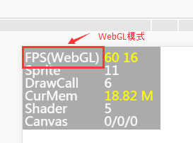
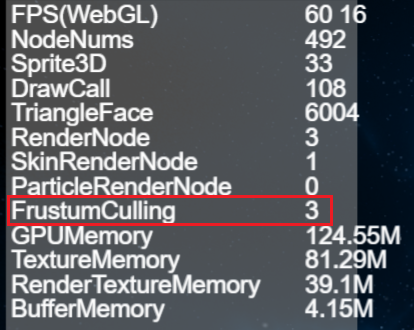

# 性能统计面板介绍     

　　LayaAir 引擎设计之初，就以性能为第一目标，在引擎内做了大量的性能优化。合理运用好引擎，可以让游戏等引擎产品达到原生APP的体验。如果开发者不能发挥好引擎的优势，那么游戏最终的性能体验或将无从谈起。因此，在制作游戏过程中，掌握游戏以及引擎的优化技巧还是非常有必要的。


> 要了解引擎的性能，首先要看懂性能统计面板，下面将针对性能统计面板进行详细介绍。


## 1、性能统计面板的调用

LayaAir引擎内置的性能统计面板可实时检测当前性能。调用统计面板因开发语言的不同，会有所不同。

TS语言直接在代码中输入 `Laya.Stat.show(0,0);` 即可调出性能统计面板。

示例Demo.ts编写代码如下：

```typescript
//初始化舞台
Laya.init(1136, 640);
//调用性能统计面板方法，(0,0)为面板位置坐标
Laya.Stat.show(0,0);
```

**Tips**:要注意大小写。


## 2、FPS相关的介绍

### 2.1  FPS概述

FPS是每秒传输帧数(Frames Per Second)的缩写。假设游戏的帧速为60FPS，表明游戏运行时每个帧的执行时间为1/60 秒。帧速值越高，视觉上感觉越流畅。

 

（图1）

当前PC与手机等设备的满帧是60帧，如图1所示，但某些游戏对画面的流畅度要求并不高，也可以采用引擎的帧速限制方法`Stage.FRAME_SLOW`，将FPS帧速限制为最高30帧。

由于实际运行环境是在浏览器中，所以性能还取决于JavaScript解释器的效率，因此，同一款游戏的FPS值在不同的浏览器中可能会存在差异。这部分不是开发者能够决定的，开发者能作的是尽可能使用好引擎及优化项目，争取在低端设备或低性能浏览器中，提升FPS帧速。 

#### 2.2 WebGL模式下的FPS

LayaAir引擎支持WebG的渲染模式。如图2所示；`FPS(WebGL)`是WebGL模式下的帧速，

 

（图2）

#### 2.3  FPS的数值说明

图1与图2中，FPS的第一个黄色值`60`为当前的**FPS帧速**，越高越好。

第二个黄色值`16`为**每帧渲染所消耗的时间**，单位为毫秒，这个值越小越好。

这两个值如果不能维持在满帧，会在产品操作过程中产生变化，如动图3所示。

 

 (动图3)

## 3、DrawCall介绍

 **DrawCall的次数是决定性能的重要指标**，位于统计面板的第三行，如图4所示。DrawCall在Canvas和WebGL渲染下代表不同的意义，但都是越少越好，**建议开发者尽量限制在100之下**。

 

 (图4)

WebGL模式下DrawCall表示渲染提交批次，每次准备数据并通知GPU渲染绘制的过程称为1次DrawCall，在每1次DrawCall中除了在通知GPU的渲染上比较耗时之外，切换材质与shader也是非常耗时的操作。

## 4、NodeNums的数值说明

NodeNums是性能统计面板中的一个指标，表示当前场景中渲染节点的数量。渲染节点是指需要进行渲染的节点，包括Sprite、MeshSprite3D、SkinnedMeshSprite3D等。

NodeNums的值越大，场景中需要渲染的节点数量越多，对于性能的影响也越大。因此，在开发中应尽量减少场景中的不必要的渲染节点，以提高游戏的性能表现。如图5所示。

 

（图5）


## 5、Sprite3D数值说明

Sprite3D是性能统计面板中的一个指标，表示当前场景中Sprite3D节点的数量。Sprite3D是3D节点的基础类，可以包含3D模型、材质、光照等属性，并且可以进行3D变换、动画等操作。

Sprite3D的数量是影响游戏性能的重要因素之一。Sprite3D数量过多，会导致渲染次数增加，从而影响游戏的帧率和性能表现。因此，在开发中应尽量减少场景中的Sprite3D节点数量，以提高游戏的性能表现。如图6所示。

 

（图6）

## 6、TriangleFace数值说明

TriangleFace是性能统计面板中的一个指标，表示当前场景中渲染的三角形面数。TriangleFace的值越大，表示场景中需要渲染的三角形面数越多，对于性能的影响也越大。

在3D渲染中，每个MeshRenderer（MeshSprite3D、SkinnedMeshSprite3D）都由多个三角形面组成。因此，在开发中应尽量减少需要渲染的三角形面数，以提高游戏的性能表现。如图7所示。

 

（图7）

## 7、RenderNode数值说明

RenderNode是性能统计面板中的一个指标，表示当前场景中渲染节点的数量。渲染节点是指需要进行渲染的节点，包括Sprite、MeshSprite3D、SkinnedMeshSprite3D等。

RenderNode的数量是影响游戏性能的重要因素之一。RenderNode数量过多，会导致渲染次数增加，从而影响游戏的帧率和性能表现。如图8所示 。

 

（图8）

## 8、SkinRenderNode数值说明

SkinRenderNode是性能统计面板中的一个指标，表示当前场景中骨骼动画渲染节点的数量。骨骼动画渲染节点是指需要进行骨骼动画渲染的节点，包括SkinnedMeshSprite3D等。如图9所示 。

SkinRenderNode的数量是影响游戏性能的重要因素之一。SkinRenderNode数量过多，会导致渲染次数增加，从而影响游戏的帧率和性能表现。

 

（图9）

## 9、ParticleRenderNode数值说明

ParticleRenderNode是LayaAir引擎3.0版本中性能统计面板中的一个指标，表示当前场景中粒子渲染节点的数量。粒子渲染节点是指需要进行粒子渲染的节点，包括ParticleSystem。如图10所示。

可以通过减少粒子数量，使用合理的粒子发射器设置，进行优化，避免粒子数量过大。

 

（图10）

## 10、FrustumCulling数值说明

Frustum Culling是性能统计面板中的一个指标，表示当前场景中开启视锥体裁剪的渲染节点数量。视锥体裁剪是指只对在视锥体内的物体进行渲染，超出视锥体的物体不进行渲染，从而减少不必要的渲染，提高游戏的性能表现。如图11所示。

Frustum Culling的数量越大，表示场景中开启视锥体裁剪的渲染节点数量越多，对于性能的影响也越大。

 

（图11）

在开发中，可以通过设置合适的视锥体大小和位置，避免视锥体过大或过小，从而减少不必要的渲染。

也可以通过合理的节点管理和视锥体裁剪设置，提高Frustum Culling的效率，进而提高游戏的性能表现。

## 11、GPUMemory数值说明

GPUMemory是性能统计面板中的一个指标，表示当前场景中占用GPU内存的大小。GPU内存是指用于存储GPU所需数据的内存，包括纹理、缓冲区等。如图12所示。

GPUMemory占用过多，会导致游戏卡顿、掉帧等问题。

 

（图12）

## 12、TextrueMemory数值说明

TextureMemory是LayaAir引擎3.0版本中性能统计面板中的一个指标，表示当前场景中占用纹理内存的大小。纹理内存是指用于存储纹理数据的内存，包括贴图、字体等。如图13所示

TextureMemory占用过多，会导致游戏卡顿、掉帧等问题。

 

（图13）

## 13、RenderTextureMemory数值说明

RenderTextureMemory是性能统计面板中的一个指标，表示当前场景中占用渲染纹理内存的大小。渲染纹理内存是指用于存储渲染纹理数据的内存，包括用于动态生成纹理的RenderTarget等。如图14所示

 

（图14）

## 14、BufferMemory数值说明

BufferMemory是性能统计面板中的一个指标，表示当前场景中占用缓冲区内存的大小。缓冲区内存是指用于存储缓冲区数据的内存，包括顶点缓冲区、索引缓冲区等。如图15所示。

 

（图15）


